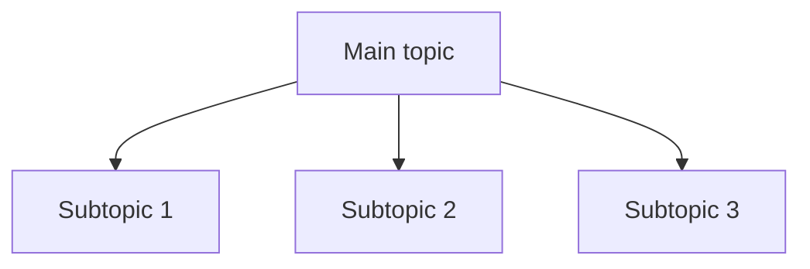
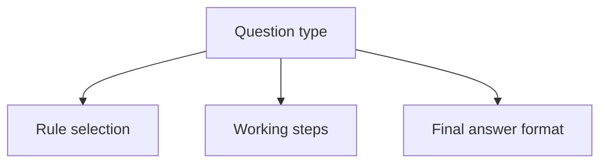

# Style and Template

This is the shared template for professor-style CA exam notes in this study set.

## Writing Style

- Start with the exam use-case, not textbook exposition.
- Use short, direct paragraphs.
- Prefer tables, checklists, and flow steps where they help decision-making.
- Convert raw material into revision language.
- Keep definitions accurate, but move quickly to application and traps.

## Normal Chapter / Unit Template

```md
# [Chapter / Unit Title]

## Exam Relevance

- What the examiner usually tests
- Why this topic matters
- Common question forms

## Core Intuition

The one-sentence idea behind the chapter.

## Concept Map



## Key Concepts

### 1. [Concept Name]

Definition, logic, and practical meaning.

### 2. [Concept Name]

Definition, logic, and practical meaning.

## Professor's Problem-Solving Framework

1. Identify the issue.
2. Classify the facts.
3. Apply the rule or standard.
4. Do the working.
5. State the conclusion in exam language.

## Worked Examples

### Example 1

Problem:

Working:

Answer:

### Example 2

Problem:

Working:

Answer:

## Common Mistakes

- Mistake 1
- Mistake 2
- Mistake 3

## Summary Tables

| Item | Meaning | Exam reminder |
|---|---|---|
| ... | ... | ... |

## Last-Day Revision

- 5 to 10 bullet recall points
- Formulae or rule triggers
- Fast comparison points

## Doubts / Version-Sensitive Items

- Any line that may depend on the latest ICAI wording, law amendment, schedule, or notification
- Any term that should be checked against the source PDF or manifest before final polishing
```

## Practice-Question Template

Use this for practice sets, question banks, and mixed exercises.

```md
# [Practice Questions Title]

## Exam Relevance

- What this question set trains
- Which chapter rules it mixes
- How the examiner may twist it

## Core Intuition

The solving pattern in one sentence.

## Concept Map



## Key Concepts

### 1. [Rule / Trigger]

When it applies and what to watch for.

### 2. [Rule / Trigger]

When it applies and what to watch for.

## Professor's Problem-Solving Framework

1. Classify the question.
2. Extract given data.
3. Choose the right rule set.
4. Write clean working notes.
5. Check for traps and conclude.

## Worked Examples

### Question 1

Given:

Working:

Final answer:

### Question 2

Given:

Working:

Final answer:

## Common Mistakes

- Misreading the trigger
- Mixing unrelated chapter rules
- Forgetting final-answer wording

## Summary Tables

| Question type | Best approach | Trap |
|---|---|---|
| ... | ... | ... |

## Last-Day Revision

- Trigger words
- Formula reminders
- Final-answer patterns

## Doubts / Version-Sensitive Items

- Any question wording that depends on the exact source PDF
- Any updated ICAI or amendment-dependent framing
```

## Usage Notes

- Keep headings stable across files so workers can skim quickly.
- If a chapter needs an extra section, add it below the shared sections rather than deleting the shared structure.
- If a topic is heavily practical, add more worked examples and fewer theory paragraphs.
