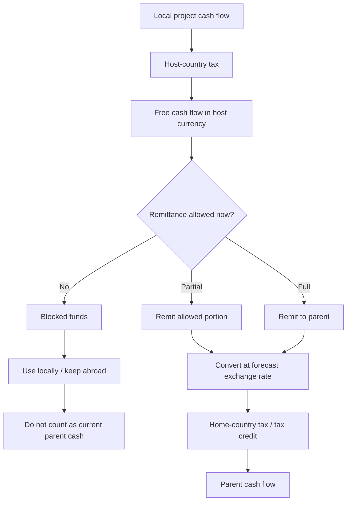
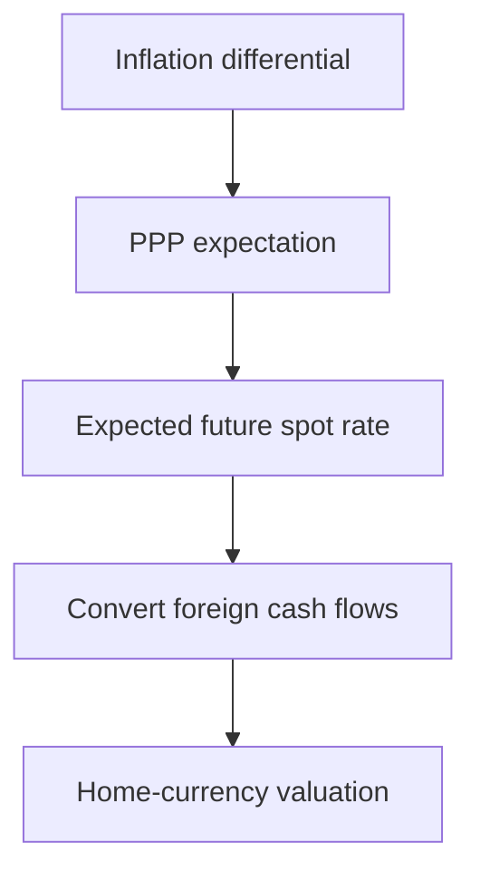
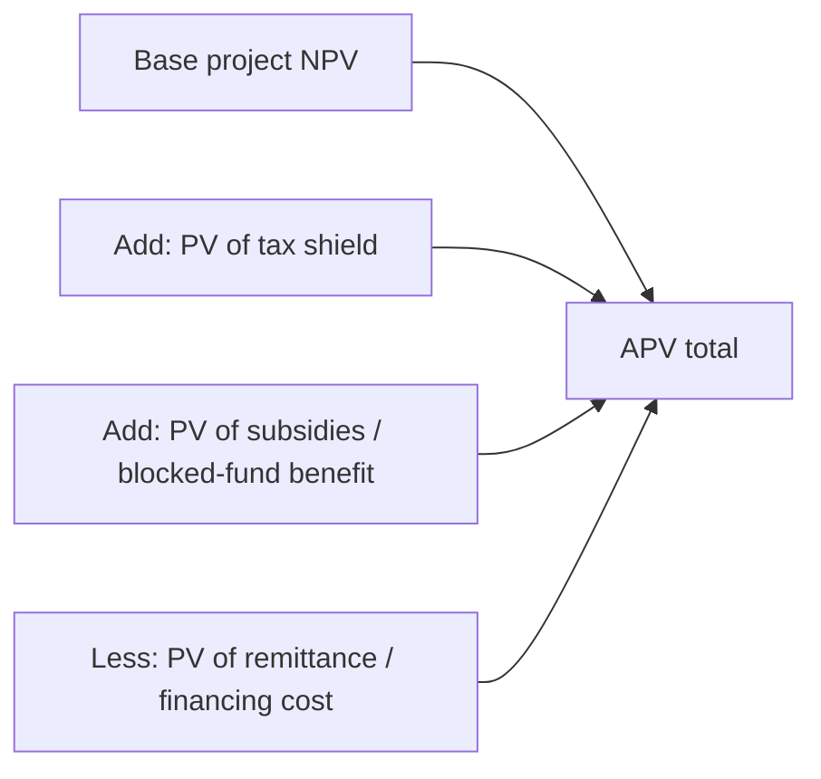
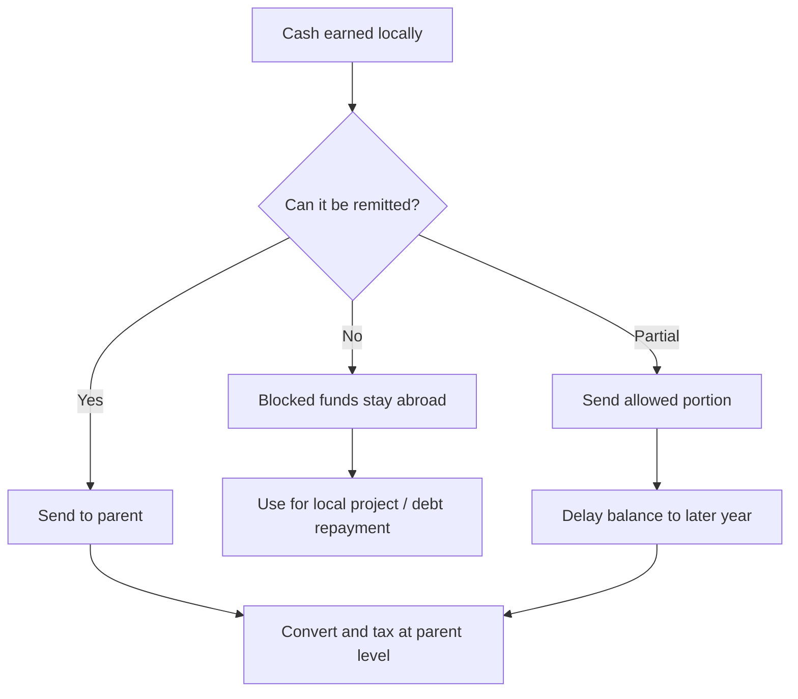
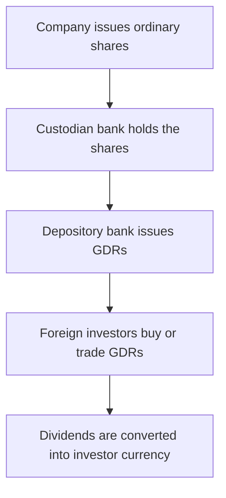
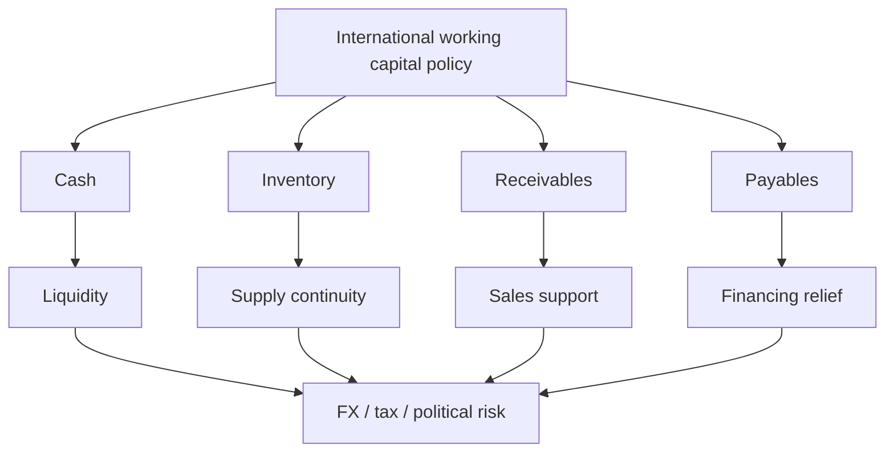
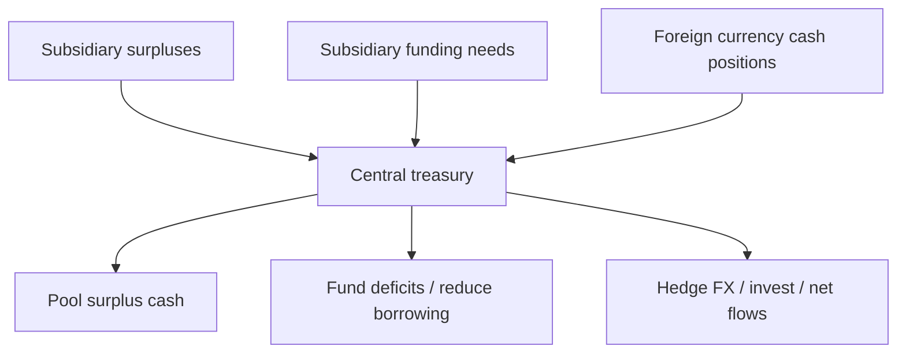
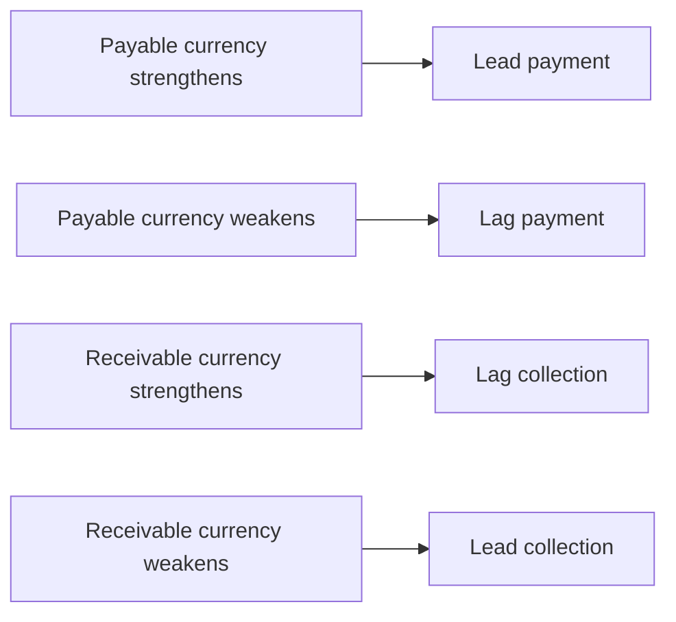

# Chapter 11: International Financial Management - CA Exam Notes

## How to Study This Chapter

International Financial Management is not just "finance in foreign currency". The central idea is this:

> A multinational finance decision is a normal finance decision complicated by currency, tax, remittance, political risk, and regulation.

In domestic finance, you usually ask: "Will this project create value?"

In international finance, you ask a sharper question:

> "Will this project create value for the parent company after converting currencies, paying taxes, handling blocked funds, and allowing for political and exchange-rate risk?"

That one sentence is the fundamental intuition behind most practical questions in this chapter.

## Table of Contents

1. International Capital Budgeting
2. Project Cash Flows vs Parent Cash Flows
3. Exchange Rate Forecasting and PPP
4. Adjusted Present Value
5. International Sources of Finance
6. GDRs, ADRs, FCCBs and Euro Instruments
7. GIFT City and International Financial Centres
8. Sovereign Wealth Funds
9. International Working Capital Management
10. Multinational Cash Management
11. Netting, Leading and Lagging
12. Inventory and Receivables Management
13. Exam Problem-Solving Frameworks
14. Common Mistakes
15. Last-Day Revision Sheet

---

# 1. International Capital Budgeting

## Core Meaning

International capital budgeting means evaluating whether a company should invest in a project located in another country.

The method still resembles normal capital budgeting:

- Estimate cash flows
- Adjust for tax
- Consider working capital and salvage value
- Convert cash flows into the parent company's currency
- Discount at an appropriate rate
- Accept if NPV is positive

But the foreign project has extra layers.

## Why It Is More Complex Than Domestic Capital Budgeting

In a domestic project, cash flows and investment are normally in the same currency and under one tax regime.

In an international project, the examiner may introduce:

| Complication | Fundamental Intuition |
|---|---|
| Foreign currency cash flows | The parent ultimately cares about its own currency. |
| Exchange-rate fluctuation | A profitable local project can become unattractive after conversion. |
| Different inflation rates | Inflation changes both cash flows and exchange rates. |
| Two tax systems | Host-country tax and home-country tax may both matter. |
| Remittance restrictions | Cash generated by the project may not immediately reach the parent. |
| Blocked funds | Money stuck abroad may reduce the effective initial investment if used in the project. |
| Political risk | Future cash flows may be interrupted, reduced, or delayed. |
| Terminal value difficulty | Selling a foreign project is less predictable than selling domestic assets. |

## Professor's Intuition

Think of a foreign project as having two lives:

1. **Local life**: the project earns and spends money in the host country.
2. **Parent life**: the parent receives cash after conversion, tax, remittance rules, and risk adjustments.

For CA practical questions, the answer usually depends on the second life.

---

# 2. Project Cash Flows vs Parent Cash Flows

## Project Cash Flows

Project cash flows are the cash flows generated inside the foreign country.

They answer:

> "Is the project commercially viable in the host country?"

Examples:

- Sales revenue in local currency
- Local operating costs
- Local depreciation and tax
- Local working capital
- Local salvage value

## Parent Cash Flows

Parent cash flows are the cash flows actually received by the parent company.

They answer:

> "What cash finally reaches the parent after remittance restrictions, withholding tax, exchange-rate conversion, and home-country tax?"

Examples:

- Dividends remitted to the parent
- Royalty received by the parent
- Management fees
- Technical fees
- Loan repayment or interest received
- Repatriated terminal value

## Exam Intuition

If the question says **"from parent company's point of view"**, do not stop at local project cash flows.

You must ask:

1. How much cash is generated locally?
2. How much is allowed to be remitted?
3. When is it remitted?
4. What exchange rate applies?
5. What tax is paid in the host country?
6. Is there additional tax in the home country?
7. What is the final parent-currency cash flow?

## Cash Flow Map



## Mini Example

Suppose a project in India earns `100 lakh after local tax, but only 60% can be remitted this year and the balance next year.

Then the parent cash flow is not `100 lakh this year.

It is:

- Year 1: `60 lakh converted at Year 1 exchange rate
- Year 2: `40 lakh converted at Year 2 exchange rate

If the rupee depreciates before Year 2, the parent may receive less foreign currency even though the local project earned the full amount.

---

# 3. Exchange Rate Forecasting and PPP

## Core Concept

Purchasing Power Parity (PPP) says that exchange rates tend to adjust according to inflation differences between two countries.

If one country has higher inflation, its currency is expected to weaken.

## Formula

For a direct quote:

```text
Expected future spot rate = Current spot rate x [(1 + domestic inflation) / (1 + foreign inflation)]
```

The exact interpretation of "domestic" and "foreign" depends on how the quote is written.

## Intuition

If India has inflation of 8% and the US has inflation of 4%, Indian goods become relatively more expensive. To restore purchasing parity, the rupee is expected to depreciate.

## CA Exam Application

PPP is usually used when:

- Cash flows are in foreign currency
- Inflation rates of two countries are given
- The question asks to convert future cash flows
- Forward rates are not directly given

## Mini Example

Current rate: `80/$  
India inflation: 8%  
US inflation: 4%

```text
Expected rate = 80 x 1.08 / 1.04
              = `83.08/$ approximately
```

Interpretation: the dollar becomes more expensive in rupee terms, meaning the rupee depreciates.

## Exchange-Rate Flow



---

# 4. Adjusting Risk: Discount Rate vs Cash Flows

## Traditional Approach

Some companies add extra risk premium to the discount rate for foreign projects.

This looks simple, but it is not always conceptually clean.

## Why Adjusting Only Discount Rate Can Be Misleading

Different risks affect cash flows differently:

- Political risk may affect only certain future years.
- Remittance restriction may delay cash flows rather than reduce them.
- Exchange-rate movement may be favourable or unfavourable.
- Tax benefits may be relatively certain.

If you load all risks into one discount rate, you may penalise every cash flow equally even when the risk is not equal.

## Better Intuition

Adjust the cash flow when the risk affects cash flow directly.

Examples:

- If only 50% can be remitted this year, adjust remittance timing.
- If political risk may reduce cash inflow, use expected cash flow or certainty equivalent.
- If exchange rate may change, forecast the exchange rate.

Then discount using a rate appropriate to the risk of those adjusted cash flows.

---

# 5. Adjusted Present Value

## Core Meaning

Adjusted Present Value (APV) values a project by separating different components of value.

Instead of forcing everything into one WACC, APV says:

> Value the base project first, then add or subtract the separate financing side effects.

## APV Logic

```text
APV = Base NPV of project
    + PV of tax shields
    + PV of interest subsidies
    - Other financing or remittance costs, if any
```

The chapter presents APV as a value-additive approach where different cash flow components may be discounted using different rates depending on risk.

## Why APV Is Useful for Foreign Projects

Foreign projects often contain special elements:

- Concessional loans
- Subsidised finance
- Blocked funds
- Tax shields
- Different remittance rules
- Separate political risks

These items may not have the same risk as normal operating cash flows. APV lets us value them separately.

## APV Flow



## Blocked Funds in APV

Blocked funds are balances stuck in a foreign country because of exchange control restrictions.

If the parent can use those blocked funds for a new foreign project, then the effective investment outlay is reduced.

## Intuition

If you already have money trapped abroad and cannot bring it home, using it in a project is not the same as sending fresh money from the parent country.

So in capital budgeting:

```text
Effective initial investment = Project cost - usable blocked funds
```

## CA Exam Tip

When blocked funds are mentioned, do not automatically treat them as free money. Ask:

1. Can the funds actually be used for this project?
2. What is their opportunity cost?
3. Would the parent otherwise have earned anything from them?
4. Are taxes or restrictions triggered on use or remittance?

## Remittance Restriction Flow



---

# 6. International Capital Budgeting: Practical Question Framework

Use this framework for most long practical questions.

## Step 1: Identify the Parent and Host Country

Ask:

- Which company is investing?
- Which country is the project in?
- Which currency is the parent currency?
- Which currency is the project currency?

## Step 2: Build Local Operating Cash Flows

Start in the host-country currency.

Typical structure:

```text
Sales revenue
- Variable cost
- Fixed cost
- Depreciation
= Profit before tax
- Host country tax
= Profit after tax
+ Depreciation
- Working capital investment
+ Working capital recovery
+ Salvage value
= Free cash flow
```

## Step 3: Apply Remittance Rules

If the question says only a certain percentage can be remitted, split cash flows by year.

Example:

If 50% can be remitted in the current year and 50% next year:

| Year | Cash Generated | Remitted in Same Year | Remitted Next Year |
|---|---:|---:|---:|
| 1 | 100 | 50 | 50 in Year 2 |
| 2 | 120 | 60 | 60 in Year 3 |

This is a favourite exam trap.

## Step 4: Convert to Parent Currency

Use forecasted exchange rates.

If future spot rates are not given, use PPP.

## Step 5: Apply Home-Country Tax, if Applicable

Look carefully for:

- Double Taxation Avoidance Agreement
- Tax credit
- Withholding tax
- Higher of host/home tax method
- No tax credit situation

## Step 6: Discount Parent Cash Flows

Use the required return specified in the question.

If the question asks for foreign currency approach, discount in foreign currency at the foreign currency discount rate.

## Step 7: Decide

```text
If NPV > 0: Accept
If NPV < 0: Reject
```

For exam presentation, write a clear final sentence.

---

# 7. Illustration Pattern: Foreign Company Investing in India

The chapter includes a detailed illustration of a US pharmaceutical company considering an Indian joint venture.

## What the Problem Tests

This type of question tests whether you can coordinate:

- Indian rupee cash flows
- Dollar conversion
- Inflation-adjusted pricing
- Royalty payments
- Indian and US tax
- Remittance restrictions
- Working capital recovery
- Salvage value
- NPV in parent currency

## Fundamental Intuition

The Indian project may generate rupee cash flows, but the US parent does not consume rupees. The parent consumes dollars.

Therefore, the real question is:

> After converting rupee remittances into dollars and paying required taxes, does the US parent earn enough return?

## Typical Working Notes

For this question type, create separate working notes:

1. Expected exchange rates using PPP
2. Sales revenue and parent share
3. Royalty calculation
4. Tax liability in host country
5. Free cash flow
6. Remittance schedule
7. Parent-currency NPV

## Exam Trap

Do not forget that taxes may be paid in the following year if the problem says so.

That shifts cash flows and can change NPV materially.

---

# 8. Illustration Pattern: Indian Company Investing Abroad

The chapter includes cases where an Indian company invests in another country and either raises funds locally or in another currency.

## What the Problem Tests

These questions usually test:

- Asset beta and equity beta adjustment
- Cost of equity using CAPM
- Debt-equity financing mix
- Host-country project cash flows
- Currency conversion
- Tax differences
- Whether to use local or parent perspective

## Beta Adjustment Intuition

If the target project is in a different industry or country, the company's existing beta may not represent project risk.

So you may need to:

1. Take a comparable company's equity beta.
2. Ungear it to find asset beta.
3. Regear it using the investing company's intended capital structure.
4. Use CAPM to estimate cost of equity.

## Professor's Intuition

The asset beta asks:

> "How risky is the business itself, ignoring financing?"

The equity beta asks:

> "How risky is the shareholder return after adding debt?"

Debt magnifies equity risk, so geared equity beta is normally higher than asset beta.

---

# 9. International Sources of Finance

Indian companies can raise funds from international markets through instruments such as:

- Foreign Currency Convertible Bonds
- American Depository Receipts
- Global Depository Receipts
- Euro-Convertible Bonds
- Euro bonds
- Foreign bonds
- Syndicated bank loans
- Euro Commercial Papers
- Credit instruments

The exam often asks theory questions from this area.

---

# 10. Foreign Currency Convertible Bonds

## Meaning

Foreign Currency Convertible Bonds (FCCBs) are bonds issued in a foreign currency that can be converted into equity shares of the issuing company.

They combine:

- Debt feature: coupon and principal payment
- Equity feature: option to convert into shares

## Why Investors Like FCCBs

Investors get:

- Fixed interest
- Principal protection if not converted
- Upside if the company's share price rises

## Why Companies Like FCCBs

Companies get:

- Lower coupon cost than normal debt
- Delayed equity dilution
- Access to foreign currency funds

## Key Risk

The issuer has foreign exchange risk.

If bonds are not converted, the company must repay principal in foreign currency. If the domestic currency depreciates, repayment becomes more expensive.

## Exam Tip

FCCBs are attractive when the company expects:

- Strong future share price growth
- Foreign currency earnings
- Ability to manage exchange risk

They are risky when:

- Share price falls below conversion price
- Foreign currency debt must be redeemed
- Domestic currency depreciates sharply

---

# 11. ADRs and GDRs

## Depository Receipt: Core Meaning

A depository receipt is a negotiable certificate representing shares of a company, traded outside the company's domestic market.

The company deposits domestic shares with a custodian bank. A foreign depository then issues receipts against those shares.

## ADR

American Depository Receipts are issued in the United States and are denominated in US dollars.

They must comply with US securities regulations.

## GDR

Global Depository Receipts are issued outside the domestic country and may be traded internationally, often in US dollars.

Indian companies have used GDRs to access global equity markets.

## ADR vs GDR

| Point | ADR | GDR |
|---|---|---|
| Market | United States | International markets |
| Currency | Usually USD | Usually USD, sometimes Euro or GBP |
| Regulation | US SEC framework | Depends on listing market |
| Purpose | Raise capital/access US investors | Raise capital/access global investors |

## GDR Mechanism



## Characteristics of GDRs

- Holders receive economic benefits like dividends.
- Voting rights are generally not directly available like ordinary shareholders.
- They may be settled through international clearing systems.
- They are traded by professional investors and market makers.
- They are globally marketable.
- Dividend is converted into the investor's currency, creating exchange exposure for the investor.

## Impact of GDRs on Indian Capital Market

Important points for theory answers:

- Indian capital markets became more connected with global markets.
- Foreign investment into Indian companies increased.
- Arbitrage opportunities emerged between domestic shares and GDRs.
- Indian investors had to track global economic events more closely.
- Retail investors became less central in some large capital-raising exercises.

---

# 12. Cost and Number of GDRs: Exam Framework

The chapter includes an illustration on calculating number of GDRs and cost of GDR.

## Step 1: Calculate Gross Issue Size

If net proceeds required and flotation cost are given:

```text
Gross issue = Net funds required / (1 - flotation cost rate)
```

## Step 2: Calculate GDR Issue Price

```text
Issue price per GDR = Market price per share x shares per GDR x (1 - discount)
```

Convert into foreign currency if needed.

## Step 3: Calculate Number of GDRs

```text
Number of GDRs = Gross issue size / Issue price per GDR
```

## Step 4: Calculate Cost of GDR

The chapter uses an equity-cost style formula:

```text
Cost of GDR = D1 / Net proceeds per GDR + growth rate
```

## Mini Example

Market price per share: `250  
Shares per GDR: 2  
Discount: 10%  
Exchange rate: `60/$  
Flotation cost: 2%  
Dividend per share: `20  
Growth: 12%

```text
Issue price per GDR = 250 x 2 x 90% = `450
Issue price in dollars = 450 / 60 = $7.50
Net proceeds per GDR = 450 x 98% = `441
Dividend per GDR = 20 x 2 = `40
Cost = 40 / 441 + 12% = 21.07%
```

## Exam Trap

Use **gross issue** for calculating the number of GDRs when net funds required are given.

Use **net proceeds** for calculating cost.

---

# 13. Euro-Convertible Bonds and Other International Instruments

## Euro-Convertible Bonds

These are debt instruments that can be converted into equity shares.

They may include:

- **Call option**: issuer can redeem early.
- **Put option**: investor can sell back to issuer.

## Call Option Intuition

The issuer calls the bond when share prices have risen enough that conversion is likely or beneficial.

It pushes investors toward conversion.

## Put Option Intuition

The investor uses the put option when the bond is unattractive to hold or conversion is not worthwhile.

It protects the investor.

## Other Sources

| Instrument | Meaning |
|---|---|
| Euro-convertible zero coupon bond | No regular interest; conversion or redemption happens at maturity. |
| Euro-bond with equity warrants | Bond plus detachable warrants. |
| Syndicated bank loan | Large loan arranged by multiple banks, often linked to benchmark rates plus spread. |
| Euro-bond | Debt issued outside the country of the currency in which it is denominated. |
| Foreign bond | Bond issued in a foreign country in that country's currency. |
| Euro Commercial Paper | Short-term international money market instrument. |
| Credit instruments | Instruments used for foreign remittance and settlement. |

---

# 14. International Financial Centre and GIFT City

## Meaning of International Financial Centre

An International Financial Centre (IFC) provides financial services to customers outside its own jurisdiction.

It is physically located in a country but operates under a separate, flexible regulatory and tax environment.

## Fundamental Intuition

An IFC tries to attract international financial business by reducing friction:

- Easier regulation
- Better infrastructure
- Competitive tax regime
- Foreign currency services
- Global trading and settlement facilities

## Benefits of an IFC

- Brings offshore financial business back into the country
- Creates opportunities for financial professionals
- Reduces brain drain
- Allows sophisticated derivative and financial product trading
- Helps develop global financial services capabilities

## Constituents of an IFC

| Constituent | Why It Matters |
|---|---|
| Developed infrastructure | Global finance needs speed, reliability, and technology. |
| Stable political environment | Investors avoid jurisdictions with high political risk. |
| Strategic location | Connectivity helps international business. |
| Quality of life | Attracts skilled professionals. |
| Rational regulatory framework | Investors need fair and transparent rules. |
| Sustainable economy | Gives confidence that the centre can absorb shocks. |

## GIFT City

GIFT City is India's International Financial Services Centre.

It is designed to compete with global financial centres such as Dubai, Hong Kong, and Singapore.

Important points:

- India's first IFSC was operationalized at GIFT Multi Services SEZ.
- It offers competitive tax and regulatory treatment.
- It provides a platform for international financial services from India.
- It supports foreign currency transactions and global financial market activities.
- FEMA restrictions do not operate in the same way inside the IFSC framework.

## Exam Tip

For a theory answer on GIFT City, write in this order:

1. Meaning of IFC
2. Why India needed one
3. GIFT City as India's IFSC
4. Benefits: tax, regulation, foreign currency finance, financial services, arbitration, ease of doing business

---

# 15. Sovereign Wealth Funds

## Meaning

A Sovereign Wealth Fund (SWF) is a state-owned investment fund created from government surplus reserves.

These reserves may arise from:

- Natural resource revenues
- Trade surpluses
- Foreign currency operations
- Privatization proceeds
- Budget surpluses
- Government transfers

## Fundamental Intuition

A country with large surplus wealth faces a choice:

> Should the surplus sit idle, or should it be invested for stabilization, growth, and future generations?

An SWF is the institutional answer to that question.

## Objectives of SWFs

- Stabilize budget and economy against volatile revenues
- Diversify away from non-renewable commodity exports
- Earn better return than normal foreign exchange reserves
- Absorb excess liquidity
- Save for future generations
- Fund social and economic development
- Achieve long-term capital growth
- Support political or strategic goals

## Types of SWFs

| Type | Purpose |
|---|---|
| Stabilization fund | Protect budget from volatile revenue. |
| Savings/future generation fund | Save today's surplus for tomorrow. |
| Public pension reserve fund | Support pension obligations. |
| Reserve investment fund | Earn higher returns on reserves. |
| Strategic development SWF | Support national development strategy. |

## Related Sovereign Investment Vehicles

- Sovereign Wealth Funds
- Public Pension Funds
- State-Owned Enterprises
- Sovereign Wealth Enterprises

---

# 16. International Working Capital Management

## Core Meaning

International working capital management deals with managing short-term assets and liabilities across countries.

It includes:

- Cash management
- Inventory management
- Receivables management
- Short-term financing
- Currency and tax planning

## Why It Is More Complex Than Domestic Working Capital

| Issue | Intuition |
|---|---|
| More financing options | MNCs may borrow locally or internationally. |
| Different interest rates | Borrowing cost differs across countries. |
| Different tax rates | Tax-efficient cash movement matters. |
| Exchange-rate risk | Receivables and payables change value. |
| Political restrictions | Cash or inventory may be blocked. |
| Limited local knowledge | Each country has different business conditions. |
| Convertibility restrictions | Funds may not move freely. |

## Professor's Intuition

Domestic working capital asks:

> "How much cash, stock, and receivables do we need?"

International working capital asks:

> "Where should cash, stock, and receivables sit across the world so the group is liquid, tax-efficient, and protected from currency and political risk?"



---

# 17. Multinational Cash Management

## Objectives

An effective international cash management system aims to:

- Minimize currency exposure risk
- Minimize total cash requirement of the group
- Minimize transaction costs
- Minimize political risk
- Use economies of scale
- Improve investment returns on surplus cash

## Centralized Cash Management

In centralized cash management, a central treasury monitors and manages cash flows among the parent and subsidiaries.



## Benefits

- Maintains lower group-wide cash balances
- Improves liquidity planning
- Allows better hedging decisions
- Pools cash for better investment returns
- Enables multinational netting
- Supports transfer pricing strategy
- Reduces transaction and conversion costs

## Intuition

If every subsidiary hoards cash separately, the group may simultaneously have:

- idle cash in one country
- expensive borrowing in another country

Centralized treasury tries to solve this contradiction.

---

# 18. Techniques for Optimizing International Cash Flow

The chapter lists six major techniques:

1. Accelerating cash inflows
2. Managing blocked funds
3. Leading and lagging
4. Transfer pricing
5. Netting
6. Investing excess cash

## 18.1 Accelerating Cash Inflows

The aim is to collect cash faster so it can be used or invested.

Methods include:

- Lockbox arrangements
- Pre-authorized payments
- Faster banking channels
- Efficient collection centres

## Intuition

Cash received earlier is more valuable because it reduces borrowing and increases reinvestment opportunity.

## 18.2 Managing Blocked Funds

Blocked funds are cash balances that cannot be freely remitted to the parent.

Ways to manage them:

- Use them for local investment
- Repay local loans
- Adjust transfer prices, subject to law
- Negotiate with local authorities
- Use leading and lagging strategies

## 18.3 Leading and Lagging

Leading means accelerating payment.

Lagging means delaying payment.

```text
Payable currency expected to strengthen  -> lead payment
Payable currency expected to weaken      -> lag payment
Receivable currency expected to strengthen -> lag collection
Receivable currency expected to weaken     -> lead collection
```



## Currency Intuition

If a payable currency is expected to strengthen, pay early.

If a payable currency is expected to weaken, delay payment.

## Mini Example

An Indian subsidiary owes Japanese yen to a Japanese subsidiary.

If the rupee is expected to depreciate against yen, the Indian subsidiary should pay early because yen will become more expensive later.

That is leading.

If the rupee is expected to appreciate against yen, it may delay payment.

That is lagging.

## 18.4 Transfer Pricing

Transfer pricing is the price charged for goods or services transferred between divisions or subsidiaries of the same group.

## Intuition

Transfer price decides where profit appears.

If a high-tax country buys from a low-tax country at a high transfer price, more profit may appear in the low-tax country and less in the high-tax country.

But transfer pricing is regulated, so exam answers should not present it as unlimited tax avoidance.

## 18.5 Netting

Netting reduces the number and amount of intercompany payments.

Instead of every subsidiary paying every other subsidiary gross amounts, the group calculates net receivable or payable positions.


## Bilateral Netting

Bilateral netting is between two entities.

Example:

Subsidiary X owes Y $20 million.  
Subsidiary Y owes X $30 million.

Without netting, total transfers are $50 million.

With netting, Y pays X only $10 million.

## Multilateral Netting

Multilateral netting involves several affiliates.

Each affiliate nets all receipts and payments and settles only the balance.

## Benefits of Netting

- Reduces cross-border transfers
- Reduces bank charges
- Reduces foreign exchange conversion
- Improves cash flow forecasting
- Gives central treasury better control

## Exam Matrix Intuition

In a netting matrix:

```text
Net receipt/payment = Total receivables - Total payables
```

If positive, the affiliate is a net receiver.  
If negative, the affiliate is a net payer.

## 18.6 Investing Excess Cash

Surplus cash may be invested in:

- Eurocurrency deposits
- Treasury bills
- Commercial paper
- Short-term foreign securities
- Internal group financing

## Intuition

The best investment is not simply the one with the highest quoted interest rate.

You must consider:

- Expected currency appreciation/depreciation
- Transaction cost
- Political risk
- Liquidity need
- Tax effect

---

# 19. International Inventory Management

## Core Issue

International firms may hold larger inventory than the normal EOQ level.

This is called stock piling.

## Why Stock Piling Happens

- Long international lead times
- Customs delays
- Political disturbances
- Risk of import interruption
- Expected currency depreciation
- Bulk shipment economics
- Dependence on sister units in other countries

## Fundamental Intuition

Inventory is insurance.

In domestic business, too much inventory mainly means carrying cost.

In international business, extra inventory may protect the firm from currency depreciation, supply disruption, customs delay, or political restrictions.

## Decision Rule

Compare:

```text
Additional carrying cost of stock piling
vs
Expected saving from avoiding price/exchange-rate/supply disruption
```

If the probability and cost of disruption are high, stock piling may be justified even if carrying cost rises.

---

# 20. International Receivables Management

## Core Issue

International receivables arise from credit sales across countries.

There are two types:

- Inter-firm sales: sales to outside parties
- Intra-firm sales: sales between group companies

## Inter-Firm Sales

Key decisions:

- Which currency should invoice be denominated in?
- What credit period should be allowed?
- Should the exporter offer liberal credit to grow sales?

## Currency Intuition

Exporter prefers a strong currency.

Importer prefers a weak currency.

If the exporter has debt in the importer's currency, the exporter may accept invoicing in that currency because receipts can be used to repay the debt.

## Intra-Firm Sales

In intra-firm sales, the buyer and seller are part of the same multinational group.

So the focus is not only on collection from a customer. The focus is group-wide cash allocation.

Leading and lagging may be used to move liquidity within the group.

---

# 21. Exam Problem-Solving Frameworks

## Framework A: Foreign Currency NPV Approach

Use when the question asks for NPV using foreign currency approach.

1. Keep project cash flows in foreign currency.
2. Derive foreign currency discount rate if required.
3. Discount foreign currency cash flows.
4. Subtract foreign currency investment.
5. Convert NPV into home currency using current spot rate, if asked.

### Risk Premium Adjustment Example

If domestic required return is 14%, domestic risk-free rate is 12%, and foreign risk-free rate is 8%:

```text
1 + risk premium = 1.14 / 1.12
Risk premium = 1.79%

Foreign currency required return
= (1 + foreign risk-free rate) x (1 + risk premium) - 1
= 1.08 x 1.0179 - 1
= 9.9% approximately
```

## Framework B: Real Cash Flows to Nominal Cash Flows

Use when the problem gives real cash flows and inflation rates.

1. Inflate home-country real cash flows by home inflation.
2. Inflate foreign-country real cash flows by foreign inflation.
3. Forecast exchange rate using inflation differential.
4. Convert foreign cash flows into home currency.
5. Add home and converted foreign cash flows.
6. Discount at nominal risk-adjusted rate.
7. Include terminal value if cash flows continue indefinitely.

## Framework C: Setting Up Subsidiary vs Exporting

Use when the MNC currently exports but is considering a foreign subsidiary.

1. Calculate project investment.
2. Include working capital requirement.
3. Deduct release of existing working capital, if exports reduce.
4. Calculate cash flows from subsidiary.
5. Calculate cash flows lost from reduced exports.
6. Incremental cash flow = subsidiary cash flow - lost export cash flow.
7. Add terminal working capital recovery or salvage value.
8. Discount and compute NPV.

## Framework D: Transfer Price or Software Development Abroad

Use when a foreign parent sets up a unit in India or another country for one year.

1. Compute local revenue using transfer price.
2. Deduct local costs.
3. Compute local profit.
4. Deduct local corporate tax.
5. Deduct withholding tax, if applicable.
6. Convert repatriated amount into parent currency.
7. Compare effective cost/profit with parent-country sale price.

## Framework E: MIRR for International Proposal

Use when both NPV and MIRR are asked.

1. Convert all foreign cash flows into home currency.
2. Add home currency cash flows.
3. Discount outflows to present, if needed.
4. Compound inflows to terminal value at reinvestment rate.
5. Use:

```text
MIRR = (Terminal value of inflows / Present value of outflows)^(1/n) - 1
```

---

# 22. Common Mistakes and Exam Traps

## Mistake 1: Treating Local Profit as Parent Cash Flow

Local profit is not the same as parent cash flow.

Always adjust for:

- tax
- remittance
- currency conversion
- withholding tax
- timing

## Mistake 2: Ignoring Remittance Timing

If cash is remitted next year, discount it next year.

Do not include it in the year it was generated.

## Mistake 3: Forgetting Tax Credit

If DTAA or tax credit is given, home-country tax may be reduced by host-country tax already paid.

## Mistake 4: Using Wrong Exchange Rate Direction

Before converting, write the quote clearly.

Example:

```text
`80/$ means 1 dollar = `80
```

To convert rupees into dollars:

```text
Dollars = Rupees / 80
```

To convert dollars into rupees:

```text
Rupees = Dollars x 80
```

## Mistake 5: Mixing Operating and Financing Cash Flows

Operating cash flows and financing cash flows should not be casually mixed.

APV separates them deliberately.

## Mistake 6: Treating Allocated Fixed Cost as Relevant

In incremental analysis, allocated fixed costs may be irrelevant unless they represent additional cash outflow.

## Mistake 7: Ignoring Opportunity Cost of Existing Exports

If setting up a subsidiary reduces exports, the lost export contribution is an opportunity cost.

## Mistake 8: Using Gross Proceeds for Cost of GDR

Cost of GDR should be based on net proceeds after flotation cost.

## Mistake 9: Assuming Highest Interest Rate Is Best

For excess cash investment, effective return depends on both interest rate and currency movement.

## Mistake 10: Treating Transfer Pricing as Unrestricted

Transfer pricing is a planning tool, but it is subject to tax laws and arm's length principles.

---

# 23. Quick Concept Maps

## International Capital Budgeting Map

```text
Local project cash flow
        ↓
Host-country tax
        ↓
Free cash flow
        ↓
Remittance restrictions
        ↓
Exchange-rate conversion
        ↓
Home-country tax / tax credit
        ↓
Parent cash flow
        ↓
Discounting
        ↓
NPV decision
```

## Working Capital Management Map

```text
International working capital
        ↓
Cash management
Inventory management
Receivables management
        ↓
Currency risk + tax + political risk + regulation
        ↓
Centralized treasury decisions
```

## International Finance Instruments Map

```text
Need foreign funds
        ↓
Debt route: Euro bonds, foreign bonds, syndicated loans, ECP
Equity route: ADRs, GDRs
Hybrid route: FCCBs, Euro-convertible bonds, warrants
```

---

# 24. Last-Day Revision Sheet

## Must-Remember Ideas

- Parent cash flow is more important than project cash flow when evaluating for the parent.
- PPP links inflation differential with exchange-rate movement.
- Higher inflation usually leads to expected currency depreciation.
- APV separates operating value from financing side effects.
- Blocked funds can reduce effective investment outlay if usable.
- FCCBs are foreign currency debt with equity conversion option.
- ADRs are US depository receipts; GDRs are global depository receipts.
- GIFT City is India's IFSC for international financial services.
- SWFs are government-owned investment funds created from surplus reserves.
- Centralized cash management reduces idle cash, transaction cost, and exposure.
- Leading means paying early; lagging means paying late.
- Netting reduces gross intercompany payments to net settlement amounts.
- Stock piling may be rational when supply or exchange-rate risk is high.

## Formula Sheet

### PPP Expected Spot Rate

```text
Expected spot = Current spot x [(1 + domestic inflation) / (1 + foreign inflation)]
```

### Gross Issue Size

```text
Gross issue = Net proceeds required / (1 - flotation cost)
```

### GDR Issue Price

```text
Issue price per GDR = Market price per share x shares per GDR x (1 - discount)
```

### Cost of GDR

```text
Cost = D1 / Net proceeds per GDR + growth rate
```

### MIRR

```text
MIRR = (Terminal value of inflows / Present value of outflows)^(1/n) - 1
```

### Netting Position

```text
Net position = Total receipts - Total payments
```

Positive = net receiver  
Negative = net payer

## Final Exam Checklist for Practical Questions

Before finalizing your answer, check:

- Have I identified parent and host currency?
- Have I applied inflation correctly?
- Have I forecasted exchange rates correctly?
- Have I deducted host-country tax?
- Have I considered home-country tax or tax credit?
- Have I applied remittance restrictions by year?
- Have I included working capital recovery?
- Have I included salvage value?
- Have I excluded irrelevant sunk costs?
- Have I included opportunity costs?
- Have I used the correct discount rate?
- Have I written a final accept/reject decision?

## How to Think Like an Examiner

The examiner is usually not testing whether you can mechanically calculate NPV.

The examiner is testing whether you notice the international adjustments:

- Is the cash actually available to the parent?
- In which currency?
- In which year?
- After which tax?
- At what risk?
- After which restriction?

If you train yourself to ask these six questions, most questions in this chapter become manageable.

