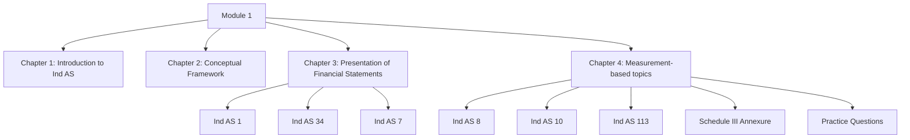

# Module 1: Initial Pages Overview

## Exam Relevance

This front matter is the orientation sheet for the whole module. It tells you where Module 1 starts and ends, what the chapter sequence is, and how the opening framework connects to the later presentation and measurement chapters.

Use it to get the big picture before you start detailed chapter study. In the exam, Module 1 mostly feeds theory, presentation, classification and basic standard-selection questions.

## Module Map

## How To Use This Module

- Read Chapter 1 before anything else; it sets the Ind AS roadmap logic.
- Treat Chapter 2 as the conceptual base for later recognition and measurement questions.
- Chapter 3 is the working core for presentation, cash flow and interim reporting.
- Chapter 4 ties together policy changes, events after reporting date and fair value.
- Use the annexure as a presentation reference, not as a theory chapter.

## Exam Strategy

1. Identify whether the question is about applicability, presentation or measurement.
2. Pick the controlling standard first, then apply the facts.
3. For mixed questions, separate recognition/measurement from presentation.
4. In numerical answers, keep the classification logic clean before doing the working.
5. Use the practice set after the core chapters to lock in pattern recognition.

## Front-Matter Watchlist

- ICAI wording for chapter titles and standard names can differ slightly from the local file names.
- Roadmap dates, net worth thresholds and any Schedule III references are version-sensitive.
- Ind AS 1, Ind AS 7 and Ind AS 113 wording should be checked against the source PDF if a question asks for exact language.
- The May 2026 study material release should be treated as the base edition for this set.

