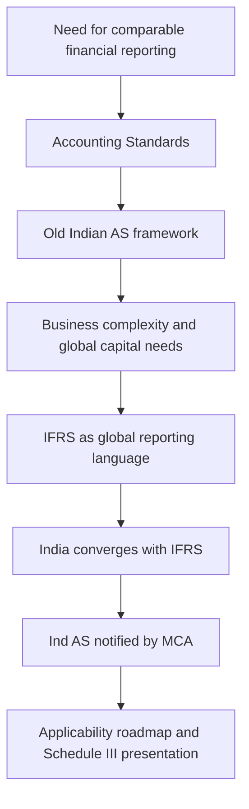
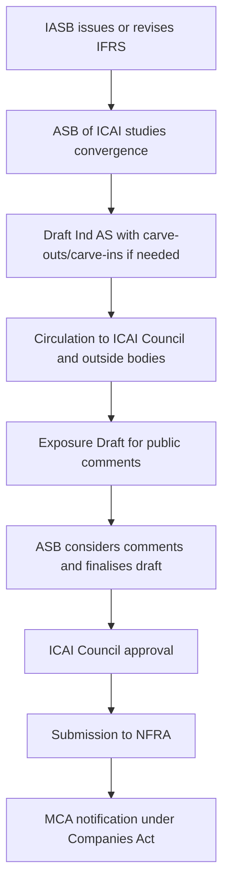
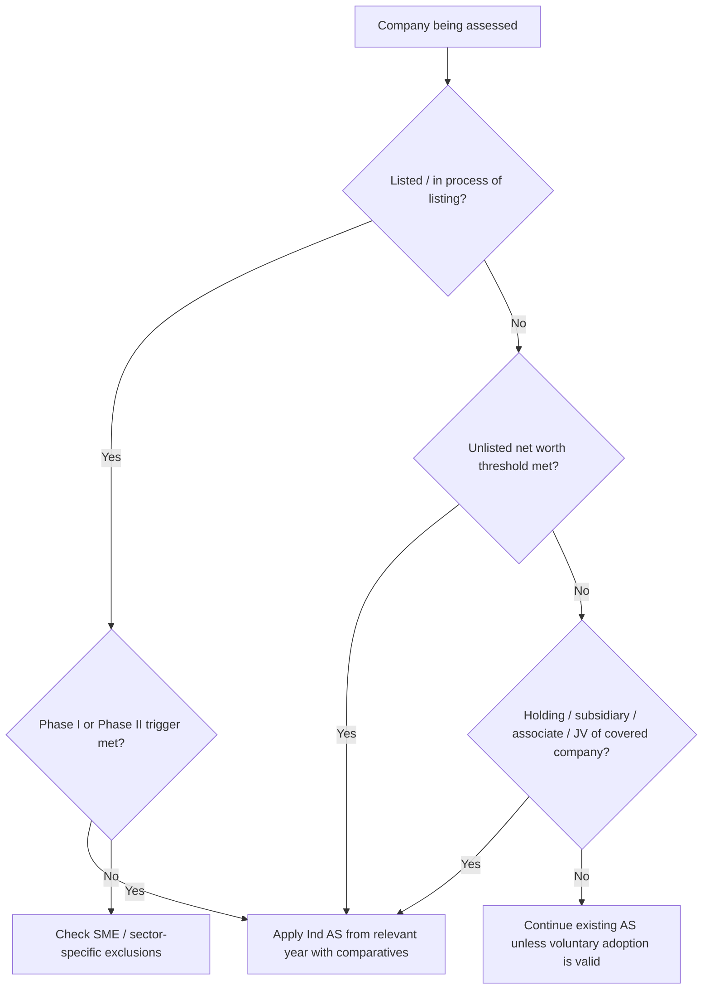

# Chapter 1: Introduction to Indian Accounting Standards

## Exam Relevance

This chapter is the gateway to CA Final Financial Reporting. It is less about journal entries and more about the reporting ecosystem: why Ind AS exists, how it differs from old AS, how it is notified, who must apply it, and how Schedule III presentation works.

Typical exam use:

- Short theory questions on convergence vs adoption.
- Case-based applicability questions on Ind AS roadmap.
- Net worth threshold questions.
- Questions on holding, subsidiary, associate and joint venture applicability.
- Presentation questions linked to Division II of Schedule III.
- Conceptual questions on why global standards improve comparability and capital allocation.

## Core Intuition

Accounting standards are a common financial reporting language. Without a common language, two companies may report the same economic event differently, making comparison unreliable.

Ind AS exists because Indian business became more complex and more connected with global capital markets. Old AS was useful, but it did not fully handle areas such as complex financial instruments, derivatives, business combinations, share-based payments, deferred tax complexity and extensive investor-focused disclosures.

The chapter's central message:

> India did not blindly copy IFRS. India converged with IFRS by creating Ind AS, with limited changes for Indian legal, regulatory and business conditions.

## Concept Map



## Key Concepts

### 1. Meaning of Accounting Standards

Accounting standards are principles and rules for recognition, measurement, presentation and disclosure of transactions in financial statements.

They aim to improve:

- consistency
- comparability
- reliability
- understandability
- relevance

#### Professor's Intuition

Think of accounting standards as traffic rules for financial statements. Different entities may drive different vehicles, but they must follow a shared rule system so users can understand and compare them.

### 2. Indian Scenario Before Ind AS

Before Ind AS, Indian Accounting Standards were issued to deal with various reporting matters. These standards applied to companies not following Ind AS, SMCs and non-corporate entities depending on applicability levels.

The exam is unlikely to ask you to reproduce the entire old AS applicability table. The high-yield point is that India already had an accounting framework, but it was not enough for modern global reporting complexity.

### 3. Limitations of Earlier AS

Earlier AS did not comprehensively handle many modern transactions:

| Area | Why Old AS Was Stretched |
|---|---|
| Complex capital instruments | Convertible shares/debentures may have both debt and equity features. |
| Embedded derivatives | Foreign currency bonds and commodity-linked contracts need sophisticated measurement. |
| Business combinations | Mergers, demergers and acquisitions require fair-value and control-based thinking. |
| Digital revenue models | Revenue recognition became more complex than simple sale of goods/services. |
| Share-based payments | Employee compensation increasingly used equity-linked awards. |
| Tax accounting | Current/deferred tax effects became more complex. |
| Disclosures | Investors needed fuller risk, segment, related party and revenue information. |

### 4. Emergence of Global Accounting Standards

The International Accounting Standards Committee was formed in 1973 to harmonize reporting practices. Later, the IASB was formed in 2000 under the IFRS Foundation to develop IFRS.

Important global milestones:

- IOSCO supported international standards for cross-border listings.
- EU listed companies moved to IFRS from 2005.
- G20 supported global convergence after the financial crisis.
- IASB and FASB launched convergence efforts through the Norwalk Agreement.

### 5. Need for Global Standards in India

Global standards were needed because Indian companies increasingly:

- raised capital internationally
- had foreign investors
- operated through multinational structures
- needed comparability with global peers
- faced high compliance cost from multiple reporting frameworks

#### Example

An Indian company holding non-current equity investments may show a different performance picture under old AS and IFRS/Ind AS because fair value measurement can create gains or losses not captured under cost-based accounting.

### 6. Benefits of Global Accounting Standards

| Benefit | Intuition |
|---|---|
| Transparency | Users get more comparable and higher-quality information. |
| Accountability | Management has less room to hide behind local reporting differences. |
| Efficiency | Capital flows more easily when investors understand the numbers. |
| Lower reporting cost | Multinational groups reduce multiple reporting systems. |
| Better consolidation | A common reporting language improves group reporting. |

### 7. Convergence vs Adoption of IFRS

This is a favourite theory area.

| Point | Adoption | Convergence |
|---|---|---|
| Meaning | Country applies IFRS as issued by IASB. | Country aligns national standards with IFRS, with limited exceptions. |
| IFRS compliance claim | Possible if full IFRS is applied. | Not necessarily possible if local carve-outs/carve-ins exist. |
| Local modification | No meaningful modification. | Local legal/business modifications may exist. |
| Indian position | India has not adopted IFRS. | India has converged through Ind AS. |

#### Exam Tip

Do not write that India has adopted IFRS. The correct expression is:

> India has converged its accounting standards with IFRS through Ind AS.

### 8. Development and Finalisation of Ind AS

Ind AS is developed through a standard-setting process involving ICAI, ASB, NFRA and MCA.



### 9. Structure and Numbering of Ind AS

Ind AS are broadly numbered to correspond with IFRS/IAS numbering, but not every number is used in a simple sequence.

Key point:

- Bold and plain text in Ind AS have equal authority.
- Appendices may contain mandatory guidance.
- Each standard may include objective, scope, recognition, measurement, presentation and disclosure guidance.

### 10. Applicability Roadmap

The Ind AS roadmap is threshold-based and phase-wise.

High-yield rules:

- Listed companies and companies in the process of listing are tested first.
- Unlisted companies are covered based on net worth thresholds.
- Holding, subsidiary, associate and joint venture of covered companies also come under Ind AS.
- Once Ind AS is followed, it generally continues in later years even if criteria cease to apply.
- Companies not covered by Ind AS continue with Companies (Accounting Standards) Rules, 2006.

### 10.1 Company Roadmap: Operational Revision Table

For CA exam answers, write the roadmap as a decision table, not as a loose paragraph.

| Category | Mandatory Ind AS trigger in the study material | Applicability timing idea |
|---|---|---|
| Phase I listed / in-process listed companies | Equity or debt securities listed or in process of listing in India or outside India and net worth of `500 crore or more | Accounting periods beginning on or after 1 April 2016, with comparatives |
| Phase I unlisted companies | Net worth of `500 crore or more | Accounting periods beginning on or after 1 April 2016, with comparatives |
| Phase I group entities | Holding, subsidiary, joint venture or associate of the above covered companies | Follows the covered company roadmap |
| Phase II listed / in-process listed companies | Listed or in process of listing, not already covered in Phase I | Accounting periods beginning on or after 1 April 2017, with comparatives |
| Phase II unlisted companies | Net worth of `250 crore or more but less than `500 crore | Accounting periods beginning on or after 1 April 2017, with comparatives |
| Phase II group entities | Holding, subsidiary, joint venture or associate of the above covered companies | Follows the covered company roadmap |
| SME exchange companies | Listed on SME exchange only | Not mandatorily covered merely because of SME exchange listing |
| Companies outside roadmap | Not listed/in process and below threshold, unless group-extension applies | Continue with existing Accounting Standards unless voluntary adoption is validly chosen |

The wording in the question matters. "In process of listing" can be enough if the roadmap conditions are met; do not wait for actual listing if the question clearly places the company in that category.

### 10.2 NBFC, Banking, Insurance and Mutual Fund Roadmaps

The chapter also discusses separate roadmap treatment for NBFCs, banking companies, insurance companies and mutual funds.

For revision, remember the exam-safe method:

| Entity type | Exam approach |
|---|---|
| NBFC | Check the NBFC-specific roadmap and net worth/date conditions separately from ordinary companies. |
| Banking company | Do not apply ordinary company roadmap blindly; regulator-specific implementation matters. |
| Insurance company | Do not apply ordinary company roadmap blindly; regulator-specific implementation matters. |
| Mutual fund | Check the specific roadmap and regulator context before concluding. |

This is why the notes flag sector applicability as version-sensitive: the legal/regulatory route can differ from the ordinary company route.

#### Applicability Decision Tree



### 11. Net Worth Calculation

Net worth questions are practical theory traps. For exam purposes, always check:

- paid-up share capital
- securities premium
- reserves created out of profits
- debit/credit balance of profit and loss
- exclusions specified by the law/rules

Do not mechanically use total equity without checking the statutory definition given in the question.

### 11.1 Net Worth: Exam Calculation Skeleton

Use this skeleton unless the question gives a specific statutory definition:

```text
Paid-up share capital
+ Securities premium
+ Reserves created out of profits
- Accumulated losses
- Deferred expenditure
- Miscellaneous expenditure not written off
= Net worth for roadmap analysis
```

Do not include revaluation reserve or reserves created out of write-back of depreciation/amalgamation unless the applicable rule specifically permits it.

### 12. Statutory Provisions and SEBI Linkages

Ind AS is not merely an ICAI academic framework. It is notified under the Companies Act through MCA. SEBI requirements also matter for listed entities.

Professor's intuition:

> ICAI helps develop the accounting language; MCA gives it legal force for companies.

### 13. Division II of Schedule III

Division II of Schedule III provides the format for Ind AS financial statements.

It covers:

- balance sheet
- statement of changes in equity
- statement of profit and loss
- significant notes and disclosures

The guidance note helps apply presentation requirements in practical situations.

## Professor's Problem-Solving Framework

### Framework A: Ind AS Applicability Case

1. Identify the entity type: listed, unlisted, NBFC, bank, insurance, mutual fund or other.
2. Check whether the entity is listed or in process of listing.
3. Check net worth threshold and relevant date.
4. Check whether it is a holding, subsidiary, associate or joint venture of a covered entity.
5. Check whether Ind AS was already adopted earlier.
6. Decide applicable year and whether comparatives are required.
7. If the entity is a joint arrangement, determine whether it is a joint venture or joint operation if the roadmap wording makes this relevant.

### Framework B: Convergence vs Adoption Answer

1. Define adoption.
2. Define convergence.
3. Explain India's position.
4. Mention local carve-outs/carve-ins.
5. Conclude that Ind AS financial statements are not automatically IFRS-compliant unless full IFRS requirements are met.

### Framework C: Schedule III Classification Question

1. Identify the item.
2. Ask whether it is financial/non-financial.
3. Ask whether it is current/non-current.
4. Ask whether it is trade or other.
5. Check whether separate disclosure is required.
6. Avoid classification based only on legal name; classify based on substance.

## Worked Examples

### Example 1: Convergence vs Adoption

An Indian company says, "Since Ind AS is based on IFRS, our financial statements are IFRS financial statements."

This statement is not automatically correct. Ind AS is converged with IFRS but may include carve-outs or carve-ins. Unless the entity fully complies with IFRS as issued by IASB, it should not claim IFRS compliance merely because it follows Ind AS.

### Example 2: Applicability Through Associate Relationship

A company crosses the Ind AS net worth threshold. Its associate is a Section 8 charitable company.

The associate relationship matters. If the roadmap applies to associates of covered companies, the associate may also be required to follow Ind AS despite being a charitable company, subject to the exact legal applicability.

### Example 3: Joint Arrangement Trap

If a partnership arrangement is a joint operation, the entity may not be treated the same way as a joint venture for roadmap extension. If parties have rights to assets and obligations for liabilities, it suggests joint operation. If they have rights to net assets, it suggests joint venture.

## Common Mistakes

- Writing "India adopted IFRS" instead of "India converged with IFRS".
- Ignoring holding/subsidiary/associate/JV applicability.
- Assuming old AS became irrelevant for all entities.
- Treating legal form as decisive when substance matters.
- Forgetting that once Ind AS is adopted, later fall in threshold does not usually reverse applicability.
- Using total balance sheet size instead of statutory net worth for thresholds.
- Treating Schedule III as optional formatting rather than statutory presentation.

## Summary Tables

### Why Ind AS Was Needed

| Pressure | Ind AS Response |
|---|---|
| Global investment | Improves comparability with global peers. |
| Complex instruments | Provides financial instrument guidance. |
| Group restructurings | Supports modern business combination accounting. |
| Disclosure gaps | Expands investor-relevant disclosures. |
| Multiple reporting systems | Reduces reporting friction for multinational groups. |

### Bodies in the Standard-Setting Ecosystem

| Body | Role |
|---|---|
| IASB | Issues IFRS globally. |
| ICAI / ASB | Develops and recommends Indian standards. |
| NFRA | Examines/reviews recommendations under the Companies Act framework. |
| MCA | Notifies Ind AS under law. |
| SEBI | Regulates listed entity reporting requirements. |

## Last-Day Revision

- Accounting standards create consistency, comparability and reliability.
- Earlier AS did not fully address modern transactions and disclosure needs.
- IFRS became a global reporting language through international convergence.
- India converged with IFRS through Ind AS; India did not simply adopt IFRS.
- Ind AS is notified by MCA under Companies Act after standard-setting consultation.
- Applicability depends on listing status, net worth and group relationships.
- Holding, subsidiary, associate and joint venture links are key in roadmap questions.
- Division II of Schedule III governs Ind AS financial statement presentation.
- Use substance and statutory definitions, not shortcuts, in classification questions.

## Doubts / Version-Sensitive Items

- Ind AS roadmap thresholds and sector-specific applicability are legal/regulatory matters. For live exam preparation, verify against the latest ICAI study material, RTP/MTP and MCA notifications applicable for the exam attempt.
- Banking, insurance, NBFC and mutual fund roadmaps should be checked separately. Avoid answering from the ordinary company roadmap if the question gives sector-specific facts.
- Schedule III presentation guidance may be amended over time, especially disclosure formats and ageing schedules.
