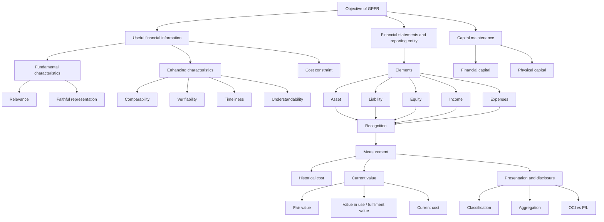
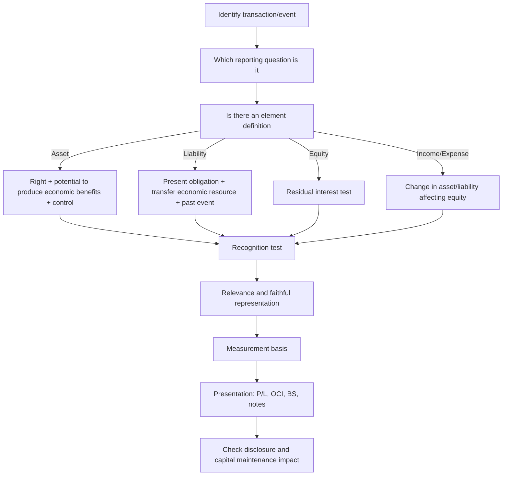

# Chapter 2: Conceptual Framework for Financial Reporting under Ind AS

## Exam Relevance

This chapter is the architecture beneath Ind AS. It is rarely asked as a pure memory dump; instead, it is used to justify why an item is, or is not, recognised, how it should be measured, and how a standard should be interpreted when the standard is silent or ambiguous.

For CA Final FR, this chapter matters because it:

1. explains the objective of general purpose financial reporting;
2. defines the qualitative characteristics that make financial information useful;
3. gives the modern definitions of asset, liability, equity, income and expenses;
4. explains recognition, derecognition, measurement, presentation and disclosure;
5. provides the profit and capital maintenance lens used in interpretation questions.

Most questions are indirect:

- "Can this item be recognised as an asset?"
- "Should this be routed through OCI or profit or loss?"
- "Which measurement basis gives the best representation?"
- "Why is a note disclosure needed even if recognition is not done?"

## Core Intuition

Think of the Conceptual Framework as the constitution of financial reporting.

- The objective tells you **why** financial statements exist.
- Qualitative characteristics tell you **what makes information good**.
- Definitions of elements tell you **what can enter the statements**.
- Recognition criteria tell you **when entry is justified**.
- Measurement tells you **at what amount** it should appear.
- Presentation/disclosure tell you **how to communicate it clearly**.
- Capital maintenance tells you **what counts as profit**.

The central idea is simple:

> Financial reporting should help users make decisions about providing resources to the entity, by giving information that is relevant and faithfully represented, while remaining cost-conscious.

## Concept Map

## Key Concepts

### 1) Status and purpose of the Framework

The Framework is not an Ind AS. It does not override any specific standard.

Its purposes are to:

- assist ICAI in formulating Ind AS on consistent concepts;
- assist preparers when no Ind AS applies, or where a choice exists;
- assist users, auditors and others in understanding and interpreting Ind AS.

If a specific Ind AS departs from the Framework, the departure is explained in that standard.

### 2) Objective of general purpose financial reporting

The objective is to provide financial information about the reporting entity that is useful to existing and potential investors, lenders and other creditors for making decisions about providing resources to the entity.

Those decisions include:

- buying, selling or holding equity or debt instruments;
- providing or settling loans and other credit;
- exercising voting or influence rights.

Users mainly want information about:

- economic resources of the entity;
- claims against the entity;
- changes in resources and claims;
- management stewardship.

### 3) Qualitative characteristics of useful financial information

#### Fundamental characteristics

- **Relevance**: information capable of making a difference to decisions.
- **Faithful representation**: complete, neutral and free from error to the extent possible.

#### Enhancing characteristics

- **Comparability**: allows similarities and differences to be identified.
- **Verifiability**: different knowledgeable and independent observers could reach consensus.
- **Timeliness**: information available in time to influence decisions.
- **Understandability**: clear and concise presentation for reasonably informed users.

#### Cost constraint

Do not provide information if the benefit does not justify the cost of producing and using it.

#### Exam lens

When two treatments are possible, ask:

1. Which one is more relevant?
2. Which one is more faithfully representative?
3. Which one is more understandable, comparable and verifiable?
4. Is the cost justified?

### 4) Reporting entity and financial statements

A reporting entity is any entity required, or choosing, to prepare financial statements.

It can be:

- a single entity;
- part of an entity;
- more than one entity;
- not necessarily a legal entity.

Types:

- **Consolidated financial statements**: parent + subsidiaries as one reporting entity.
- **Unconsolidated financial statements**: parent alone.
- **Combined financial statements**: two or more entities not all linked by parent-subsidiary relationship.

The going concern assumption is the default unless liquidation or cessation is intended or unavoidable.

### 5) Elements of financial statements

#### Asset

An asset is a present economic resource controlled by the entity as a result of past events.

Three ideas sit inside the definition:

- **right**: there must be a right, legal or otherwise;
- **potential to produce economic benefits**;
- **control**: the entity must control the resource.

#### Liability

A liability is a present obligation of the entity to transfer an economic resource as a result of past events.

Three tests:

- there must be an obligation;
- the obligation must require transfer of an economic resource;
- it must be present and arise from past events.

#### Equity

Equity is the residual interest in the assets of the entity after deducting all liabilities.

Equity claims are claims on that residual interest that do not meet the definition of liability.

#### Income and expenses

- **Income**: increases in assets or decreases in liabilities that increase equity, other than contributions from equity holders.
- **Expenses**: decreases in assets or increases in liabilities that decrease equity, other than distributions to equity holders.

### 6) Recognition and derecognition

Recognition is the process of capturing an item that meets the definition of an element in the balance sheet or statement of profit and loss.

An item is recognised only if doing so gives:

- relevant information; and
- a faithful representation.

If recognition is not done, disclosure in the notes may still be needed.

Derecognition is the removal of all or part of a recognised asset or liability from the balance sheet.

For assets, derecognition normally happens when control is lost.

For liabilities, derecognition normally happens when the obligation is discharged, cancelled, or expires.

### 7) Measurement

Measurement is about assigning monetary amounts to recognised elements.

Two broad families:

- **Historical cost**: based on the transaction price or event that gave rise to the item.
- **Current value**: updated to reflect conditions at the measurement date.

Current value includes:

- fair value;
- value in use for assets;
- fulfilment value for liabilities;
- current cost.

### 8) Presentation and disclosure

Financial statements communicate through:

- classification;
- aggregation;
- presentation in balance sheet, statement of profit and loss, OCI, and notes.

Good presentation does not merely repeat numbers. It separates dissimilar items, groups similar items, and keeps the notes from becoming an information landfill.

### 9) Capital and capital maintenance

Two concepts of capital:

- **Financial capital**: capital equals net assets or equity.
- **Physical capital**: capital means productive capacity.

Two concepts of capital maintenance:

- **Financial capital maintenance**: profit arises only if closing net assets exceed opening net assets, after owner transactions.
- **Physical capital maintenance**: profit arises only if closing productive capacity exceeds opening productive capacity, after owner transactions.

## Problem-Solving Framework

Use this sequence in theory and case-based questions:

### Short decision rule

Ask these in order:

1. What is the economic phenomenon?
2. Does it meet an element definition?
3. Does recognition give useful information?
4. Which measurement basis best balances relevance and faithful representation?
5. Where should it be presented and disclosed?

## Worked Examples

### Micro-example: Definition Met, Recognition Still Fails

An entity files a claim against a supplier and may receive compensation. The possible inflow may meet the broad idea of an economic resource if the right exists, but recognition can still fail if the existence or measurement of the asset is too uncertain. The Framework helps you ask the recognition questions; the relevant Ind AS decides the final accounting treatment.

This is the practical lesson:

> Definition is the entry gate. Recognition is the decision to put the item into the financial statements.

### Example 1: Pending lawsuit with uncertain outcome

Facts: The entity is facing a lawsuit. Legal opinion suggests a possible outflow, but the amount is highly uncertain.

Analysis:

- There may be a present obligation if the past event has already created a duty.
- If existence is uncertain or measurement uncertainty is extreme, recognition may not give faithful representation.
- Even if not recognised, note disclosure about the risk, range of outcomes and uncertainties may be necessary.

Exam point:

Do not jump to automatic recognition just because a lawsuit exists. Test the obligation and the quality of measurement first.

### Example 2: Machinery bought recently

Facts: A machine was bought this year for a market price.

Analysis:

- Historical cost is relevant because it comes directly from the transaction price.
- If the machine is consumed over time, depreciation allocates historical cost systematically.
- If current value is used for some reason, then changes in value may flow differently through profit or loss or OCI depending on the Ind AS.

Exam point:

The Framework does not say "fair value always wins". The choice depends on relevance, faithful representation, and the user effect.

### Example 3: Customer advance received before performance

Facts: An entity receives cash in advance for services to be provided later.

Analysis:

- Cash received is an asset.
- The obligation to provide services is a present obligation arising from the contract.
- The advance is usually a liability until performance occurs.

Exam point:

Revenue is not automatic on receipt of cash. Look for performance and obligation.

## Common Mistakes

1. Treating the Framework as if it is a standard.
2. Forgetting that relevance and faithful representation are the fundamental characteristics.
3. Confusing comparability with uniformity.
4. Saying "probability is low, so no liability exists". Probability affects recognition relevance, not the existence definition by itself.
5. Mixing up recognition with measurement.
6. Assuming fair value is the only current value measure.
7. Treating OCI as a dumping ground instead of a deliberate presentation choice.
8. Writing "income = inflow" and "expense = outflow" without linking them to changes in assets/liabilities and equity.
9. Ignoring notes when recognition is not done.
10. Missing the version-sensitive applicability date.

## Summary Tables

### Table 1: Big picture

| Layer | Question | Core idea |
|---|---|---|
| Objective | Why report? | Useful decision-making information |
| Qualitative characteristics | What is good information? | Relevant + faithfully represented |
| Elements | What can be reported? | Asset, liability, equity, income, expense |
| Recognition | When to recognise? | Useful and faithfully represented |
| Measurement | At what amount? | Historical cost or current value |
| Presentation/disclosure | How to show it? | Classification, aggregation, notes |
| Capital maintenance | What is profit? | Residual after maintaining capital |

### Table 2: Qualitative characteristics

| Type | Characteristics | Exam cue |
|---|---|---|
| Fundamental | Relevance, faithful representation | Must-have |
| Enhancing | Comparability, verifiability, timeliness, understandability | Improves quality |
| Constraint | Cost | Do not over-engineer reporting |

### Table 3: Elements

| Element | Definition shortcut | Common trap |
|---|---|---|
| Asset | Present controlled resource with economic benefit potential | Ownership is not always necessary |
| Liability | Present obligation to transfer economic resource | Future intention alone is not enough |
| Equity | Residual interest | Not a standalone obligation |
| Income | Asset up / liability down causing equity up, excluding owner contributions | Do not confuse with owner inflows |
| Expense | Asset down / liability up causing equity down, excluding owner distributions | Do not confuse with owner outflows |

### Table 4: Measurement bases

| Basis | What it uses | Strength | Weakness |
|---|---|---|---|
| Historical cost | Past transaction price | Simple, objective, often verifiable | May become stale |
| Fair value | Exit price in market participant view | Market-aligned, current | Needs estimates if no active market |
| Value in use | Entity-specific present value of future inflows | Focuses on utility to entity | High estimation burden |
| Fulfilment value | Entity-specific present value of settlement outflows | Relevant for liabilities | Hard to observe directly |
| Current cost | Current replacement price | Shows replacement economics | May be difficult to determine |

### Table 5: Presentation logic

| Tool | Purpose |
|---|---|
| Classification | Separate unlike items, group like items |
| Aggregation | Summarise without hiding substance |
| OCI | Used when later recycling or separate reporting better serves usefulness |
| Notes | Explain uncertainty, assumptions, risks, and items not recognised |

## Last-Day Revision

Memorise this chain:

**Objective -> Characteristics -> Elements -> Recognition -> Measurement -> Presentation -> Capital maintenance**

If you are blanking in the exam, rebuild the answer from these prompts:

- Who is the user?
- What decision is being supported?
- Is the information relevant?
- Is it faithfully represented?
- What is the asset/liability/equity/income/expense?
- Should it be recognised now or only disclosed?
- Which measurement basis is best?
- Does the presentation help or hide meaning?

### Ultra-short memory sheet

- Framework guides, but does not override, Ind AS.
- Primary users: investors, lenders and other creditors.
- Fundamental characteristics: relevance and faithful representation.
- Enhancing characteristics: comparability, verifiability, timeliness, understandability.
- Asset: present controlled economic resource.
- Liability: present obligation to transfer economic resource.
- Equity: residual interest.
- Income and expenses are changes in assets/liabilities that affect equity, excluding owner transactions.
- Recognition needs usefulness and faithful representation.
- Measurement can be historical cost or current value.
- Presentation should classify and aggregate without obscuring substance.
- Profit depends on capital maintenance concept.

## Doubts / Version-Sensitive Items

1. **Applicability date**: the official ICAI framework is applicable for standard-setting from **1 April 2020** and for preparers for accounting periods beginning on or after **1 April 2021**. This is a version-sensitive point and should be stated carefully in exams.
2. **Source layout**: the PDF contains dense tables, especially in measurement and capital-maintenance sections. I have normalised them into prose and summary tables here.
3. **OCI / recycling**: the Framework gives principles, but actual OCI recycling depends on the relevant Ind AS. Do not overgeneralise from the Framework alone.
4. **Recognition thresholds**: the Framework uses judgment-heavy language. Do not turn it into a rigid probability rule.
5. **Measurement basis**: the Framework discusses principles, not a one-size-fits-all answer. Ind AS-specific measurement requirements can override a generic conceptual answer.
6. **Old vs new framework references**: some older materials still mention the previous Ind AS framework. For current exam answers, align with the revised Conceptual Framework under Ind AS.

### Validation note

This note was built from the official ICAI Conceptual Framework PDF structure and content, with the source’s chapter headings, definitions, and measurement logic cross-checked against the framework text. Where the PDF’s tables were hard to reproduce directly, I converted them into compact teaching tables and flagged the version-sensitive points above.
