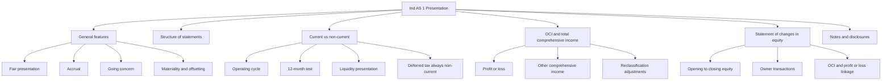
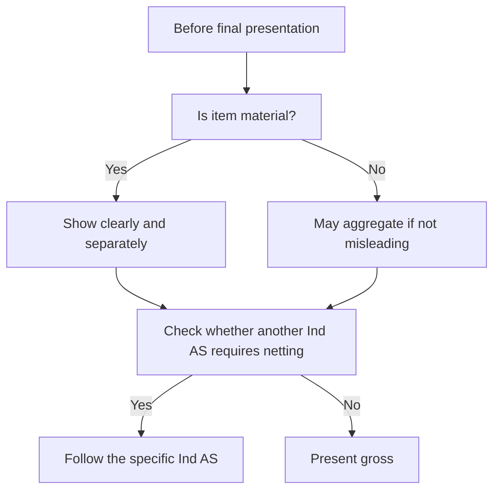
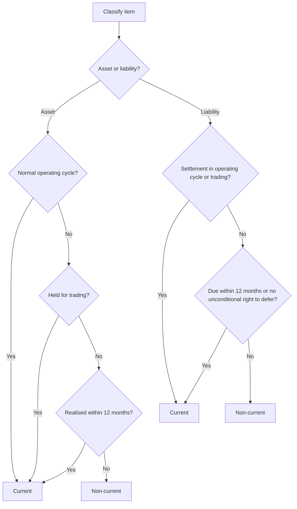

# Chapter 3, Unit 1: Ind AS 1 - Presentation of Financial Statements

## Exam Relevance

- This is a high-frequency presentation standard. The examiner uses it to test whether you can classify items correctly and write a clean financial statement layout.
- Expect questions on current vs non-current classification, operating cycle, liquidity presentation, OCI, equity movements, and notes/disclosures.
- The standard also appears indirectly in questions on borrowing classification, deferred tax presentation, comparative information, and the statement of changes in equity.
- A common exam twist is to mix presentation rules with substance rules: a liability may be long-term in economic terms but still current because settlement is due within 12 months or the right to defer is missing.
- Another favorite twist is to mix profit or loss with OCI and then ask for the effect on SOCIE.

## Core Intuition

Ind AS 1 is the language of the financial statements.
It does not measure the business; it makes the measurement readable, comparable, and classifiable.

The whole chapter can be remembered as:

> present fairly, classify correctly, separate OCI from profit or loss, and show movement in equity clearly.

## Concept Map

## Key Concepts

### 1. Objective and scope

Ind AS 1 sets the overall framework for general-purpose financial statements.
It applies to both consolidated and separate financial statements.
It does not govern condensed interim financial statements, except for the relevant paragraphs of the standard that still apply there.

The exam point is simple:

- the standard is about presentation, not measurement;
- the content is supplemented by other Ind AS;
- the same structure must help users compare across periods and across entities.

### 2. General features: the examiner's favorite theory zone

#### Fair presentation

Financial statements should present fairly the financial position, performance, and cash flows.
If compliance with an Ind AS would be misleading in the rare case allowed by the framework, the entity may need to depart only if the regulatory framework permits it.

#### Accrual basis

Items are recognised when earned or incurred, not when cash moves.

#### Going concern

Prepare the statements on the assumption that the entity will continue operating unless management intends or is forced to liquidate or cease trading.

#### Consistency

Use the same presentation and classification from period to period unless a change is justified.

#### Materiality and aggregation

Material items should not be buried in clutter.
Similar items may be aggregated, but dissimilar items should not be mixed just because they are nearby on the balance sheet.

#### Offsetting

As a rule, do not net assets against liabilities or income against expenses unless another Ind AS requires or permits it.
This is a classic exam trap.
Allowance against inventory or doubtful debt provision is not the same as prohibited offsetting.

### 3. Complete set of financial statements

A complete set includes:

- balance sheet,
- statement of profit and loss,
- statement of changes in equity,
- statement of cash flows,
- notes with material accounting policy information and other explanatory information,
- comparative information for the preceding period,
- opening balance sheet for the earliest comparative period when retrospective application, retrospective restatement, or reclassification is involved.

The statement of profit and loss is presented as a single statement with two sections:

- profit or loss first,
- OCI immediately after it.

### 4. Current vs non-current classification

This is the heart of the chapter.

Use current/non-current classification in the balance sheet unless a liquidity presentation is more relevant and reliable, which is more common for entities such as financial institutions.

An asset is current when it is:

- expected to be realised, sold, or consumed in the normal operating cycle,
- held mainly for trading,
- expected to be realised within 12 months after the reporting date,
- cash or cash equivalent, unless restricted from being used for at least 12 months after the reporting date.

An asset is non-current when it fails those tests.

A liability is current when it is:

- expected to be settled in the normal operating cycle,
- held mainly for trading,
- due within 12 months after the reporting date,
- or the entity does not have an unconditional right to defer settlement for at least 12 months.

Deferred tax assets and deferred tax liabilities are always non-current in the current/non-current format.

### 5. Operating cycle logic

The operating cycle is the time between acquiring assets for processing and their realisation in cash or cash equivalents.

Important exam habits:

- If the operating cycle is not clearly identifiable, assume 12 months.
- Inventory and trade receivables may be current even when they are realised after 12 months, if they are part of the normal operating cycle.
- For businesses with different cycles, classify the item with reference to the relevant cycle for that item.

### 6. Balance sheet presentation

Ind AS 1 requires separate current and non-current sections unless liquidity presentation is more relevant.

If the entity uses current/non-current format, it must also disclose the amount expected to be recovered or settled after more than 12 months for each asset and liability line item that combines short and long-term amounts.

The balance sheet should not classify deferred tax as current.

### 7. Statement of profit and loss and OCI

The profit or loss statement is not just about revenue and expenses.
It must also show OCI in a separate section immediately after profit or loss.

OCI contains items that another Ind AS requires or permits outside profit or loss.
Typical OCI items include revaluation surplus, remeasurement of defined benefit plans, foreign currency translation differences on foreign operations, some fair value movements on equity investments designated at FVOCI, and certain hedging items.

The examiner often asks you to sort items into:

- profit or loss,
- OCI,
- equity directly.

That sorting matters more than rote memory.

### 8. Statement of changes in equity

SOCIE is the bridge between performance and ownership changes.
It should show:

- total comprehensive income for the period, split between owners and non-controlling interests where relevant,
- retrospective adjustments or restatements,
- reconciliation for each component of equity from opening to closing,
- movements from profit or loss,
- movements from each OCI item,
- transactions with owners in their capacity as owners,
- direct equity items such as capital reserve recognized under business combination accounting.

This is the place where OCI stops being abstract and becomes a movement in equity.

### 9. Notes

Notes are not a dumping ground.
They must:

- explain the basis of preparation and accounting policies,
- disclose information required by Ind AS that is not shown elsewhere,
- provide extra information that helps users understand the statements.

They should be systematic, cross-referenced, and readable.

The usual order is:

1. statement of compliance with Ind AS,
2. material accounting policy information,
3. supporting information for items in the primary statements,
4. other disclosures such as contingencies, commitments, and capital management.

## Professor's Problem-Solving Framework

1. Identify whether the question is about presentation, classification, or disclosure.
2. Decide which statement is affected: balance sheet, P and L, OCI, SOCIE, cash flow, or notes.
3. For balance sheet items, test current vs non-current using operating cycle first, then 12 months, then trading, then right to defer.
4. Check whether the item belongs in profit or loss, OCI, or equity directly.
5. See whether the answer needs a line-item note, comparative disclosure, or opening balance sheet.
6. Write the conclusion in exam language, not in loose narrative.

## Worked Examples

### Example 1: Operating cycle beats the 12-month rule

Problem:
An entity produces aircraft. Raw material to delivery takes 9 months, and collection takes 7 months after delivery.

Working:
The operating cycle is 16 months.
Inventory and trade receivables are part of that cycle, so they are current even though the total cash realisation time is beyond 12 months.

Answer:
Both inventory and receivables are current.

### Example 2: Liability due within 12 months

Problem:
A loan has a large long-term balance, but one instalment falls due within 12 months after the reporting date.

Working:
The current portion due within 12 months is current.
The balance due after 12 months is non-current, assuming the entity has an unconditional right to defer the rest.

Answer:
Split the liability between current and non-current.

### Example 3: OCI vs profit or loss

Problem:
Remeasurement of defined benefit plans, revaluation surplus, foreign operation translation gain, and normal current service cost.

Working:
- remeasurement of defined benefit plans: OCI,
- revaluation surplus: OCI,
- translation gain on foreign operation: OCI,
- current service cost: profit or loss.

Answer:
Put the first three in OCI and the service cost in profit or loss.

### Example 4: SOCIE logic

Problem:
An entity has profit for the year, OCI gain, dividend declared, and issue of new shares.

Working:
Profit and OCI go into total comprehensive income.
Dividend is a transaction with owners.
Issue of shares changes equity directly.

Answer:
Show all three in SOCIE, but in different columns or lines depending on the component of equity affected.

## Common Mistakes

- Using 12 months mechanically without checking the normal operating cycle first.
- Forgetting that trade receivables and inventory are often current even when realised later than 12 months.
- Classifying deferred tax as current.
- Netting items when the standard requires gross presentation.
- Putting OCI items in profit or loss.
- Forgetting that SOCIE is mandatory in a complete set of financial statements.
- Writing only a balance sheet answer when the question actually needs note disclosure or comparative information.
- Treating a long-term liability as non-current even when the right to defer settlement is missing.

## Summary Tables

### 1. Statement quick map

| Statement | What it shows | Exam reminder |
|---|---|---|
| Balance sheet | Financial position at period end | Current/non-current split unless liquidity is better |
| Profit and loss | Performance for the period | OCI comes after profit or loss in one statement |
| OCI section | Items outside profit or loss | Only items permitted by other Ind AS |
| SOCIE | Movement in each equity component | Connects profit, OCI, owners, and opening/closing equity |
| Cash flow statement | Cash movements | Covered by Ind AS 7, not Ind AS 1 |
| Notes | Explanations and policies | Cross-reference everything material |

### 2. Current vs non-current cheat sheet

| Item | Current if... | Special exam note |
|---|---|---|
| Inventory | Part of operating cycle | May be current even if >12 months |
| Trade receivables | Part of operating cycle | Same logic as inventory |
| Cash and cash equivalents | Normally current | Unless restricted for 12 months or more |
| Trade payables | Due in operating cycle or within 12 months | Operating working capital items may be current even if due later |
| Loan liability | Due within 12 months or no unconditional right to defer | Split current portion and non-current balance |
| Deferred tax | Not current | Always non-current in this format |

### 3. Liability classification trigger table

| Question wording | What to check | Likely direction |
|---|---|---|
| "Due within 12 months" | Is repayment contractually due within 12 months after reporting date? | Current for that portion. |
| "Entity expects to refinance" | Did it have an unconditional right to defer at reporting date? | Expectation alone is not enough. |
| "Loan covenant breached before reporting date" | Did breach make the loan payable on demand at reporting date? | Usually current unless the Ind AS 1 carve-out in the study material applies. |
| "Waiver obtained before approval of financial statements" | Does the current ICAI material allow non-current classification in that specific breach/waiver fact pattern? | Treat as version-sensitive and follow source wording. |
| "Grace period ending after 12 months" | Whether lender cannot demand repayment within 12 months | May support non-current classification. |

### 4. OCI vs profit or loss

| Item type | Usual location | Exam cue |
|---|---|---|
| Current service cost | Profit or loss | Ongoing operating cost |
| Revaluation surplus | OCI | Outside P and L unless reversed through P and L by another standard |
| Defined benefit remeasurement | OCI | Classic OCI item |
| Foreign operation translation difference | OCI | But watch reclassification on disposal |
| FVOCI equity investment gains/losses | OCI | Subject to the relevant financial instrument standard |

## Last-Day Revision

- Ind AS 1 is about presentation, structure, and comparability.
- A complete set includes balance sheet, P and L, SOCIE, cash flow statement, notes, and comparatives.
- Use operating cycle first for current/non-current classification.
- If the operating cycle is unclear, assume 12 months.
- Deferred tax is not current in the current/non-current format.
- A liability is current if there is no unconditional right to defer settlement for at least 12 months.
- OCI is not a free-for-all; only items required or permitted by other Ind AS go there.
- SOCIE must reconcile each equity component from opening to closing.
- Offsetting is forbidden unless another Ind AS permits it.
- No extraordinary items under Ind AS 1.
- Notes must be systematic and cross-referenced.
- Comparative information is part of the complete set.

## Doubts / Version-Sensitive Items

- The long-term loan breach/waiver area is sensitive. First identify whether the entity had an unconditional right to defer settlement for at least 12 months at the reporting date. Then check whether the ICAI study material's Ind AS 1 carve-out applies where a lender agrees before approval of the financial statements not to demand payment because of breach of a material provision. Do not generalize this rule to every waiver fact pattern.
- The exact disclosure sequence for notes can vary slightly across editions, but the substance remains: compliance, accounting policies, supporting detail, and other explanatory information.
- OCI categories are standard-dependent. When the question mentions a specific instrument or hedge, check the underlying Ind AS 19, 21, 109, 113, or 16 rule before placing the item.
- If a question uses bank-style covenant language, look carefully at the reporting date, the due date, the breach date, and the waiver date.
- If the entity has mixed business cycles, classify each item with reference to the relevant cycle, not a single blanket rule.

