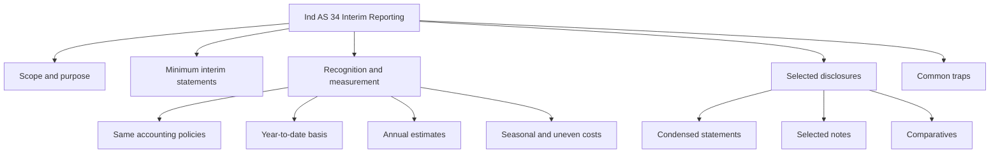
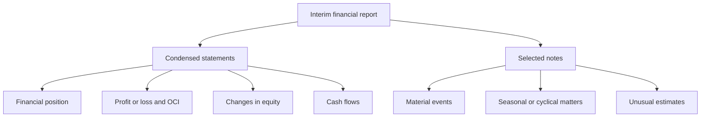

# Chapter 3, Unit 2: Ind AS 34 - Interim Financial Reporting

## Exam Relevance

- This standard tests whether you can think in year-to-date logic instead of full-year logic.
- Expect questions on condensed interim statements, minimum disclosures, year-to-date measurement, and how to treat taxes, seasonality, estimates, and unusual items.
- The examiner also likes to ask what should not be anticipated or deferred just because it is only an interim report.
- A common twist is to mix annual reporting habits into interim reporting and then see whether you catch the difference.

## Core Intuition

An interim report is a timely snapshot, not a mini annual report.
Use the same accounting principles, but measure and disclose on a shorter, year-to-date basis with special care for estimates and seasonality.

## Concept Map

## Key Concepts

### 1. What Ind AS 34 is really for

Ind AS 34 governs interim financial reporting, meaning financial reporting for a period shorter than a full financial year.
It does not create a new measurement system.
It compresses the annual system into a shorter reporting cycle.

The practical exam message is:

- use the same Ind AS recognition and measurement principles;
- report on a year-to-date basis;
- avoid front-loading or deferring items merely to make the interim period look smoother;
- disclose enough for users to understand the interim movements.

### 2. Interim period and interim financial report

An interim period is a financial reporting period shorter than a full financial year.
The report may be quarterly, half-yearly, or any shorter period required or chosen by the entity.

The standard is most visible in listed-company reporting, but the logic can be tested in any problem that asks for a short-period financial report.

### 3. Minimum components of an interim financial report

A condensed interim report normally includes:

- condensed statement of financial position,
- condensed statement of profit and loss and other comprehensive income,
- condensed statement of changes in equity,
- condensed statement of cash flows,
- selected explanatory notes.

If the entity publishes a complete set of financial statements at interim dates, those statements must also comply with the relevant presentation requirements.

### 4. Recognition and measurement: same rules, shorter horizon

This is the heart of the chapter.

The basic rule is that the same accounting policies used in annual financial statements should be applied in interim financial statements, except for changes in accounting policy that are required by another Ind AS.

Important practical consequences:

- revenue and expenses are recognised on the same basis as in annual reporting;
- items are measured on a year-to-date basis;
- estimates may need to be updated more frequently;
- costs that benefit a longer period may still be allocated over that longer period if that is the normal annual basis.

The examiner often checks whether you understand that an interim report is not an excuse for arbitrary accounting shortcuts.

### 5. Year-to-date logic

Interim financial statements are usually prepared using the year-to-date approach.
That means the report covers:

- the current interim period, and
- the cumulative period from the start of the financial year to the interim reporting date.

This matters for:

- tax expense,
- bonus and incentive accruals,
- annual rebates,
- depreciation and amortisation,
- inventory losses,
- seasonal business effects,
- and any expense that is uneven across the year.

### 6. Seasonal, cyclical, and uneven costs

A recurring exam issue is whether an expense should be accelerated or spread.

The rule is not to anticipate or defer costs just because the reporting period is shorter.
But if a cost or income item is naturally annual in pattern, then the interim figure should reflect the pattern that would be expected for the full year.

Examples:

- annual audit fee may be recognised as services are received;
- bonus expense may be accrued if the obligation exists by the interim date;
- vacation pay may need accrual if employees have already earned it;
- inventory losses, warranty costs, and similar items may need updated estimates.

### 7. Income tax in interim reporting

Income tax is a favourite exam trap.

The interim tax charge is not usually calculated as a simple fraction of annual tax.
Instead, the entity normally uses an estimated annual effective tax rate applied to the interim year-to-date profit before tax.

That estimate is then updated each interim period.

Watch for these points:

- current and deferred tax can both appear in interim reporting;
- tax effects of one-off items must be handled carefully;
- if a benefit or expense is clearly attributable to a specific interim period, do not blindly spread it across the year.

### 8. Selected explanatory notes

Interim notes are not a miniature copy of the annual note set.
They should explain the significant events and transactions that are needed to understand the interim numbers.

Typical disclosures include:

- statement that the report complies with Ind AS 34,
- accounting policies and any changes,
- seasonality or cyclicality of operations,
- unusual or material estimates,
- events after the interim reporting date if relevant to understanding the period,
- segment-style or line-item explanations where required by the standard or by materiality.

### 9. Condensed presentation logic

Condensed does not mean vague.
It means the primary statements may be shortened, but the information must still be understandable and linked to the annual accounts.

The examiner may ask whether a line item can be aggregated.
The answer depends on materiality, user understanding, and whether the aggregation hides a significant movement.

### 10. Comparative information

Comparatives in interim reporting are very important.
Depending on the statement and the reporting pattern, users may need:

- current interim period versus comparable interim period,
- year-to-date figures versus prior-year year-to-date figures,
- statement of financial position comparatives from the last annual period.

The point is to let the reader compare like with like.

## Professor's Problem-Solving Framework

1. Identify whether the question asks about scope, recognition, measurement, or disclosure.
2. Decide whether the report is condensed or a complete set.
3. Convert the numbers to year-to-date logic before doing any working.
4. Check whether an item should be spread, accrued, or estimated using annual pattern logic.
5. Apply the special tax rule and update estimates carefully.
6. Write the conclusion in interim-report language, not annual-report language.

## Worked Examples

### Example 1: Bonus payable only if annual target is met

Problem:
An entity pays an annual performance bonus if full-year profit exceeds a threshold. At the half-year point, management expects the target to be met.

Working:
If the bonus obligation arises from services already received up to the interim date, the expense should be accrued on the basis of the probable annual obligation and the services rendered to date.

Answer:
Recognise a bonus expense and liability to the extent the interim obligation has been incurred, using reasonable estimation.

### Example 2: Income tax at an interim date

Problem:
An entity makes a large profit in the first quarter because a contract was signed early, but later quarters are usually weaker.

Working:
Do not compute tax by applying a flat annual percentage to the quarter profit without considering the expected full-year pattern.
Use the estimated annual effective tax rate on year-to-date profit, then update for the facts known at the interim date.

Answer:
Recognise interim tax using the estimated annual effective tax rate, not a crude quarterly fraction.

### Example 3: Seasonal business

Problem:
A retailer earns most of its annual profit in the festive quarter.

Working:
The interim report should reflect that seasonality.
Profit in an off-season quarter may be low or negative and that alone does not mean the annual result will be weak.

Answer:
Do not smooth seasonality artificially.
Explain the seasonal pattern in the notes if it is material.

### Example 4: Annual audit fee

Problem:
The annual audit fee is billed only after year-end, but audit work is being performed throughout the year.

Working:
The cost should be recognised as services are received, not deferred until the invoice is issued.

Answer:
Accrue the interim portion of the audit fee.

## Common Mistakes

- Treating interim reporting as if it were a separate annual reporting cycle.
- Using the full-year tax rate mechanically without updating the estimated annual effective tax rate.
- Deferring or accelerating costs just to make interim profit look smoother.
- Ignoring seasonality when it clearly affects the business.
- Forgetting year-to-date logic for profit, expenses, and tax.
- Writing annual disclosure language when the question wants selected interim notes.
- Assuming condensed statements may omit material explanations.
- Missing the difference between current interim comparatives and annual comparatives.

## Summary Tables

### 1. Interim reporting quick map

| Area | Core rule | Exam reminder |
|---|---|---|
| Recognition | Same as annual Ind AS | No special shortcut merely because the period is short |
| Measurement | Year-to-date basis | Update estimates at each interim date |
| Tax | Estimated annual effective tax rate | The classic trap |
| Disclosure | Selected notes | Condensed does not mean incomplete |
| Comparatives | Like-with-like comparison | Match interim with interim where relevant |

### 2. Items that often need special judgment

| Item | Interim treatment | Trap |
|---|---|---|
| Bonus | Accrue if obligation exists | Do not wait for year-end invoice |
| Tax | Use annual effective tax rate | Do not use a flat percentage blindly |
| Audit fee | Accrue as service is received | Billing date is not recognition date |
| Seasonal revenue | Reflect actual seasonal pattern | Do not smooth by force |
| Inventory losses | Update estimate | Do not freeze the year-end assumption |
| Depreciation | Recognise on normal basis | Do not ignore year-to-date charge |

### 3. Condensed report checklist

| Check | Question to ask | Why it matters |
|---|---|---|
| Completeness | Are the minimum statements present? | Interim report must still be readable |
| Notes | Are key events explained? | Users need context |
| Estimates | Are year-to-date estimates updated? | Interim numbers change fast |
| Tax | Is the tax charge sensible for the full year estimate? | Most common exam point |

## Last-Day Revision

- Interim reporting is shorter, not looser.
- Use the same Ind AS recognition and measurement principles as annual reporting.
- Think year-to-date, not just current quarter.
- Estimate tax using the annual effective tax rate.
- Watch seasonal businesses carefully.
- Accrue bonuses, audit fees, and similar obligations when earned.
- Condensed statements still need selected explanatory notes.
- Comparative interim information matters.
- Do not let the shorter period tempt you into arbitrary smoothing.

## Doubts / Version-Sensitive Items

- The exact wording of minimum interim disclosures can vary slightly across ICAI editions, but the core requirement remains: condensed statements plus selected explanatory notes.
- Tax treatment is sensitive to the facts in the question. If the interim item is clearly specific to one period, do not over-generalise the annual effective tax rate rule.
- Seasonality and uneven expenditure questions often turn on the specific business model described in the problem.
- If the question mentions a change in accounting policy or an estimate revision, check whether the underlying change is required by another Ind AS before treating it as an interim-specific adjustment.

