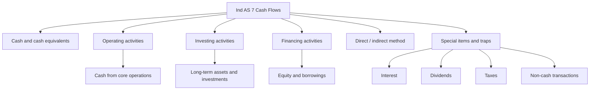
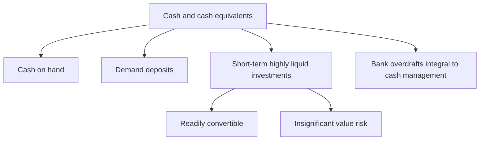
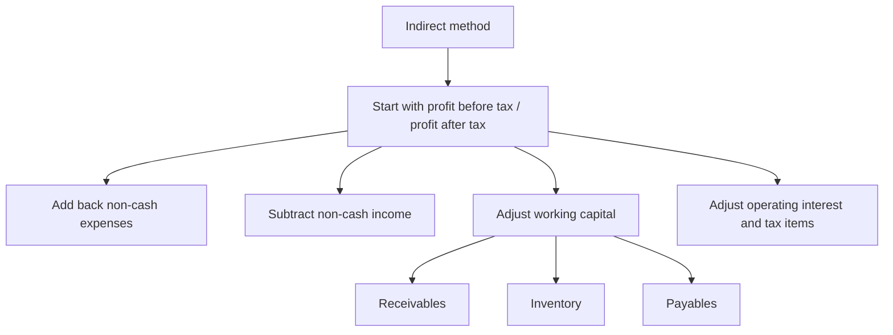

# Chapter 3, Unit 3: Ind AS 7 - Statement of Cash Flows

## Exam Relevance

- This is a classic classification chapter.
- The examiner usually tests whether you can sort cash flows into operating, investing, and financing sections without mixing them up.
- Expect questions on direct and indirect method, cash and cash equivalents, interest/dividend/tax treatment, bank overdrafts, and non-cash items.
- The biggest trap is not calculation, but classification logic.

## Core Intuition

Ind AS 7 turns profit into cash logic.
It answers a simple question: where did the cash come from, where did it go, and why is it different from accounting profit?

## Concept Map

## Key Concepts

### 1. What the statement of cash flows does

The statement of cash flows explains the change in cash and cash equivalents during the period.
It links profit with liquidity.

It is not just a cash book summary.
It classifies flows into three buckets:

- operating activities,
- investing activities,
- financing activities.

### 2. Cash and cash equivalents

Cash means cash on hand and demand deposits.
Cash equivalents are short-term, highly liquid investments that are readily convertible to known amounts of cash and are subject to an insignificant risk of changes in value.

Key exam points:

- cash equivalents are held for meeting short-term cash commitments, not for investment returns;
- bank overdrafts repayable on demand may form part of cash and cash equivalents if they are an integral part of the entity's cash management;
- restricted cash is not freely available cash and may need separate judgment.

### 3. Operating activities

Operating activities are the principal revenue-producing activities of the entity and other activities that are not investing or financing.

In plain exam language:

- cash received from customers,
- cash paid to suppliers and employees,
- cash paid for operating expenses,
- taxes on operating profit,
- and other day-to-day business flows.

The operating section is the one that shows whether the business actually generates cash from its core activities.

### 4. Investing activities

Investing activities are the acquisition and disposal of long-term assets and other investments not included in cash equivalents.

Typical investing flows:

- purchase or sale of PPE,
- purchase or sale of intangible assets,
- purchase or sale of investments,
- loans made to other parties,
- cash from sale of subsidiaries or business units, subject to netting rules for cash acquired.

### 5. Financing activities

Financing activities are activities that result in changes in the size and composition of the contributed equity and borrowings of the entity.

Typical financing flows:

- issue of shares,
- buyback of shares,
- proceeds from borrowings,
- repayment of borrowings,
- lease principal payments where relevant under the cash flow classification,
- dividends paid to owners.

### 6. Direct method and indirect method

Ind AS 7 permits two methods for operating cash flows.

#### Direct method

The direct method shows major classes of gross cash receipts and gross cash payments.

It typically includes:

- cash received from customers,
- cash paid to suppliers,
- cash paid to employees,
- cash paid for other operating expenses,
- taxes paid.

The direct method is the most intuitive, because it shows the actual cash engine of the business.

#### Indirect method

The indirect method starts with profit before tax or profit after tax and adjusts for:

- non-cash items,
- non-operating items,
- changes in working capital,
- interest and tax classification,
- and other reconciliation items.

This method is common in exam problems because it connects accounting profit to cash.

### 7. Classification logic: the examiner's real game

The classification depends on substance, not on how the transaction feels.

#### Operating

Cash flows from the entity's main trading activity.

#### Investing

Cash flows from acquiring and disposing of long-term productive assets and investments.

#### Financing

Cash flows from obtaining and repaying funds from owners and lenders.

Use the following practical rule:

- if it helps run the business today, lean operating;
- if it changes long-term asset base, lean investing;
- if it changes funding structure, lean financing.

### 8. Interest, dividends, and tax traps

This is the most exam-sensitive part of Ind AS 7.

#### Interest paid

Interest paid is classified consistently from period to period based on the entity's policy and the facts of the case.
In exam answers, treat it as an item that may sit in operating or financing depending on the policy stated or implied in the question.

#### Interest received

Interest received is classified consistently from period to period based on policy and substance.
In exam answers, treat it as an item that may sit in operating or investing depending on the policy stated or implied in the question.

#### Dividends received

Dividends received may be classified as operating or investing, depending on policy and consistency.

#### Dividends paid

Dividends paid are usually financing cash flows because they are returns to owners.

#### Income taxes

Income tax cash flows are usually operating cash flows, unless they can be specifically identified with investing or financing activities.

The trap is to classify these items by habit instead of by policy and substance.

### 9. Non-cash transactions

Non-cash investing and financing transactions are not included in the main statement of cash flows.
They are disclosed elsewhere because they do not involve cash movement.

Examples:

- issue of shares to acquire an asset,
- acquisition of PPE by lease,
- conversion of debt into equity,
- exchange of one non-cash asset for another.

### 10. Foreign currency and exchange effects

Cash flows in foreign currency are translated at the exchange rate at the date of the cash flow.

Unrealised exchange differences are not cash flows.
The effect of exchange rate changes on cash and cash equivalents is presented separately so users can reconcile opening and closing cash.

## Professor's Problem-Solving Framework

1. Identify whether the question asks for classification or computation.
2. Decide whether the item is operating, investing, or financing using substance.
3. Choose direct method or indirect method if the problem specifies one.
4. Treat interest, dividends, and tax with special care.
5. Exclude non-cash transactions from the main cash flow total.
6. Reconcile opening cash to closing cash and explain the movement clearly.

## Worked Examples

### Example 1: Purchase of machinery on credit

Problem:
An entity buys machinery for cash and partly on deferred payment terms.

Working:
The cash paid is an investing cash flow because it relates to acquisition of a long-term asset.
The credit portion is a non-cash financing or investing arrangement depending on substance, so it is not shown as a cash flow until cash is actually paid.

Answer:
Show only the cash payment in investing activities; disclose the non-cash part separately if material.

### Example 2: Interest paid by a manufacturing company

Problem:
A manufacturing company pays interest on a term loan.

Working:
Interest paid is not automatically financing in every answer.
Check the entity's policy and apply it consistently.

Answer:
Classify according to the chosen and consistently applied policy, commonly operating or financing.

### Example 3: Dividend received on investment

Problem:
An entity receives dividends from shares held as an investment.

Working:
This may be operating or investing depending on policy, but it should not be mixed with dividend paid logic.

Answer:
Classify consistently as operating or investing as per policy.

### Example 4: Reconciliation under indirect method

Problem:
Profit after tax is high, but receivables have increased and inventory has increased.

Working:
Increase in receivables absorbs cash, so subtract it.
Increase in inventory also absorbs cash, so subtract it.
Add back non-cash depreciation and similar charges.

Answer:
Start with profit and adjust for non-cash items plus working capital changes to arrive at cash from operations.

## Common Mistakes

- Mixing operating, investing, and financing by instinct instead of by classification logic.
- Forgetting that direct method shows gross receipts and payments.
- Treating all interest, dividend, and tax items as if they belong in one fixed section.
- Including non-cash transactions in the main cash flow total.
- Forgetting that bank overdrafts can be part of cash equivalents only in the right cash-management setting.
- Confusing profit with cash from operations.
- Ignoring working capital movements in the indirect method.
- Forgetting to disclose the effect of exchange rate changes on cash and cash equivalents.

## Summary Tables

### 1. Classification map

| Item | Usual classification | Exam reminder |
|---|---|---|
| Cash receipts from customers | Operating | Core trading flow |
| Cash paid to suppliers and employees | Operating | Day-to-day business payments |
| Purchase of PPE | Investing | Long-term asset acquisition |
| Sale of PPE | Investing | Disposal of long-term asset |
| Proceeds from shares issued | Financing | Owner funding |
| Loan repayment | Financing | Borrowed funds being settled |
| Dividend paid | Financing | Return to owners |

### 2. Interest, dividend, and tax cheat sheet

| Item | Possible sections | Trap |
|---|---|---|
| Interest paid | Operating or financing | Must be consistent |
| Interest received | Operating or investing | Do not force one answer without policy |
| Dividends received | Operating or investing | Depends on policy and nature |
| Dividends paid | Financing | Usually return to owners |
| Income taxes | Operating, unless specifically identifiable | Check whether linked to investing or financing |

### 3. Direct vs indirect method

| Method | What it shows | Best use in exam |
|---|---|---|
| Direct | Gross cash receipts and payments | Clear operating presentation |
| Indirect | Reconciliation from profit to operating cash | Most common in working problems |

## Last-Day Revision

- Ind AS 7 explains the change in cash and cash equivalents.
- Classify flows into operating, investing, and financing.
- Direct method shows gross cash receipts and payments.
- Indirect method starts from profit and adjusts to cash from operations.
- Interest, dividends, and taxes are the main trap zone.
- Non-cash transactions stay out of the main cash flow statement.
- Cash equivalents must be short-term, highly liquid, and low-risk.
- Bank overdrafts may be part of cash and cash equivalents only if integral to cash management.
- Exchange differences on cash are shown separately.
- Working capital changes matter in the indirect method.

## Doubts / Version-Sensitive Items

- Interest, dividend, and tax classification can depend on the entity's chosen policy and must be applied consistently. If the question is ambiguous, follow the policy stated in the question or the source material.
- The treatment of bank overdrafts depends on whether they are repayable on demand and integral to cash management.
- Non-cash transactions are disclosed separately, but the exact placement of that disclosure can vary with the report format used in the question.
- Foreign currency cash flow treatment can become fact-sensitive when exchange differences or translation effects are mixed into the problem.
