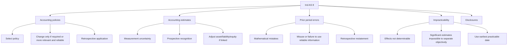
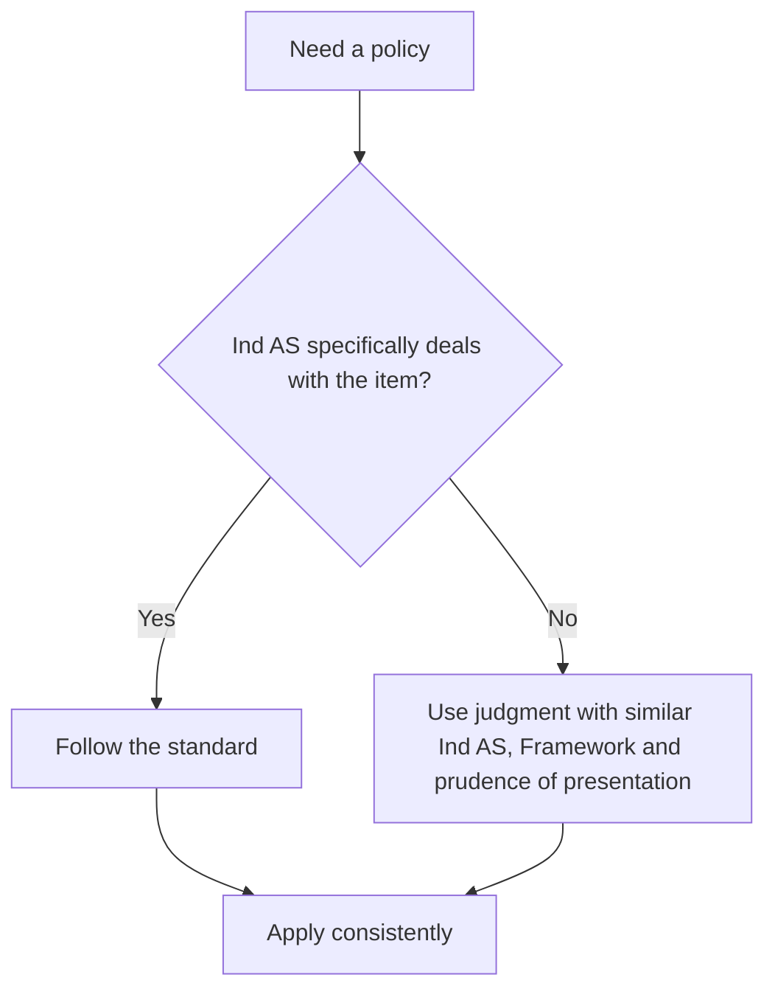
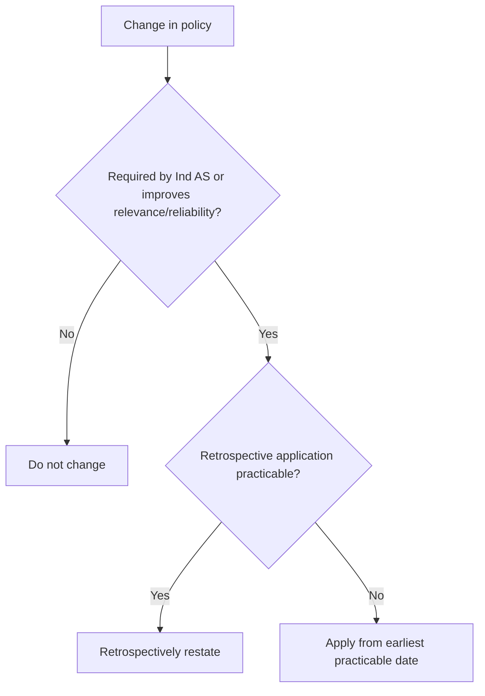
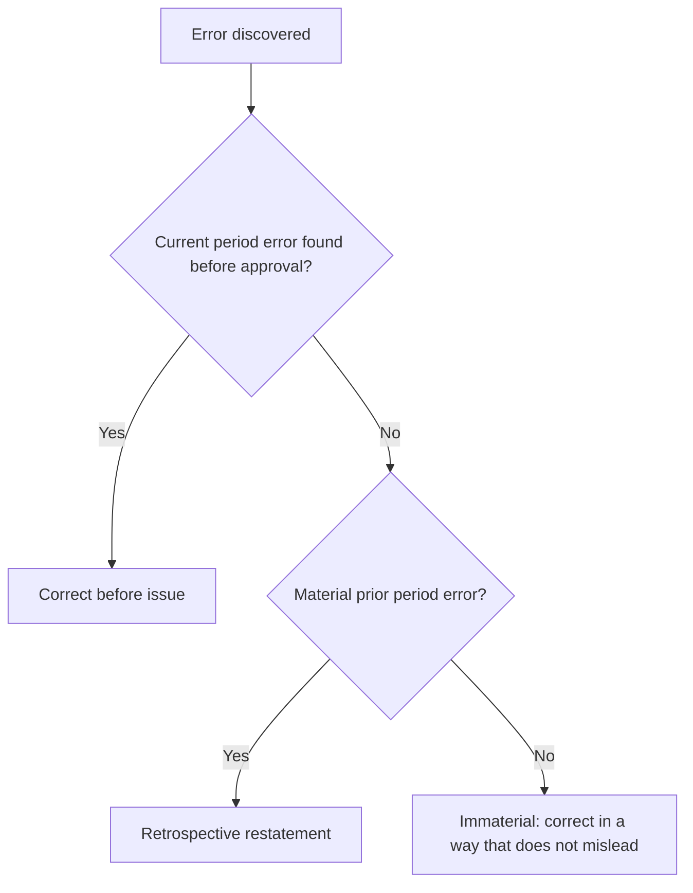

# Chapter 4, Unit 1: Ind AS 8 - Accounting Policies, Changes in Accounting Estimates and Errors

## Exam Relevance

- This is a classification-and-treatment chapter. The examiner wants you to identify whether the fact pattern is a policy change, estimate change, or prior period error.
- Common questions ask for retrospective vs prospective treatment, disclosures, impracticability, and the link with the third balance sheet under Ind AS 1.
- Traps are usually built around depreciation, useful life, inventory formula, goodwill, provision estimates, and fraud or accounting mistakes discovered later.
- Another favourite twist is to mix Ind AS 8 with Ind AS 1 presentation, especially where a retrospective restatement affects the opening balance sheet of the preceding period.

## Core Intuition

Ind AS 8 is a sorting standard.
It tells you whether the change belongs to the past, the present, or the future.

The exam one-liner is:

> policy change = change the rule, estimate change = update the guess, error = fix the mistake.

## Concept Map

## Key Concepts

### 1. What the standard is really doing

Ind AS 8 applies to:

- selecting and applying accounting policies,
- changes in accounting policies,
- changes in accounting estimates,
- corrections of prior period errors.

It is not about taxes on those changes. Tax effects are dealt with under Ind AS 12.

The exam point:

- the standard is about the accounting treatment of the change itself;
- the presentation consequences may spill into Ind AS 1;
- the tax consequence is a separate standard.

### 2. Accounting policy

Accounting policies are the specific principles, bases, conventions, rules and practices used in preparing and presenting financial statements.

Policy choice becomes important where the standard gives room for judgment. The policy should be selected so that the financial statements are relevant and reliable.

### 3. When can an accounting policy be changed?

A policy can be changed only when:

1. the change is required by an Ind AS; or
2. the change makes the financial statements provide more reliable and more relevant information.

Not every new fact pattern is a policy change.

The standard specifically says these are not policy changes:

- applying a policy to transactions or events that differ in substance from those previously occurring;
- applying a new policy to transactions or events that did not occur previously or were immaterial.

#### Quick exam sense

If the substance changes, the policy may stay the same while the underlying fact pattern changes.

### 4. Retrospective application of policy changes

As a rule, a change in accounting policy is applied retrospectively.

That means:

- adjust opening equity of the earliest prior period presented;
- restate comparative figures as if the new policy had always been applied;
- present the effects through the comparative information.

If the change was made to a policy used in the first Ind AS financial statements, the special transition rules of first-time adoption must be checked; the ordinary Ind AS 8 policy-change rule does not run in the same way there.

### 5. Impracticability

Applying a requirement is impracticable when the entity cannot do it after making every reasonable effort.

For a prior period, retrospective application or retrospective restatement is impracticable if:

- the effects are not determinable;
- it would require assumptions about management's intent for that period;
- it would require significant estimates and objective separation is impossible.

The practical answer is:

- use the earliest date from which retrospective application is practicable;
- do not pretend precision where the data does not exist.

### 6. Changes in accounting estimates

Accounting estimates are monetary amounts subject to measurement uncertainty.

This is not a mistake. It is the business reality that some amounts can only be estimated.

Typical estimate areas:

- doubtful debts / expected credit losses,
- useful life and residual value of PPE,
- warranty obligations,
- inventory NRV,
- provisions and actuarial-type assumptions.

#### The rule

Changes in estimates are recognised prospectively.

That means:

- current period effect goes through current period profit or loss;
- future period effect goes through future periods;
- if the estimate change affects an asset, liability or equity item, adjust the related carrying amount in the period of change.

#### The trap

A change in estimate is not a prior period error.

It becomes an error only if the earlier amount was wrong because reliable information available then was ignored or misused.

### 7. Policy vs estimate

The line between policy and estimate can blur.

The exam-safe rule is:

- change in measurement basis = accounting policy;
- if it is difficult to distinguish, treat it as a change in estimate.

#### Common examples

| Situation | Treatment | Exam clue |
|---|---|---|
| Change in cost formula for inventories | Policy change | Cost formula is part of inventory policy. |
| Revision of useful life of PPE | Estimate change | New information about consumption pattern. |
| Change in depreciation method because pattern of consumption changed | Usually estimate-driven unless the measurement basis itself changes | Watch the fact pattern carefully. |
| Change from cost model to revaluation model | Policy change | Measurement basis changes. |

### 8. Prior period errors

Prior period errors are omissions or misstatements in prior period financial statements arising from failure to use, or misuse of, reliable information that was available when those statements were approved for issue and could reasonably have been obtained and used.

Common causes:

- mathematical mistakes,
- mistakes in applying accounting policies,
- oversights or misinterpretations of facts,
- fraud.

What it is not:

- the outcome of a contingency becoming known later is not automatically an error;
- a genuine estimate revised with later information is not an error by itself.

### 9. How prior period errors are corrected

Material prior period errors are corrected retrospectively.

That means:

- restate comparative figures for prior periods presented;
- adjust opening balances of assets, liabilities and equity for the earliest prior period presented;
- if impracticable for a period, restate from the earliest practicable date.

### 10. Third balance sheet link

Ind AS 1 can require a third balance sheet at the beginning of the preceding period when retrospective application, retrospective restatement or reclassification has a material effect on the opening balance sheet of that preceding period.

This is a presentation question, not an Ind AS 8 measurement question.

So the sequence is:

1. Ind AS 8 tells you whether the change or error is retrospective.
2. Ind AS 1 tells you whether the retrospective effect is so material that a third balance sheet is needed.

### 11. Disclosures

For a policy change, disclose:

- the nature of the change;
- the reasons why the new policy provides reliable and more relevant information;
- the amount of adjustment for each financial statement line item affected, to the extent practicable;
- the amount of adjustment relating to periods before those presented, to the extent practicable;
- if retrospective application is impracticable, explain why and describe how and from when the change has been applied.

For a change in estimate, disclose:

- the nature and amount of the change;
- the effect on the current period;
- the effect expected in future periods, unless impracticable.

For a prior period error, disclose:

- the nature of the error;
- the amount of correction for each line item affected for each prior period presented, to the extent practicable;
- the amount of correction at the beginning of the earliest prior period presented;
- if retrospective restatement is impracticable, explain why and describe how and from when the error was corrected.

## Professor's Problem-Solving Framework

1. Decide whether the fact is a policy, estimate or error.
2. Ask whether the change is required by another Ind AS or is a voluntary policy change.
3. Decide retrospective or prospective treatment.
4. Check whether impracticability blocks full restatement.
5. Check whether Ind AS 1 third balance sheet consequences arise.
6. Write the conclusion in one clean exam sentence.

## Worked Examples

### Example 1: Inventory formula change

Problem:

An entity changes its inventory cost formula from FIFO to weighted average.

Working:

The cost formula used is part of accounting policy. This is a change in accounting policy, not an estimate.

Answer:

Apply retrospectively unless impracticable. Restate comparatives and disclose the effect.

### Example 2: Useful life revision

Problem:

Management revises the useful life of plant after new operational data shows the asset will be consumed faster than originally expected.

Working:

This is a change in accounting estimate because the amount was always subject to measurement uncertainty.

Answer:

Recognise prospectively in the current period and future periods, by adjusting depreciation from the date of change.

### Example 3: Revenue overstated last year

Problem:

The current year's review reveals that last year's revenue was overstated because invoices were recorded twice.

Working:

This is a prior period error. It is not a current period expense.

Answer:

Restate prior period figures retrospectively and adjust opening balances for the earliest prior period presented, subject to practicability.

### Example 4: New technology changes depreciation pattern

Problem:

An entity changes the pattern of consumption used for depreciation after a new production process is introduced.

Working:

This is an estimate-driven revision of future consumption, not a correction of a mistaken prior assumption.

Answer:

Treat prospectively from the date of change.

## Summary Tables

| Topic | Core rule | How to remember it |
|---|---|---|
| Accounting policy | Change only if required or more relevant and reliable | Change the rule |
| Accounting estimate | Recognise prospectively | Change the guess |
| Prior period error | Restate retrospectively | Fix the mistake |
| Impracticability | Use earliest practicable date | Do what can actually be done |
| Third balance sheet | Ind AS 1 presentation issue | Retrospective change + material opening effect |

| Common fact pattern | Most likely treatment | Trap |
|---|---|---|
| Cost formula changed | Policy change | Do not label it estimate |
| Useful life / residual value revised | Estimate change | Do not reopen past years |
| Fraud or arithmetical mistake found later | Error | Do not push into current year profit |
| Changed facts that did not exist earlier | Not necessarily a policy change | Substance matters |

## Common Mistakes

- Treating every change as retrospective restatement.
- Treating an estimate revision as a prior period error.
- Forgetting that a policy change can be prospective only when retrospective application is impracticable.
- Missing the Ind AS 1 third balance sheet link.
- Mixing up measurement basis changes with estimate changes.
- Ignoring the separate tax treatment under Ind AS 12.

## Last-Day Revision

- Policy = the principle or basis used.
- Estimate = a measured amount with uncertainty.
- Error = wrong use or non-use of reliable information available then.
- Policy changes are retrospective unless impracticable.
- Estimate changes are prospective.
- Prior period errors are retrospectively restated.
- Current period errors found before issue are corrected before approval.
- Third balance sheet is an Ind AS 1 consequence, not an Ind AS 8 rule.
- Outcome of a contingency becoming known later is not automatically an error.

## Doubts / Version-Sensitive Items

- The May 2026 source material states that Ind AS 8 policy-change requirements do not apply in an entity's first Ind AS financial statements; check the exact transition context if the exam question blends Ind AS 101 and Ind AS 8.
- The source PDF treats a change in the measurement basis as a policy change and says that if it is difficult to distinguish policy from estimate, treat it as an estimate. Keep the exact source wording in mind if the question is very literal.
- The treatment of a depreciation-method change can be fact-sensitive. In exam answers, link it to the reason for the change and the underlying measurement basis before concluding.
