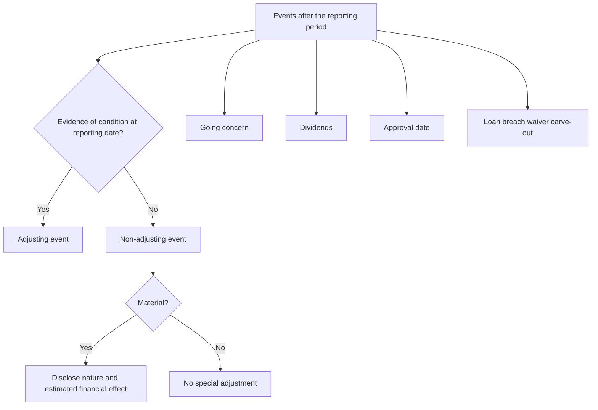
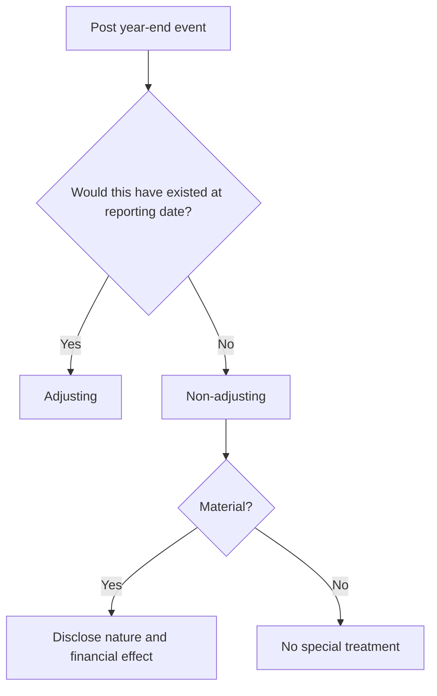

# Chapter 4, Unit 2: Ind AS 10 - Events after the Reporting Period

## Exam Relevance

- This is a high-yield trap chapter because the examiner loves to ask whether an event is adjusting or non-adjusting.
- You are also expected to know the special points on dividends, going concern, approval date, and the carve-out for waiver of breach in a long-term loan arrangement.
- Questions often combine year-end events with legal claims, fire, customer insolvency, market crashes, tax changes, and dividend declarations.
- The big skill is not memorising examples. It is deciding whether the event provides evidence of conditions existing at the reporting date.

## Core Intuition

Ind AS 10 asks one main question:

> Did the event tell you something about a condition that already existed at the reporting date, or did it create a new condition after the reporting date?

That one sentence decides almost everything.

## Concept Map

## Key Concepts

### 1. What counts as an event after the reporting period

An event after the reporting period is an event, favourable or unfavourable, that occurs between the reporting date and the date when the financial statements are approved for issue.

The chapter is not about every post-balance-sheet development.
It is about how those developments affect the already closed reporting period.

### 2. Adjusting events

Adjusting events are those that provide evidence of conditions that existed at the reporting date.

The condition existed already. The later event merely revealed or confirmed it.

Typical examples:

- settlement of a court case after year-end that confirms an obligation existed at year-end;
- bankruptcy of a customer after year-end that confirms the receivable was impaired at year-end;
- sale of inventory after year-end that provides evidence of NRV at year-end;
- discovery of fraud or errors after year-end that proves the original financial statements were wrong;
- receiving information after year-end about conditions existing at year-end, such as valuation evidence or the outcome of existing disputes.

#### Exam test

If the later event answers, "What was true at year-end?" then it is usually adjusting.

### 3. Non-adjusting events

Non-adjusting events are those indicative of conditions that arose after the reporting date.

The event is new. It does not prove that the earlier balance sheet was wrong.

Typical examples:

- a fire after year-end destroying a plant;
- a business combination after year-end;
- major litigation arising solely from events after year-end;
- abnormally large changes after year-end in market prices or exchange rates;
- changes in tax rates or tax laws enacted or announced after year-end;
- dividend declaration after year-end;
- acquisition or disposal after year-end that is itself a new post-year-end event.

### 4. Material non-adjusting events

If a non-adjusting event is material, disclose:

- the nature of the event; and
- an estimate of its financial effect, or a statement that such an estimate cannot be made.

This is a disclosure rule, not an adjustment rule.

### 5. Dividends

Dividends declared after the reporting period but before approval of the financial statements are not recognised as a liability at the reporting date.

They are disclosed in the notes, but they do not become a year-end obligation just because the declaration happened before approval.

This is a classic trap.

| Timing | Treatment |
|---|---|
| Declared after reporting date and before approval | No liability at reporting date; disclose in notes |
| Declared before reporting date | Assess liability under the relevant facts and dividend type |
| Proposed dividend after reporting date | Not recognised as year-end liability |

### 6. Going concern

Going concern is a separate and very important post-reporting-date issue.

If after the reporting period but before approval management decides to liquidate the entity, cease trading, or has no realistic alternative but to do so, the financial statements may need to be prepared on a basis other than going concern.

This is not just a disclosure point. It can change the very basis of accounting.

#### Trap to avoid

Do not assume every post-year-end loss automatically destroys going concern.
The question is whether the deterioration is so pervasive that management no longer has a realistic alternative.

### 7. Date of approval for issue

The financial statements are not open-ended.
Ind AS 10 expects disclosure of the date on which the financial statements were approved for issue and who gave that approval.

That date matters because events after that date are outside the standard's scope for that set of financial statements.

### 8. Long-term loan arrangement breach waiver carve-out

This is a favourite exam twist in the Indian material.

Where there is a breach of a material provision of a long-term loan arrangement on or before the end of the reporting period, if the lender agrees to waive the breach before approval of the financial statements for issue, the study material treats it as an adjusting event under the carve-out.

This is one of those places where the legal wording matters.

### 9. Updating disclosures

Sometimes an event after the reporting period does not change recognition amounts, but it gives new information about conditions existing at year-end.

In that case, update the disclosures that relate to those conditions.

Example:

- a post-year-end court outcome may not change a recognised number if no amount was booked, but it may require disclosure if it helps users understand year-end uncertainty.

## Professor's Problem-Solving Framework

1. Identify the reporting date and the approval date.
2. Ask whether the event occurred before or after the reporting date.
3. Decide whether the event provides evidence of a year-end condition.
4. If yes, treat it as adjusting.
5. If no, treat it as non-adjusting and check materiality.
6. Separately test going concern and dividend rules.
7. Write the answer with clear exam language.

## Worked Examples

### Example 1: Customer goes bankrupt after year-end

Problem:

A debtor who owed money at year-end goes bankrupt two weeks after year-end.

Working:

If the bankruptcy confirms that the receivable was impaired at year-end, the event is adjusting.

Answer:

Revise the year-end loss allowance and financial statements accordingly.

### Example 2: Fire after year-end

Problem:

A factory burns down after the reporting date.

Working:

The fire is a new condition arising after year-end. It does not prove that the asset was already impaired at the reporting date.

Answer:

Non-adjusting event. If material, disclose the nature of the event and estimated financial effect.

### Example 3: Dividend declared after year-end

Problem:

The board declares a dividend after year-end but before approval of the financial statements.

Working:

No obligation existed at the reporting date.

Answer:

Do not recognise it as a liability at year-end. Disclose it in the notes.

### Example 4: Going concern shock

Problem:

After year-end, management decides that the entity has no realistic alternative but to cease trading.

Working:

This is not a normal adjusting-event question. It changes the basis of accounting.

Answer:

Prepare the financial statements on a basis other than going concern, if going concern is no longer appropriate, and disclose the facts.

### Example 5: Waiver of loan breach

Problem:

A company breaches a long-term loan covenant before year-end. The lender waives the breach before approval of the accounts.

Working:

Under the Indian study material carve-out, this is treated as adjusting.

Answer:

Reclassify and present in line with the carve-out and disclose the relevant facts.

## Summary Tables

| Event type | Treatment | Exam reminder |
|---|---|---|
| Existing condition confirmed after year-end | Adjusting | Update year-end numbers |
| New condition after year-end | Non-adjusting | Disclose if material |
| Dividend declared after year-end | Non-adjusting for recognition | No year-end liability |
| Going concern deterioration after year-end | Separate basis-of-accounting issue | May require non-going-concern basis |
| Loan breach waived before approval | Carve-out adjustment in the study material | Check the exact wording |

| Common example | Likely classification | Why |
|---|---|---|
| Customer insolvency after year-end | Adjusting, if it confirms year-end impairment | Evidence of pre-existing condition |
| Fire after year-end | Non-adjusting | New event |
| Tax rate announced after year-end | Non-adjusting | New law or announcement |
| Settlement of litigation after year-end | Adjusting, if it relates to pre-year-end obligation | Confirms existing exposure |

## Common Mistakes

- Treating every post-year-end event as non-adjusting.
- Treating every post-year-end event as adjusting because it affects profits.
- Recognising dividends declared after year-end as year-end liabilities.
- Forgetting that going concern can override the usual adjusting/non-adjusting analysis.
- Missing the distinction between disclosure and recognition.
- Ignoring the special wording around loan breach waiver in the study material.

## Last-Day Revision

- Adjusting event = evidence of a condition existing at reporting date.
- Non-adjusting event = new condition after reporting date.
- Material non-adjusting event = disclose nature and financial effect.
- Dividend declared after year-end = not a year-end liability.
- Going concern after year-end can require a change in basis.
- Approval date matters because the standard stops there.
- The loan breach waiver carve-out is a special exam trap.
- Ask first: "What was true at year-end?"

## Doubts / Version-Sensitive Items

- The source PDF includes a carve-out on waiver of breach of a material provision of a long-term loan arrangement before approval. Use the exact study material wording if the exam question quotes that fact pattern.
- Dividend treatment can depend on whether the question is about ordinary dividends or a fact pattern with contractual preference dividend features. Read the instrument terms carefully.
- Going concern questions can overlap with Ind AS 1 disclosure requirements. If the facts are severe, the answer may need both the accounting basis and the disclosure consequence.
