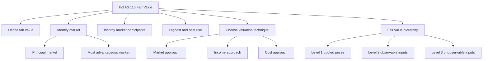
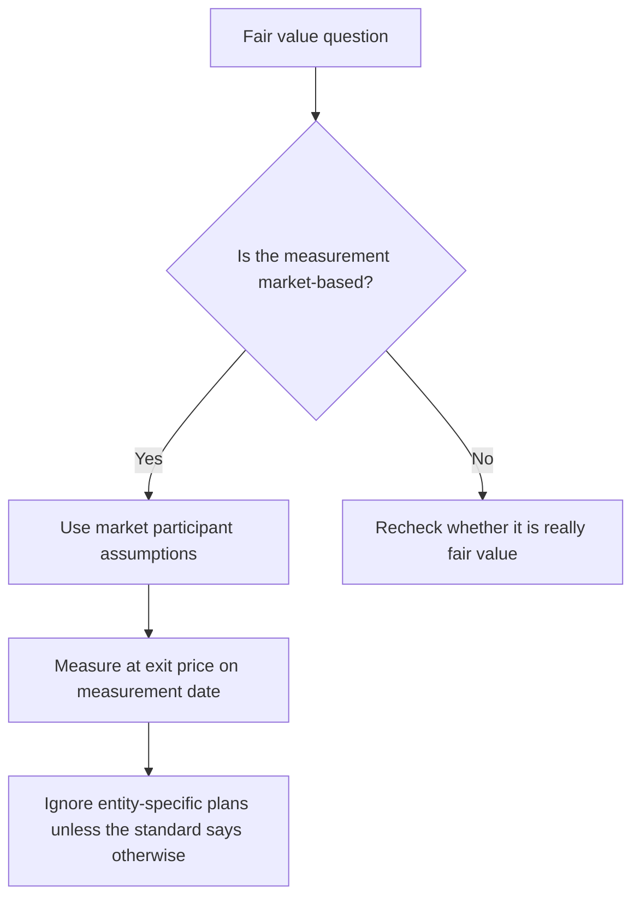
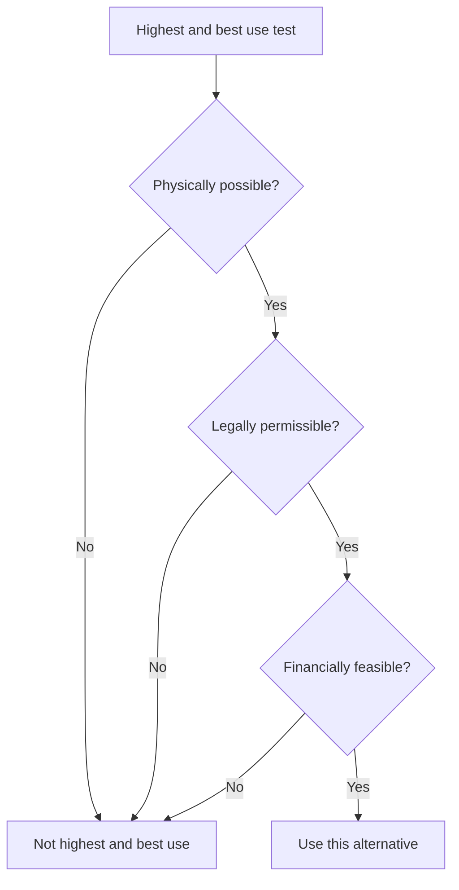
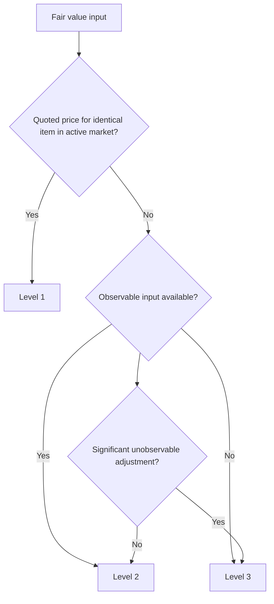

# Chapter 4, Unit 3: Ind AS 113 - Fair Value Measurement

## Exam Relevance

- This is a frequent mixed-concept chapter. The examiner rarely tests only the definition; the real game is application.
- Expect questions on fair value definition, principal vs most advantageous market, market participants, highest and best use, valuation techniques, and the fair value hierarchy.
- It is often asked as a short note, a theory trap, or a worked valuation classification question.
- The common trick is to mix entity-specific intention, restricted use, or unobservable assumptions with a market-based measurement question.
- Another common twist is to ask which standard uses fair value, and which standard actually gives the measurement mechanics.

## Core Intuition

Fair value is not what the entity wants, paid, or hopes for.
It is the price the market would put on the item at the measurement date, in an orderly transaction, using market participant assumptions.

## Concept Map

## Key Concepts

### 1. What fair value really means

Ind AS 113 defines fair value as the price that would be received to sell an asset or paid to transfer a liability in an orderly transaction between market participants at the measurement date.

The important exam words are:

- price, not book value;
- orderly transaction, not forced sale;
- market participants, not just management;
- measurement date, not some future date;
- exit price, not entry price.

The standard is market-based, not entity-specific. So the entity's own intention to hold, use, or settle the item is not the starting point.

### 2. Principal market and most advantageous market

The first market question is whether there is a principal market for the asset or liability.

| Term | Meaning | Exam point |
|---|---|---|
| Principal market | Market with the greatest volume and level of activity for the item | Use this if it exists |
| Most advantageous market | Market that maximises the amount received to sell the asset or minimises the amount paid to transfer the liability, after transport and transaction costs | Use this only if there is no principal market |

The entity must be able to access the market at the measurement date.
If both markets exist, the principal market wins even if another market gives a better number.

### 3. Market participants

Market participants are buyers and sellers in the principal market, or the most advantageous market if no principal market exists.

They are assumed to be:

- independent of each other;
- knowledgeable;
- able to enter into the transaction;
- willing to transact, but not forced;
- acting in their economic best interest.

The examiner loves this trap:

> Do not replace market participant assumptions with management optimism, management distress, or a special buyer's strategy.

### 4. Highest and best use

For non-financial assets, fair value assumes the asset's highest and best use from the perspective of market participants.

That use must be:

- physically possible;
- legally permissible;
- financially feasible.

If the asset is used in a bundle with other assets, the analysis may still consider the asset's use on a standalone basis or in combination, depending on the item being measured.

### 5. Valuation techniques

Ind AS 113 accepts valuation techniques that are appropriate in the circumstances and for which sufficient data are available.

The standard's three broad approaches are:

| Technique | Basic idea | Typical use |
|---|---|---|
| Market approach | Uses prices and other relevant information generated by market transactions involving identical or comparable assets, liabilities, or groups of assets and liabilities | Quoted prices, comparable multiples, matrix pricing |
| Income approach | Converts future amounts to a present discounted amount | Discounted cash flows, present value techniques, option pricing |
| Cost approach | Reflects the amount currently required to replace the service capacity of an asset | Replacement cost, depreciated replacement cost |

The rule is not to force one approach.
Use the approach that best fits the item and the available inputs, while maximising observable inputs and minimising unobservable inputs.

### 6. Fair value hierarchy

The hierarchy is about inputs, not about the importance of the item itself.

| Level | Input type | Exam memory |
|---|---|---|
| Level 1 | Quoted prices in active markets for identical assets or liabilities | Best and cleanest input |
| Level 2 | Observable inputs other than Level 1 quoted prices | Market-corroborated data |
| Level 3 | Unobservable inputs | Model-based, judgment-heavy |

If an observable input needs a significant adjustment using an unobservable input, the result may move to Level 3.

### 7. Special exam traps

Fair value is not:

- liquidation value in a distress sale;
- a management estimate built from internal preference;
- a value that ignores market restrictions when those restrictions attach to the asset or liability;
- the same thing as value in use or net realisable value.

Entity-specific restrictions are ignored if they do not transfer to market participants.
Asset-specific or liability-specific restrictions are considered if they would be part of the item that a market participant takes.

## Professor's Problem-Solving Framework

1. Identify what is being measured: asset, liability, or own equity instrument.
2. Identify whether the question is asking for principle, technique, hierarchy, or disclosure.
3. Find the relevant market: principal market first, then most advantageous market.
4. Replace entity assumptions with market participant assumptions.
5. Test highest and best use if the item is a non-financial asset.
6. Choose the valuation technique that fits the available data.
7. Classify the inputs into Level 1, Level 2, or Level 3.
8. Write the answer in measurement language, not in business-plan language.

## Worked Examples

### Example 1: Principal market beats better-looking alternative

Problem:
An asset is traded in Market A with the greatest activity. Market B offers a slightly higher quoted price, but the entity does not use Market B regularly.

Working:
Market A is the principal market because it has the greatest volume and level of activity.
Ind AS 113 uses the principal market if one exists, even if another market appears numerically better.

Answer:
Use Market A.

### Example 2: Highest and best use

Problem:
An entity owns land currently used as storage. Market participants could legally and physically develop it into a retail site and that use is financially feasible.

Working:
The highest and best use is the retail development alternative, because it is physically possible, legally permissible, and financially feasible.

Answer:
Measure the land based on that highest and best use.

### Example 3: Fair value hierarchy

Problem:
A listed share is traded actively on the exchange.

Working:
Quoted price in an active market for an identical asset is a Level 1 input.

Answer:
Level 1.

### Example 4: Unobservable input trap

Problem:
An unlisted investment is valued using projected cash flows and a discount rate built from management judgment, with no direct market price.

Working:
The model depends on unobservable inputs.

Answer:
Level 3.

## Common Mistakes

- Treating fair value as the amount the entity expects to earn rather than the amount the market would price.
- Forgetting that the principal market comes before the most advantageous market.
- Ignoring market participant assumptions and using management intentions instead.
- Mixing entity-specific restrictions with asset-specific restrictions.
- Calling every discounted cash flow model Level 3 without checking whether observable inputs are significant.
- Confusing fair value with value in use, NRV, or liquidation value.

## Summary Tables

| Item | Meaning | Exam reminder |
|---|---|---|
| Fair value | Exit price in an orderly transaction between market participants at measurement date | Market-based, not entity-based |
| Principal market | Greatest volume and level of activity | Use first if available |
| Most advantageous market | Best net price after transport and transaction costs | Only if no principal market |
| Market participants | Independent, knowledgeable, willing, able, economically rational | Not management-specific |
| Highest and best use | Best use of a non-financial asset from market participant view | Physically possible, legally permissible, financially feasible |
| Market approach | Uses market prices and comparable evidence | Strong where active data exist |
| Income approach | Discounts future amounts to present value | DCF style questions |
| Cost approach | Replacement cost based | Service capacity thinking |
| Level 1 | Quoted identical active market price | Cleanest input |
| Level 2 | Observable inputs other than Level 1 | Corroborated market data |
| Level 3 | Unobservable inputs | Heavy judgment and disclosure |

## Last-Day Revision

- Fair value is the price received to sell an asset or paid to transfer a liability.
- It is an exit price at the measurement date.
- Principal market first, most advantageous market only if needed.
- Use market participant assumptions, not entity-specific hopes.
- Non-financial assets need highest and best use analysis.
- Three valuation approaches: market, income, cost.
- Fair value hierarchy depends on inputs, not on the item's label.
- Level 1 = quoted identical active market price.
- Level 2 = observable inputs other than Level 1.
- Level 3 = unobservable inputs.

## Doubts / Version-Sensitive Items

- Check the latest ICAI wording if the exam asks for a verbatim definition or a formal note.
- Confirm the current hierarchy wording if the question uses amended guidance or a newer illustration set.
- If the asset or liability is covered by another Ind AS, verify whether Ind AS 113 applies to measurement, disclosure, or both.
- Recheck the exact treatment of restrictions if the fact pattern is unusually narrow or entity-specific.
