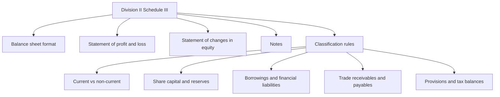
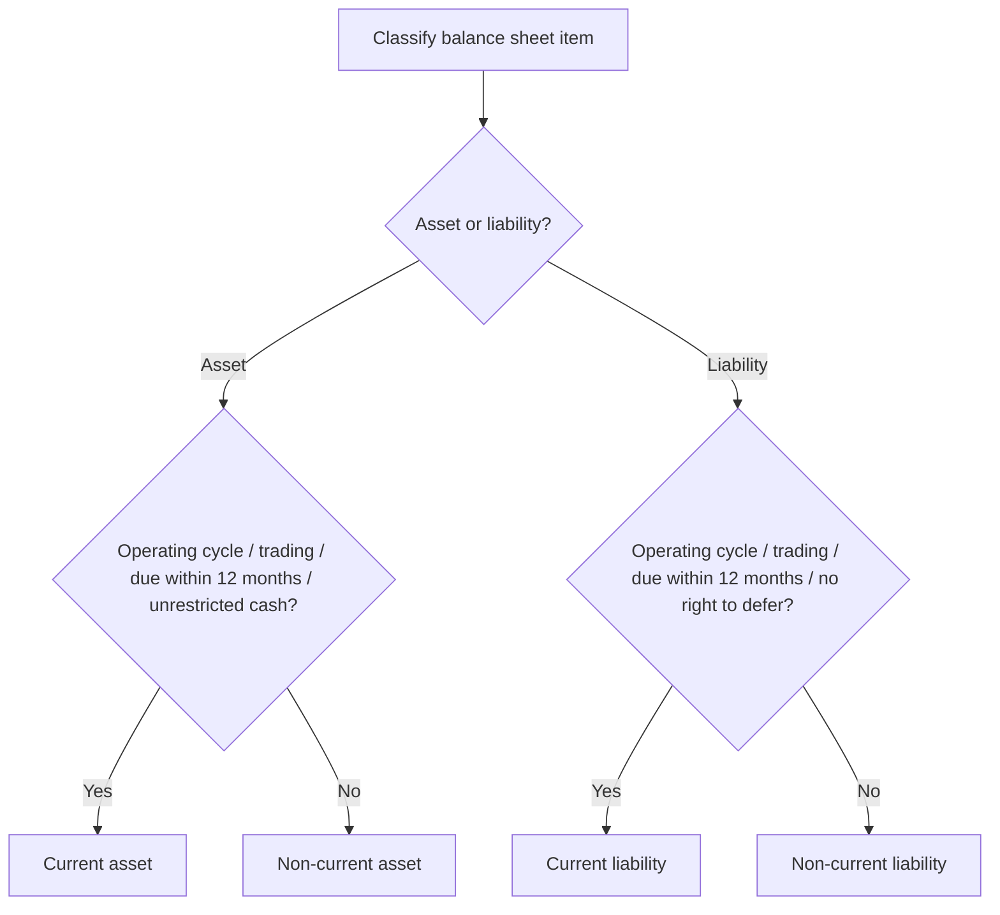
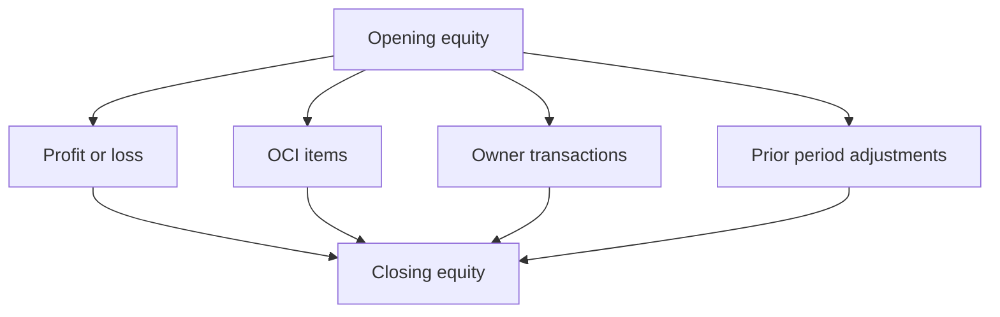

# Annexure: Division II of Schedule III to the Companies Act, 2013

## Exam Relevance

- This annexure is a presentation chapter, not a measurement chapter.
- The examiner usually tests whether you can place items in the correct line item, classify them correctly, and follow the right order in the financial statements.
- Expect questions on balance sheet format, current vs non-current classification, statement of profit and loss presentation, statement of changes in equity, and note structure.
- The fastest marks come from neat tables and correct classification language.
- A common trap is to answer with accounting substance while the question actually asks for presentation under Schedule III.

## Core Intuition

Division II tells you how the statements should be shown, not how the numbers are earned.
If the measurement is already settled by another Ind AS, Schedule III decides the presentation bucket.

## Concept Map

## Key Concepts

### 1. The presentation logic

Division II is built around one clear exam idea:

- show the statement head first;
- classify items into the correct block;
- break out the required line items;
- give notes for the rest.

The annexure is therefore best studied as a checklist of presentations rather than a theory chapter.

### 2. Balance sheet structure

The balance sheet is presented using the broad grouping:

- assets;
- equity and liabilities.

The common format uses:

- non-current assets;
- current assets;
- equity;
- non-current liabilities;
- current liabilities.

| Section | What the examiner wants | Typical line items |
|---|---|---|
| Non-current assets | Long-term presentation block | PPE, capital work-in-progress, investment property, intangible assets, financial assets, deferred tax assets, other non-current assets |
| Current assets | Short-term realization block | Inventories, trade receivables, cash and cash equivalents, bank balances, loans, current financial assets, other current assets |
| Equity | Ownership interest | Equity share capital, other equity |
| Non-current liabilities | Long-term obligations | Borrowings, lease liabilities, other financial liabilities, provisions, deferred tax liabilities |
| Current liabilities | Near-term obligations | Borrowings, trade payables, other financial liabilities, other current liabilities, provisions, current tax liabilities |

### 3. Current vs non-current classification

This is the biggest scoring area in Division II.

An item is current if it is expected to be realised, sold, consumed, or settled in the entity's normal operating cycle, or if it is due within 12 months, or held primarily for trading.

| Item | Common presentation test | Exam reminder |
|---|---|---|
| Trade receivable | Current if part of normal operating cycle | Operating cycle can beat 12 months |
| Trade payable | Current if part of normal operating cycle | Do not force into non-current merely because payment is delayed |
| Inventory | Current | Usually part of operating cycle |
| Cash and cash equivalents | Current unless restricted for more than 12 months | Restriction matters |
| Borrowing due within 12 months | Current | Unless refinancing or deferral right changes the result under the relevant rule |
| Deferred tax | Non-current | Do not mix it into current tax presentation |
| Other financial assets and liabilities | Test by timing and contractual rights | Read the note carefully |

### 4. Statement of profit and loss

The statement of profit and loss is presented in a structured format with:

- revenue;
- expenses by nature or function, as applicable;
- profit before tax;
- tax expense;
- profit for the period;
- other comprehensive income;
- total comprehensive income.

The examiner may ask where an item should go:

| Item | Usual presentation bucket | Note |
|---|---|---|
| Revenue from operations | Profit or loss | Top line |
| Other income | Profit or loss | Separate from operating revenue if needed |
| Finance costs | Profit or loss | Below operating result |
| Tax expense | Profit or loss | Current and deferred tax components may be shown |
| OCI items | Other comprehensive income | Not mixed with profit or loss |

### 5. Statement of changes in equity

SOCIE is the bridge statement.
It should show opening and closing balances and the movements in each component of equity.

| Component | What must be shown |
|---|---|
| Equity share capital | Opening balance, changes during the period, closing balance |
| Other equity | Openings, transfers, profit or loss, OCI, dividends, prior period adjustments, other changes |
| Total equity | Reconciliation from beginning to end |

### 6. Notes to accounts

Notes are where the schedule becomes exam-friendly.
They should support the primary statements, not repeat them blindly.

The note structure should normally do three things:

1. explain the basis of preparation and accounting policies;
2. support the line items in the statements;
3. disclose material commitments, contingencies, and other required information.

## Presentation Checklist Tables

### A. Balance Sheet Checklist

| Check | What to verify |
|---|---|
| Heading | Name of company, balance sheet date, and note references |
| Asset order | Non-current before current |
| Liability order | Equity first, then non-current liabilities, then current liabilities |
| Classification | Current/non-current tests applied correctly |
| Totals | Total assets = total equity and liabilities |
| Note references | Every major line item linked to notes |
| Comparatives | Previous period figures shown |

### B. Current Asset / Liability Checklist

| Item | Presentation question | Typical answer |
|---|---|---|
| Trade receivables | Is it from operating cycle? | Usually current |
| Inventories | Is it intended for sale/consumption in operating cycle? | Current |
| Current investments | Is it expected to be realised within 12 months or held for trading? | Current |
| Borrowings | Is repayment due within 12 months or right to defer absent? | Current liability if yes |
| Provisions | Is the obligation short-term or linked to current operations? | Current if near-term |
| Deferred tax | Does schedule force non-current presentation? | Yes |

### C. Profit and Loss Checklist

| Check | What to verify |
|---|---|
| Revenue line | Correct caption and note support |
| Expense grouping | Nature or function used consistently |
| Finance costs | Not mixed into operating lines |
| OCI separation | OCI shown after profit or loss |
| Tax line | Current and deferred tax correctly split if required |
| EPS / other mandatory disclosures | Included where applicable |

### D. SOCIE Checklist

| Check | What to verify |
|---|---|
| Opening balances | Match previous period closing balances |
| Movement columns | Profit or loss, OCI, owner transactions, prior period corrections |
| Component-wise rows | Share capital, reserves, retained earnings, etc. |
| Closing balances | Reconciled and arithmetically clean |

## Professor's Problem-Solving Framework

1. Identify which statement is being asked: balance sheet, P and L, SOCIE, or notes.
2. Decide whether the item belongs in current or non-current grouping.
3. Check whether the item is an equity item, liability item, or asset item.
4. Break the item into the exact Schedule III line item.
5. Verify whether any note disclosure or comparative presentation is required.
6. Write the answer in presentation language, not in measurement language.

## Worked Examples

### Example 1: Trade receivable beyond 12 months

Problem:
A trade receivable will be collected 14 months after the reporting date, but it arises from the normal operating cycle of 10 months.

Working:
Trade receivables that arise in the operating cycle are current even if collection takes more than 12 months.

Answer:
Current asset.

### Example 2: Borrowing with near-term instalment

Problem:
A term borrowing has one instalment due within 12 months and the remainder due later.

Working:
The current portion due within 12 months is current liability.
The remainder is non-current if the entity has the relevant contractual right to defer the balance.

Answer:
Split between current and non-current portions.

### Example 3: Schedule III line-item drill

Problem:
Classify the following:

- interest accrued on borrowings;
- revenue received in advance;
- unpaid dividends;
- provision for employee benefits.

Working:

| Item | Schedule III bucket |
|---|---|
| Interest accrued on borrowings | Other financial liabilities |
| Revenue received in advance | Other current liabilities |
| Unpaid dividends | Other financial liabilities |
| Provision for employee benefits | Provisions |

Answer:
Each item goes to its specific Schedule III classification, not to a generic "miscellaneous" line.

### Example 4: SOCIE trap

Problem:
A prior period error changes opening retained earnings.

Working:
SOCIE must show the opening balance, the prior period adjustment, the restated opening balance, and the closing balance after current-year movement.

Answer:
Show the adjustment separately in SOCIE instead of burying it in current-year profit.

## Common Mistakes

- Using a pure 12-month test and forgetting the operating cycle.
- Mixing current tax liabilities with deferred tax balances.
- Treating notes as optional clutter instead of mandatory support.
- Forgetting to split a borrowing into current and non-current portions.
- Placing OCI items inside profit or loss.
- Not linking the line item to the correct note.
- Writing the answer as a measurement answer when the question is actually about presentation.

## Summary Tables

| Presentation area | What Division II controls | High-value exam cue |
|---|---|---|
| Balance sheet | Order and grouping of assets, equity, and liabilities | Start with classification |
| Current/non-current tests | Whether an item belongs in the short-term or long-term block | Operating cycle first where relevant |
| Profit and loss | Layout of income, expenses, profit, tax, and OCI | Separate OCI from profit or loss |
| SOCIE | Movement in each equity component | Show opening, movement, and closing |
| Notes | Detail behind the primary statements | Keep notes linked and clean |

## Last-Day Revision

- Division II is a presentation schedule.
- Always identify the statement first.
- Use current/non-current classification carefully.
- Operating cycle can override the 12-month rule for operating items.
- Trade receivables and trade payables need special attention.
- Deferred tax is non-current in presentation.
- Profit or loss and OCI are shown separately.
- SOCIE tracks movements in equity components.
- Notes must support the main statements and not just repeat them.

## Doubts / Version-Sensitive Items

- Check the exact latest Schedule III wording if the question asks for a verbatim presentation format.
- Confirm whether the exam expects the current amendment-based captions from the source PDF or the most recent MCA update.
- Recheck classification of unusual borrowings or liabilities if the fact pattern includes refinancing, waiver, or restricted rights to defer settlement.
- If the question mixes Ind AS measurement with Schedule III presentation, separate the two layers before writing the answer.
