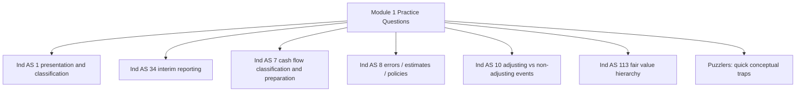
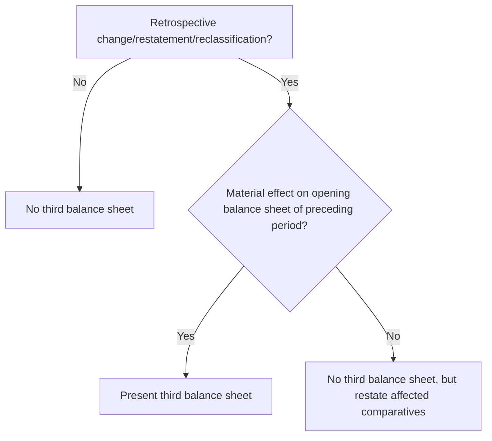
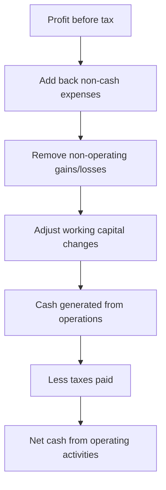
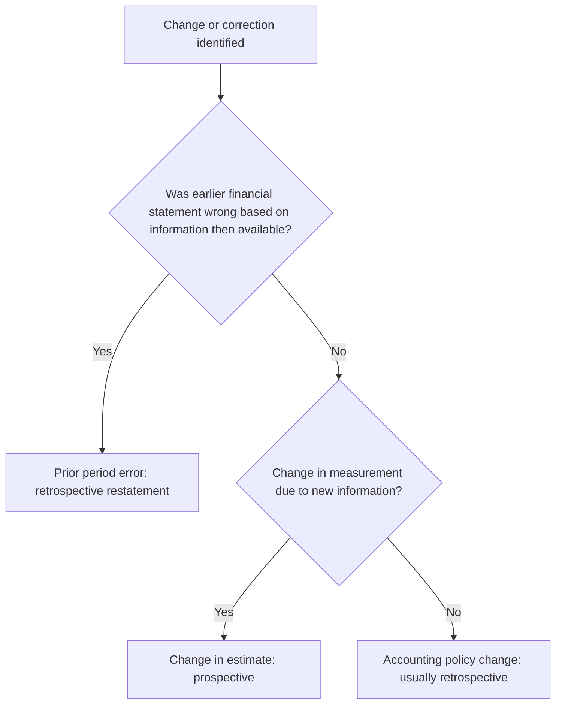

# Module 1 Practice Questions - Pattern Guide

## Exam Relevance

This PDF is not a theory chapter. It is a mixed practice set for Module 1 topics, mainly:

- Ind AS 1: Presentation of Financial Statements
- Ind AS 34: Interim Financial Reporting
- Ind AS 7: Statement of Cash Flows
- Ind AS 8: Accounting Policies, Changes in Accounting Estimates and Errors
- Ind AS 10: Events after the Reporting Period
- Ind AS 113: Fair Value Measurement
- Ind AS Puzzlers

The best way to study this file is not to memorize answers. Instead, identify the recurring question patterns and train yourself to apply the correct decision rule.

## Practice Map

## Question Pattern Map

| Pattern | How to Recognize It | Core Solving Move |
|---|---|---|
| Additional comparatives under Ind AS 1 | Third statement or extra comparative information is presented. | Check whether extra information is Ind AS-compliant and whether related notes are needed. |
| Third balance sheet | Retrospective restatement, reclassification or accounting policy change is mentioned. | Present third balance sheet only if the beginning balance sheet is materially affected. |
| Current vs non-current classification | Operating cycle, 12 months, trade receivables/payables or deposits are given. | Use operating cycle first for trade items; use expected realization/settlement and rights at reporting date. |
| Offsetting | Receivable and payable, reimbursements, gains/losses are proposed to be netted. | Offsetting is allowed only when a standard permits or legal right/intention conditions are met. |
| Exceptional/material items | Statutory exceptional item wording appears. | Separate presentation/disclosure is based on materiality, nature and function; "exceptional" is not a magic label. |
| Interim reporting | Quarterly/half-year information and seasonal costs appear. | Treat interim periods as part of annual reporting; do not anticipate or defer costs unless annual treatment permits. |
| Cash flow classification | Lists of interest, tax, dividends, purchase/sale of assets, borrowings. | Classify into operating, investing and financing using Ind AS 7 logic and entity type. |
| Indirect cash flow | Balance sheets and profit/loss items are provided. | Start with profit before tax, adjust non-cash/non-operating items, then working capital changes. |
| Prior period error | Mistake in earlier financial statements is discovered. | Correct retrospectively unless impracticable; do not push prior error into current year profit. |
| Change in estimate | Useful life, residual value, expected obligation changes. | Account prospectively from the period of change. |
| Event after reporting period | Fact occurs after year-end but before approval. | Ask whether it provides evidence of conditions existing at reporting date. |
| Fair value measurement | Observable/unobservable inputs, market assumptions, highest and best use. | Identify principal/most advantageous market and level in fair value hierarchy. |

## Ind AS 1 Pattern Guide

### 1. Additional Comparative Statement

If management presents an additional statement of profit and loss beyond minimum comparatives, Ind AS 1 permits additional comparative information as long as it is prepared in accordance with Ind AS.

Key point:

- It need not include a complete additional set of financial statements.
- Related note information for the additional statement is required.

### 2. Third Balance Sheet

Third balance sheet at the beginning of the preceding period is required when both conditions are met:

1. There is retrospective application, retrospective restatement or reclassification.
2. It has a material effect on the beginning balance sheet of the preceding period.

### 3. Current vs Non-Current

For operating-cycle businesses, do not blindly use 12 months.

| Item | Classification Logic |
|---|---|
| Trade receivable due within operating cycle | Current even if beyond 12 months. |
| Trade payable due within operating cycle | Current even if settlement may be delayed in practice. |
| Security deposit recoverable after project plus extra period | Check expected realization and operating cycle connection. |
| Deposit repayable only on cancellation/completion | Classification depends on contractual terms and right to defer settlement. |

### 4. Offsetting

Offsetting is generally not permitted unless required or permitted by an Ind AS.

Common trap:

> Same counterparty does not automatically mean offsetting is allowed.

## Ind AS 34 Pattern Guide

Interim reporting questions test whether you treat the interim period as a reporting period with annual context.

Solving questions:

1. Identify the interim period.
2. Ask whether the cost/revenue would be recognized or deferred at annual reporting date.
3. Apply the same recognition and measurement principles.
4. Do not smooth income merely because the year is incomplete.

Common traps:

- Anticipating future losses or costs not yet obligations.
- Deferring costs merely to match annual expectation.
- Forgetting income tax is measured using estimated annual effective tax rate where applicable.

## Ind AS 7 Pattern Guide

### Cash Flow Classification

| Cash Flow | Usual Classification |
|---|---|
| Cash from customers | Operating |
| Cash paid to suppliers/employees | Operating |
| Purchase/sale of PPE | Investing |
| Purchase/sale of investments | Investing, unless trading business |
| Issue/redemption of shares/debentures | Financing |
| Borrowing proceeds/repayment | Financing |
| Interest/dividend | Depends on entity type and policy choices allowed by Ind AS 7. |
| Income taxes | Usually operating unless specifically identifiable with investing/financing. |

### Indirect Method Framework

Common traps:

- Depreciation is non-cash; add back.
- Profit on sale of asset is removed from operating cash flow.
- Increase in receivables consumes cash.
- Increase in payables provides cash.
- Purchased goodwill is investing, not operating.

## Ind AS 8 Pattern Guide

### Accounting Policy vs Estimate vs Error

| Situation | Treatment |
|---|---|
| Change in accounting policy | Retrospective unless transitional provision or impracticable. |
| Change in accounting estimate | Prospective. |
| Prior period error | Retrospective restatement unless impracticable. |

Common traps:

- Treating a discovered mistake as a current-year expense.
- Treating useful life revision as prior period error without evidence of prior mistake.
- Forgetting third balance sheet is a separate Ind AS 1 presentation question.

## Ind AS 10 Pattern Guide

### Adjusting vs Non-Adjusting Events

Core question:

> Does the event provide evidence of a condition that existed at the reporting date?

| Event Type | Treatment |
|---|---|
| Evidence of existing condition | Adjusting event |
| New condition arising after reporting date | Non-adjusting event |
| Material non-adjusting event | Disclose nature and estimate of financial effect where required |

Examples:

- Settlement of a court case after year-end may be adjusting if it confirms an existing obligation.
- Fire after reporting date is usually non-adjusting unless it reveals a pre-existing condition.
- Dividend declared after reporting date is generally not recognized as liability at reporting date.

## Ind AS 113 Pattern Guide

Fair value questions test the market-based measurement mindset.

Steps:

1. Identify the asset or liability.
2. Identify the principal market or most advantageous market.
3. Use market participant assumptions, not entity-specific wishful thinking.
4. For non-financial assets, consider highest and best use.
5. Classify inputs into fair value hierarchy.

| Level | Input Type |
|---|---|
| Level 1 | Quoted prices in active markets for identical assets/liabilities. |
| Level 2 | Observable inputs other than Level 1 quoted prices. |
| Level 3 | Unobservable inputs. |

## Worked Mini Examples

### Example 1: Prior Error vs Current-Year Correction

A company overstated revenue last year and discovers it this year.

Correct answer: restate prior period figures if material. Do not simply reduce current-year revenue unless the standard permits prospective treatment, which a prior period error generally does not.

### Example 2: Operating Cycle

A construction company has an 18-month operating cycle. A trade receivable due in 15 months is current because it is expected to be realized within the operating cycle.

### Example 3: Event After Reporting Period

Inventory is damaged by flood after year-end. If the flood happened after reporting date, it is usually non-adjusting. But if the damage existed before year-end and was discovered after year-end, it may be adjusting.

### Example 4: Cash Flow Classification Drill

Classify the following cash flows for a manufacturing entity:

| Cash flow | Classification | Reason |
|---|---|---|
| Cash received from customers | Operating | Main revenue activity. |
| Purchase of machinery | Investing | Acquisition of long-term asset. |
| Proceeds from issue of debentures | Financing | Changes capital/borrowing structure. |
| Interest paid on borrowings | Operating or financing, based on permitted policy | Apply the entity's consistent Ind AS 7 policy. |
| Income tax paid | Usually operating | Unless specifically identifiable with investing/financing transaction. |

Professor's shortcut:

> Ask whether the cash flow comes from operations, long-term asset/investment decisions, or capital financing decisions.

### Example 5: Fair Value Hierarchy Drill

An entity holds an investment in a listed equity share traded actively on NSE. The quoted market price is available at the measurement date.

Classification: **Level 1 input**, because the price is quoted in an active market for an identical asset.

Now change the fact: the investment is in an unlisted startup and valuation uses projected cash flows and management assumptions.

Classification: **Level 3 input**, because significant unobservable inputs are used.

### Example 6: Mixed Standard Trap

A company discovers after year-end that last year's revenue was overstated, and the correction materially affects retained earnings.

This is not only an Ind AS 8 question. It may also trigger Ind AS 1 presentation consequences:

- Ind AS 8 decides retrospective correction of the prior period error.
- Ind AS 1 decides whether a third balance sheet is required.

Mixed-question habit:

> First identify the standard that decides recognition/measurement, then identify the standard that decides presentation.

## Common Mistakes

- Thinking every retrospective restatement requires a third balance sheet.
- Using 12 months mechanically even when operating cycle is longer.
- Netting income and expenses because they relate to similar items.
- Classifying interest/dividend cash flows without checking entity type and policy.
- Treating a change in estimate as a prior period error.
- Recognizing dividends declared after reporting date as year-end liability.
- Using entity-specific assumptions in fair value when market participant assumptions are required.

## Last-Day Practice Checklist

- For Ind AS 1, ask: presentation, comparatives, current/non-current, offsetting or material disclosure?
- For Ind AS 34, ask: would this be recognized/deferred at annual reporting date?
- For Ind AS 7, first classify cash flows, then compute.
- For Ind AS 8, separate policy, estimate and error before writing treatment.
- For Ind AS 10, ask whether the condition existed at reporting date.
- For Ind AS 113, identify market, market participant assumptions and hierarchy level.
- In every answer, quote the principle, apply facts, and conclude clearly.

## Doubts / Version-Sensitive Items

- The practice PDF includes detailed numerical cash flow questions where table extraction can be imperfect. For final answer reproduction, verify numerical workings directly against the source PDF.
- Interest/dividend classification under Ind AS 7 should be aligned with the exact entity type and policy choices permitted in the applicable study material.
- Fair value measurement examples may depend heavily on facts; avoid memorizing only the answer.
