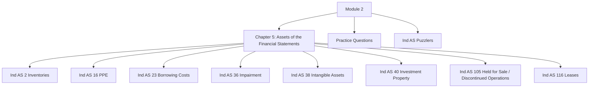

# Module 2: Initial Pages Overview

## Exam Relevance

This is the opening map for the assets module. It tells you how the chapter on assets is split across inventories, PPE, borrowing costs, impairment, intangibles, investment property, held-for-sale assets and leases.

The exam usually uses this module for classification, recognition, measurement, depreciation, impairment and lease logic.

## Module Map

## How To Use This Module

- Start with inventories and PPE because they set the measurement rhythm.
- Move to borrowing costs and impairment to understand when carrying amount changes.
- Study intangibles and investment property as separate recognition tracks.
- Keep Ind AS 105 and Ind AS 116 as classification-heavy topics.
- Use the puzzlers after the chapter to test traps and fast judgments.

## Exam Strategy

1. Identify the asset class immediately.
2. Ask whether the question is about recognition, initial measurement or subsequent measurement.
3. Check whether the item is capital, operating, impaired, leased or held for sale.
4. For numericals, write the logic for capitalization, depreciation or impairment before the arithmetic.
5. For lease questions, separate lease term, lease payments, discounting and right-of-use logic.

## Front-Matter Watchlist

- Standard names, unit titles and punctuation may vary slightly across the PDF and the index file.
- Lease guidance and held-for-sale wording are especially sensitive to exact classification facts.
- Any explanatory note on transition, exceptions or exemptions should be checked against the source PDF if the question is date-specific.
- If the initial pages mention study sequencing or exclusions, treat that as module-level guidance rather than chapter content.

