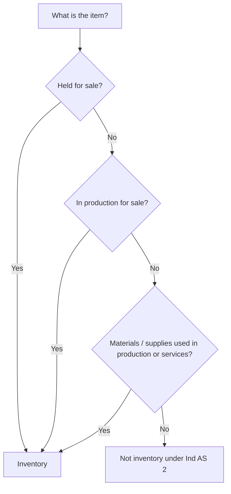
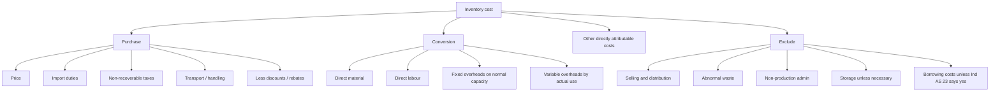
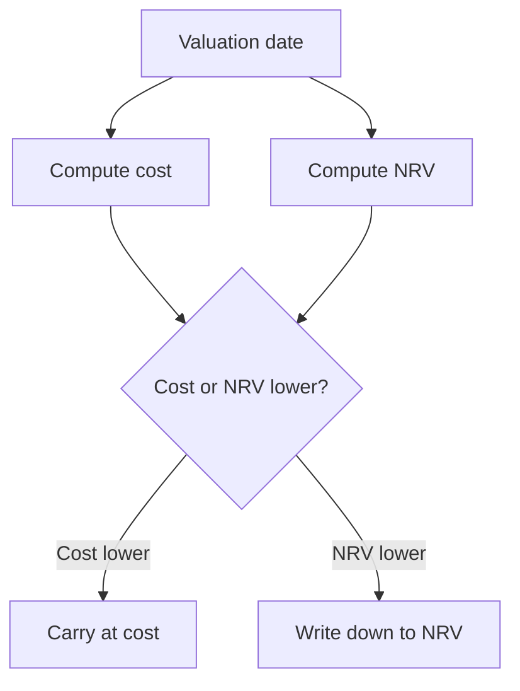

# Chapter 5, Unit 1: Ind AS 2 - Inventories

## Exam Relevance

- This is a favourite practical chapter for valuation questions.
- The examiner usually tests lower of cost and NRV, cost build-up, exclusions from cost, cost formulas, and write-down/reversal logic.
- The topic also appears in mixed questions with Ind AS 16, Ind AS 23, and Ind AS 115.
- Common traps are:
  - treating selling/distribution costs as inventory cost,
  - using FIFO / weighted average incorrectly,
  - comparing NRV at the inventory total level instead of item by item,
  - forgetting that a reversal cannot take inventory above original cost.

## Core Intuition

Inventory is not measured at whatever it cost last year.
It is measured at the lower of what it cost and what it can realistically net on sale.

The exam memory hook is:

> bring the item to its present location and condition, exclude the junk, then compare cost with NRV item by item.

## Concept Map

```mermaid
flowchart TD
    A["Ind AS 2 Inventories"] --> B["Scope"]
    A --> C["Cost of inventory"]
    A --> D["Cost formulas"]
    A --> E["Lower of cost and NRV"]
    A --> F["Write-down / reversal"]
    A --> G["Recognition and disclosure"]

    B --> B1["Inventories"]
    B --> B2["Exclusions"]
    B --> B3["Special measurement cases"]

    C --> C1["Purchase costs"]
    C --> C2["Conversion costs"]
    C --> C3["Other costs"]
    C --> C4["Costs excluded"]

    D --> D1["Specific identification"]
    D --> D2["FIFO"]
    D --> D3["Weighted average"]
    D --> D4["Standard cost / retail method"]

    E --> E1["NRV"]
    E --> E2["Item-by-item comparison"]
    E --> E3["Group only when similar"]

    F --> F1["Write-down when NRV falls"]
    F --> F2["Reversal when NRV rises"]
    F --> F3["Ceiling = original cost"]
```

## Key Concepts

### 1. Objective and scope

Ind AS 2 prescribes the accounting treatment for inventories.
It gives guidance on:

- determining inventory cost,
- subsequent recognition as an expense,
- write-down to NRV,
- cost formulas.

The standard applies to all inventories except:

- financial instruments dealt with under Ind AS 32 and Ind AS 109,
- biological assets related to agricultural activity and agricultural produce at harvest, which are covered by Ind AS 41.

Important source-specific points:

- agricultural produce harvested from biological assets is initially measured at fair value less costs to sell at the point of harvest, and that amount becomes the cost for Ind AS 2 afterwards;
- producers of agricultural and forest products, agricultural produce after harvest, and minerals may measure inventories at NRV under well-established industry practice;
- commodity broker-traders may measure inventories at fair value less costs to sell.

### 2. Inventory definition

Inventories are assets:

- held for sale in the ordinary course of business,
- in the process of production for such sale,
- in the form of materials or supplies to be consumed in production or in rendering services.

That covers:

- goods purchased for resale,
- finished goods,
- work in progress,
- raw materials and supplies,
- primary packing material and similar inputs used to make inventory saleable.

### 3. Cost of inventory

Cost is the sum of:

1. costs of purchase,
2. costs of conversion,
3. other costs incurred in bringing inventories to present location and condition.

#### Costs of purchase

Include:

- purchase price,
- import duties and other non-recoverable taxes,
- transport and handling,
- other directly attributable acquisition costs.

Deduct:

- trade discounts,
- rebates,
- similar items.

Important exam point:

- an early settlement discount is not deducted if it is only hoped for; the actual purchase cost is reduced only by discounts that are part of the purchase price / known at purchase.

#### Costs of conversion

Include:

- direct labour,
- direct material,
- other direct costs,
- systematic allocation of fixed and variable production overheads.

Fixed overheads are absorbed on normal capacity.
If production is abnormally low, unallocated overheads are expensed.
If production is abnormally high, overhead absorption per unit is reduced so inventory is not overstated.

#### Other costs

Include only costs necessary to bring inventory to present location and condition.
The source PDF is clear that:

- administrative overheads that do not contribute to bringing inventory to present location and condition are excluded,
- selling and distribution costs are excluded,
- abnormal wastage is excluded,
- storage costs are excluded unless they are necessary in the production process,
- borrowing costs are included only if Ind AS 23 requires capitalisation.

### 4. Special cost situations

#### Joint products and by-products

When conversion costs cannot be separately identified, allocate them on a rational and consistent basis.
By-products are usually measured at NRV and reduce the cost of the main product.

#### Services inventory

Costs of services inventory include labour and other personnel costs directly involved in providing the service, plus attributable overheads.
Selling and general admin still stay out.

#### Self-constructed PPE component

If inventory is used in the construction of self-constructed PPE, it leaves inventory and becomes part of PPE cost under Ind AS 16.

### 5. Cost formulas

The same cost formula must be used for inventories with a similar nature and use.

Acceptable formulas:

- specific identification,
- FIFO,
- weighted average,
- standard cost method,
- retail method.

Exam traps:

- if inventory items are not ordinarily interchangeable or are segregated for specific projects, use specific identification;
- different geography by itself does not justify different cost formulas;
- different nature or use may justify different formulas.

### 6. NRV and lower of cost and NRV

NRV is the estimated selling price in the ordinary course of business less estimated costs of completion and selling.

It is entity-specific.
It is not the same thing as fair value.

The valuation rule is:

- compare cost and NRV,
- take the lower amount,
- do the comparison item by item or group by group where the items are similar and related.

Do not compare total inventory cost with total inventory NRV unless the items are sufficiently similar to justify grouping.

### 7. Write-down and reversal

If NRV falls below cost, recognise a write-down as an expense.
If NRV later increases, reverse the write-down to the extent of the original write-down.

The reversal has two ceilings:

- it cannot exceed the original write-down,
- the resulting carrying amount cannot exceed cost.

The source PDF also requires disclosure of the circumstances or events that led to the reversal.

### 8. Recognition as an expense

When inventories are sold, their carrying amount is recognised as expense in the period of sale.

If inventory is consumed in another asset, for example self-constructed PPE, the inventory cost is recognised through the depreciation or carrying amount of that asset instead of direct expense in profit or loss.

### 9. Disclosure

The source material expects disclosure of:

- accounting policies adopted in measuring inventories,
- carrying amount in classifications such as raw materials, WIP, finished goods, and supplies,
- carrying amount carried at fair value less costs to sell,
- amount recognised as expense,
- amount of write-down,
- amount of reversal,
- carrying amount of inventories pledged as security.

## Professor's Problem-Solving Framework

1. Identify whether the item is inventory at all.
2. Check whether any scope exclusion applies.
3. Build cost from purchase, conversion, and other directly attributable costs.
4. Remove selling, distribution, abnormal waste, and non-qualifying overheads.
5. Select the right cost formula.
6. Compute NRV and compare it with cost item by item.
7. Record write-down or reversal, keeping the cost ceiling in mind.
8. If the inventory is consumed into PPE or another asset, move it out of inventory and into the receiving asset's cost.

## Worked Examples

### Example 1: Purchase cost vs excluded costs

Problem:
Goods are purchased for Rs. 100,000. Import duty is Rs. 8,000. Transport to warehouse is Rs. 2,500. Selling commission expected on eventual sale is Rs. 3,000. Management expects to take a settlement discount of Rs. 1,000 if paid within 10 days.

Working:

- purchase cost includes purchase price, import duty, and transport;
- selling commission is excluded;
- the expected settlement discount is ignored unless it is actually part of the purchase price.

Cost = Rs. 100,000 + 8,000 + 2,500 = Rs. 110,500

Answer:
Inventory is initially measured at Rs. 110,500, before NRV comparison.

### Example 2: Write-down and reversal

Problem:
Inventory cost is Rs. 50,000.
At year-end NRV falls to Rs. 44,000.
Next year NRV rises to Rs. 48,500.

Working:

- year 1 carrying amount = Rs. 44,000;
- write-down = Rs. 6,000;
- year 2 reversal can be only up to Rs. 4,500, because cost remains the ceiling.

Answer:
Year 1: recognise Rs. 6,000 loss in profit or loss.
Year 2: reverse Rs. 4,500, because the increase in NRV is Rs. 4,500 and the reversal cannot exceed the original write-down or cost. Carrying amount becomes Rs. 48,500.

### Example 3: Service inventory

Problem:
A consultancy incurs consultant wages, travel for client meetings, head-office admin, and proposal-writing costs.

Working:

- consultant wages directly linked to service delivery are inventory cost,
- attributable support costs may be included if directly related,
- head-office admin and proposal costs are excluded.

Answer:
Only the directly attributable service-production costs are inventoried.

## Common Mistakes

- Treating selling or distribution costs as inventory cost.
- Using total cost and total NRV without checking whether items are separately identifiable.
- Forgetting that fixed overhead absorption is based on normal capacity.
- Carrying forward a write-down reversal above original cost.
- Mixing FIFO, weighted average, and specific identification without checking the inventory type.
- Missing the special measurement rule for broker-traders and agricultural produce at harvest.

## Summary Tables

### Cost Components

| Component | Included? | Exam reminder |
|---|---|---|
| Purchase price | Yes | Net of trade discount / rebate |
| Import duties | Yes | Only non-recoverable taxes matter |
| Transport and handling | Yes | Directly attributable |
| Direct labour | Yes | Conversion cost |
| Fixed production overhead | Yes | Absorb on normal capacity |
| Selling cost | No | Always out |
| Distribution cost | No | Treated as selling cost |
| Abnormal waste | No | Expense as incurred |
| Storage cost | Usually no | Include only if needed in production process |
| Borrowing cost | Sometimes | Only if Ind AS 23 requires capitalisation |

### Measurement Triggers

| Trigger | Result | Exam reminder |
|---|---|---|
| Cost > NRV | Write-down | Expense in profit or loss |
| NRV later rises | Reversal | Limited by original write-down and cost |
| Similar inventories | Same cost formula | Different geography alone is not enough to change formula |
| Special project / non-interchangeable items | Specific identification | Do not average them blindly |

## Last-Day Revision

- Inventories are measured at lower of cost and NRV.
- NRV is selling price less completion and selling costs.
- Scope excludes financial instruments and biological assets / agricultural produce at harvest.
- Cost = purchase + conversion + other directly attributable costs.
- Selling and distribution costs are excluded.
- Fixed overheads are based on normal capacity.
- Same cost formula must be used for similar inventories.
- FIFO, weighted average, specific identification, standard cost, and retail method are acceptable.
- Write-down goes to profit or loss.
- Reversal is permitted only up to original write-down and not above cost.
- Item-by-item comparison is the default valuation logic.

## Doubts / Version-Sensitive Items

- The source PDF gives a practical distinction between NRV and fair value; the exact phraseology should be checked if the examiner asks for definition wording.
- The treatment of inventories held by producers of agricultural and forest products, agricultural produce after harvest, and minerals is industry-specific and should be rechecked against the source wording if a question is very literal.
- Broker-trader measurement at fair value less costs to sell is a special case and should not be confused with normal inventory valuation.
- The reversal mechanics are simple in principle, but exam questions may test the arithmetic ceiling carefully, so the working should always show the original cost cap.
