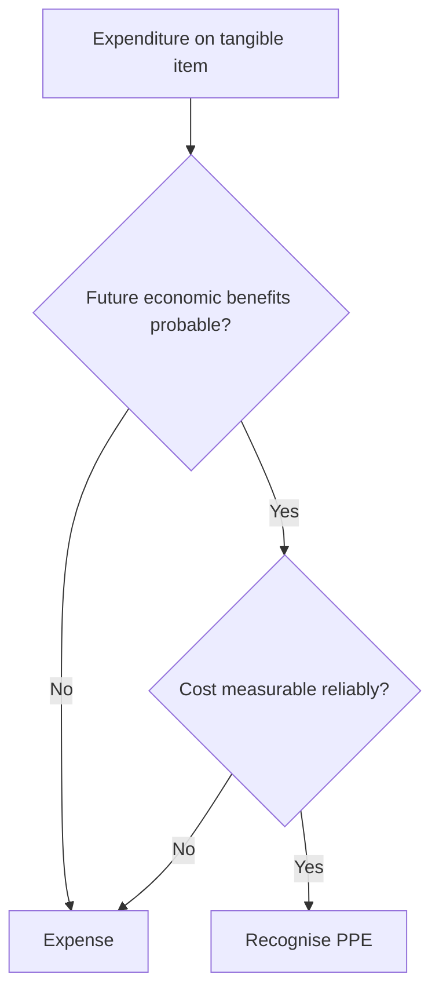
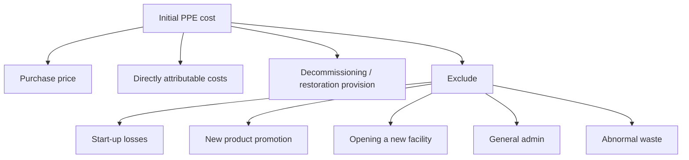
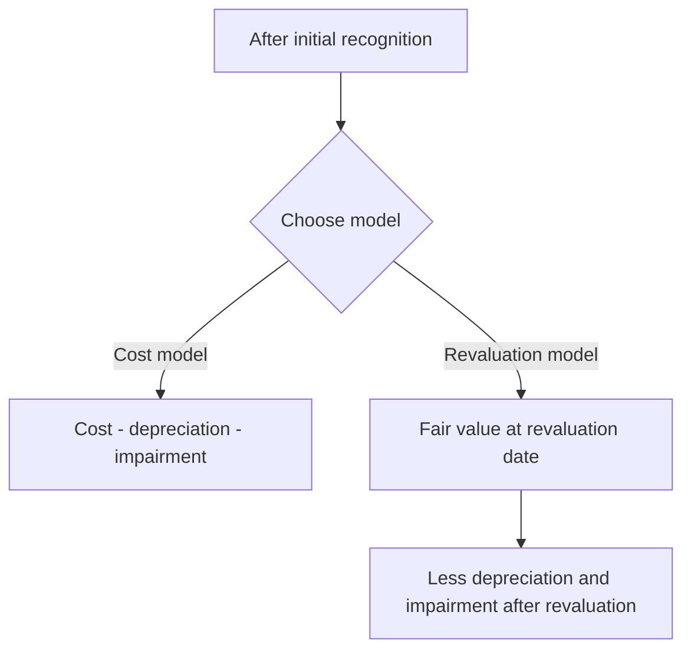

# Chapter 5, Unit 2: Ind AS 16 - Property, Plant and Equipment

## Exam Relevance

- PPE is one of the most tested practical standards in Module 2.
- The examiner usually mixes recognition, initial measurement, subsequent expenditure, component accounting, depreciation, revaluation, derecognition, and disclosure.
- Questions often require a clean split between capital and revenue expenditure.
- Frequent traps:
  - capitalising repairs and maintenance,
  - forgetting to remove the carrying amount of replaced parts,
  - missing that depreciation starts when the asset is available for use,
  - confusing revaluation surplus with profit or loss,
  - missing derecognition on disposal or when no future benefits are expected.

## Core Intuition

PPE is recognised when it will probably bring future benefits and its cost can be measured reliably.
After that, the exam is mostly about keeping only the part of the asset that still exists and spreading its depreciable amount over its useful life.

## Concept Map

```mermaid
flowchart TD
    A["Ind AS 16 PPE"] --> B["Recognition"]
    A --> C["Measurement at recognition"]
    A --> D["Subsequent expenditure"]
    A --> E["Subsequent measurement"]
    A --> F["Depreciation"]
    A --> G["Derecognition"]
    A --> H["Disclosure"]

    B --> B1["Future benefits probable"]
    B --> B2["Cost measurable reliably"]

    C --> C1["Purchase price"]
    C --> C2["Directly attributable costs"]
    C --> C3["Decommissioning / restoration estimate"]

    D --> D1["Capitalise if criteria met"]
    D --> D2["Expense day-to-day servicing"]
    D --> D3["Replace parts / major inspections"]

    E --> E1["Cost model"]
    E --> E2["Revaluation model"]

    F --> F1["Depreciable amount"]
    F --> F2["Useful life"]
    F --> F3["Method reflects consumption pattern"]

    G --> G1["Disposal"]
    G --> G2["No future benefits"]
    G --> G3["Gain / loss in P or L"]
```

## Key Concepts

### 1. Objective and scope

Ind AS 16 prescribes accounting for property, plant and equipment so users can see:

- the investment in PPE,
- the movements in that investment,
- the depreciation charge,
- any impairment-related effect,
- any derecognition gain or loss.

The standard applies to PPE, except where another Ind AS requires a different treatment, such as:

- assets held for sale under Ind AS 105,
- mineral rights and reserves in some special cases,
- biological assets related to agricultural activity accounted under Ind AS 41.

### 2. Recognition principle

An item of PPE is recognised as an asset when:

- it is probable that future economic benefits associated with the item will flow to the entity,
- the cost of the item can be measured reliably.

The standard applies this rule both to:

- the initial purchase or construction of the asset,
- subsequent expenditure such as replacement parts and major inspections, if the recognition criteria are met.

Judgment matters on the unit of measure.
Ind AS 16 does not prescribe one fixed unit of account, so an entity may aggregate individually insignificant items where that makes sense.

### 3. Initial measurement

The cost of an item of PPE comprises:

- purchase price, including import duties and non-refundable purchase taxes, net of trade discounts and rebates,
- directly attributable costs of bringing the asset to the location and condition necessary for it to be capable of operating as intended,
- initial estimate of dismantling, removal and site restoration obligations when the entity has such an obligation.

Directly attributable costs may include:

- employee benefits arising directly from construction or acquisition,
- site preparation,
- delivery and handling,
- installation and assembly,
- testing the asset after deducting net proceeds of items produced while bringing it to working condition,
- professional fees.

Not PPE cost:

- opening a new facility,
- introducing a new product or service,
- conducting business in a new location or with a new class of customer,
- administration and general overheads unless directly attributable,
- start-up and pre-operative losses,
- abnormal amounts of wasted material, labour or other resources.

### 4. Subsequent costs and component accounting

This is one of the most exam-heavy areas.

#### Day-to-day servicing

Routine repairs and maintenance are expensed as incurred.
They do not get added to carrying amount.

#### Replacement of parts

If a part of an item of PPE is replaced and the recognition criteria are met, the cost of the new part is capitalised and the carrying amount of the old part is derecognised.

This is the core component-accounting rule.

#### Major inspections

When major inspections or overhauls are required to continue operating the asset, the cost of each inspection is capitalised if the criteria are met.
The carrying amount of the previous inspection component is derecognised.

#### Self-constructed PPE

Cost is determined by the same principles as for acquired assets.
Internal profits are eliminated.
If the entity normally manufactures similar assets for sale, the same cost logic is used for the self-constructed asset.

### 5. Subsequent measurement

After recognition, PPE is measured using either:

- the cost model, or
- the revaluation model.

#### Cost model

Carry at cost less accumulated depreciation and accumulated impairment losses.

#### Revaluation model

Carry at revalued amount, being fair value at the date of revaluation less subsequent depreciation and impairment.

Important exam points:

- revaluation is applied by class of assets, not selectively to one item in isolation unless that item stands as a separate class under the standard's logic;
- if an asset is revalued, the entire class should be revalued with sufficient regularity;
- upward revaluation usually goes to OCI and accumulates in revaluation surplus unless it reverses a previous downward revaluation recognised in profit or loss;
- downward revaluation usually goes to profit or loss unless it reverses a previous surplus in OCI.

### 6. Depreciation

Depreciation is systematic allocation of the depreciable amount over the useful life.

Depreciable amount = cost or revalued amount minus residual value.

Useful life, residual value, and depreciation method are reviewed at least at each financial year-end.

#### Start and stop

- depreciation begins when the asset is available for use,
- depreciation does not stop just because the asset is idle,
- depreciation ceases at the earlier of classification as held for sale and derecognition.

#### Method

The method should reflect the pattern in which future economic benefits are expected to be consumed.
Common methods:

- straight-line,
- diminishing balance,
- units of production.

The method, useful life, and residual value are estimate-driven and may change prospectively.

### 7. Derecognition

An item of PPE is derecognised:

- on disposal, or
- when no future economic benefits are expected from its use or disposal.

Gain or loss on derecognition is the difference between:

- net disposal proceeds, if any,
- carrying amount of the item.

It is recognised in profit or loss.

If a replaced part had a carrying amount that can be identified, that amount is derecognised even if the part was not separately depreciated before.

### 8. Disclosure

The source standard expects disclosure of:

- measurement bases used for gross carrying amount,
- depreciation methods,
- useful lives or depreciation rates,
- gross carrying amount and accumulated depreciation,
- reconciliation of carrying amount from beginning to end,
- restrictions on title,
- PPE pledged as security,
- capital commitments,
- compensation from third parties for PPE impairment, loss or giving up of items.

## Professor's Problem-Solving Framework

1. Decide whether the expenditure creates a recognisable PPE asset or is just repair / revenue expense.
2. Build the initial cost carefully.
3. Check whether subsequent expenditure replaces a part, performs an inspection, or is merely day-to-day servicing.
4. Choose cost model or revaluation model and apply it consistently by class.
5. Compute depreciation from the date the asset is available for use.
6. Review useful life, residual value, and method prospectively when facts change.
7. On disposal or scrapping, remove the asset and calculate gain or loss in profit or loss.

## Worked Examples

### Example 1: Initial cost

Problem:
A machine costs Rs. 500,000. Import duties are Rs. 40,000. Installation is Rs. 25,000. Trial production yields sale proceeds of Rs. 5,000. Routine maintenance for the first month is Rs. 3,000.

Working:

- purchase price = Rs. 500,000,
- import duties = Rs. 40,000,
- installation = Rs. 25,000,
- trial production net proceeds reduce cost,
- routine maintenance is expensed.

Cost = Rs. 500,000 + 40,000 + 25,000 - 5,000 = Rs. 560,000

Answer:
Initial PPE cost = Rs. 560,000.

### Example 2: Component replacement

Problem:
An aircraft engine component carrying amount of old part is Rs. 120,000.
New engine part costs Rs. 180,000.

Working:

- capitalise the new part if it meets recognition criteria,
- derecognise the old part's carrying amount,
- any difference from the old part's book value is not rolled into the new part.

Answer:
PPE increases by Rs. 180,000 and the old component of Rs. 120,000 is removed from PPE; net increase before any disposal proceeds or impairment effect = Rs. 60,000.

### Example 3: Depreciation and derecognition

Problem:
An asset is ready for use on 1 July. The financial year ends on 31 March.

Working:

- depreciation begins on 1 July, not on the purchase date if the asset was not yet available for use;
- charge depreciation for the period it is available for use.

Answer:
Depreciation for 9 months is recognised for that year.

## Common Mistakes

- Capitalising repairs and maintenance.
- Forgetting that replacement parts may require derecognition of the old part.
- Using revaluation on one asset without checking the class basis.
- Starting depreciation before the asset is available for use.
- Stopping depreciation because the asset is idle.
- Putting revaluation increases straight to profit or loss when OCI is required.
- Forgetting the disposal gain or loss calculation at derecognition.

## Summary Tables

### Recognition and Measurement

| Topic | Rule | Exam reminder |
|---|---|---|
| Recognition | Future benefits probable and cost measurable | Both conditions must be met |
| Initial cost | Purchase price + directly attributable costs + restoration estimate | Net of discounts and rebates |
| Day-to-day servicing | Expense | Not capitalised |
| Replacement parts | Capitalise if criteria met | Derecognise replaced part |
| Major inspection | Capitalise if criteria met | Derecognise previous inspection component |
| Cost model | Cost less depreciation and impairment | Simpler model |
| Revaluation model | Fair value at revaluation date less subsequent depreciation and impairment | Applies by class |

### Depreciation and Derecognition

| Topic | Rule | Exam reminder |
|---|---|---|
| Start of depreciation | When available for use | Not when cash is paid |
| Idle asset | Still depreciate | Unless usage method gives zero production charge |
| Change in estimate | Prospectively | Not retrospective |
| Derecognition trigger | Disposal or no future benefits | Remove asset from books |
| Gain / loss | Disposal proceeds minus carrying amount | Goes to profit or loss |

## Last-Day Revision

- PPE requires probable future economic benefits and reliable measurement of cost.
- Initial cost includes purchase price, directly attributable costs, and restoration obligation.
- Day-to-day repairs are expensed.
- Replacement parts and major inspections may be capitalised.
- The old part or previous inspection component is derecognised.
- After recognition, use cost model or revaluation model.
- Revaluation is by class and usually hits OCI upward and profit or loss downward.
- Depreciation begins when available for use.
- Useful life, residual value, and depreciation method are reviewed at each year-end.
- Derecognition occurs on disposal or when no future benefits are expected.
- Gain or loss on derecognition goes to profit or loss.

## Doubts / Version-Sensitive Items

- The source PDF includes examples around inspection components and self-constructed assets; in a literal exam question, the exact component identification should be checked carefully.
- Revaluation surplus routing can depend on whether the increase reverses a prior decrease in profit or loss, so the direction of prior remeasurement matters.
- Disposal under sale-and-leaseback may be affected by Ind AS 116, so a mixed question should not be answered from Ind AS 16 alone.
- If a question asks for the exact disclosure list, the wording should be aligned to the source PDF because examiners sometimes expect the standard's terminology.
