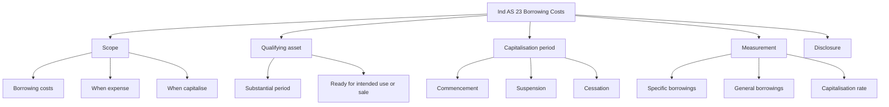
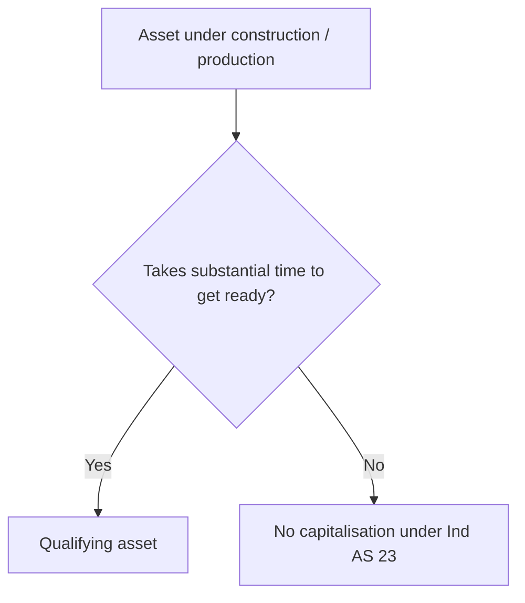
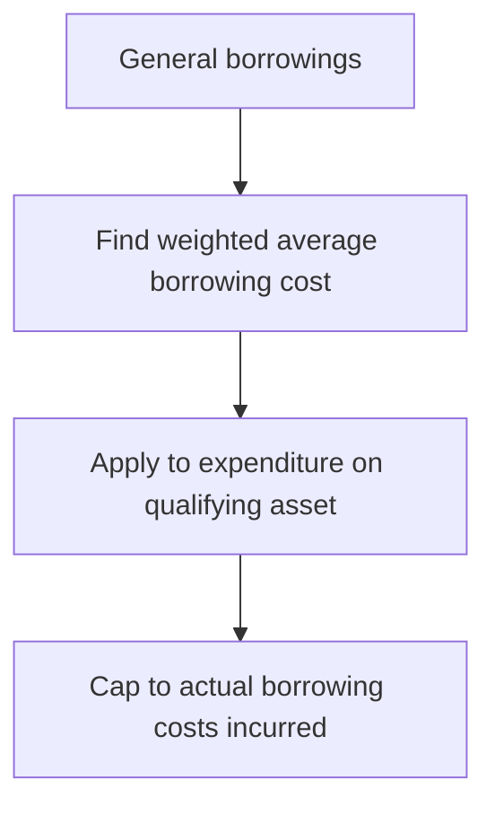

# Chapter 5, Unit 3: Ind AS 23 - Borrowing Costs

## Exam Relevance

- This chapter is usually tested as a practical classification question.
- The examiner commonly asks whether a borrowing cost is capitalised or expensed.
- The key triggers are:
  - qualifying asset,
  - commencement of capitalisation,
  - suspension and cessation,
  - specific borrowings versus general borrowings.
- Common traps are:
  - capitalising too early,
  - forgetting temporary suspension when construction is interrupted,
  - applying the wrong rate to general borrowings,
  - including investment income incorrectly or forgetting to reduce it where the standard requires,
  - continuing capitalisation after the asset is ready for intended use.

## Core Intuition

Borrowing costs are usually an expense.
They are capitalised only when the entity is building or producing a qualifying asset that takes substantial time to get ready, and only for the period when that asset is actually being brought to use.

## Concept Map

## Key Concepts

### 1. What counts as borrowing costs

Borrowing costs are interest and other costs incurred in connection with borrowing funds.

Typical exam items:

- interest expense on bank loans and debentures,
- amortisation of discount or premium on borrowings,
- amortisation of ancillary costs related to borrowings,
- finance charges under finance leases,
- exchange differences on foreign currency borrowings to the extent treated as an adjustment to interest cost.

The usual rule is simple:

- if no qualifying asset, borrow to profit or loss,
- if qualifying asset and the conditions are met, capitalise to the asset.

### 2. Qualifying asset

A qualifying asset is one that necessarily takes a substantial period of time to get ready for its intended use or sale.

Examples:

- factory building under construction,
- a large plant or installation,
- a power project,
- a ship or ship-like asset that takes time to complete.

Not usually qualifying assets:

- inventories produced quickly,
- assets ready for use immediately,
- assets that are acquired and can be used without a long construction period.

### 3. Capitalisation period

Capitalisation does not start when the loan is taken.
It starts only when all three conditions are met:

1. expenditure for the asset is being incurred,
2. borrowing costs are being incurred,
3. activities necessary to prepare the asset for its intended use or sale are in progress.

Capitalisation suspends during extended periods in which active development is interrupted.

Capitalisation ceases when substantially all the activities necessary to prepare the qualifying asset for its intended use or sale are complete.

Important exam clue:

- if the asset is ready for use, capitalisation stops even if the asset is not yet actually used.

### 4. Specific borrowings

If funds are borrowed specifically for a qualifying asset, the eligible borrowing cost is the actual borrowing cost incurred on that borrowing during the period, adjusted for any temporary investment income on those specific borrowings where the standard requires such reduction.

Practical exam reading:

- identify the specific loan,
- track actual interest and related costs,
- reduce by income from temporary investment of surplus funds, if applicable,
- capitalise only during the eligible period.

### 5. General borrowings

When the asset is financed from general borrowings, the entity uses a capitalisation rate.

The capitalisation amount is based on:

- expenditures on the qualifying asset,
- multiplied by the weighted average capitalisation rate for general borrowings outstanding during the period.

The capitalisation rate is the weighted average of the borrowing costs applicable to the general borrowings of the entity, other than borrowings made specifically for the qualifying asset.

### 6. Mixed funding logic

If part of the funding is specific and part is general:

- first identify the portion financed by the specific borrowing,
- capitalise actual specific borrowing cost for that portion,
- then apply the general borrowing rate to the remaining qualifying expenditure.

The final capitalised amount can never exceed the borrowing costs actually incurred in the period.

### 7. Suspension and cessation traps

Suspension happens when active development is interrupted for extended periods.

No suspension is needed for ordinary technical or administrative work, or for short delays that are part of the process.

Capitalisation ceases when the asset is basically ready for its intended use or sale.

Exam trap:

- do not continue capitalising because final finishing touches, administrative handover, or minor testing remain.

### 8. Disclosure

Disclose:

- the amount of borrowing costs capitalised during the period,
- the capitalisation rate used.

In an exam answer, this is usually a small but easy-marks point.

## Professor's Problem-Solving Framework

1. Decide whether the item is a qualifying asset.
2. Check whether borrowing costs and qualifying expenditure are both present.
3. Mark the capitalisation start date using the three-condition test.
4. Identify specific borrowings first, then general borrowings.
5. Suspend capitalisation for extended interruptions.
6. Stop capitalisation when substantially all activities are complete.
7. State the answer with the correct expense versus capitalise conclusion.

## Worked Examples

### Example 1: Specific borrowing

Problem:

A company borrows Rs. 10 crore specifically for a plant under construction.
Interest for the year is Rs. 80 lakh.
Temporary investment income on unutilised funds is Rs. 6 lakh.
The plant is a qualifying asset and all conditions for capitalisation are satisfied for the full year.

Working:

Eligible borrowing cost = actual interest - temporary investment income

= Rs. 80 lakh - Rs. 6 lakh

= Rs. 74 lakh

Answer:

Capitalise Rs. 74 lakh to the cost of the qualifying asset.

### Example 2: General borrowings

Problem:

An entity has general borrowings with a weighted average borrowing rate of 11%.
Qualifying asset expenditure during the year is Rs. 5 crore.
The asset is under construction throughout the eligible period.

Working:

Capitalisable borrowing cost = Rs. 5 crore x 11%

= Rs. 55 lakh

Answer:

Capitalise Rs. 55 lakh, subject to the cap of actual general borrowing costs incurred.

## Common Mistakes

- Treating every loan interest as capitalisable.
- Ignoring the substantial-period test for a qualifying asset.
- Starting capitalisation before expenditure begins.
- Continuing capitalisation during a long construction pause.
- Stopping capitalisation too late, after the asset is already ready for intended use.
- Using the specific borrowing rate for all assets even when only part of the spending is financed specifically.

## Summary Tables

| Item | Rule | Exam reminder |
|---|---|---|
| Qualifying asset | Takes substantial time to get ready | This is the entry gate |
| Start of capitalisation | Expenditure incurred + borrowing costs incurred + activity in progress | All three must exist |
| Suspension | Extended interruption in active development | Short gaps do not automatically stop capitalisation |
| Cessation | Substantially all activities complete | Readiness, not actual use, is the trigger |
| Specific borrowings | Capitalise actual cost, with required reduction for temporary investment income | Track the linked loan |
| General borrowings | Use weighted average capitalisation rate | Do not use a random loan rate |

## Last-Day Revision

- Borrowing costs are normally expensed.
- Capitalise only for qualifying assets.
- Qualifying asset = substantial period to get ready.
- Start only when expenditure, borrowing cost, and development activity all exist.
- Suspend for extended interruption.
- Stop when substantially all preparation is complete.
- Specific borrowings first, then general borrowings.
- General borrowings use a weighted average capitalisation rate.
- Disclose capitalised amount and rate.

## Doubts / Version-Sensitive Items

- The exact treatment of exchange differences as borrowing costs should be checked against the wording in the source PDF and the ICAI teaching style.
- The temporary investment income adjustment on specific borrowings should be matched with the exact example language used in the source material.
- If the source PDF uses any amended wording for the capitalisation start or stop condition, align the final phrasing to that wording.
