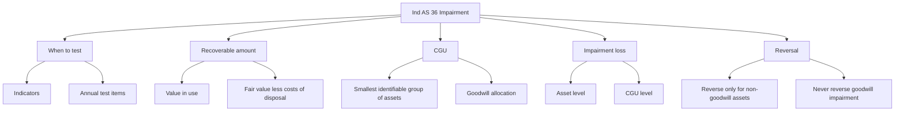
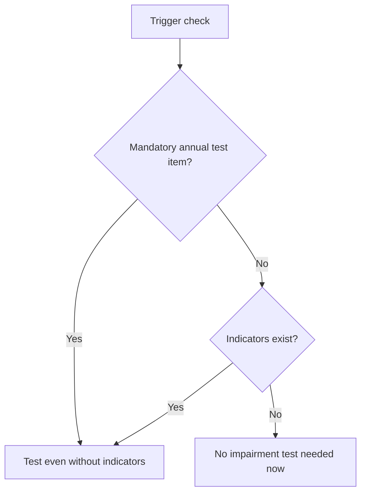
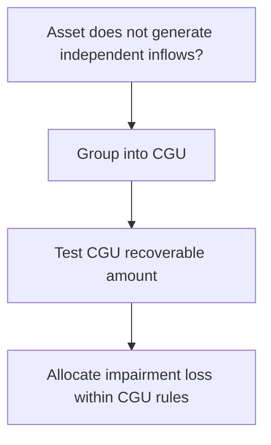
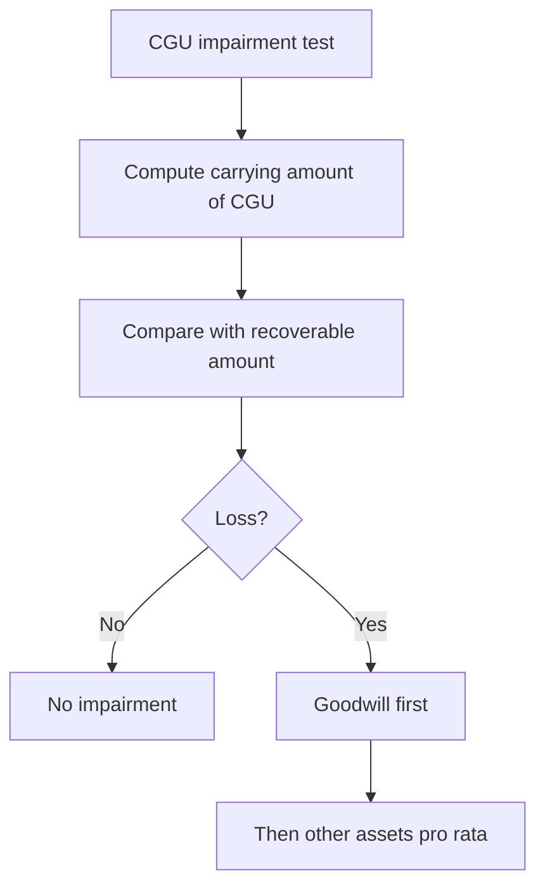

# Chapter 5, Unit 4: Ind AS 36 - Impairment of Assets

## Exam Relevance

- This is a high-yield theory-plus-application chapter.
- The examiner often tests:
  - impairment indicators,
  - recoverable amount,
  - cash-generating units,
  - goodwill impairment,
  - reversal of impairment losses,
  - the no-reversal trap for goodwill.
- Questions frequently mix PPE, intangible assets, goodwill, and allocated corporate assets.
- Common traps are:
  - forgetting annual impairment testing for goodwill and indefinite-life intangibles,
  - using the wrong benchmark for recoverable amount,
  - mixing up VIU and FVLCD,
  - allocating goodwill incorrectly within a CGU,
  - reversing goodwill impairment, which is not permitted.

## Core Intuition

Impairment is the accounting check for whether an asset is carrying too much value on the balance sheet.
If the asset cannot recover its carrying amount through use or sale, write it down to recoverable amount.

## Concept Map

## Key Concepts

### 1. Objective and scope

Ind AS 36 ensures that assets are not carried above the amount the entity can recover from them.

The standard applies broadly to assets, but some items are dealt with by other Ind ASs.

Important exceptions and special areas:

- inventories are outside this standard,
- assets arising from employee benefits are outside this standard,
- financial assets are generally outside this standard,
- investment property measured at fair value is outside this standard for impairment purposes,
- certain assets held for sale are covered under Ind AS 105.

### 2. When impairment testing is required

Impairment testing is triggered in two ways:

1. by indicators of impairment, or
2. by annual mandatory testing for specific assets.

Annual impairment test is required for:

- goodwill,
- an intangible asset with an indefinite useful life,
- an intangible asset not yet available for use.

External indicators include:

- significant decline in market value,
- adverse changes in technology, market, economic or legal environment,
- increase in market interest rates,
- market capitalisation below carrying amount.

Internal indicators include:

- obsolescence or physical damage,
- restructuring or plans to discontinue or dispose,
- evidence that economic performance is worse than expected,
- changes in the way the asset is used.

### 3. Recoverable amount

Recoverable amount is the higher of:

- value in use, and
- fair value less costs of disposal.

This is one of the most important exam definitions.

If carrying amount exceeds recoverable amount, the asset is impaired.

### 4. Value in use

Value in use is the present value of the future cash flows expected from the asset or CGU.

Key points:

- based on entity-specific cash flows,
- based on current estimates of future inflows and outflows from continuing use and ultimate disposal,
- discounted using a pre-tax rate that reflects current market assessments of the time value of money and the risks specific to the asset for which cash flow estimates have not been adjusted.

Exam traps:

- do not use accounting profit,
- do not use post-tax discounting without converting properly,
- do not mix in financing cash flows unless the standard permits them in the model used.

### 5. Fair value less costs of disposal

FVLCD is the amount obtainable from selling an asset or CGU in an orderly transaction between market participants, less costs of disposal.

It is a market-based measure.

Use it when market information is available and reliable.

### 6. Cash-generating unit

A CGU is the smallest identifiable group of assets that generates cash inflows largely independent of the cash inflows from other assets or groups of assets.

It matters when:

- individual asset recoverable amount cannot be determined,
- goodwill has to be tested,
- corporate assets need allocation.

### 7. Goodwill impairment

Goodwill acquired in a business combination must be allocated to the acquirer's CGU or group of CGUs expected to benefit from the synergies of the combination.

Then test that CGU for impairment.

Important rules:

- goodwill is tested annually and when indicators arise,
- goodwill is tested at the CGU level, not in isolation like a stand-alone asset,
- goodwill impairment is recognised first before reducing other assets in the CGU,
- goodwill impairment is never reversed.

Exam trap:

- if goodwill belongs to a CGU, do not spread it across arbitrary assets or across unrelated units.

### 8. Recognition of impairment loss

For an individual asset:

- loss = carrying amount - recoverable amount,
- recognise the loss in profit or loss unless the asset is carried under another revaluation-based model that sends the effect elsewhere in accordance with that model.

For a CGU:

- compare carrying amount of the CGU with recoverable amount,
- first reduce goodwill,
- then allocate remaining loss pro rata to other assets in the CGU,
- do not reduce any asset below the highest of:
  - its fair value less costs of disposal, if determinable,
  - its value in use, if determinable,
  - zero.

### 9. Reversal of impairment

If impairment indicators reverse or estimates improve, impairment losses may be reversed for assets other than goodwill.

But the reversal is subject to a ceiling:

- carrying amount after reversal cannot exceed what the carrying amount would have been had no impairment loss been recognised.

Goodwill:

- impairment loss on goodwill is never reversed.

Reversal traps:

- do not reverse goodwill impairment,
- do not push the asset above the no-impairment carrying amount,
- do not reverse just because the market price bounced for a short period; the estimate change must be supportable.

### 10. Allocation logic for CGU and corporate assets

If a CGU contains goodwill:

1. allocate goodwill to the CGU,
2. test the CGU,
3. recognise loss against goodwill first,
4. then allocate the balance to other assets.

Corporate assets are allocated to CGUs on a reasonable and consistent basis where they can be associated with the unit being tested.

## Professor's Problem-Solving Framework

1. Identify the asset or CGU to be tested.
2. Ask whether annual testing is mandatory or indicators have triggered a test.
3. Compute recoverable amount as higher of VIU and FVLCD.
4. Compare carrying amount with recoverable amount.
5. Allocate any impairment loss in the correct order, with goodwill first in a CGU.
6. Check whether reversal is allowed and whether the asset is goodwill.
7. State the answer in exam language, including the no-reversal rule for goodwill.

## Worked Examples

### Example 1: Asset impairment

Problem:

An asset has a carrying amount of Rs. 12 lakh.
Its VIU is Rs. 9 lakh and FVLCD is Rs. 10 lakh.

Working:

Recoverable amount = higher of VIU and FVLCD

= higher of Rs. 9 lakh and Rs. 10 lakh

= Rs. 10 lakh

Impairment loss = Rs. 12 lakh - Rs. 10 lakh

= Rs. 2 lakh

Answer:

Recognise an impairment loss of Rs. 2 lakh.

### Example 2: Goodwill reversal trap

Problem:

Goodwill was impaired last year by Rs. 15 lakh.
This year conditions improve and the CGU appears stronger.

Answer:

Do not reverse the goodwill impairment.
Goodwill impairment is never reversed under Ind AS 36.

## Common Mistakes

- Testing only when the asset looks old or damaged, while forgetting mandatory annual testing for goodwill and indefinite-life intangibles.
- Using carrying amount versus fair value directly, instead of recoverable amount.
- Confusing VIU with FVLCD.
- Using post-tax cash flows and discount rates without proper conversion.
- Forgetting that goodwill is tested at the CGU level.
- Reversing goodwill impairment.
- Allocating CGU impairment so that an asset falls below its own floor.

## Summary Tables

| Item | Rule | Exam reminder |
|---|---|---|
| Impairment trigger | Indicators or mandatory annual test | Goodwill and indefinite-life intangibles are special |
| Recoverable amount | Higher of VIU and FVLCD | This is the benchmark |
| VIU | Present value of expected future cash flows | Entity-specific and discounted |
| FVLCD | Market-based selling value less costs of disposal | Think market participant logic |
| CGU | Smallest group with independent inflows | Used when one asset cannot be tested alone |
| Goodwill | Allocated to CGU and tested annually | No reversal ever |
| Reversal | Allowed for non-goodwill assets subject to ceiling | Ceiling is the no-impairment carrying amount |

## Last-Day Revision

- Impairment exists only when carrying amount exceeds recoverable amount.
- Recoverable amount = higher of VIU and FVLCD.
- VIU = discounted expected future cash flows.
- FVLCD = market-based fair value less costs of disposal.
- CGU is the smallest group with independent inflows.
- Goodwill goes to the CGU and is tested annually.
- Goodwill impairment is never reversed.
- Reversal is possible only for non-goodwill assets and only within the ceiling.
- Allocation in a CGU goes goodwill first, then other assets.

## Doubts / Version-Sensitive Items

- The exact list of impairment indicators should be aligned with the wording used in the source PDF and final ICAI material.
- The discount-rate discussion for VIU should be checked against the source PDF if it uses any simplified exam wording.
- If the source PDF gives a specific flowchart or sequence for CGU allocation, align the final drafting to that sequence.
