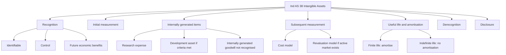
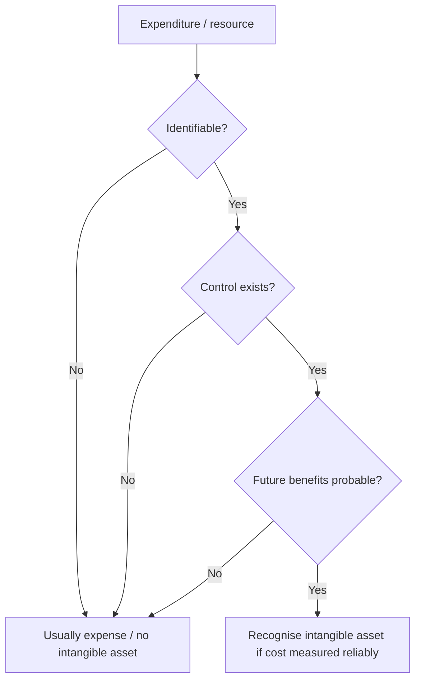
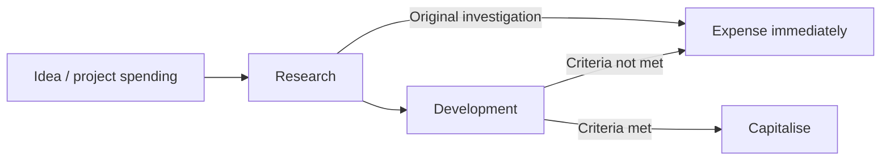
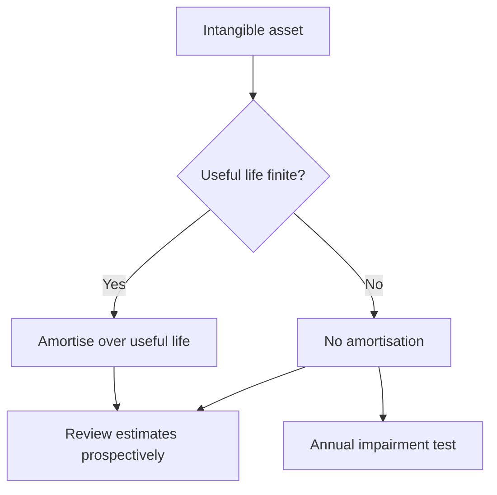
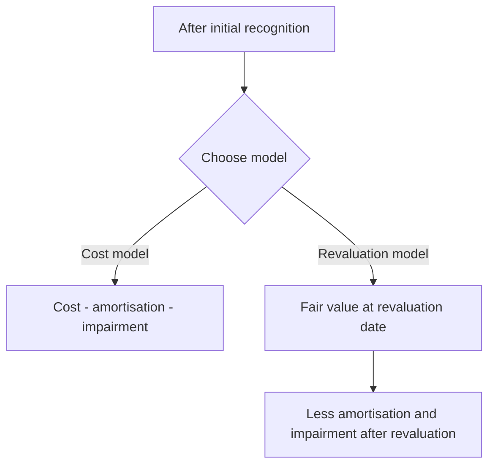

# Chapter 5, Unit 5: Ind AS 38 - Intangible Assets

## Exam Relevance

- Intangible assets are a regular theory-plus-application question in Module 2.
- The examiner usually mixes recognition, identifiability, control, future benefits, internal generation, research vs development, initial measurement, revaluation, amortisation, and derecognition.
- Frequent traps:
  - treating a strong brand or customer list as an asset just because it has value,
  - capitalising research expenditure,
  - forgetting that internally generated goodwill is never recognised,
  - amortising an indefinite-life intangible,
  - using revaluation without an active market,
  - ignoring that the useful life review is prospective.

## Core Intuition

An intangible asset is recognised only when the entity can point to it clearly, control its benefits, and measure it reliably.
The exam then turns into a classification game: what is an asset, what is just expenditure, what is research, what is development, and what needs amortisation or impairment.

## Concept Map

## Key Concepts

### 1. Objective and scope

Ind AS 38 prescribes the accounting treatment for intangible assets that are not dealt with by another standard.

It excludes, among others:

- intangible assets covered by another standard,
- financial assets,
- exploration and evaluation assets,
- expenditure on development and extraction of minerals, oil, natural gas and similar non-regenerative resources,
- non-current intangible assets classified as held for sale.

The practical exam question is usually not about the exclusion list by itself. It is about whether the item belongs to Ind AS 38 or should be routed elsewhere.

### 2. What makes an intangible asset

An intangible asset is:

- identifiable,
- non-monetary,
- without physical substance.

The three exam words are **identifiability**, **control**, and **future economic benefits**.

#### Identifiability

An item is identifiable if it is either:

- separable, meaning it can be sold, transferred, licensed, rented or exchanged separately, or
- arises from contractual or other legal rights, whether or not those rights are transferable.

This is why a patent or licence is usually easy to classify, while internally generated goodwill is not.

#### Control

Control means the entity has the power to obtain future benefits from the resource and restrict others from access to those benefits.

So the asset is not just valuable. The entity must be able to keep the benefits inside its own sphere.

#### Future economic benefits

Benefits may arise from:

- revenue from sale of products or services,
- cost savings,
- use of the asset in production,
- other benefits from the asset's use.

### 3. Initial recognition

An intangible asset is recognised only when:

- it is probable that expected future economic benefits will flow to the entity,
- the cost of the asset can be measured reliably.

This is the same recognition logic the examiner uses across assets, but the intangible asset area is where it gets tested with more subtle facts.

### 4. Initial measurement

An intangible asset is initially measured at cost.

Cost may arise from:

- separate acquisition,
- business combination,
- government grant,
- exchange of assets,
- internally generated development expenditure, if the recognition criteria are met.

Cost generally includes:

- purchase price, including import duties and non-refundable taxes, after trade discounts and rebates,
- directly attributable costs of preparing the asset for its intended use,
- any directly attributable borrowing cost if a separate standard requires it,
- fair value of consideration given in exchange.

#### Mini rule

If the item is bought ready for use, the cost question is simple.

If the item is developed internally, the main question is whether you are still in research or have crossed into development.

### 5. Separate acquisition, business combination, and exchange

#### Separate acquisition

If the asset is bought separately, initial cost is normally straightforward purchase cost plus directly attributable expenditure.

#### Business combination

If the intangible asset is acquired in a business combination, it is recognised separately from goodwill if it is identifiable and its fair value can be measured reliably.

This is an exam favourite because customer lists, brands, patents, licences, and order books may appear in the purchase price allocation.

#### Exchange of assets

If an intangible asset is acquired in exchange for another asset, the cost is generally measured at fair value unless the exchange lacks commercial substance or fair value cannot be measured reliably.

### 6. Internally generated intangible assets

This is the most tested part.

Ind AS 38 splits internal generation into two phases:

- research,
- development.

#### Research phase

Research is original and planned investigation undertaken with the prospect of gaining new scientific or technical knowledge and understanding.

Research expenditure is recognised as an expense when incurred.

That is a hard rule.

#### Development phase

Development is the application of research findings or other knowledge to a plan or design for the production of new or substantially improved materials, devices, products, processes, systems or services before commercial production or use.

Development expenditure is capitalised only if the development criteria are met.

Typical criteria include:

- technical feasibility,
- intention to complete,
- ability to use or sell,
- probable future economic benefits,
- availability of adequate resources,
- ability to measure expenditure reliably.

#### Common internally generated items that are not recognised

Even if they have value, the following are generally not recognised as intangible assets when internally generated:

- goodwill,
- brands,
- mastheads,
- publishing titles,
- customer lists,
- items substantially similar to the above.

The logic is simple:

they may have value, but the cost cannot be distinguished reliably enough from the business as a whole, and control is often too diffuse.

### 7. Useful life and amortisation

An intangible asset may have:

- finite useful life,
- indefinite useful life.

#### Finite useful life

If useful life is finite, the asset is amortised on a systematic basis over that useful life.

Amortisation begins when the asset is available for use.

The amortisation method should reflect the pattern of consumption of future benefits.

Common methods:

- straight-line,
- diminishing balance,
- units of production where appropriate.

#### Indefinite useful life

If no foreseeable limit exists on the period over which the asset is expected to generate net cash inflows, the asset has an indefinite useful life.

An indefinite-life intangible:

- is not amortised,
- is tested for impairment annually,
- is reviewed each period to see whether the assessment remains valid.

#### Useful life review

Useful life, residual value, and amortisation method are reviewed at least at each financial year-end.

If assumptions change, the effect is accounted for prospectively.

### 8. Revaluation model

After initial recognition, an intangible asset may be carried using:

- the cost model, or
- the revaluation model.

#### Cost model

Cost less accumulated amortisation and accumulated impairment losses.

#### Revaluation model

Revalued amount = fair value at the date of revaluation less subsequent accumulated amortisation and impairment losses.

Important exam points:

- revaluation is permitted only if fair value can be determined by reference to an **active market**,
- the whole class of intangible assets must be revalued, not just one cherry-picked item,
- upward revaluation usually goes to OCI and accumulates in revaluation surplus,
- downward revaluation usually goes to profit or loss unless it reverses a previous surplus in OCI.

### 9. Derecognition

An intangible asset is derecognised:

- on disposal, or
- when no future economic benefits are expected from its use or disposal.

The gain or loss on derecognition is the difference between:

- the net disposal proceeds, and
- the carrying amount of the asset.

It goes to profit or loss.

### 10. Disclosure

Exam-relevant disclosure items include:

- whether the useful lives are finite or indefinite,
- amortisation methods and useful lives or rates,
- gross carrying amount and accumulated amortisation and impairment,
- line items in profit or loss for amortisation,
- reconciliation of carrying amount,
- reasons supporting an indefinite useful life,
- details of revalued assets and revaluation surplus.

## Professor's Problem-Solving Framework

1. Identify whether the item is an intangible asset at all.
2. Check identifiability, control, and future benefits.
3. Decide whether the expenditure is research, development, or a separately acquired asset.
4. Measure initial cost and identify what is capitalisable.
5. Decide whether useful life is finite or indefinite.
6. Apply amortisation or impairment logic.
7. If revaluation is mentioned, check for an active market and class-wide application.
8. On disposal or abandonment, compute the derecognition gain or loss.

## Worked Examples

### Example 1: Research vs development

Problem:
A company spends Rs. 8 lakh on market research, Rs. 12 lakh on laboratory testing to discover a new process, and Rs. 20 lakh after technical feasibility has been established to build a prototype for commercial production.

Working:

- market research = research phase,
- laboratory testing to discover knowledge = research phase,
- prototype after feasibility = development phase,
- research expenditure is expensed,
- development expenditure is capitalised only if the criteria are met.

Answer:
Rs. 20 lakh may be capitalised if the development criteria are met; Rs. 20 lakh is not automatically capitalised unless the standard's recognition tests are satisfied.

### Example 2: Finite-life intangible

Problem:
A licence costs Rs. 15 lakh and is valid for 5 years with no residual value.

Working:

- cost = Rs. 15 lakh,
- useful life = 5 years,
- amortisation per year = Rs. 3 lakh on straight-line basis if the pattern of benefits is even.

Answer:
Annual amortisation = Rs. 3 lakh.

### Example 3: Revaluation on active market

Problem:
A traded quota right has carrying amount Rs. 40 lakh and fair value Rs. 55 lakh in an active market.

Working:

- revaluation model may be used only if an active market exists,
- upward difference = Rs. 15 lakh.

Answer:
Revalue the asset to Rs. 55 lakh and record the increase according to the revaluation rules.

## Common Mistakes

- Treating every valuable intangible as an asset.
- Capitalising research expenditure.
- Recognising internally generated goodwill.
- Forgetting that revaluation requires an active market.
- Amortising an indefinite-life intangible.
- Forgetting that changes in useful life and amortisation method are prospective.
- Leaving derecognition gains and losses out of profit or loss.

## Summary Tables

### Recognition and Measurement

| Topic | Rule | Exam reminder |
|---|---|---|
| Identifiability | Separable or arises from contractual/legal rights | Value alone is not enough |
| Control | Power to obtain benefits and restrict others | The entity must control the resource |
| Future benefits | Probable inflow of economic benefits | Must be more than a vague possibility |
| Initial measurement | At cost | Separate acquisition, business combination, grant, exchange, or development |
| Research | Expense as incurred | Never capitalise research |
| Development | Capitalise only if criteria met | Evidence matters |
| Revaluation model | Fair value less subsequent amortisation and impairment | Active market required |

### Useful Life and Derecognition

| Topic | Rule | Exam reminder |
|---|---|---|
| Finite life | Amortise systematically | Start when available for use |
| Indefinite life | No amortisation | Test annually for impairment |
| Review | At least each year-end | Changes are prospective |
| Derecognition | Disposal or no future benefits | Gain/loss to P or L |

## Last-Day Revision

- Intangible asset = identifiable, non-monetary, without physical substance.
- Identifiable means separable or arising from contractual/legal rights.
- Control means the entity can obtain the benefits and keep others out.
- Research is expensed.
- Development can be capitalised only when the criteria are met.
- Internally generated goodwill is never recognised.
- Brands, mastheads, publishing titles, and similar internally generated items are usually not recognised.
- Finite-life intangibles are amortised.
- Indefinite-life intangibles are not amortised but are tested for impairment annually.
- Revaluation model is allowed only when an active market exists.
- Revaluation is class-based, not asset-picking.
- Derecognition gain or loss goes to profit or loss.

## Doubts / Version-Sensitive Items

- The exact list of items excluded from the scope can be read narrowly in an exam, so if the question is built around another Ind AS, cross-check the source wording before answering.
- Revaluation under Ind AS 38 depends on the existence of an active market; if the question gives a thinly traded or quoted-but-illiquid market, the exam treatment may need careful wording.
- The treatment of residual value for intangible assets can depend on whether an active market exists or a third-party purchase commitment is present.
- If the question mixes software embedded in hardware, the classification may shift to PPE rather than Ind AS 38.

