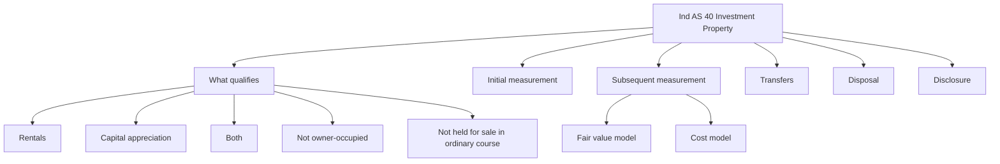
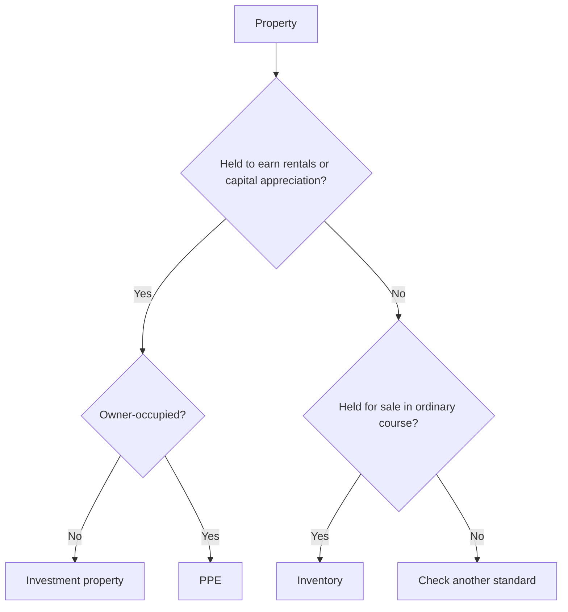
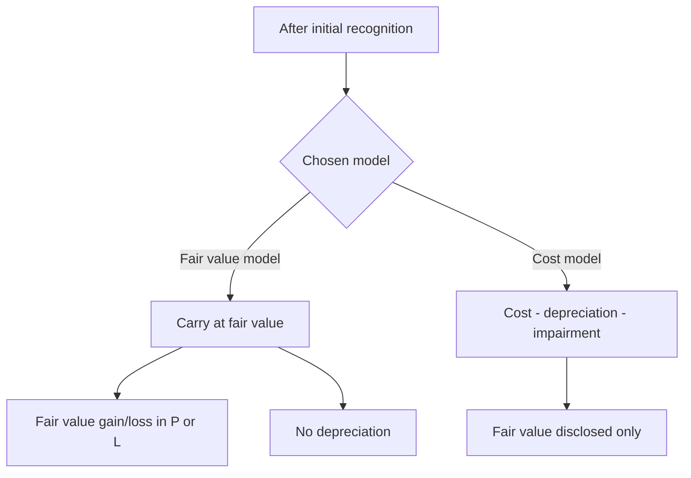
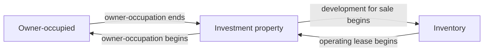

# Chapter 5, Unit 6: Ind AS 40 - Investment Property

## Exam Relevance

- Investment property is a short but very testable standard because the examiner can twist it against PPE, inventory, or owner-occupied property.
- The usual asks are recognition, classification, initial measurement, subsequent measurement, fair value model, cost model, transfers, and disposal.
- Frequent traps:
  - calling every rental property investment property without checking the use,
  - confusing owner-occupied property with investment property,
  - forgetting that fair value changes go to profit or loss,
  - trying to depreciate under the fair value model,
  - missing the transfer date logic when use changes,
  - forgetting that property held for sale is inventory, not investment property.

## Core Intuition

Investment property is property held to earn rentals, for capital appreciation, or both.
The whole exam question is usually about purpose: use it in the business, sell it in the ordinary course, or hold it as a passive property investment.

## Concept Map

## Key Concepts

### 1. Objective and scope

Ind AS 40 deals with property held to earn rentals or for capital appreciation or both.

It does not deal with property:

- held for use in production or supply of goods or services or for administrative purposes, which belongs to PPE under Ind AS 16,
- held for sale in the ordinary course of business, which belongs to inventory under Ind AS 2.

So the first exam step is to decide the nature of use, not the legal title alone.

### 2. What counts as investment property

Investment property is land or a building, or part of a building, or both, held by the owner or by the lessee as a right-of-use asset, to earn rentals or for capital appreciation or both.

The essence is passive holding for return, not active operational use.

Examples:

- land held for capital appreciation,
- building leased out under operating lease,
- vacant building held for future rental income,
- part of a building rented out while the owner uses the rest, if the parts are separable.

Non-examples:

- factory used in production,
- office used for administration,
- property built for immediate sale in the normal course of business,
- property under construction for future use as owner-occupied property.

### 3. Mixed-use property

A property may have both investment and owner-occupied portions.

If the portions can be sold separately or leased separately under a finance lease, they are accounted for separately.

If the owner-occupied portion is insignificant, the entire property may be treated as investment property.

This is a frequent classification trap in exam questions with shops, flats, and commercial complexes.

### 4. Initial recognition

An item of investment property is recognised as an asset when:

- it is probable that future economic benefits associated with the property will flow to the entity,
- the cost of the property can be measured reliably.

This mirrors the usual asset recognition rule.

### 5. Initial measurement

Investment property is initially measured at cost.

Cost includes:

- purchase price,
- directly attributable expenditure,
- transfer taxes and duties,
- professional fees,
- other directly attributable costs of acquisition or construction.

If the property is self-constructed or acquired with significant components, the cost logic should still follow the same basic principle: bring it to the condition and location necessary for its intended investment use.

### 6. Subsequent measurement

After initial recognition, an entity chooses either:

- the fair value model, or
- the cost model.

The choice applies to all of its investment property.

#### Fair value model

Under the fair value model:

- investment property is carried at fair value,
- gains or losses from changes in fair value are recognised in profit or loss,
- no depreciation is charged,
- fair value should be measured at each reporting date.

This is the exam's favourite model because it changes both presentation and profit volatility.

#### Cost model

Under the cost model:

- investment property is carried at cost less accumulated depreciation and impairment losses,
- the accounting follows Ind AS 16 after initial recognition,
- fair value is still disclosed in the notes, even though it is not used for carrying amount.

#### Rare fair value difficulty

The standard's basic expectation is that fair value can usually be measured reliably.
If fair value cannot be measured reliably in the rare case described by the standard, the cost model continues until disposal.

### 7. Transfers

Transfer to or from investment property is made only when there is a change in use.

The change must be evidenced by actual use change, not by management intention alone.

Common transfer triggers:

- commencement of owner-occupation,
- commencement of development with a view to sale,
- end of owner-occupation,
- commencement of an operating lease to another party.

#### Transfer logic in practice

- Investment property to PPE: when owner-occupation begins.
- PPE to investment property: when owner-occupation ends and the property is held to earn rentals or capital appreciation.
- Investment property to inventory: when development with a view to sale begins.
- Inventory to investment property: when an operating lease to another party begins.

At the date of transfer, the property is measured under the relevant model and the carrying amount becomes the new starting point under the receiving classification.

### 8. Disposal

An investment property is derecognised on disposal or when no future economic benefits are expected from its use and disposal.

Gain or loss on disposal is the difference between:

- net disposal proceeds, and
- carrying amount.

It is recognised in profit or loss.

Under the fair value model, the carrying amount already reflects fair value up to the date of disposal, so the disposal calculation is usually clean.

### 9. Disclosure

Exam-relevant disclosures include:

- whether the fair value or cost model is used,
- amounts recognised in profit or loss,
- criteria used to distinguish investment property from owner-occupied property and property held for sale,
- existence and amounts of restrictions on realisability or remittance of income and proceeds,
- contract obligations to purchase, construct or develop investment property,
- fair value information where the cost model is used,
- details of fair value hierarchy when required.

## Professor's Problem-Solving Framework

1. Classify the property by use, not by title.
2. Decide whether it is investment property, PPE, inventory, or another asset.
3. Recognise it at cost if the recognition criteria are met.
4. Apply the chosen subsequent model consistently.
5. If fair value model is used, record fair value changes in profit or loss and do not depreciate.
6. If use changes, transfer only when the change in use is evidenced.
7. On sale or scrapping, remove the property and compute the gain or loss.

## Worked Examples

### Example 1: Rental building

Problem:
A company buys a building and leases it out under an operating lease while not using it for operations.

Working:

- held to earn rentals,
- not owner-occupied,
- not held for sale in the ordinary course.

Answer:
It is investment property.

### Example 2: Fair value movement

Problem:
Opening carrying amount under fair value model = Rs. 80 lakh. Year-end fair value = Rs. 92 lakh.

Working:

- increase in fair value = Rs. 12 lakh,
- no depreciation under fair value model.

Answer:
Recognise Rs. 12 lakh gain in profit or loss.

### Example 3: Transfer from PPE to investment property

Problem:
An office building used by the company for administration is vacated and then let out to third parties.

Working:

- owner-occupation ends,
- use changes to rental income generation,
- transfer is made when the change in use is evidenced.

Answer:
Transfer from PPE to investment property on the date use changes.

## Common Mistakes

- Classifying a factory or head office as investment property just because it can be rented out someday.
- Using the fair value model and still charging depreciation.
- Forgetting that fair value changes go to profit or loss.
- Transferring property on management intention alone instead of actual change in use.
- Mixing inventory held for sale with property held to earn rentals.
- Ignoring the separability rule for mixed-use property.

## Summary Tables

### Classification and Measurement

| Topic | Rule | Exam reminder |
|---|---|---|
| Investment property | Held to earn rentals or capital appreciation | Passive return, not business use |
| PPE | Used in production, supply, or administration | Operational use |
| Inventory | Held for sale in ordinary course | Trading stock |
| Initial measurement | Cost | Same basic recognition logic |
| Fair value model | Fair value with changes in P or L | No depreciation |
| Cost model | Cost less depreciation and impairment | Fair value disclosed |

### Transfers and Disposal

| Event | Treatment | Exam reminder |
|---|---|---|
| Owner-occupation begins | Transfer out of investment property | Evidence of change in use |
| Owner-occupation ends | Transfer into investment property | Rental use must be intended and evidenced |
| Development with a view to sale begins | Transfer to inventory | Property is no longer held for rent/capital appreciation |
| Operating lease to another party begins | Transfer into investment property | Passive rental use starts |
| Disposal | Derecognise asset | Gain/loss in P or L |

## Last-Day Revision

- Investment property is held for rentals, capital appreciation, or both.
- Do not confuse it with owner-occupied property or inventory.
- Initial measurement is at cost.
- After recognition, choose fair value model or cost model.
- Under the fair value model, fair value changes go to profit or loss and there is no depreciation.
- Under the cost model, apply Ind AS 16-style depreciation and impairment.
- Transfers happen only when there is evidence of a change in use.
- Mixed-use property needs a separability check.
- Disposal gain or loss is recognised in profit or loss.

## Doubts / Version-Sensitive Items

- The exact transfer examples can be framed slightly differently in exam material, so the question's evidence of change in use should be matched carefully before finalising the classification.
- If the question involves a right-of-use asset under a lease, the wording should be checked against the lease standard and the investment property definition together.
- The fair value model presumes fair value is reliably measurable; if the fact pattern claims otherwise, that rare-case wording should be handled with care.
- Mixed-use property can be easy to misclassify if the owner-occupied portion is not clearly insignificant.

