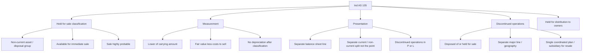
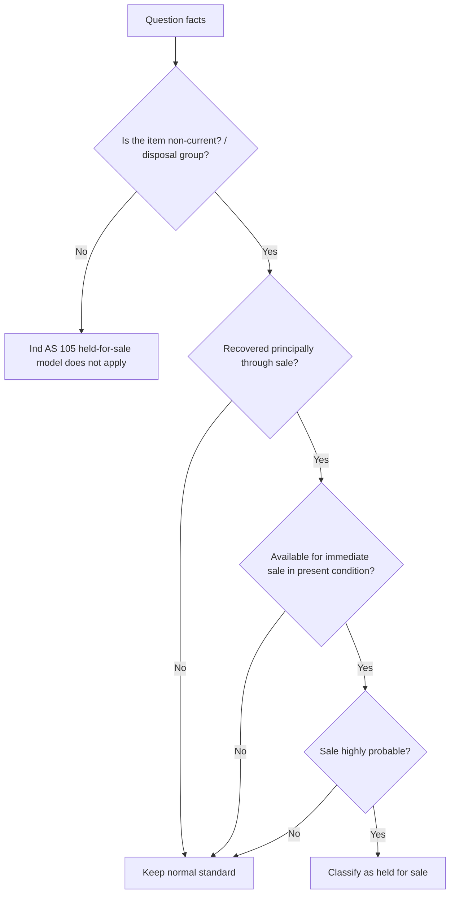
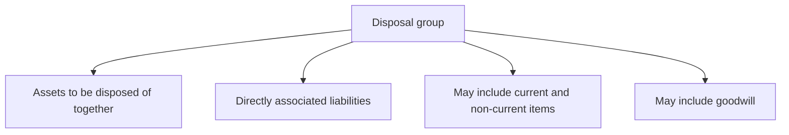

# Chapter 5, Unit 7: Ind AS 105 - Non-current Assets Held for Sale and Discontinued Operations

## Exam Relevance

- This is a classification-heavy chapter with very short triggers and very unforgiving wording.
- The examiner usually tests:
  - whether a non-current asset or disposal group qualifies as held for sale,
  - whether the asset is measured at lower of carrying amount and fair value less costs to sell,
  - when depreciation stops,
  - when a component becomes a discontinued operation,
  - how to present the gain, loss, impairment, and disposal results separately.
- Common twists:
  - the sale is expected but the asset is not yet available for immediate sale,
  - the sale will happen after more than one year,
  - a disposal group contains current and non-current items,
  - the question mixes Ind AS 105 with Ind AS 36 impairment or Ind AS 1 current/non-current classification.

## Core Intuition

Ind AS 105 is about telling the reader, "this asset is no longer being kept mainly for use; it is being kept mainly for sale."

Once that decision is real and highly probable, the accounting changes fast:

- stop depreciating,
- measure at the lower of carrying amount and fair value less costs to sell,
- present separately,
- split out discontinued operations.

## Concept Map

## Key Concepts

### 1. Objective and scope

Ind AS 105 handles two reporting ideas:

1. non-current assets or disposal groups held for sale, and
2. discontinued operations.

The standard applies to recognised non-current assets and disposal groups.
It also applies to assets held for distribution to owners acting in their capacity as owners.

Important exclusions from the measurement part include items already covered by other standards, such as:

- deferred tax assets,
- employee benefit assets,
- financial assets within Ind AS 109,
- biological assets measured at fair value less costs to sell under Ind AS 41,
- insurance contract groups where applicable.

### 2. What counts as held for sale

A non-current asset or disposal group is classified as held for sale when:

- its carrying amount will be recovered principally through sale rather than continuing use,
- it is available for immediate sale in its present condition,
- the sale is highly probable.

The exam trigger words are usually:

- board approval,
- committed plan,
- active marketing,
- buyer identified,
- sale expected within 12 months,
- operations discontinued or mothballed for sale.

### 3. Immediate sale means practical, not mystical

"Available for immediate sale" does not mean the asset must be sold today.
It means the entity can sell it in its present condition, subject only to customary and usual sale terms.

Useful exam distinctions:

- vacating a building before sale can still be consistent with immediate sale,
- routine repairs, minor legal formalities, or normal marketing do not defeat classification,
- major refurbishment, delayed restructuring, or a distant future sale usually defeats classification.

### 4. Highly probable sale

The standard wants a high level of commitment.
Typical indicators:

- management is committed to a plan,
- active programme to locate a buyer,
- asset marketed at a reasonable price,
- sale expected to complete within one year,
- actions have been taken to make the plan unlikely to be withdrawn.

Typical blockers:

- major uncertainty about approval,
- unrealistic pricing,
- only vague intent,
- long delay without a valid extension reason.

### 5. Disposal groups

A disposal group is a group of assets to be disposed of in a single transaction together with directly associated liabilities.

It may include:

- a single cash-generating unit,
- a group of CGUs,
- part of a CGU,
- goodwill allocated to the unit where relevant.

### 6. Measurement

The measurement rule is simple:

**lower of**

- carrying amount, and
- fair value less costs to sell.

If the sale is expected after more than one year, costs to sell are discounted to present value.
The passage of time then creates financing cost in profit or loss.

Important exam logic:

- compare the carrying amount with fair value less costs to sell at each reporting date,
- recognise a loss immediately if fair value less costs to sell is lower,
- reverse only up to the ceiling allowed by the standard,
- do not keep layering normal depreciation after classification.

### 7. Depreciation stops

Once classified as held for sale:

- depreciation stops for the non-current asset,
- impairment-style measurement under Ind AS 105 replaces normal depreciation logic,
- if the asset no longer meets the held-for-sale criteria, normal measurement resumes.

### 8. Discontinued operations

A discontinued operation is a component of an entity that either:

- has been disposed of, or
- is classified as held for sale,

and also:

- represents a separate major line of business or geographical area,
- or is part of a single coordinated plan to dispose of such a line or area,
- or is a subsidiary acquired exclusively with a view to resale.

This is a presentation test.
The results are shown separately so users can see what is continuing and what is exiting.

### 9. Presentation logic

The held-for-sale asset or disposal group is shown separately in the balance sheet.
The results of discontinued operations are shown separately in profit or loss.

The analysis of the discontinued operation generally splits:

- profit or loss of the discontinued operation,
- related tax,
- gain or loss on disposal,
- cash flow disclosure where required.

## Professor's Problem-Solving Framework

1. Identify whether the item is a single asset, a CGU, or a disposal group.
2. Ask whether the asset is non-current and whether it is really being recovered through sale.
3. Test the three gates: immediate sale, present condition, highly probable sale.
4. Measure at lower of carrying amount and fair value less costs to sell.
5. Stop depreciation once classification is achieved.
6. Check whether the component is a discontinued operation and separate the presentation.
7. State the conclusion in one sentence with the reporting date.

## Worked Examples

### Example 1: Vacant building to be sold

**Problem:**
An entity vacates its headquarters on 1 December and begins marketing it. The building needs normal cleaning and handover formalities before sale.

**Working:**
- It is a non-current asset.
- It is available in its present condition, subject only to customary sale steps.
- The sale is highly probable.

**Answer:**
Classify the building as held for sale from the date the criteria are met.
Measure at lower of carrying amount and fair value less costs to sell.
Stop depreciation from that date.

### Example 2: Disposal group with a loss-making division

**Problem:**
An entity plans to sell an entire division, including PPE, working capital items, and liabilities directly linked to the division. The division is a separate major line of business.

**Working:**
- The grouping is a disposal group.
- If the sale is highly probable and the group is available for immediate sale, it qualifies.
- If the division meets the discontinued operation definition, the results are presented separately.

**Answer:**
Classify the group as held for sale and present the division as a discontinued operation in profit or loss.

## Common Mistakes

- Using "intends to sell" instead of testing the full held-for-sale criteria.
- Forgetting that the asset must be available for immediate sale in its present condition.
- Continuing depreciation after classification.
- Measuring the disposal group with normal Ind AS 16 / Ind AS 36 logic after the held-for-sale trigger.
- Missing the separate presentation of discontinued operations.
- Forgetting that current assets sold individually are not the same thing as a held-for-sale non-current asset.

## Summary Tables

| Item | Rule | Exam reminder |
|---|---|---|
| Held-for-sale asset | Lower of carrying amount and FVLCTS | Reassess each reporting date |
| Depreciation | Stops once classified | No normal depreciation after trigger |
| Disposal group | Assets and directly associated liabilities | Can include current and non-current items |
| Costs to sell after 1 year | Present value | Financing cost appears over time |
| Discontinued operation | Separate major line / geography / resale subsidiary | Separate in profit or loss |

## Last-Day Revision

- Held for sale means sale is the principal recovery route, not use.
- The asset must be available for immediate sale in its present condition.
- The sale must be highly probable.
- Measure at lower of carrying amount and fair value less costs to sell.
- Stop depreciation on classification.
- Disposal group means assets plus directly associated liabilities.
- Discontinued operation is a presentation category, not just a sale plan.
- If sale is beyond one year, discount costs to sell.

## Doubts / Version-Sensitive Items

- Check whether the source PDF uses "fair value less costs to sell" or shortened shorthand in a given illustration.
- Confirm the exact wording for insurance-contract scope exclusions if the question mixes newer standards.
- Recheck any example where the sale period exceeds one year, because discounting of costs to sell is easy to miss.
- Verify whether the question wants classification date, measurement date, or presentation date; the answer can change by a reporting cut-off.
