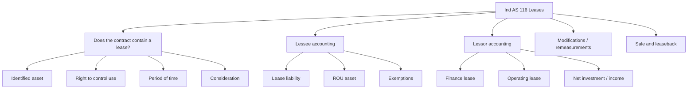
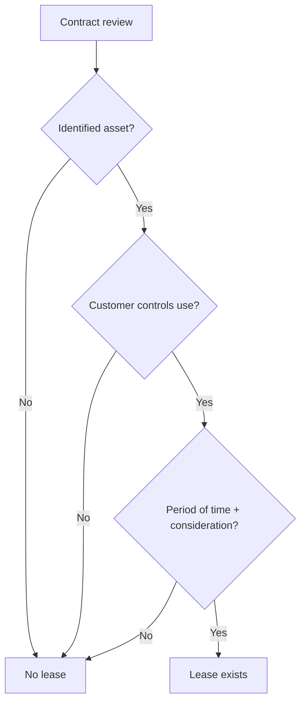
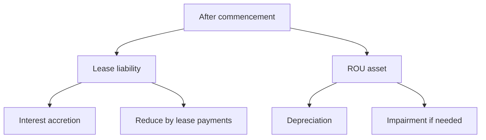

# Chapter 5, Unit 8: Ind AS 116 - Leases

## Exam Relevance

- This is one of the densest practical standards in Module 2.
- The examiner usually tests:
  - whether a contract contains a lease,
  - whether lease and non-lease components must be separated,
  - whether a lessee can use the short-term or low-value exemption,
  - lease liability and right-of-use asset measurement,
  - lessor classification into finance lease or operating lease,
  - lease modifications, subleases, and sale-and-leaseback logic.
- Frequent traps:
  - missing the identified asset test,
  - confusing control with ownership,
  - including non-lease service payments in the lease liability,
  - mixing lessee and lessor payment rules,
  - using the wrong rate or wrong lease term.

## Core Intuition

Ind AS 116 asks one main question:

**Who controls the use of a specific asset for a period of time?**

If the answer is yes, the lessee gets a right-of-use asset and a lease liability.
If the answer is no, it is just a service or supply contract.

## Concept Map

## Key Concepts

### 1. Lease identification

At inception, the entity checks whether the contract is or contains a lease.

A lease is a contract, or part of a contract, that conveys the right to control the use of an identified asset for a period of time in exchange for consideration.

That gives you three exam tests:

1. Is there an identified asset?
2. Does the customer control the use?
3. Is the right for a period of time for consideration?

#### Identified asset

An asset is identified when it is explicitly or implicitly specified and the supplier does not have a substantive substitution right.

Watch for:

- physical asset with a serial number or floor space,
- capacity portions that are physically distinct,
- supplier rights that are protective only,
- outsourced service contracts with no identified asset.

#### Control of use

The customer controls the use if it has:

- the right to obtain substantially all economic benefits from use, and
- the right to direct the use of the asset.

### 2. Lease and non-lease components

If a contract has both lease and service components, those components are separated unless a practical election applies.

Exam habit:

- lease payments belong in the lease model,
- service or maintenance amounts belong outside the lease liability unless the contract elects to combine them when allowed.

### 3. Lessee exemptions

The lessee can avoid recognition of ROU asset and lease liability for:

- short-term leases,
- leases of low-value assets.

Use the exemption carefully:

- if the lease term is 12 months or less and no purchase option, short-term treatment may apply,
- low-value is judged by the asset when new, not by the remaining value of the leased used item,
- if the head lease is subleased or expected to be subleased, low-value exemption is not available for that head lease.

### 4. Lessee initial measurement

At commencement, the lessee recognises:

- a lease liability,
- a right-of-use asset.

The lease liability is measured at the present value of lease payments not paid at that date, discounted using the lease's implicit rate if readily determinable, otherwise the incremental borrowing rate.

Lease payments normally include:

- fixed payments,
- in-substance fixed payments,
- variable payments linked to an index or rate,
- amounts expected to be payable under residual value guarantees,
- exercise price of a purchase option if reasonably certain,
- termination penalties if the lease term reflects exercising the termination option.

Lease payments usually exclude:

- variable payments based on sales or usage that do not depend on an index or rate,
- non-lease component payments if separated,
- amounts that are not part of the lease liability under the standard.

The right-of-use asset generally includes:

- the initial measurement of the lease liability,
- lease payments made at or before commencement,
- initial direct costs,
- restoration or dismantling estimates where applicable,
- less lease incentives received.

### 5. Lessee subsequent accounting

After commencement, the lessee uses a cost model for the ROU asset.

The usual pattern is:

- depreciate the ROU asset over the shorter of lease term and useful life, unless ownership transfers,
- accrue interest on the lease liability,
- reduce the liability when lease payments are made,
- test the ROU asset for impairment where required.

### 6. Lessor accounting

The lessor does not use a single ROU model.
It classifies leases into:

- finance lease, or
- operating lease.

#### Finance lease

If substantially all risks and rewards incidental to ownership are transferred, it is a finance lease.

Accounting logic:

- recognise a net investment in the lease,
- derecognise the underlying asset,
- recognise finance income over the lease term.

#### Operating lease

If risks and rewards are not substantially transferred, it is an operating lease.

Accounting logic:

- keep the underlying asset on the lessor's books,
- recognise lease income generally on a straight-line basis unless another systematic basis is better,
- depreciate the asset as usual,
- recognise initial direct costs according to the standard's operating lease logic.

### 7. Modification and reassessment

The standard is very alert to changes after commencement.

For lessees, reassess lease term when significant events or circumstances within the lessee's control change whether renewal, termination, or purchase options are reasonably certain.

For lessors:

- finance lease modifications may trigger remeasurement or Ind AS 109 logic depending on the facts,
- operating lease modifications are usually treated as a new lease from the effective date.

### 8. Sale and leaseback

Sale and leaseback is a high-frequency exam area.

First check whether a sale has really occurred.
If sale is valid:

- the seller-lessee applies sale accounting for the transferred rights,
- recognises the ROU asset for retained rights,
- the buyer-lessor applies the appropriate lessor model.

If there is no sale, the transaction stays on financing logic.

## Professor's Problem-Solving Framework

1. Start by asking whether the contract contains a lease at all.
2. Test identified asset, control, and consideration.
3. Split lease and non-lease components where required.
4. Apply exemption checks before building a liability.
5. For lessee questions, compute lease liability first, then ROU asset.
6. For lessor questions, classify into finance or operating lease.
7. Recheck modification, sublease, and sale-and-leaseback facts before finalising.

## Worked Examples

### Example 1: Facilities plus floor space

**Problem:**
An entity leases an entire floor and separately pays for security and maintenance services under the same bundle of agreements.

**Working:**
- The floor space is an identified asset.
- The lease and service components should be separated unless the contract elects otherwise where allowed.

**Answer:**
Recognise lease accounting only for the lease component and treat the services separately.

### Example 2: Finance lease by lessor

**Problem:**
The lease transfers substantially all risks and rewards to the lessee.

**Working:**
- The lessor classifies it as a finance lease.
- The lessor recognises net investment in the lease and derecognises the underlying asset.

**Answer:**
Use finance lease accounting, not operating lease accounting.

## Common Mistakes

- Treating a contract as a lease just because an asset is being used.
- Forgetting the supplier's substantive substitution right test.
- Including maintenance or service charges inside the lease liability when they are separate components.
- Mixing the lessee discount rate and lessor yield logic.
- Forgetting that low-value assessment is based on the asset when new.
- Using operating lease logic for a finance lease or vice versa.
- Depreciating the ROU asset over the full physical life when the lease term is shorter and ownership does not transfer.

## Summary Tables

| Issue | Lessee | Lessor |
|---|---|---|
| Initial model | Lease liability + ROU asset | Finance lease: net investment; operating lease: keep asset |
| Discount rate | Implicit rate if readily determinable, else incremental borrowing rate | Used in net investment / lease income logic |
| Main classification | Contains lease or not | Finance vs operating |
| Exemptions | Short-term and low-value | No equivalent broad exemption focus |
| Income pattern | Interest + depreciation | Finance income or lease income |

| Trigger word | What to test | Typical trap |
|---|---|---|
| "dedicated floor" | Identified asset | Service contract mistaken as lease |
| "maintenance included" | Split components | Overstating lease liability |
| "9 months" | Short-term exemption | Missing option clauses |
| "sublease" | Head lease cannot use low-value exemption | Wrong exemption choice |
| "substantially all risks and rewards" | Finance lease | Wrong lessor model |

## Last-Day Revision

- Lease = identified asset + control + period of time + consideration.
- Supplier substitution right must be substantive to break identification.
- Lessee starts with lease liability and ROU asset.
- ROU asset uses a cost model after commencement.
- Lease liability is a PV calculation.
- Short-term and low-value exemptions are lessee-only reliefs.
- Lessor classifies into finance lease or operating lease.
- Finance lease means net investment and asset derecognition.
- Operating lease means keep the asset and recognise lease income.
- Sale and leaseback begins with whether there was really a sale.

## Doubts / Version-Sensitive Items

- Check whether the question wants the implicit rate, incremental borrowing rate, or both.
- Confirm whether non-lease components are separately observable or whether the contract allows a practical election.
- In low-value cases, verify the asset's value when new, not the current used value.
- Recheck sale-and-leaseback wording carefully, because the accounting changes completely if no sale has occurred.
- For lease term, confirm whether the option period is reasonably certain or only possible.
