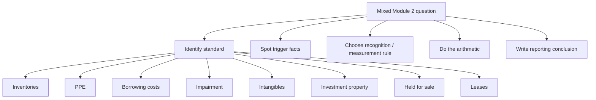

# Module 2 Practice Questions Pattern Guide

## Exam Relevance

- This guide is for mixed Module 2 practice sets where the examiner switches standards quickly.
- The main job is not memorising every line. It is recognising the question family in seconds.
- The module commonly mixes:
  - inventories,
  - PPE,
  - borrowing costs,
  - impairment,
  - intangible assets,
  - investment property,
  - held-for-sale assets,
  - leases.
- The examiner usually twists the facts by changing one trigger word, one date, or one classification boundary.

## Core Intuition

Most Module 2 questions are solved by the same rhythm:

**identify the standard, isolate the trigger, build the working, then state the reporting consequence.**

## Concept Map

## Key Concepts

### 1. The first question is always "what chapter am I in?"

Mixed practice is usually lost at classification stage, not at calculation stage.

Use a quick filter:

- stock for resale or production input -> inventories,
- tangible item with long life -> PPE,
- borrowing used for qualifying asset -> Ind AS 23,
- recoverable amount problem -> impairment,
- non-monetary separable rights -> intangible,
- property held for rentals or capital appreciation -> investment property,
- sale-driven recovery and separate presentation -> Ind AS 105,
- right to use another asset for a period -> lease.

### 2. The second question is "what trigger changes the accounting?"

Most practice questions pivot on a trigger word.

| Trigger phrase | Likely standard | What it changes |
|---|---|---|
| "available for sale" | Ind AS 105 | Classification and measurement |
| "reasonably certain" | Ind AS 116 | Lease term and liability |
| "substantially all" | Ind AS 116 | Finance lease test |
| "normal capacity" | Ind AS 2 | Overhead absorption |
| "available for use" | Ind AS 16 / 116 | Depreciation start |
| "capable of operating" | Ind AS 38 | Stop capitalisation |
| "recoverable amount" | Ind AS 36 | Impairment test |
| "committed plan" | Ind AS 105 | Held-for-sale assessment |

### 3. Work in layers, not in one jump

For numerical problems, split the working into these layers:

1. recognition test,
2. initial measurement,
3. subsequent measurement,
4. presentation effect,
5. final statement.

That keeps the answer readable and makes cross-standard questions much easier to mark.

### 4. The standard-specific working style

#### Inventories

- build cost from purchase, conversion, and other attributable items,
- exclude selling, abnormal waste, and unrelated finance costs,
- compare cost with NRV item by item unless grouping is clearly justified.

#### PPE

- decide whether expenditure is capital or revenue,
- add directly attributable items only,
- use component accounting when a part is significant,
- depreciate from the date available for use.

#### Borrowing costs

- identify a qualifying asset,
- find the commencement date for capitalisation,
- suspend during extended interruptions,
- stop when substantially all activities are complete,
- deduct investment income from specific borrowings.

#### Impairment

- test for indication,
- estimate recoverable amount,
- use higher of value in use and fair value less costs of disposal,
- allocate impairment to CGU / goodwill carefully.

#### Intangibles

- check identifiability and control,
- decide finite or indefinite useful life,
- capitalize only when recognition conditions and development-stage tests are met,
- stop when available for use.

#### Investment property

- ask whether the asset is held for rentals, capital appreciation, or both,
- separate owner-occupied portions,
- transfer only on change in use with evidence of the change.

#### Held for sale

- classify only when the sale route becomes dominant,
- stop depreciation,
- measure at lower of carrying amount and fair value less costs to sell.

#### Leases

- ask if the contract contains a lease,
- separate lease and non-lease components,
- calculate lease liability first,
- build the ROU asset second,
- classify lessor leases separately.

## Professor's Problem-Solving Framework

1. Read the last sentence first. It usually tells you what the examiner wants.
2. Mark every trigger word and date.
3. Decide the standard before touching numbers.
4. Split the working into short blocks with labels.
5. State the conclusion in the language of the standard, not in casual English.

## Worked Examples

### Question 1: Mixed inventory and borrowing cost

**Given:**
Raw materials were purchased with refundable taxes, and the purchase was funded by a loan.

**Working:**
- refundable taxes are not inventory cost,
- loan raising fees are not inventory cost,
- borrowing costs are capitalised only if a qualifying asset and the Ind AS 23 conditions exist.

**Final answer:**
Start with the clean inventory cost, then test whether borrowing costs belong under Ind AS 23 separately.

### Question 2: PPE replacement and depreciation

**Given:**
A machine is repaired, a major part is replaced, and the asset is available for use from a later date.

**Working:**
- day-to-day repairs are expense,
- replacement part may be capitalised,
- old component must be derecognised if identifiable,
- depreciation begins when the asset is available for use.

**Final answer:**
Split the answer into expense, capitalisation, derecognition, and depreciation blocks.

### Question 3: Lease bundle

**Given:**
An office floor is leased together with cleaning and security services.

**Working:**
- floor space can be an identified asset,
- services are non-lease components,
- the lease liability should not swallow the service cost unless the standard allows the combined election.

**Final answer:**
Separate the accounting for the lease component and the service component.

## Common Mistakes

- Starting with formulas before identifying the standard.
- Treating every long-term contract as a lease.
- Capitalising every cost that appears in the question.
- Forgetting to separate current assets from held-for-sale non-current assets.
- Mixing fair value with NRV or value in use.
- Writing "because it is probable" when the standard actually requires "highly probable" or "reasonably certain."

## Summary Tables

| Pattern | Best approach | Typical trap |
|---|---|---|
| Inventory valuation | Build cost then compare with NRV | Including selling costs in cost |
| PPE capitalisation | Capitalise only directly attributable items | Repair expenses capitalised |
| Borrowing costs | Map dates and qualifying asset test | Capitalising too early or too long |
| Impairment | Recoverable amount comparison | Using one measure only |
| Lease | Identify contract components first | Treating services as lease |
| Held for sale | Check immediate sale + high probability | Jumping to classification too early |

## Last-Day Revision

- Every Module 2 answer starts with classification.
- Trigger words are worth more than long narration.
- Mixed questions are usually two standards in one body.
- Separate the standard logic before doing arithmetic.
- Use clean headings in the answer sheet.
- Final conclusion must name the standard and the reporting effect.

## Concrete Mixed Patterns

### Pattern 1: PPE plus borrowing cost

Problem cue: the entity constructs a plant over 18 months and has both specific and general borrowings.

Solving move:

1. Use Ind AS 16 to decide which plant costs are directly attributable.
2. Use Ind AS 23 to decide when capitalization of borrowing costs starts, pauses, and stops.
3. Add eligible borrowing cost to PPE only during the capitalization period.
4. Start depreciation only when the plant is available for use, not merely when cash is spent.

Exam trap: do not capitalize borrowing cost after the asset is ready for intended use.

### Pattern 2: Lease plus held-for-sale

Problem cue: a right-of-use asset or leased asset is expected to be sold/disposed of.

Solving move:

1. Use Ind AS 116 to identify the lease and measure the ROU asset/liability.
2. If the disposal plan is committed and sale is highly probable, check Ind AS 105 classification.
3. Once held-for-sale criteria are met, apply Ind AS 105 measurement and presentation logic to the relevant asset/disposal group.

Exam trap: held-for-sale classification is not based on management intention alone.

## Doubts / Version-Sensitive Items

- Confirm whether the practice question is asking for recognition, measurement, or disclosure.
- Check if the question uses terms like "available for use", "available for sale", or "available for immediate sale" because they are not interchangeable.
- Recheck whether the question is using ICAI wording from the source PDF or a shortened classroom version.
- Verify whether the examiner wants the answer under Ind AS or comparative AS language.
