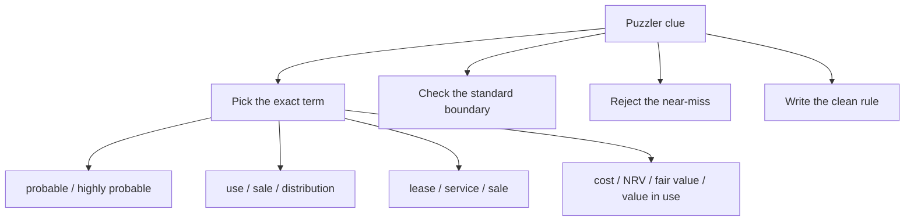

# Module 2 Ind AS Puzzlers Trap Guide

## Exam Relevance

- The puzzlers are designed to catch memory slips, not long calculations.
- They are especially good at testing:
  - definition-level wording,
  - whether you know the exact trigger phrase,
  - whether you can separate similar-looking concepts.
- Treat them like a trap map for Module 2. Every clue points at a line you could easily misread in an exam.

## Core Intuition

The fastest way to avoid a trap is to ask:

**which word here is doing the accounting work?**

## Concept Map

## Key Concepts

### 1. Words that look similar but are not the same

| Trap pair | Correct distinction |
|---|---|
| probable vs highly probable | Held-for-sale needs a stronger sale commitment |
| fair value vs NRV | NRV is entity-specific selling value less completion and selling costs |
| value in use vs fair value less costs of disposal | Impairment uses the higher of the two |
| lease vs service contract | Lease requires an identified asset and control |
| current asset vs held for sale | Held-for-sale classification is for non-current assets or disposal groups |
| available for use vs available for sale | PPE / leases use one, Ind AS 105 uses the other |

### 2. Held-for-sale trap points

- A distant intention to sell is not enough.
- An asset can be held for sale only when it is available for immediate sale in its present condition.
- A disposal group can include liabilities directly associated with the assets.
- Depreciation stops once held-for-sale classification is achieved.
- If the sale is beyond one year, the costs to sell are discounted.

### 3. Lease trap points

- The existence of a lease is about control, not just access.
- The supplier must lack a substantive substitution right.
- Short-term treatment is not the same as low-value treatment.
- A head lease cannot use low-value exemption if the asset is subleased or expected to be subleased.
- Lease and non-lease components are not automatically bundled together.
- The lessee and lessor do not use the same accounting model.

### 4. Inventory and PPE trap points

- Refundable purchase taxes do not form inventory cost.
- Selling and distribution costs stay out of inventory cost.
- Abnormal wastage is not inventory cost.
- Repairs and maintenance are usually expense, not PPE.
- A significant part of PPE should be accounted for separately.
- Depreciation starts when the asset is available for use, not when the first sale happens.

### 5. Borrowing cost and impairment trap points

- Capitalisation starts only when the qualifying asset conditions are met.
- Capitalisation stops when substantially all the activities are complete.
- Temporary investment income reduces capitalisable borrowing costs for specific borrowings.
- Impairment is about recoverable amount, not simply fair value.
- Goodwill and CGU logic must be kept separate from individual asset logic.

### 6. Intangible and investment property trap points

- Control matters for intangible assets.
- Indefinite useful life means no amortisation, but impairment still matters.
- Investment property is held for rental income or capital appreciation, not for owner use or sale in the ordinary course.
- A change in use needs evidence, not just a board mood shift.

## Professor's Problem-Solving Framework

1. Underline the clue word that feels too easy.
2. Ask what the standard requires exactly, not approximately.
3. Reject the answer that is "almost right."
4. Convert the trap into a one-line rule.
5. Keep the final response short and exact.

## Worked Examples

### Example 1: "Probable" sale

**Clue:**
An entity expects to sell a machine later and has started thinking about buyers.

**Trap:**
That sounds close to held for sale, but it is not enough.

**Correct rule:**
The asset must be available for immediate sale and the sale must be highly probable.

### Example 2: Low-value lease

**Clue:**
A company leases a used small device and wants to apply the low-value exemption.

**Trap:**
The relevant test is the value of the asset when new, not its current worn-down value.

**Correct rule:**
Judge low value at new-asset level.

### Example 3: Inventory vs PPE

**Clue:**
Items are held for resale and also used in a production process.

**Trap:**
The same item can move between standards as its role changes.

**Correct rule:**
Use the actual function at the reporting date and for the relevant use.

## Common Mistakes

- Memorising half-definitions.
- Ignoring whether the question is about recognition, measurement, or presentation.
- Missing one negative word in the clue.
- Writing a rule that is true in everyday speech but not in Ind AS.
- Mixing a chapter's measurement rule with another chapter's disclosure rule.

## Summary Tables

| Puzzler clue | Likely answer family | Exam caution |
|---|---|---|
| "available for immediate sale" | Ind AS 105 | Check present condition |
| "highly probable" | Ind AS 105 / lease options | Stronger than probable |
| "identified asset" | Ind AS 116 | Check substitution rights |
| "recoverable amount" | Ind AS 36 | Compare two measures |
| "indefinite useful life" | Ind AS 38 | No amortisation, yes impairment |
| "rental income" | Ind AS 40 | Owner use changes the conclusion |
| "normal capacity" | Ind AS 2 | Overhead absorption test |

## Last-Day Revision

- Puzzlers punish sloppy wording.
- Always ask whether the clue is asking for a definition or an application rule.
- "Highly probable" and "reasonably certain" are stronger than ordinary probability language.
- Lease questions usually hide a control test.
- Held-for-sale questions usually hide a timing and commitment test.
- Inventory and PPE clues often test exclusions, not inclusions.

## Doubts / Version-Sensitive Items

- Confirm the exact crossword clue wording if the answer length is important.
- Check whether the clue is using "value in use" or the longer phrase "present value of future cash flows."
- Recheck any clue that mixes lease and sale-and-leaseback language, because the same word can point to different steps.
- For held-for-sale clues, verify whether the source PDF is testing "sale" or "distribution to owners," since those behave similarly but are not identical.
