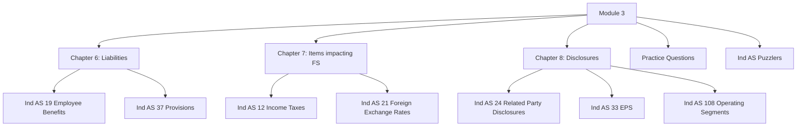

# Module 3: Initial Pages Overview

## Exam Relevance

This front matter introduces the liabilities, taxes, foreign exchange and disclosure block of the syllabus. It is the bridge between balance-sheet liabilities and items that affect profit, other comprehensive income and note disclosures.

This module is usually tested through classification, computation and disclosure-style questions.

## Module Map

## How To Use This Module

- Read the liabilities chapter first to fix recognition and estimate logic.
- Use the tax and foreign exchange chapter as a bridge from measurement to profit impact.
- Finish with disclosure standards because they often test definition, scope and reporting thresholds.
- Keep EPS and segments as high-discipline note-preparation topics.
- Use the practice questions to separate computation from disclosure wording.

## Exam Strategy

1. Decide whether the item creates a present obligation, a tax effect, an exchange difference or a disclosure duty.
2. If the question is mixed, split the accounting effect from the disclosure effect.
3. For provisions and employee benefits, pay attention to estimation, timing and discounting.
4. For EPS, identify the numerator, denominator and any adjustment first.
5. For related party and segment questions, check scope and classification before writing disclosures.

## Front-Matter Watchlist

- Ind AS 19 and Ind AS 37 wording can depend on the exact fact pattern and measurement assumption used in the source PDF.
- Income tax and foreign exchange questions often depend on the precise reporting-date facts.
- Related party, EPS and segment disclosures are sensitive to exact definitions and thresholds.
- If the opening pages flag any old-to-new wording changes, verify them against the current study material before final revision.

