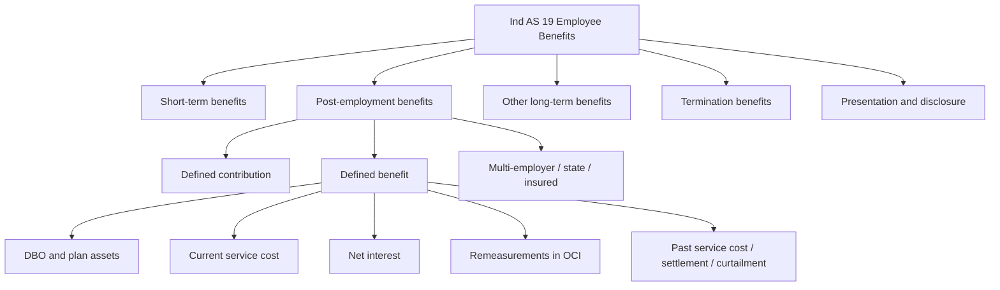
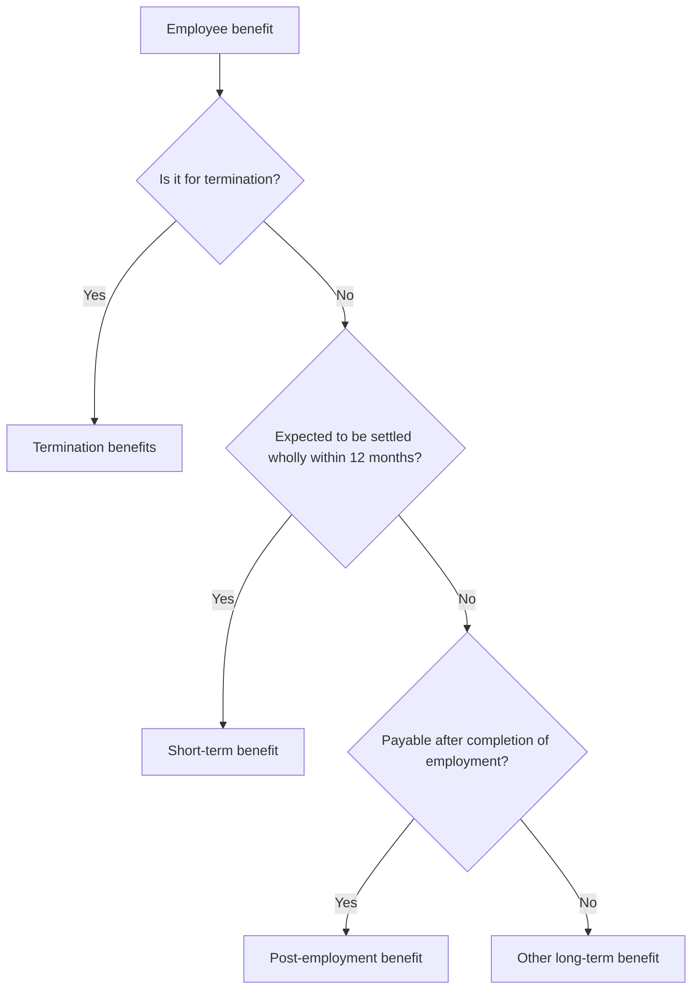
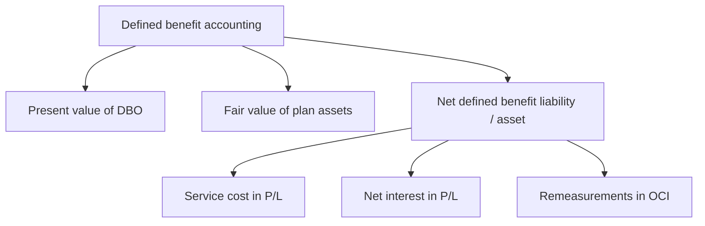

# Chapter 6, Unit 1: Ind AS 19 - Employee Benefits

## Exam Relevance

- This unit is a regular practical-theory hybrid.
- The examiner usually tests classification first, then measurement and presentation.
- The most common question forms are:
  - short-term benefits and bonus accruals,
  - post-employment classification,
  - defined contribution vs defined benefit,
  - actuarial gains and losses,
  - past service cost, curtailment and settlement,
  - termination benefits,
  - disclosure and OCI treatment.
- Traps are usually about:
  - treating a defined benefit plan like a defined contribution plan,
  - discounting short-term benefits when it is not needed,
  - putting actuarial gains and losses in profit or loss,
  - forgetting the asset ceiling,
  - confusing current service cost with past service cost,
  - missing that remeasurements stay in OCI and are not recycled.

## Core Intuition

Employee benefits are recognized when service is received, not when cash is paid.

The exam question is always asking one of two things:

1. What type of employee benefit is this?
2. Where does the cost go: profit or loss, OCI, asset cost, or balance sheet liability?

## Concept Map

## Key Concepts

### 1. Scope and classification

Ind AS 19 covers all forms of consideration given by an entity in exchange for employee service or for termination of employment.

Employees can be full-time, part-time, permanent, casual, temporary, directors, or other management personnel. Benefits may be paid directly to the employee or to dependants, beneficiaries, or even an insurer.

The four main buckets are:

- short-term employee benefits,
- post-employment benefits,
- other long-term employee benefits,
- termination benefits.

### 2. Short-term employee benefits

Short-term benefits are expected to be settled wholly before 12 months after the end of the reporting period in which the related service is rendered.

Typical items:

- wages and salaries,
- social security contributions,
- paid annual leave and paid sick leave,
- profit-sharing and bonuses,
- non-monetary benefits such as medical care, housing, cars and subsidised goods or services.

Measurement is straightforward:

- use the undiscounted amount,
- no actuarial valuation,
- recognize as a liability after deducting amounts already paid,
- recognize excess prepayment as an asset only if it will lead to future benefit or cash refund,
- expense it unless another Ind AS requires capitalization into an asset.

Accumulating paid absences are recognized when service increases future entitlement.
Non-accumulating absences are recognized when the absence occurs.

Profit-sharing and bonus plans are expenses, not distributions of profit, because they arise from employee service.

### 3. Post-employment benefits

Post-employment benefits are payable after employment ends, other than termination benefits and short-term benefits.

The key split is:

| Plan type | Core idea | Measurement risk |
|---|---|---|
| Defined contribution | Fixed contributions to a fund; no further obligation if the fund is short | Very low |
| Defined benefit | Entity promises a defined benefit; actuarial risk stays with the employer | High |

#### Defined contribution plans

- Recognize the contribution payable as a liability when employee service is rendered.
- Expense it in profit or loss unless another Ind AS permits capitalization.
- No actuarial assumptions.
- No actuarial gains or losses.
- Usually measured on an undiscounted basis, unless the due date is beyond 12 months after the reporting period.

#### Defined benefit plans

The employer promises benefits that depend on a formula, usually linked to salary and service.

The accounting logic is:

1. measure the present value of the defined benefit obligation,
2. deduct fair value of plan assets,
3. recognize the net defined benefit liability or asset,
4. split the cost into service cost, net interest, and remeasurements.

The standard uses the projected unit credit method.
Benefits are attributed to periods of service under the plan formula.
If later years create materially higher benefits, straight-line attribution may be needed from the first service date to the point where further service no longer creates material additional benefit.

### 4. Components of defined benefit cost

The three components are:

| Component | Where it goes | Exam reminder |
|---|---|---|
| Current service cost | Profit or loss | Cost of service in the current period |
| Net interest on net defined benefit liability / asset | Profit or loss | Uses discount rate |
| Remeasurements | OCI | No recycling to profit or loss |

Remeasurements include:

- actuarial gains and losses,
- return on plan assets excluding amounts already in net interest,
- any change in the effect of the asset ceiling excluding amounts already in net interest.

Actuarial gains and losses arise from changes in actuarial assumptions and experience adjustments, such as:

- salary growth,
- mortality,
- medical cost changes,
- discount rate changes.

They do not include changes caused by:

- plan amendment,
- curtailment,
- settlement,
- changes in benefits payable under the plan.

### 5. Net interest and asset ceiling

Net interest is calculated by applying the discount rate at the start of the year to the net defined benefit liability or asset.

The plan asset side is not treated like an investment asset under Ind AS 109.
The return on plan assets used in net interest is based on the discount rate, while the actual return is part of remeasurement.

If the plan is in surplus, the entity recognizes a net defined benefit asset only up to the asset ceiling.
The asset ceiling is the present value of economic benefits available to the entity, usually through reduced future contributions or a cash refund.

### 6. Past service cost, curtailment and settlement

Past service cost is the change in the present value of the defined benefit obligation from a plan amendment or curtailment.

It is recognized in profit or loss at the earlier of:

- when the plan amendment or curtailment occurs, or
- when the entity recognizes related restructuring costs or termination benefits.

Settlement occurs when the entity enters into a transaction that eliminates all further legal or constructive obligation for part or all of the benefits.

Curtailment usually comes from a material reduction in employees covered or benefits provided.

If amendment, curtailment and settlement happen together, do not overcomplicate the split in the exam answer; identify the net effect and then present the line items cleanly.

### 7. Termination benefits

Termination benefits are given in exchange for ending employment, either because:

- the entity decides to terminate before normal retirement date, or
- the employee accepts an offer in exchange for termination.

They are not service-based benefits.
That means service attribution logic used for defined benefit plans does not apply.

Recognition point depends on when the entity can no longer withdraw the offer:

- for employee-accepted offers: when accepted or when withdrawal restriction takes effect, whichever is earlier,
- for entity-initiated terminations: when a detailed plan has been communicated and withdrawal is no longer possible.

If the benefit is an enhancement to post-employment benefits, treat it as post-employment.
Otherwise classify it by expected settlement timing.

### 8. Multi-employer, state and insured arrangements

If a multi-employer plan is a defined benefit plan and sufficient information exists, account for the entity’s share of DBO, plan assets and related cost like any other defined benefit plan.

If sufficient information is not available, account for it as if it were a defined contribution plan, and disclose the fact and why defined benefit accounting could not be used.

If a policy is in the name of specified participants and the entity has no legal or constructive obligation to cover losses, fixed premiums are treated as defined contribution style settlement.

### 9. Reimbursements

If some or all of the expenditure required to settle a defined benefit obligation or a provision will be reimbursed by another party:

- recognize the reimbursement as a separate asset only when it is virtually certain,
- do not let the reimbursement exceed the related liability,
- in profit or loss, present the expense net of the reimbursement if appropriate,
- disclose the reimbursement with the related amount.

### 10. Presentation and disclosure

The general disclosure aim is to let users see the nature of the plans, the risks, the amounts in the financial statements, and the effect on future cash flows.

For defined benefit plans, disclose:

- characteristics and risks,
- reconciliation of opening and closing DBO and plan assets,
- components of defined benefit cost,
- actuarial assumptions,
- sensitivity and maturity information where relevant,
- effect on future cash flows.

## Professor's Problem-Solving Framework

1. Classify the employee benefit.
2. Decide whether the benefit is short-term, post-employment, other long-term, or termination.
3. If it is post-employment, decide whether the plan is defined contribution or defined benefit.
4. For defined contribution, recognize the payable contribution only.
5. For defined benefit, compute DBO, plan assets, net liability or asset, and the asset ceiling.
6. Split the cost into service cost, net interest, and remeasurements.
7. Send remeasurements to OCI and keep them there.
8. Check whether any amount should be capitalized into another asset.
9. State the conclusion using exam language.

## Worked Examples

### Example 1: Short-term bonus

Problem:
An entity owes employees a bonus of 12,00,000 based on current-year profit. The amount will be paid 6 months after year-end.

Working:
- It is a short-term employee benefit because it will be settled within 12 months after the reporting period.
- Recognize the undiscounted amount as a liability and expense.

Answer:
Recognize `12,00,000 as accrued expense in profit or loss.

### Example 2: Defined contribution plan

Problem:
An entity must pay 10% of salary to a provident fund. Salary for the year is 80,00,000 and 6,00,000 was already paid.

Working:
- Contribution payable = 10% of 80,00,000 = 8,00,000.
- Liability at year-end = 8,00,000 - 6,00,000 = 2,00,000.

Answer:
Recognize a liability of `2,00,000 and expense of `8,00,000 in profit or loss.

### Example 3: Defined benefit split

Problem:
The opening net defined benefit liability is 50,00,000. Current service cost is 4,00,000. Net interest is 3,50,000. Actuarial loss is 1,20,000.

Working:
- P/L = current service cost + net interest = 7,50,000.
- OCI = actuarial loss = 1,20,000.
- Closing liability increases by 8,70,000 before contributions and benefit payments.

Answer:
Post current service cost and net interest in profit or loss; recognize actuarial loss in OCI.

## Common Mistakes

- Treating a promised pension as a defined contribution plan just because the employer pays into a fund.
- Discounting short-term leave and bonus payables when the settlement is within 12 months.
- Putting actuarial gains and losses into profit or loss.
- Forgetting that remeasurements are not recycled.
- Mixing past service cost with current service cost.
- Ignoring the asset ceiling when a surplus exists.
- Forgetting to check whether another Ind AS requires capitalization into PPE or inventory.

## Summary Tables

| Topic | What to remember | Exam trigger |
|---|---|---|
| Short-term benefits | Undiscounted; liability when service is rendered | Salary, bonus, leave |
| Defined contribution | Contribution payable only; no actuarial gains/losses | Fixed fund contribution |
| Defined benefit | DBO less plan assets, subject to asset ceiling | Pension / gratuity formula |
| Remeasurements | OCI, never recycled | Actuarial gain/loss, asset ceiling change |
| Past service cost | P/L at amendment / curtailment / settlement | Plan change |
| Termination benefits | Not service-based | VRS / retrenchment |
| Reimbursement | Separate asset only if virtually certain | Insurance or third-party recovery |

## Last-Day Revision

- Short-term benefits: undiscounted liability, no actuarial valuation.
- Defined contribution: recognize the amount payable for service already rendered.
- Defined benefit: present value of obligation minus plan assets, subject to asset ceiling.
- Defined benefit cost has three parts: service cost, net interest, remeasurements.
- Actuarial gains and losses go to OCI and stay there.
- Net interest uses the discount rate at the start of the period.
- Past service cost is triggered by plan amendment or curtailment.
- Termination benefits are recognized when the entity can no longer withdraw the offer.
- Multi-employer plans need special disclosure when defined benefit information is unavailable.
- Another Ind AS may pull employee-benefit cost into an asset instead of immediate expense.

## Doubts / Version-Sensitive Items

- Check the exact exam wording for "probable" in Ind AS 19 versus Ind AS 37; the standards use the term differently in practice and the question may focus on context.
- Confirm whether the plan in the question is truly defined contribution, especially if there is any employer guarantee or deficit support.
- Recheck the source PDF if the question uses a multi-employer or insured arrangement, because the treatment turns on small fact changes.
- If the examiner gives an unusual reimbursement or asset-ceiling fact pattern, verify whether the reimbursement is virtually certain and whether the asset ceiling binds.
