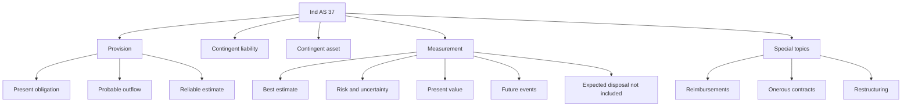
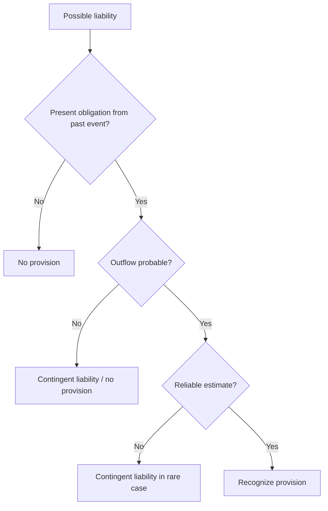
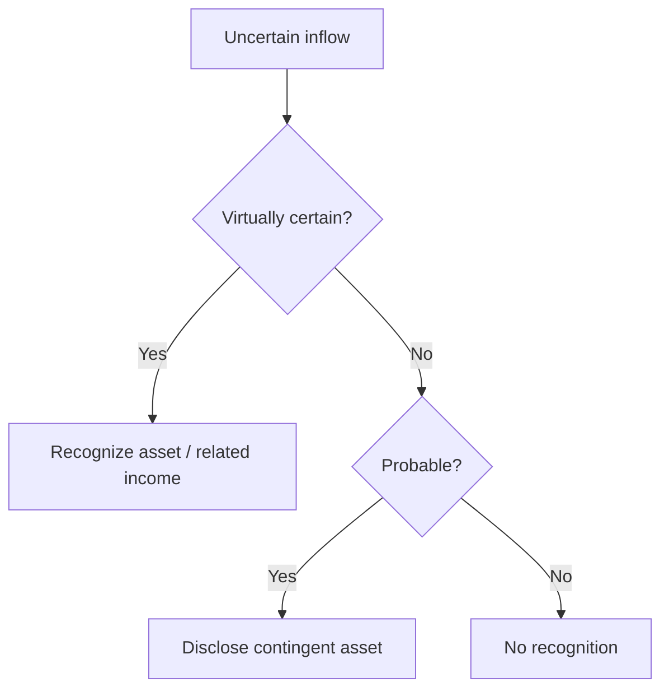
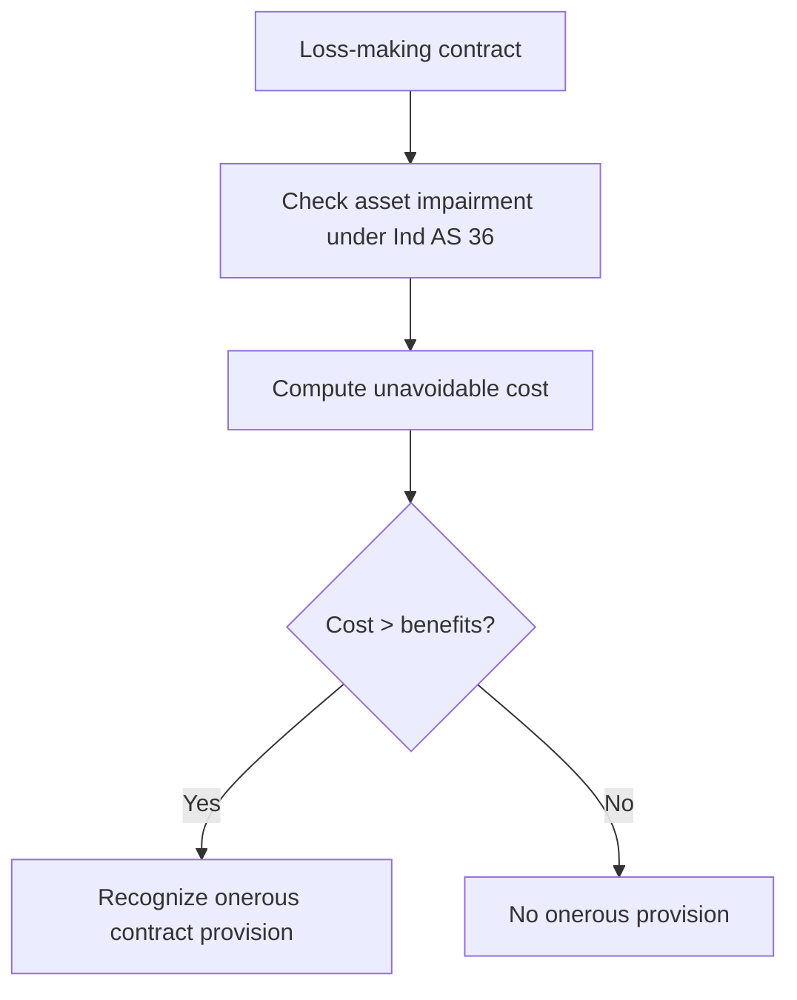

# Chapter 6, Unit 2: Ind AS 37 - Provisions, Contingent Liabilities and Contingent Assets

## Exam Relevance

- This is one of the clearest logic chapters in Module 3.
- The examiner usually tests recognition first, measurement second, and disclosure third.
- High-frequency questions are:
  - warranty and legal claims,
  - penalties and breach of contract,
  - restructuring,
  - environmental clean-up,
  - reimbursement,
  - onerous contracts,
  - contingent liability versus contingent asset.
- Traps are usually about:
  - recognizing a provision too early,
  - forgetting the present obligation test,
  - using "possible" instead of "probable" in the wrong place,
  - discounting when the time value of money is material but forgetting the pre-tax rate,
  - netting expected gains from asset disposal into the provision,
  - creating a provision for future operating losses,
  - ignoring Ind AS 36 before an onerous contract provision.

## Core Intuition

Ind AS 37 is a three-question filter:

1. Is there a present obligation from a past event?
2. Is an outflow probable?
3. Can it be estimated reliably?

If the answer is yes to all three, recognize a provision.
If not, classify it as contingent or ignore it depending on the facts.

## Concept Map



## Key Concepts

### 1. Scope and the recognition gate

Ind AS 37 deals with provisions, contingent liabilities and contingent assets.

It applies when there is uncertainty about timing or amount of a liability or about whether an asset will arise from an uncertain event.

The recognition filter is:

| Test | Question | Result if yes |
|---|---|---|
| Present obligation | Is there a legal or constructive obligation from a past event? | Move to next test |
| Probable outflow | Is outflow more likely than not? | Move to next test |
| Reliable estimate | Can the amount be estimated reliably? | Recognize a provision |



### 2. Present obligation and obligating event

A present obligation is a legal or constructive obligation that exists because of a past event.

Sources of legal obligation:

- contract,
- legislation,
- other operation of law.

Sources of constructive obligation:

- established pattern of past practice,
- published policies,
- sufficiently specific current statement that creates a valid expectation in other parties.

The key exam point is that a mere future intention does not create a provision.

If the event has not yet happened, there is normally no present obligation.

### 3. Provision recognition

A provision is recognized only when all three conditions are met:

- present obligation,
- probable outflow,
- reliable estimate.

If the obligation is only possible, or the outflow is not probable, or the amount cannot be estimated reliably, do not recognize a provision.

In the extremely rare case where there is a liability that cannot be measured reliably, disclose it as a contingent liability.

### 4. Contingent liability

A contingent liability is either:

- a possible obligation from past events whose existence depends on uncertain future events not wholly within the entity’s control, or
- a present obligation that does not meet recognition criteria.

General treatment:

- no recognition as a liability,
- disclose unless the chance of outflow is remote,
- if the possibility of outflow becomes probable later, recognize a provision in that period.

### 5. Contingent asset

A contingent asset arises from an unplanned or unexpected event that may create an inflow of economic benefits.

General treatment:

- do not recognize a contingent asset,
- disclose when inflow is probable,
- recognize only when inflow becomes virtually certain.



### 6. Measurement: best estimate

The provision is measured at the best estimate of expenditure required to settle the present obligation at the reporting date.

Best estimate means the amount the entity would rationally pay to settle or transfer the obligation.

Two common techniques:

| Situation | Measurement method |
|---|---|
| Large population of items, like warranties or refunds | Expected value |
| Single obligation, like one legal claim | Most likely outcome, adjusted for other possibilities |

If the most likely outcome and expected value are close, either may support the estimate, but the exam answer should explain why the chosen amount is reasonable.

### 7. Risks, uncertainties and future events

Risk and uncertainty must be reflected in the estimate.

Expected future events may be included only when there is sufficient objective evidence that they will occur.

Examples:

- cost reductions from improved existing technology may be considered if supported by evidence,
- a completely new technology should not be assumed without objective support,
- possible future legislation may be reflected only if sufficiently objective and likely.

The discount rate must be pre-tax and must not reflect risks already built into the cash flow estimate.

### 8. Present value

If the time value of money is material, discount the provision to present value.

The logic is:

1. estimate each possible cash flow,
2. discount each to present value,
3. weight by probability where relevant,
4. use a pre-tax discount rate.

```text
Provision = present value of expected outflows
```

### 9. Expected disposal of assets

Do not reduce a provision by expected gains on the disposal of assets.

Those gains are recognized only when the relevant standard for the asset allows it.

This is a common exam trap in dismantling and clean-up questions.

### 10. Reimbursements

If some or all of the expenditure to settle a provision is expected to be reimbursed by another party:

- recognize the reimbursement as a separate asset only when it is virtually certain,
- the recognized reimbursement cannot exceed the liability,
- the reimbursement may be presented net of the expense in profit or loss,
- disclose the reimbursement together with the related provision.

If reimbursement is expected but not virtually certain, do not recognize a separate asset yet.

### 11. Onerous contracts

An onerous contract is a contract in which the unavoidable costs of meeting the obligations exceed the economic benefits expected to be received.

The unavoidable cost is the lower of:

- the cost of fulfilling the contract, and
- compensation or penalties for failure to fulfil it.

Before recognizing a separate onerous contract provision, first recognize any impairment loss on assets used to fulfil the contract under Ind AS 36.



### 12. Restructuring

Restructuring is a planned and controlled program that materially changes a business or manner of conducting business.

Examples:

- sale or termination of a line of business,
- closure of business locations,
- relocation of business activities,
- changes in management structure,
- fundamental reorganisation.

A restructuring provision is recognized only when:

- a detailed formal plan exists, and
- the entity has created a valid expectation by starting implementation or announcing the main features to those affected.

Future operating losses are not included in a restructuring provision.

Expected gains on disposal are also excluded.

Only direct expenditure caused by the restructuring and not associated with ongoing activities belongs in the provision.

## Professor's Problem-Solving Framework

1. Identify the event.
2. Ask whether there is a present obligation from a past event.
3. Decide whether the outflow is probable.
4. Check whether the amount can be estimated reliably.
5. If all three are yes, measure the provision at best estimate.
6. Discount if the time value of money is material.
7. Adjust for risk, uncertainty, future events and reimbursements.
8. Check whether the item is actually a contingent liability or contingent asset.
9. For contracts, test whether the contract is onerous.
10. State the final answer with recognition and disclosure language.

## Worked Examples

### Example 1: Warranty claim

Problem:
A company sells goods with a warranty. Based on past experience, 75% of units need no repair, 20% need repairs costing `1,00,000, and 5% need major repairs costing `4,00,000.

Working:
- This is a large population of similar items.
- Use expected value.
- Expected cost = 0 + 20% x 1,00,000 + 5% x 4,00,000 = 40,000.

Answer:
Recognize a provision of `40,000, assuming a present obligation and reliable estimate exist.

### Example 2: Legal claim

Problem:
There is one legal claim. The most likely outcome is payment of `10,00,000, but there is a meaningful chance of `18,00,000 if the case is lost on appeal.

Working:
- This is a single obligation, so the most likely outcome is the starting point.
- Because the higher outcome is meaningful, the estimate may need adjustment above the simple most-likely amount.

Answer:
Measure the provision at the best estimate, supported by the litigation facts, not automatically at the most likely outcome.

### Example 3: Onerous contract

Problem:
An entity has a supply contract requiring unavoidable cost of `9,00,000. Economic benefits expected from the contract are only `7,50,000.

Working:
- Onerous because unavoidable cost exceeds benefits.
- Loss = `1,50,000.

Answer:
Recognize an onerous contract provision of `1,50,000, after checking whether any related asset impairment is needed.

## Common Mistakes

- Recognizing a provision for a future operating loss with no past obligating event.
- Using management intention alone as if it were a constructive obligation.
- Recording expected disposal gains inside the provision.
- Discounting with a post-tax or risk-mismatched rate.
- Recognizing reimbursement as an asset before it is virtually certain.
- Mixing up contingent liability and provision disclosure thresholds.
- Forgetting to test for asset impairment before creating an onerous contract provision.

## Summary Tables

| Item | Recognize? | Measure / disclose | Exam reminder |
|---|---|---|---|
| Provision | Yes, if all three tests pass | Best estimate, discounted if material | Present obligation + probable + reliable estimate |
| Contingent liability | No recognition | Disclose unless remote | Possible obligation or unreliable measurement |
| Contingent asset | No recognition | Disclose if probable; recognize only if virtually certain | Never book income too early |
| Reimbursement | Separate asset only if virtually certain | Cannot exceed liability | Net presentation may be allowed |
| Onerous contract | Yes, if unavoidable cost exceeds benefits | Lower of fulfilment cost and penalty/cancellation cost | Check Ind AS 36 first |
| Restructuring | Yes only when valid expectation exists | Direct costs only | No future operating losses |

## Last-Day Revision

- Provision needs present obligation, probable outflow, reliable estimate.
- Obligation can be legal or constructive.
- Constructive obligation comes from past practice, published policy, or specific statement.
- Contingent liability is not recognized; it is disclosed unless remote.
- Contingent asset is not recognized; it is disclosed if probable and recognized only when virtually certain.
- Best estimate may use expected value or most likely outcome.
- If time value of money matters, use present value and a pre-tax discount rate.
- Expected future technology or legislation can be considered only with objective evidence.
- Expected gains on disposal are excluded from provision measurement.
- Reimbursements need virtual certainty before separate asset recognition.
- Onerous contracts require comparing unavoidable cost with expected economic benefits.
- Restructuring provisions cannot include future operating losses.

## Doubts / Version-Sensitive Items

- Check whether the question is testing a legal obligation, constructive obligation, or only management intention.
- Reconfirm whether the examiner wants expected value or the most likely outcome when the fact pattern is a single claim with several possible outcomes.
- If a reimbursement is mentioned, verify whether it is virtually certain or merely expected.
- If the facts involve a clean-up or dismantling obligation, verify whether the cash flow estimate already includes risk, because the discount rate must not double-count it.
- In restructuring questions, separate direct restructuring costs from ongoing operating costs with care.
