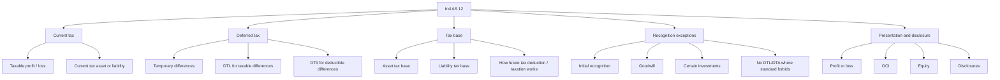
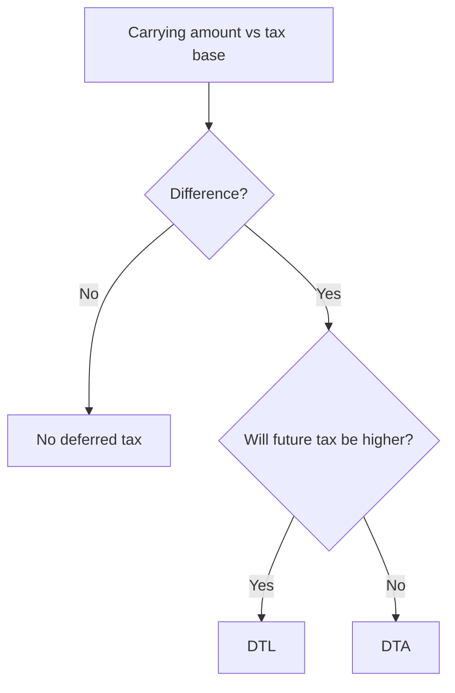

# Chapter 7, Unit 1: Ind AS 12 - Income Taxes

## Exam Relevance

- The examiner usually tests the full tax chain: accounting profit -> taxable profit -> current tax -> deferred tax -> presentation.
- Very common twists are temporary differences, tax base, unused losses, recognition of DTA/DTL, and items routed through OCI or equity.
- Expect mixed questions with PPE, revaluation, revenue received in advance, provisions, share-based payment, and business combinations.
- A favourite trap is to confuse current tax with deferred tax or to treat every timing difference as a temporary difference.

## Core Intuition

Ind AS 12 asks one question:
what tax effect belongs to this period, and what tax effect is only waiting to reverse later?

If the balance sheet carrying amount and tax base differ, the gap usually creates deferred tax.

## Concept Map

## Key Concepts

### 1. The three tax layers

Ind AS 12 works with three different ideas:

| Layer | What it means | Exam cue |
|---|---|---|
| Accounting profit | Profit before tax under Ind AS | Starts from financial statements |
| Taxable profit | Profit under tax law | Starts from the Income-tax Act |
| Tax expense | Total tax in the books | Current tax + deferred tax |

Current tax is the tax payable or recoverable for the period.
Deferred tax captures the future tax effect of the current carrying amount of assets and liabilities.

### 2. Current tax

Current tax is based on the taxable profit or tax loss of the current period.

Typical steps:

1. start from accounting profit;
2. add back non-deductible expenses;
3. deduct exempt income and allowable deductions;
4. apply the enacted or substantively enacted tax rate;
5. recognise any current tax liability or asset.

Current tax can arise even when accounting profit is low or negative, and current tax can be nil even when the entity has accounting profit.

### 3. Deferred tax

Deferred tax arises because accounting carrying amounts and tax base amounts do not move in the same way.

There are two kinds of temporary differences:

| Type | Future effect | Result |
|---|---|---|
| Taxable temporary difference | Future taxable profit increases | Deferred tax liability |
| Deductible temporary difference | Future taxable profit decreases | Deferred tax asset |

The balance sheet question is:

- will recovery of this asset or settlement of this liability create future tax payment?
- if yes, recognise deferred tax.

### 4. Tax base

Tax base is the amount attributed to an asset or liability for tax purposes.

Quick rule:

- for an asset, think of the amount that will be deductible against future taxable economic benefits;
- for a liability, think of carrying amount less any future deduction linked to that liability.

#### Short table

| Item | Tax base logic | Exam reminder |
|---|---|---|
| PPE | Future deduction through depreciation or on sale | Compare tax depreciation with book depreciation |
| Receivable | Often carrying amount, adjusted for already taxed / deductible recovery logic | Bad debt and allowance questions are common |
| Revenue received in advance | Tax base can be nil if the amount will be taxable later | Watch for cash-basis tax |
| Accrued expense | Tax base depends on whether deduction is still pending | Deductible now or later changes everything |
| Loan payable | Usually carrying amount if repayment has no tax consequence | No temporary difference if principal has no tax effect |

### 5. Temporary difference vs timing difference

Do not use the old timing-difference mindset as a shortcut.

- All timing differences are not temporary differences.
- Temporary differences are broader and are driven by carrying amount versus tax base.
- The exam-safe habit is to check the balance sheet first.

### 6. Recognition of deferred tax

#### DTL

Recognise deferred tax liability for all taxable temporary differences, except where the standard specifically blocks recognition.

#### DTA

Recognise deferred tax asset for deductible temporary differences only when it is probable that taxable profit will be available against which the deductible difference can be used.

Also assess:

- unused tax losses;
- unused tax credits;
- reversal of existing taxable temporary differences;
- tax planning opportunities.

### 7. Recognition exceptions

These are high-value exam traps.

| Situation | Usual result |
|---|---|
| Initial recognition of goodwill | No deferred tax liability recognised |
| Initial recognition of an asset or liability in a transaction that is not a business combination and affects neither accounting profit nor taxable profit | No deferred tax recognised if the conditions of the exception are met |
| Temporary differences linked to certain investments, subsidiaries, branches, associates or joint ventures | Recognition may be blocked unless reversal is controlled and reversal is probable in the foreseeable future |

Use the exception only after you have identified a temporary difference. Do not apply it by instinct.

### 8. Measurement

Deferred tax is measured using tax rates and tax laws that have been enacted or substantively enacted by the reporting date.

Use the tax rate expected to apply when the asset is recovered or the liability is settled.

If tax rates change, remeasure deferred tax at the new rate and take the effect to the same place as the original item.

### 9. Accounting location

Tax does not always go through profit or loss.

| Underlying item | Tax effect goes to |
|---|---|
| Profit or loss item | Profit or loss |
| OCI item | OCI |
| Equity item | Equity |

That matching rule matters a lot in revaluation, actuarial-type items, and share-based payment cases.

### 10. Business combination and share-based payment

In a business combination, identify deferred tax on assets and liabilities acquired at fair value where the tax base differs.

For equity-settled share-based payment, the book expense and the tax deduction often do not move together, so a DTA can arise over the vesting period.

### 11. Offset and presentation

Current tax assets and liabilities can be offset only when a legal right of set-off exists and the entity intends to settle on a net basis or realise and settle simultaneously, as applicable.

Deferred tax assets and liabilities are also offset only when the relevant conditions are met for the same taxation authority and the same taxable entity.

### 12. Disclosure focus

The examiner likes note-style answers.

Common disclosure ideas:

- major components of tax expense;
- tax rate reconciliation;
- items recognised in OCI or equity;
- unrecognised DTA for losses and credits;
- movement in DTL and DTA balances;
- expiry profile where relevant.

## Professor's Problem-Solving Framework

1. Identify the item and its tax treatment under the tax law.
2. Compute carrying amount and tax base.
3. Classify the difference as taxable or deductible.
4. Test recognition exceptions.
5. Measure at the relevant enacted or substantively enacted rate.
6. Route the tax effect to profit or loss, OCI, or equity.
7. Add any disclosure note the question asks for.

## Worked Examples

### Example 1: PPE creates DTL

Problem:

An asset has carrying amount of 1,000. Its tax base is 700. Tax rate is 30%.

Working:

Taxable temporary difference = 1,000 - 700 = 300

Deferred tax liability = 300 x 30% = 90

Answer:

Recognise DTL of 90 because future recovery of the asset will create extra taxable profit.

### Example 2: Revenue received in advance creates DTA

Problem:

An entity receives 200 in advance. The amount is taxable on receipt, but book revenue will be recognised later.

Working:

Carrying amount of liability = 200
Tax base of liability = 0

Deductible temporary difference = 200

If tax rate is 25%, DTA = 50

Answer:

Recognise a DTA if future taxable profit is probable.

### Example 3: Share-based payment timing gap

Problem:

Book compensation expense has accumulated to 80, but no tax deduction is yet available. Tax rate is 30%.

Working:

Temporary difference = 80

DTA = 80 x 30% = 24

Answer:

Recognise DTA over the vesting period, subject to probable future taxable profits.

## Common Mistakes

- Treating every accounting-tax gap as deferred tax without checking whether it is temporary or permanent.
- Forgetting that tax base is a balance-sheet concept, not a profit-and-loss concept.
- Applying the initial recognition exception too broadly.
- Recognising DTA without testing probability of future taxable profits.
- Putting OCI-linked tax through profit or loss.
- Missing the special treatment for goodwill.

## Summary Tables

| Topic | Fast rule | Exam reminder |
|---|---|---|
| Current tax | Based on taxable profit for the period | Use enacted / substantively enacted law |
| Deferred tax | Based on temporary differences | Think carrying amount minus tax base |
| DTL | Taxable temporary difference | Future tax payment rises |
| DTA | Deductible temporary difference | Future tax payment falls |
| Goodwill | No DTL on initial recognition | Prohibited recognition trap |
| Probability test | Needed for DTA | Loss history makes this harder |
| OCI / equity linkage | Follow the underlying item | Tax mirrors the source item |

## Last-Day Revision

- Current tax is current-period tax payable or recoverable.
- Deferred tax is a future tax effect from temporary differences.
- Tax base is what tax law attributes to an asset or liability.
- Taxable temporary difference -> DTL.
- Deductible temporary difference -> DTA.
- DTA needs probable taxable profit.
- Goodwill initial recognition is a major exception.
- Revaluation and other OCI items usually keep the tax effect in OCI.
- Share-based payment often creates a deferred tax timing mismatch.
- Use enacted or substantively enacted tax rates at the reporting date.

## Doubts / Version-Sensitive Items

- Check the latest Indian tax-rate amendments and any ICAI wording changes before final exam use.
- Verify any notification-based treatment for tax credits, minimum tax, or special industry incentives against the current study material.
- For investment-related exceptions, test the exact fact pattern carefully; the reversal control and probable reversal conditions are fact-sensitive.
