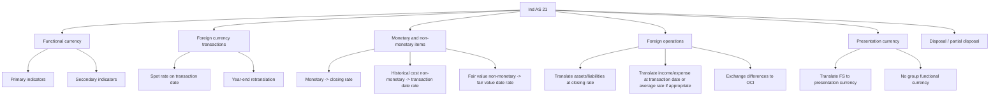
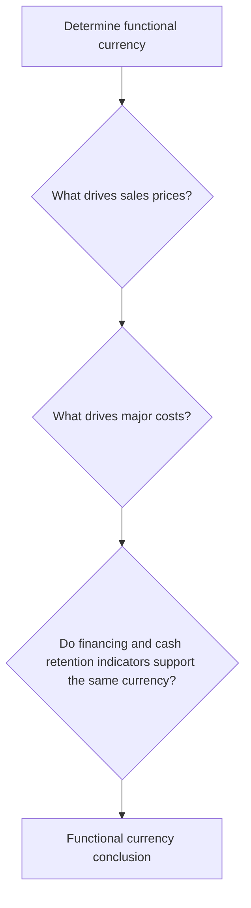
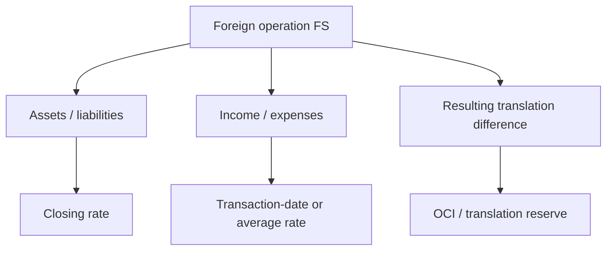

# Chapter 7, Unit 2: Ind AS 21 - The Effects of Changes in Foreign Exchange Rates

## Exam Relevance

- The examiner usually tests whether you can identify the functional currency first, then translate correctly.
- Common questions ask for initial recognition, year-end retranslation, exchange differences, foreign operation translation, and disposal effects.
- Another favourite trap is to confuse monetary items with non-monetary items or functional currency with presentation currency.
- Mixed questions often combine foreign exchange with OCI, net investment, or tax effects.

## Core Intuition

Ind AS 21 is a currency-sorting standard.

First decide which currency is the entity's measuring currency, then decide whether the item is monetary, non-monetary, or part of a foreign operation.

## Concept Map

## Key Concepts

### 1. The three currency labels

| Currency | Meaning | Exam reminder |
|---|---|---|
| Foreign currency | Any currency other than the entity's functional currency | Transaction currency can differ from measuring currency |
| Functional currency | Currency of the primary economic environment in which the entity operates | Decide this first |
| Presentation currency | Currency in which the financial statements are presented | Can differ from functional currency |

The most common student mistake is to jump straight to rupees just because the entity is in India.
Location alone does not decide functional currency.

### 2. Functional currency

Functional currency is the currency that mainly influences the entity's sales prices and costs.

Primary indicators:

- currency that mainly influences sales prices;
- currency that mainly influences labour, material, and other costs.

Secondary indicators:

- currency in which financing funds are generated;
- currency in which operating receipts are usually retained.

### 3. Foreign currency transaction on initial recognition

A foreign currency transaction is recorded initially at the spot exchange rate on the transaction date.

If an average rate approximates the actual rate and exchange rates are not wildly moving, it may be used for practical reasons.

The exam cue:

- transaction date matters for initial recognition;
- settlement date matters only if settlement happens later and creates exchange differences.

### 4. Monetary and non-monetary items

This is one of the most tested distinctions.

| Item type | Core idea | Year-end treatment |
|---|---|---|
| Monetary item | Right or obligation to receive or pay a fixed or determinable number of currency units | Translate at closing rate |
| Non-monetary item at historical cost | Asset or liability measured without current currency remeasurement | Keep transaction date rate |
| Non-monetary item at fair value | Revalued to current measurement date | Use rate on fair value date |

Examples of non-monetary items:

- prepaid expenses;
- income received in advance;
- goodwill;
- intangibles;
- inventories;
- PPE;
- right-of-use assets;
- provisions settled by delivery of non-monetary assets.

### 5. Exchange differences

Exchange difference is the gain or loss arising from translating a number of units of one currency into another at different rates.

Simple rule:

- if the item is monetary, remeasure at each reporting date and take the exchange difference to profit or loss unless another Ind AS sends it elsewhere;
- if the item is non-monetary at historical cost, do not retranslate it at year-end;
- if the item is non-monetary at fair value, translate at the fair value date and then follow the accounting location of the fair value movement.

### 6. Where exchange differences go

| Case | Where the exchange difference goes |
|---|---|
| Ordinary monetary item | Profit or loss |
| Monetary item forming part of net investment in a foreign operation | OCI in consolidated FS, then reclassified on disposal |
| Hedge-accounted item | Follow hedge accounting rules |
| Non-monetary item whose underlying gain or loss goes to OCI | Exchange difference also goes to OCI |

### 7. Foreign operations and translation

When an entity has a foreign operation, the foreign operation is translated into the group's presentation currency.

General translation pattern:

- assets and liabilities: closing rate;
- income and expenses: transaction date rate, often approximated by average rate if suitable;
- resulting exchange differences: OCI, accumulated in foreign currency translation reserve.

### 8. Partial disposal and full disposal

On disposal of a foreign operation, cumulative exchange differences in OCI are reclassified to profit or loss.

If the disposal is partial, the treatment depends on the kind of disposal:

- some partial disposals are treated like disposals;
- some merely reattribute the balance to non-controlling interest;
- a write-down due to losses or impairment is not itself a disposal.

### 9. Presentation currency

An entity may present its financial statements in a currency different from its functional currency.

The translation into presentation currency is a separate step from initial recognition of the transaction.

For group reporting:

- each entity uses its own functional currency;
- the group presentation currency is not the same thing as a group functional currency.

### 10. Tax effect of exchange differences

The tax effect of foreign exchange gains and losses is dealt with under Ind AS 12.

So in a composite exam question:

- first decide the exchange difference under Ind AS 21;
- then decide whether the tax effect goes through profit or loss or OCI under Ind AS 12.

## Professor's Problem-Solving Framework

1. Identify the entity's functional currency.
2. Classify the item as monetary or non-monetary.
3. Identify whether the item is at historical cost or fair value.
4. Apply the right exchange rate on the right date.
5. Decide whether the exchange difference goes to profit or loss or OCI.
6. If a foreign operation is involved, translate the financial statements and track the translation reserve.
7. Check whether any disposal or partial disposal triggers reclassification.

## Worked Examples

### Example 1: Trade payable in foreign currency

Problem:

An entity with rupee functional currency buys goods for USD 10,000 when the rate is 80. Year-end rate is 82. The payable is unpaid.

Working:

Initial recognition = 10,000 x 80 = 800,000

Year-end carrying amount = 10,000 x 82 = 820,000

Exchange loss = 20,000

Answer:

Recognise the loss in profit or loss because the payable is a monetary item.

### Example 2: Prepaid rent in foreign currency

Problem:

A prepaid rent asset was recognised at USD 5,000 when rate was 75. Year-end rate is 78.

Working:

Prepaid rent is non-monetary.

Historical cost item is not retranslated at year-end.

Answer:

No exchange gain or loss on year-end retranslation.

### Example 3: Foreign operation translation

Problem:

A foreign subsidiary has euro functional currency and the group presents in rupees.

Working:

Assets and liabilities -> closing rate

Income and expenses -> transaction date rate or average rate if appropriate

Difference -> OCI translation reserve

Answer:

The translation difference is not taken to current profit or loss unless a disposal rule is triggered.

## Common Mistakes

- Assuming the currency of incorporation is automatically the functional currency.
- Translating all foreign currency items at the closing rate, including historical cost non-monetary items.
- Sending translation differences straight to profit or loss for a foreign operation.
- Forgetting that fair value non-monetary items use the fair value date rate.
- Mixing net investment exchange differences with ordinary trade receivables.
- Ignoring disposal reclassification rules.

## Summary Tables

| Topic | Fast rule | Exam reminder |
|---|---|---|
| Functional currency | Currency of the primary economic environment | Check sales prices and cost base |
| Foreign currency transaction | Transaction not denominated in functional currency | Record at spot rate |
| Monetary item | Fixed or determinable currency unit claim/obligation | Closing rate at reporting date |
| Non-monetary item, historical cost | Not retranslated | Keep original rate |
| Non-monetary item, fair value | Use rate on fair value date | Follow OCI/P&L source item |
| Foreign operation translation | Use closing rate for balance sheet items | Translation difference goes to OCI |
| Disposal of foreign operation | Reclassify cumulative OCI balance | Partial disposal rules are important |

## Last-Day Revision

- Functional currency comes before every other foreign exchange decision.
- Foreign currency transaction = transaction denominated in a currency other than functional currency.
- Monetary items retranslate at closing rate.
- Historical cost non-monetary items stay at the original rate.
- Fair value non-monetary items use the fair value date rate.
- Exchange differences usually go to profit or loss.
- Foreign operation translation differences usually go to OCI and translation reserve.
- On disposal, cumulative translation differences are reclassified.
- Tax effect of exchange differences is handled under Ind AS 12.

## Extra Worked Pattern: FX Plus Tax Boundary

Problem cue: an entity has a foreign currency payable outstanding at year-end and also computes deferred tax on a carrying amount difference.

Solving move:

1. Use Ind AS 21 first to retranslate the foreign currency monetary payable at the closing rate.
2. Recognize the exchange difference in profit or loss unless another standard sends it elsewhere.
3. Then use Ind AS 12 separately to assess whether the changed carrying amount creates a tax base difference.

Exam trap: do not merge the exchange difference and deferred tax effect into one unexplained adjustment.

## Doubts / Version-Sensitive Items

- Check the exact wording of any ICAI illustration if your exam expects a specific translation route for a mixed item.
- For entities with special long-term foreign currency item options or transition exemptions, verify the exact Ind AS 101 election in the source material.
- If a composite question mixes Ind AS 21 with Ind AS 12, confirm whether the tax impact belongs in OCI or profit or loss before finalising the answer.
