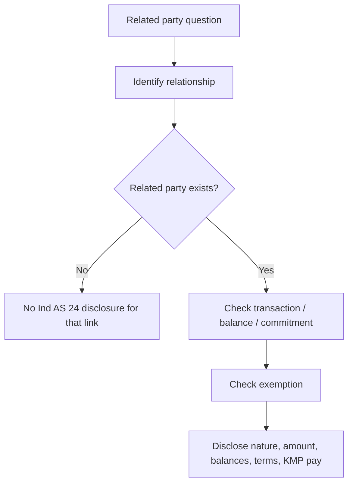
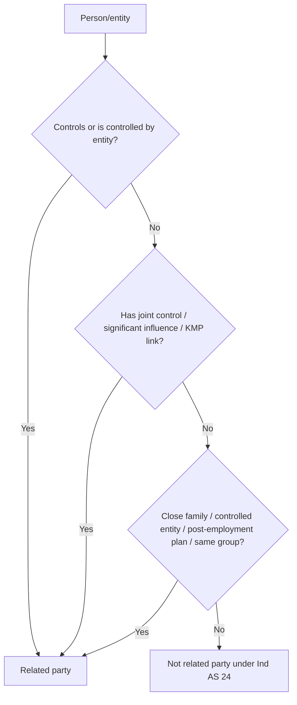

# Chapter 8 - Unit 1: Ind AS 24 Related Party Disclosures

## Exam Relevance

- The examiner usually tests identification first, then disclosure.
- Most questions mix family relationships, control, joint control, significant influence, KMP and transaction disclosure.
- Common asks: who is related, what must be disclosed, what is exempt, and how to present the note cleanly.

## Core Intuition

Ind AS 24 does not ask you to avoid related party transactions; it asks you to identify them correctly and disclose the economic links that could affect judgment.

## Concept Map

## Key Concepts

### 1. Who is a Related Party?

A related party is a person or entity that is linked to the reporting entity through control, joint control, significant influence, KMP status or certain close family relationships.

High-yield links:

| Link | Why it matters |
|---|---|
| Parent, subsidiary, fellow subsidiary | Control creates influence over financial and operating policies. |
| Associate | Significant influence. |
| Joint venture / joint operator context | Joint control or shared decision making. |
| KMP | People who can affect planning, direction and control. |
| Close family members of KMP or controlling persons | Family influence can matter even if the family member is not in management. |

### 2. What Must Be Disclosed?

The focus is on transactions, outstanding balances, commitments and KMP remuneration.

Typical disclosure buckets:

| Item | What to capture |
|---|---|
| Transactions | Nature of relationship and transaction amount |
| Balances | Closing receivable/payable balances and terms |
| Commitments | Commitments with related parties |
| KMP compensation | Short-term, post-employment, other long-term, termination and share-based payments |

If the transaction is at arm's length, it is still a related party transaction if the relationship exists. Arm's length is not a disclosure exemption by itself.

### 3. Exemptions and Common Safe Zones

Ind AS 24 is not a blanket disclosure note for every ordinary transaction.

Common exceptions:

- Transactions within a wholly owned group are often exempt from detailed disclosure in consolidated financial statements, subject to the standard's wording and the reporting context.
- Government-related entity relief may apply if the entity meets the criteria and the disclosures are available in the standard's permitted form.
- Post-employment benefit plans for employee benefits have specific treatment.

### 4. KMP Remuneration

KMP remuneration is a separate disclosure theme and usually appears as a grouped note.

Think in five buckets:

| Bucket | Example |
|---|---|
| Short-term employee benefits | Salaries, bonuses, paid leave |
| Post-employment benefits | Pension, provident fund style benefits |
| Other long-term benefits | Long-service leave |
| Termination benefits | Severance payments |
| Share-based payments | ESOPs and similar awards |

## Professor's Problem-Solving Framework

1. Identify the person or entity in question.
2. Test control, joint control, significant influence, KMP and close-family links.
3. Decide whether a related party relationship exists at the reporting date.
4. List transactions, balances, commitments and remuneration.
5. Check if any exemption or special disclosure relief applies.

## Worked Examples

### Example 1

Problem:

A company sells goods to the brother of its managing director. The brother does not manage the company.

Working:

The brother is a close family member of KMP. That makes him a related party even if he has no managerial role.

Answer:

Disclose the transaction as a related party transaction, with nature, amount, outstanding balance and terms if material.

### Example 2

Problem:

A subsidiary purchases raw materials from its parent on normal market terms.

Working:

Parent and subsidiary are related parties because of control. Arm's length pricing does not remove the relationship.

Answer:

Disclose the transaction and any balances/commitments unless a specific exemption applies in the reporting context.

### Example 3

Problem:

The entity pays the CFO salary, bonus and ESOP expense.

Working:

The CFO is KMP. Compensation is disclosed in the remuneration note, split by category.

Answer:

Disclose KMP remuneration under the standard's buckets, not as a vague single total only.

## Common Mistakes

- Treating "same market price" as if it removes related party status.
- Forgetting close family links of KMP.
- Mixing relationship identification with transaction measurement.
- Ignoring commitments and only disclosing balances.
- Writing generic notes without the exact nature of the relationship.

## Summary Tables

| Issue | Exam reminder | Trap |
|---|---|---|
| Related party identification | Test relationship first | Do not start with transaction amount |
| Arm's length deal | Still related if relationship exists | Price fairness is not a status test |
| KMP pay | Separate disclosure categories | Do not compress all remuneration into one line |
| Balances | Report closing amounts and terms | Do not leave out maturity/settlement terms if material |
| Commitments | Disclose when relevant | Commitments are not optional extras |

## Last-Day Revision

- Control, joint control and significant influence are the core relationship tests.
- KMP includes people with authority to plan, direct and control activities.
- Close family members can create related party links.
- Disclose nature, amount, balances, commitments and KMP remuneration.
- Arm's length does not cancel related party status.
- Always check if the question is asking for identification, disclosure, or both.

## Doubts / Version-Sensitive Items

- Related party conclusions are fact-sensitive. Do not infer related-party status from a business relationship alone; check control, joint control, significant influence, KMP, close family, and group relationships.
- Government-related entity relief and KMP compensation buckets should be matched to the exact wording in the current ICAI material if a question asks for disclosure drafting.
- Check the source PDF wording for the exact list of KMP remuneration buckets.
- Verify whether the study material highlights any specific exemption for government-related entities or wholly owned group disclosures.
- Confirm if the chapter's examples use "significant influence" wording for associates in a simplified way.

