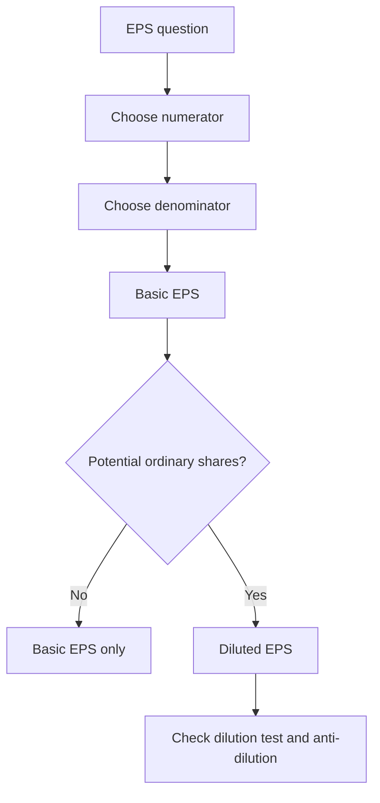
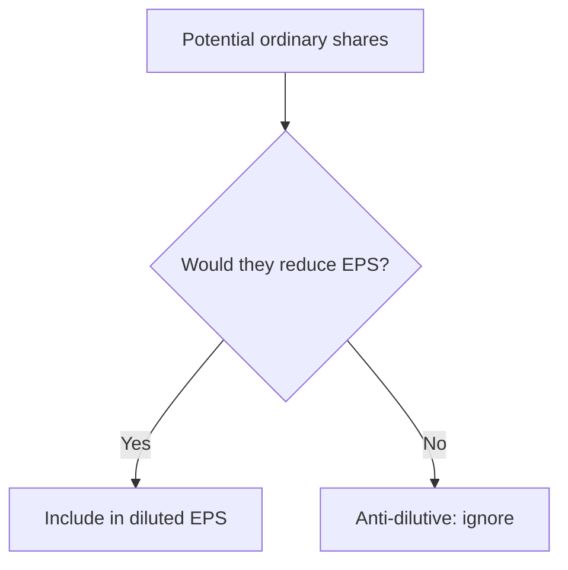

# Chapter 8 - Unit 2: Ind AS 33 Earnings Per Share

## Exam Relevance

- EPS questions are usually computational and very easy to lose marks on small denominator mistakes.
- The examiner likes basic EPS, diluted EPS, weighted average shares, bonus issue adjustments and anti-dilutive instruments.
- Most of the score sits in clean working notes and disciplined sequencing.

## Core Intuition

EPS is profit divided by the average number of equity shares, then adjusted for instruments that could dilute that profit per share.

## Concept Map

## Key Concepts

### 1. Basic EPS

Basic EPS = Profit or loss attributable to ordinary equity holders of the parent / Weighted average number of ordinary shares outstanding.

Key rules:

| Item | Treatment |
|---|---|
| Preference dividends | Deduct if they are not attributable to ordinary equity holders |
| Bonus issue / share split | Restate prior period shares as if the event happened at the start of the earliest period presented |
| Share issue for cash | Weight shares from the date consideration is receivable |
| Buyback / cancellation | Reduce weighted average shares from the date of cancellation or repurchase, as relevant |

### 2. Diluted EPS

Diluted EPS reflects the effect of potential ordinary shares that would reduce EPS if converted.

Common instruments:

| Instrument | Dilution idea |
|---|---|
| Convertible debentures | Add back after-tax finance cost to numerator and add shares to denominator |
| Convertible preference shares | Adjust numerator for preference dividend and denominator for conversion shares |
| Options / warrants | Use treasury stock method |
| Contingently issuable shares | Include only if conditions are met and dilution is real |

### 3. Weighted Average Shares

The denominator is time weighted.

| Event | Usual effect |
|---|---|
| Shares issue | Include from issue date |
| Shares buyback | Exclude from repurchase date |
| Bonus issue / split | Restate all periods presented |
| Rights issue | Apply theoretical ex-rights adjustment when relevant |

Quick formula idea for a simple share issue:

Weighted shares added = shares issued x fraction of year outstanding.

### 4. Dilution Tests and Anti-Dilution

Not every potential ordinary share dilutes EPS.

Check:

1. Is there a conversion or exercise right?
2. Would inclusion reduce EPS or increase loss per share?
3. If it increases EPS or decreases loss per share, it is anti-dilutive and excluded.

## Professor's Problem-Solving Framework

1. Decide whether the question is basic EPS, diluted EPS, or both.
2. Work out profit attributable to ordinary equity holders.
3. Build the weighted average ordinary share count.
4. Test each potential ordinary share for dilution.
5. Present the answer separately for basic and diluted EPS.

## Worked Examples

### Example 1

Problem:

Profit attributable to ordinary shareholders = 9,00,000. Weighted average ordinary shares = 3,00,000.

Working:

Basic EPS = 9,00,000 / 3,00,000 = 3 per share.

Answer:

Basic EPS = `3.00`.

### Example 2

Problem:

A company issued 1,00,000 shares on 1 October in a 12-month year. Existing shares before that date were 4,00,000.

Working:

Weighted average shares = 4,00,000 x 12/12 + 1,00,000 x 6/12 = 4,50,000.

Answer:

Use `4,50,000` in the basic EPS denominator.

### Example 3

Problem:

A convertible debenture would add shares, but after testing, diluted EPS becomes higher than basic EPS.

Working:

That instrument is anti-dilutive.

Answer:

Exclude it from diluted EPS.

## Common Mistakes

- Using closing share capital instead of weighted average shares.
- Forgetting to restate prior periods for bonus issues and splits.
- Including anti-dilutive instruments in diluted EPS.
- Mixing up after-tax and before-tax effects.
- Forgetting that EPS belongs to ordinary equity holders of the parent, not the whole group.

## Summary Tables

| Topic | Must remember | Exam trap |
|---|---|---|
| Basic EPS numerator | Profit attributable to ordinary equity holders | Do not use total profit blindly |
| Basic EPS denominator | Weighted average ordinary shares | Do not use year-end share count |
| Bonus issue | Retrospective restatement | Do not weight it prospectively |
| Options | Treasury stock method | Do not assume full share issue |
| Convertible debt | After-tax interest add-back | Do not forget tax effect |
| Anti-dilution | Exclude if EPS worsens | Not every potential share dilutes |

## Last-Day Revision

- Basic EPS = attributable profit / weighted average ordinary shares.
- Diluted EPS adds only instruments that are actually dilutive.
- Bonus issues and splits restate earlier periods.
- Treasury stock method is for options and warrants.
- Convertible instruments usually need numerator and denominator adjustments.
- Check the sequence: numerator, denominator, dilution test, presentation.

## Extra Worked Pattern: Rights Issue Cue

Problem cue: the company makes a rights issue at a price below market value.

Solving move:

1. Check whether the rights issue contains a bonus element.
2. Compute the theoretical ex-rights price if the question gives market price and rights terms.
3. Adjust the weighted average number of shares using the bonus factor for periods before the rights issue.
4. Use the actual increased shares from the issue date onward.

Exam trap: a rights issue is not treated exactly like a fresh issue at fair value when it includes a bonus element.

## Doubts / Version-Sensitive Items

- Verify the exact source-PDF treatment for partly paid shares, contingently issuable shares and rights issues if the note examples are more detailed than the standard summary.
- Check whether the study material uses the latest ICAI presentation order for EPS in statement of profit and loss notes.
- Confirm whether the source PDF gives a simplified or full treatment of bonus element in rights issues.
