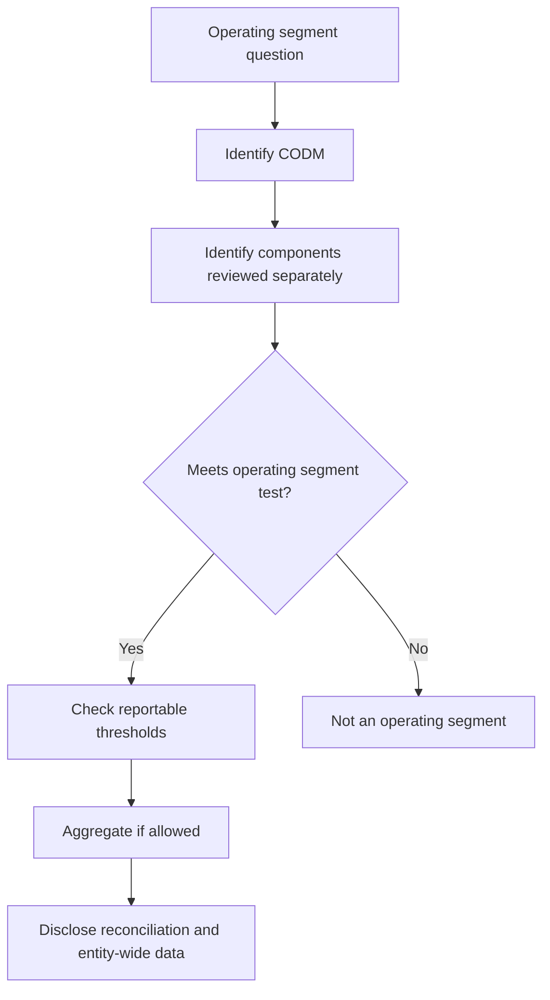
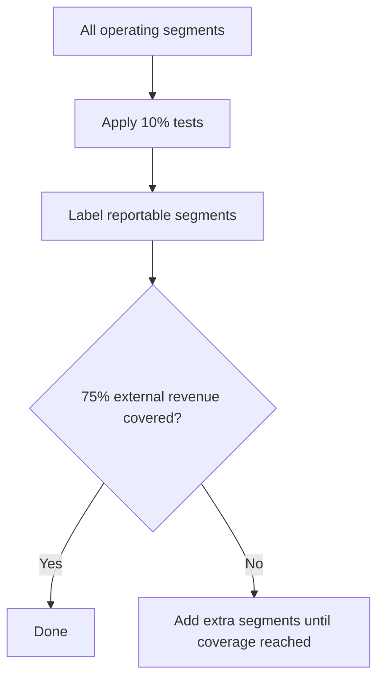

# Chapter 8 - Unit 3: Ind AS 108 Operating Segments

## Exam Relevance

- Segment questions test identification, reportable segment thresholds and disclosure mechanics.
- The tricky part is often deciding what the operating segments are before any numbers are even discussed.
- The examiner likes CODM logic, aggregation, reconciliation and entity-wide disclosures.

## Core Intuition

Ind AS 108 follows the management approach: disclose the business the chief operating decision maker actually reviews, not the segments management would casually name in a brochure.

## Concept Map

## Key Concepts

### 1. Operating Segment

An operating segment is a component of the entity that:

- engages in business activities from which it may earn revenues and incur expenses,
- whose results are regularly reviewed by the CODM, and
- for which discrete financial information is available.

The CODM is the person or group that makes operating decisions and allocates resources.

### 2. Reportable Segments

Once the operating segments are identified, test each one against the quantitative thresholds.

Common threshold logic:

| Test | Usual rule |
|---|---|
| Revenue test | 10% or more of combined external and internal revenue |
| Profit/loss test | 10% or more of absolute combined profit or loss, depending on the standard's mechanics |
| Assets test | 10% or more of combined assets |
| 75% external revenue test | Reported segments must cover at least 75% of external revenue |

### 3. Aggregation

Two or more operating segments may be aggregated only when they have similar economic characteristics and are similar in the nature of products, services, production processes, customer type, distribution methods and regulatory environment.

Aggregation is a judgment call, not a convenience choice.

### 4. Disclosure Package

For each reportable segment, disclose:

| Item | Disclosure focus |
|---|---|
| Revenue | External and internal revenue |
| Profit or loss | Segment result measure used by CODM |
| Assets / liabilities | If reviewed by CODM |
| Major non-cash items | Depreciation, amortisation or other material reconciling items if used in review |
| Reconciliations | Segment totals to entity totals |

Entity-wide disclosures often require:

- products and services,
- geography,
- major customers,
- basis of measurement.

### 5. Key Judgments

Segment reporting is management-based, so the question often turns on what is actually reviewed.

Checklist:

1. Who is the CODM?
2. What reports does the CODM receive?
3. Are discrete financial data available?
4. Do the segments meet quantitative thresholds?
5. Is aggregation justified?

## Professor's Problem-Solving Framework

1. Identify the CODM and the internal reporting structure.
2. Decide which components are operating segments.
3. Apply quantitative thresholds to determine reportable segments.
4. Check the 75% external revenue coverage rule.
5. Prepare segment disclosures and the reconciliation note.

## Worked Examples

### Example 1

Problem:

A group has two business lines. The board reviews one combined monthly report for both and no separate results are available.

Working:

If no discrete financial information is available for the business lines separately, they may not each qualify as operating segments.

Answer:

Look at the level actually reviewed by the CODM, not the legal structure alone.

### Example 2

Problem:

Segment A contributes 12% of revenue, Segment B 8%, Segment C 11% of assets, and total reportable revenue after selection is only 68% of external revenue.

Working:

The 10% tests make A and C reportable. B is not reportable on revenue alone. The 75% external revenue rule still needs more segments if necessary.

Answer:

Add other segments until at least 75% of external revenue is covered.

### Example 3

Problem:

Management wants to combine a steel segment and a telecom segment because both are "important."

Working:

Importance alone is not enough. Aggregation needs similar economic characteristics and similarity across the required indicators.

Answer:

Do not aggregate unless the similarity criteria are actually met.

## Common Mistakes

- Using legal subsidiaries instead of CODM-reviewed components.
- Confusing operating segments with reportable segments.
- Forgetting the 75% external revenue coverage test.
- Aggregating unrelated businesses because the numbers look cleaner.
- Missing reconciliation from segment totals to entity totals.

## Summary Tables

| Topic | Exam reminder | Trap |
|---|---|---|
| CODM | Decide based on who allocates resources | Do not assume the CEO automatically if the facts say otherwise |
| Operating segment | Business activity + separate review + discrete info | One condition alone is not enough |
| Reportable segment | Apply quantitative thresholds | Do not stop after identifying operating segments |
| Aggregation | Needs similarity, not convenience | Mixed industries are usually a red flag |
| Disclosures | Reconciliations matter | Segment note is incomplete without bridge numbers |

## Last-Day Revision

- Segment reporting is driven by internal management reporting.
- Identify CODM first.
- Operating segment requires revenues/expenses, separate review and discrete data.
- Use the 10% thresholds and then the 75% external revenue rule.
- Aggregation needs similar economics and similar operating characteristics.
- Reconciliations are not optional.

## Doubts / Version-Sensitive Items

- CODM identification is judgment-heavy. The title of the person is less important than who regularly reviews operating results and allocates resources.
- Aggregation of operating segments should not be done just to avoid disclosure. Check economic similarity and the specific qualitative factors before aggregating.
- Verify the source PDF's wording on whether liabilities are disclosed only when regularly reviewed by the CODM.
- Check if the study material gives a simplified threshold table or the full Ind AS 108 threshold mechanics.
- Confirm whether the chapter examples use business segment, geographic segment or both in the entity-wide disclosure section.

