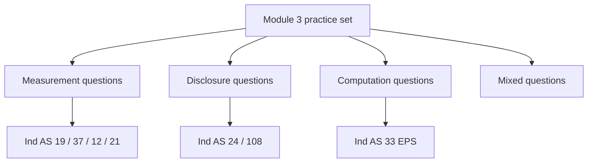
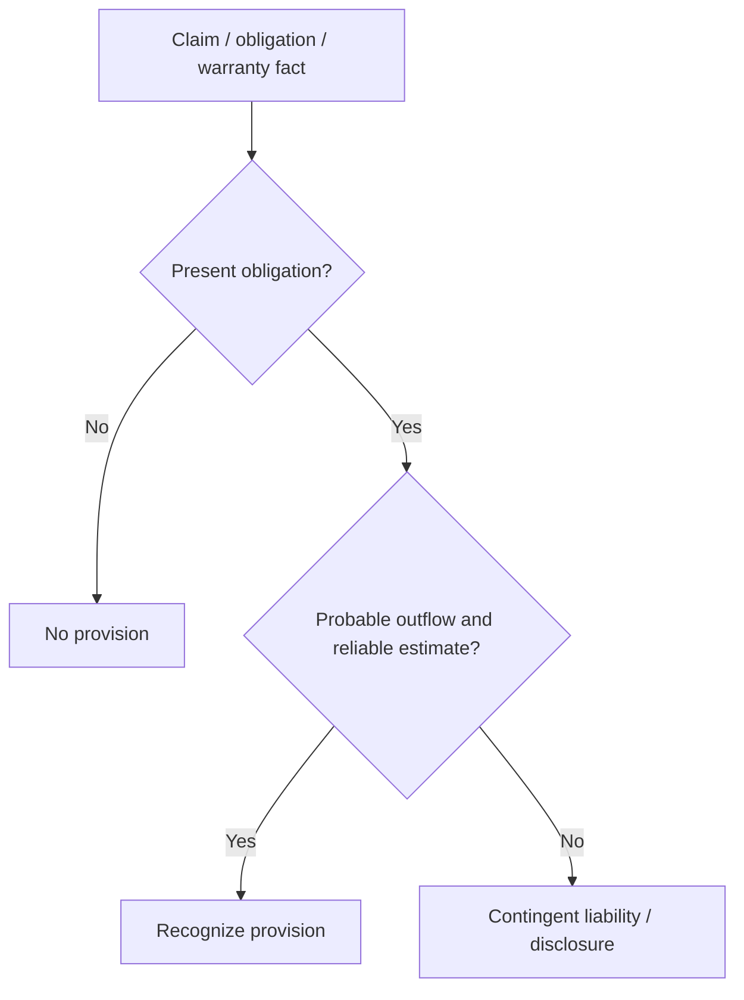

# Module 3 Practice Questions - Pattern Guide

## Exam Relevance

This practice set trains the mixed disclosure-computation style of Module 3, mainly:

- Ind AS 19 Employee Benefits
- Ind AS 37 Provisions and Contingent Liabilities
- Ind AS 12 Income Taxes
- Ind AS 21 Effects of Changes in Foreign Exchange Rates
- Ind AS 24 Related Party Disclosures
- Ind AS 33 Earnings Per Share
- Ind AS 108 Operating Segments

The paper usually rewards quick classification followed by clean working and a short, exact conclusion.

## Core Intuition

In Module 3 practice, the marks usually come from choosing the right standard first, then writing the answer in the order the examiner expects.

## Concept Map

## Question Pattern Map

| Pattern | How to Recognize It | Core Solving Move |
|---|---|---|
| Employee benefit classification | Bonus, gratuity, leave, pension, short-term or post-employment words appear. | Identify the benefit type before valuation. |
| Provision vs contingent liability | Legal case, warranty, restructuring or claim facts are given. | Test present obligation, probability and reliable estimate. |
| Tax timing difference | Deferred tax words, carrying amount vs tax base, future taxable profit. | Split current tax from deferred tax. |
| Foreign currency settlement | Foreign invoice, loan, export/import or year-end retranslation. | Decide initial recognition, reporting-date retranslation and settlement effect. |
| Related party disclosure | Parent, subsidiary, KMP, family or associate is named. | Identify the relation before deciding disclosure. |
| EPS computation | Profit, shares, bonus issue, options or debentures are mentioned. | Build numerator, weighted denominator and dilution test. |
| Segment reporting | Management reports, CODM, internal packs, revenue and assets are given. | Identify operating segments from the CODM view. |

## Ind AS 19 and Ind AS 37 Pattern Guide

### Employee Benefits

Typical steps:

1. Classify the benefit as short-term, post-employment, other long-term or termination.
2. Decide whether the obligation is defined contribution or defined benefit.
3. For defined benefit cases, identify service cost, net interest and remeasurement.
4. Check whether actuarial gains/losses go to OCI or P&L, depending on the standard.

Common traps:

- Calling every gratuity-related item a provision.
- Forgetting discounting when the payment is long-term.
- Mixing current-year service cost with actuarial remeasurement.

### Provisions

Provision questions usually ask whether you should recognize, measure or disclose.

Common traps:

- Booking a restructuring provision before a valid plan creates a present obligation.
- Recognizing a possible loss just because management expects it.
- Forgetting reimbursement treatment.

## Ind AS 12 and Ind AS 21 Pattern Guide

### Income Taxes

Tax questions are usually about timing differences and correct allocation.

Working routine:

1. Compute current tax on taxable profit.
2. Compare carrying amount and tax base.
3. Identify temporary differences.
4. Split deferred tax into profit or loss, OCI or equity if required.

Common traps:

- Using accounting profit directly for current tax.
- Forgetting that some items bypass profit or loss.
- Treating every timing difference as taxable immediately.

### Foreign Exchange

Foreign currency questions usually ask for initial recognition, year-end translation and settlement.

| Situation | Usual treatment |
|---|---|
| Foreign currency transaction on initial recognition | Translate at spot rate on transaction date |
| Monetary item at reporting date | Translate using closing rate |
| Non-monetary item at historical cost | Keep historical rate |
| Exchange difference on settlement / retranslation | Recognize in profit or loss unless a specific exception applies |

Common traps:

- Re- translating non-monetary historical items at closing rate.
- Forgetting the difference between monetary and non-monetary items.
- Mixing transaction-date rate with reporting-date rate.

## Ind AS 24, 33 and 108 Pattern Guide

### Related Party Disclosure

Pattern:

1. Identify the relationship.
2. Test whether it is a related party under the standard.
3. List transactions, balances, commitments and compensation.
4. Check exemptions.

### EPS

Pattern:

1. Compute profit attributable to ordinary equity holders.
2. Compute weighted average shares.
3. Add or remove share events.
4. Test each potential ordinary share for dilution.

### Operating Segments

Pattern:

1. Identify CODM and operating segments.
2. Apply 10% thresholds.
3. Apply the 75% revenue test.
4. Prepare reconciliations and entity-wide disclosures.

## Professor's Problem-Solving Framework

1. Mark the standard name in the margin before doing any working.
2. Decide whether the question is recognition, measurement, presentation or disclosure.
3. Extract the dates, amounts and relationships that matter.
4. Use the correct formula or test.
5. End with a short conclusion that matches the accounting issue.

## Worked Examples

### Question 1

Given:

A company provides a warranty on products sold. Historical claim data exist.

Working:

This is a provision question. A present obligation exists from past sales, and the warranty outflow can usually be estimated.

Final answer:

Recognize a provision for the expected warranty cost.

### Question 2

Given:

An entity has a foreign currency payable outstanding at year-end.

Working:

It is a monetary item, so it must be translated at the closing rate at reporting date.

Final answer:

Recognize exchange gain or loss for the retranslation difference.

### Question 3

Given:

The entity's managing director's spouse sells services to the company.

Working:

The spouse is a close family member of KMP, so the person is a related party.

Final answer:

Disclose the transaction and any outstanding balance under Ind AS 24.

### Question 4

Given:

Profit attributable to ordinary shareholders is `12,00,000`, weighted average shares are `4,00,000`, and a convertible instrument is anti-dilutive.

Working:

Basic EPS = 12,00,000 / 4,00,000 = 3. Diluted EPS ignores the anti-dilutive instrument.

Final answer:

Basic EPS and diluted EPS are both `3.00` if no other dilutive instruments exist.

### Question 5

Given:

The CODM reviews three internal business lines separately and one line contributes 11% of revenue.

Working:

That line meets the 10% revenue test and is reportable, subject to the 75% coverage rule.

Final answer:

Treat it as a reportable segment if the external revenue coverage rule is also satisfied.

## Common Mistakes

- Starting numerical work before classifying the standard.
- Treating disclosure questions as computation questions.
- Missing the reporting-date test in foreign exchange questions.
- Forgetting that EPS and segment questions are note-disclosure questions, not just formulas.
- Mixing up profit or loss recognition with disclosure of contingent matters.

## Summary Tables

| Question type | Best approach | Trap |
|---|---|---|
| Warranty / claim | Test present obligation and estimate | Recording a provision too early |
| Foreign currency payable | Translate monetary item at closing rate | Using historic rate at year-end |
| Related party note | Identify relationship first | Focusing only on arm's length price |
| EPS | Weighted average shares and dilution test | Using closing shares |
| Segments | CODM and internal reports | Using legal entity structure |

## Last-Day Revision

- Choose the standard before you choose the formula.
- For provisions and employee benefits, test obligation, estimate and classification.
- For taxes and FX, separate current effect from deferred or retranslation effect.
- For related party, EPS and segment questions, the disclosure note is as important as the computation.
- The safest answer format is: rule, working, conclusion.

## Extra Mixed Worked Pattern

### FX loan with tax and EPS effects

Problem cue: a company has a foreign currency loan, exchange loss, tax effect, and asks for EPS.

Solving move:

1. Ind AS 21: retranslate the monetary loan at closing rate and recognize exchange difference.
2. Ind AS 12: identify whether the carrying amount/tax base creates a current or deferred tax effect.
3. Ind AS 33: use profit attributable to ordinary shareholders after the above effects for EPS numerator.
4. Weighted average shares are computed independently; do not adjust share count merely because the loan is foreign currency.

Exam trap: the same fact pattern can affect profit, tax, and EPS, but each standard answers a different question.

## Doubts / Version-Sensitive Items

- Check whether the source PDF uses any short-hand treatment for post-employment plans or segment aggregation.
- Verify if the practice set expects the current ICAI style of concluding sentences for disclosure questions.
- Confirm whether the source material includes special examples for government-related entities, bonus issues or rights issues that should be mirrored exactly in the revision notes.
