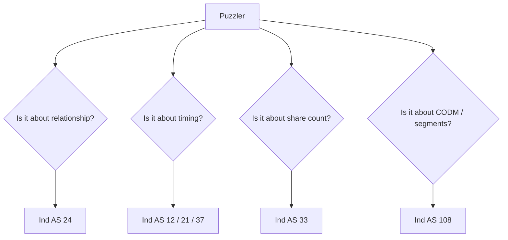
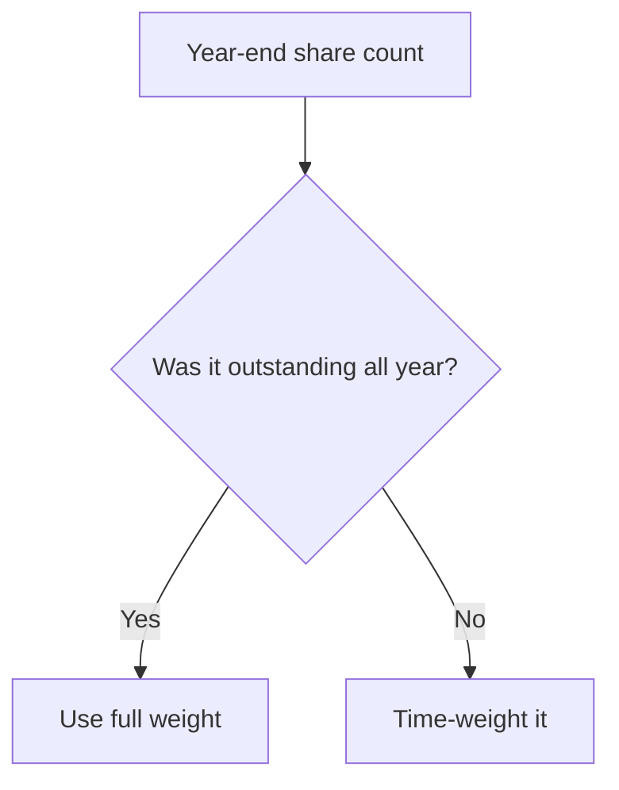

# Module 3 Ind AS Puzzlers - Trap Guide

## Exam Relevance

This file is the quick-warning sheet for the questions that look short but hide a standard-choice trap.

The examiner usually uses:

- identity traps,
- timing traps,
- disclosure traps,
- numerator/denominator traps,
- and "looks similar, is different" traps.

## Core Intuition

Most puzzlers in Module 3 are solved by one sharp question: what exactly is the standard asking me to classify before I calculate anything?

## Concept Map

## Trap Patterns

| Trap | What the question is trying to trick you into doing | Correct response |
|---|---|---|
| "Normal business terms" in related party questions | Assuming arm's length removes the disclosure | Relationship still counts if the party is related |
| Family member not on payroll | Thinking no related party exists | Close family of KMP can still trigger disclosure |
| Bonus issue in EPS | Treating the new shares prospectively | Restate prior periods as if the issue existed earlier |
| Convertible instrument | Including every potential share | Test dilution first; ignore anti-dilutive items |
| CODM not named explicitly | Assuming the board is always CODM | Use the fact pattern, not the job title alone |
| Separate internal packs exist | Assuming each pack is automatically a reportable segment | Check operating segment test and thresholds |
| Warranty / restructuring / claim | Jumping straight to provision | Test present obligation and reliable estimate |
| Monetary vs non-monetary FX item | Translating everything at closing rate | Use closing rate only for monetary items |

## Fast Decision Rules

### 1. Related Party Trap Rule

If the relationship exists, disclose it. Pricing fairness is not a substitute for classification.

### 2. EPS Trap Rule

Count shares the way they existed during the year, not the way they look at year-end.

### 3. Segment Trap Rule

The segment comes from the CODM's internal view, not from the statutory chart of accounts.

### 4. FX Trap Rule

Ask whether the item is monetary. If yes, closing rate usually matters at reporting date.

### 5. Provision Trap Rule

Expected loss alone is not enough. A present obligation is the gatekeeper.

## Mini Examples

### Example 1: Related Party Trap

The entity buys stationery from the brother of the CFO at market price.

Answer:

Still a related party transaction if the brother is a close family member of KMP. Disclose it.

### Example 2: EPS Trap

A rights issue is made partway through the year, and the candidate uses the closing share count for the whole year.

Answer:

That is wrong. The weighted average denominator needs the correct time fraction, with any rights issue adjustment if the facts require it.

### Example 3: Segment Trap

The annual report says "consumer division," but the CODM receives one combined report for consumer and industrial sales.

Answer:

Do not assume the brochure label controls. Use the internal reporting package and CODM review pattern.

### Example 4: Provision Trap

Management expects a lawsuit will be costly next year.

Answer:

Expectation alone is not enough. Identify whether a present obligation exists and whether the outflow is probable and estimable.

## Common Mistakes

- Doing disclosure after calculation when the disclosure question itself is the main issue.
- Assuming every family connection is too remote to matter.
- Using closing shares for the whole EPS year.
- Calling every internal business line a segment.
- Translating non-monetary items at year-end rates without checking their measurement basis.

## Summary Tables

| Standard | What to check first | Usual trap |
|---|---|---|
| Ind AS 24 | Relationship | "Market price" false comfort |
| Ind AS 33 | Weighted average shares | Year-end share count |
| Ind AS 108 | CODM / internal review | Legal entity labels |
| Ind AS 37 | Present obligation | Mere expectation |
| Ind AS 21 | Monetary vs non-monetary | Using one rate for everything |

## Last-Day Revision

- Relationship before disclosure.
- Weighted average before EPS.
- CODM before segment label.
- Present obligation before provision.
- Monetary item before foreign exchange translation.
- If a question looks too short, it probably wants the classification step you almost skipped.

## Doubts / Version-Sensitive Items

- Check the source PDF if it uses specific exceptions or examples for government-related entities under related party disclosures.
- Verify whether the EPS puzzlers include rights issue theory or only bonus issue and convertibles.
- Confirm whether the segment puzzles in the source note use an annual internal reporting pack example that should be mirrored more closely.

