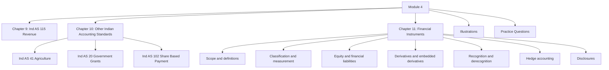

# Module 4: Initial Pages Overview

## Exam Relevance

This is the front matter for the revenue-and-financial-instruments module. It moves from revenue recognition into the specialist standards on agriculture, grants, share-based payment and financial instruments.

The exam likes this module because it mixes theory, classification, valuation and working-note style questions.

## Module Map

## How To Use This Module

- Begin with revenue because it is the gateway standard for performance reporting.
- Then move to the smaller standards so you can keep each trigger distinct.
- Financial instruments should be studied in a fixed order: scope, classification, measurement, recognition, hedge accounting and disclosures.
- Use the comprehensive illustrations to see how multiple instrument rules interact.
- Keep the practice set for final consolidation, not for first reading.

## Exam Strategy

1. Classify the transaction before trying to value it.
2. In revenue questions, identify performance obligations, timing of transfer and variable consideration.
3. In financial instrument questions, identify the instrument type and the accounting category first.
4. For derivatives and hedges, separate the contract structure from the hedge relationship.
5. In answers, write the rule, then the fact application, then the conclusion.

## Front-Matter Watchlist

- Revenue and financial instrument wording is highly fact-sensitive, so exact source phrasing matters.
- The file names use a compact structure, but the exam may refer to the standard by its full official title.
- Transition, exemption and disclosure notes should be checked if the question fixes the reporting date or adoption date.
- Ind AS 102 and hedge accounting questions are especially sensitive to precise terms, dates and eligibility conditions.

