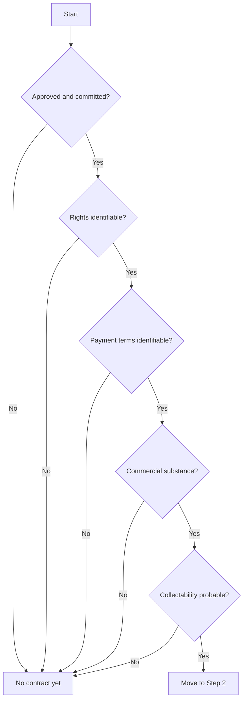
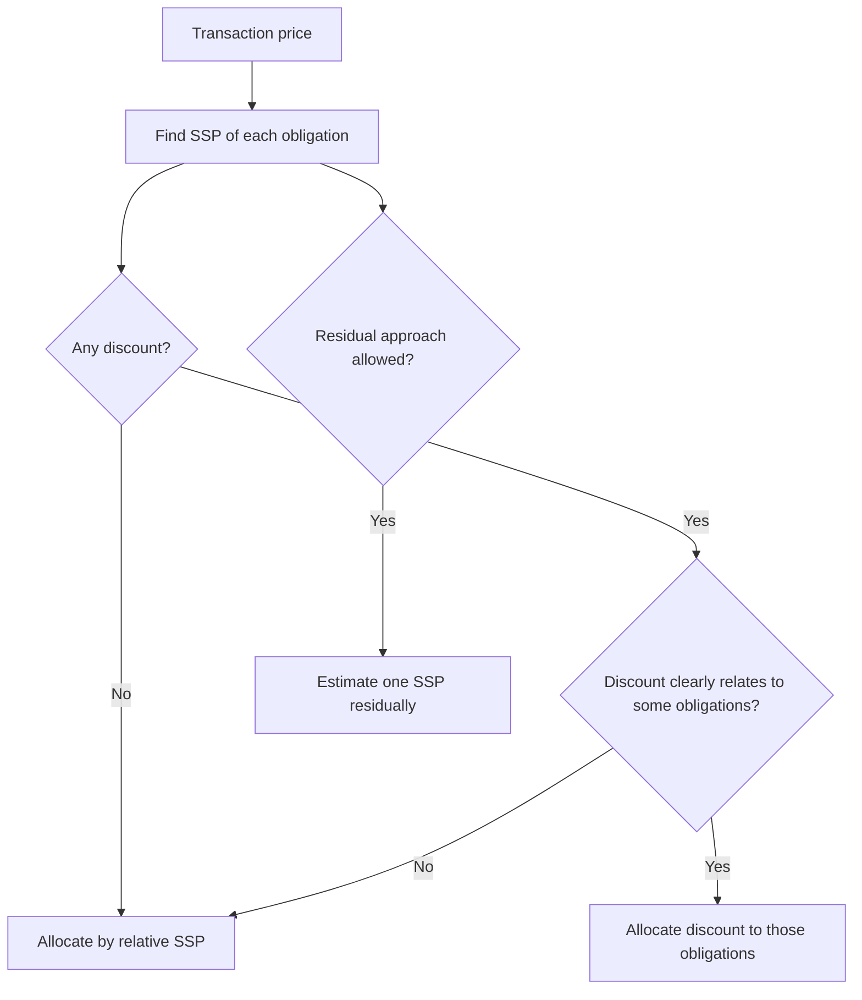

# Chapter 9: Ind AS 115 - Revenue from Contracts with Customers

## Exam Relevance

- This is one of the most examinable standards in the module because it mixes theory, classification, timing, estimates, and working-note style calculations.
- The examiner usually tests:
  - whether a contract exists,
  - how many performance obligations there are,
  - how to measure transaction price,
  - how to allocate discounts / variable consideration,
  - when revenue is recognized,
  - what to do with contract modifications and contract costs.
- The standard also appears inside mixed questions with leases, warranties, principal-agent issues, consignment, licences, and financing components.
- Common traps are:
  - skipping Step 1 and jumping straight to revenue,
  - treating every promise as one bundle,
  - using total contract price instead of stand-alone selling prices,
  - forgetting that collectability is part of contract existence,
  - confusing contract asset, receivable, and contract liability.

## Core Intuition

Ind AS 115 asks one simple exam question in five stages:

1. Is there a valid contract?
2. What promises are separate?
3. What is the transaction price?
4. How do we split that price?
5. When is each promise satisfied?

The standard is built to follow control, not just billing.

## Concept Map

```mermaid
flowchart TD
    A["Ind AS 115"] --> B["Step 1: Contract"]
    A --> C["Step 2: Performance obligations"]
    A --> D["Step 3: Transaction price"]
    A --> E["Step 4: Allocate price"]
    A --> F["Step 5: Recognise revenue"]
    A --> G["Contract costs"]
    A --> H["Presentation and disclosure"]

    B --> B1["Approval"]
    B --> B2["Rights"]
    B --> B3["Payment terms"]
    B --> B4["Commercial substance"]
    B --> B5["Collectability"]

    C --> C1["Distinct goods / services"]
    C --> C2["Series of distinct services"]
    C --> C3["Over time or point in time"]

    D --> D1["Fixed consideration"]
    D --> D2["Variable consideration"]
    D --> D3["Financing component"]
    D --> D4["Non-cash consideration"]
    D --> D5["Consideration payable to customer"]

    E --> E1["Stand-alone selling price"]
    E --> E2["Discount allocation"]
    E --> E3["Variable allocation"]
    E --> E4["Residual approach"]

    F --> F1["Over time"]
    F --> F2["Point in time"]
    F --> F3["Input / output methods"]
```

## Key Concepts

### 1. Scope and contract gatekeeping

Ind AS 115 applies to contracts with customers for goods or services that are outputs of the entity's ordinary activities.

It does not apply to:

- lease contracts under Ind AS 116,
- insurance contracts under the relevant insurance standard,
- financial instruments and certain group-contract rights and obligations,
- non-monetary exchanges in the same line of business to facilitate customer sales.

Step 1 is critical. A contract exists only if all five criteria are met:

| Criterion | Exam meaning |
|---|---|
| Approval and commitment | Both parties have accepted the arrangement |
| Rights identifiable | Each party's rights can be identified |
| Payment terms identifiable | You can work out how and when payment arises |
| Commercial substance | The contract changes cash flows in a real way |
| Collectability | It is probable that substantially all consideration will be collected |

Practical exam points:

- approval may be written, oral, or implied, but the parties must intend to be bound,
- collectability is judged at contract inception and revisited only if facts change significantly,
- if there is no contract yet, revenue is not booked just because cash has moved.

### 2. Performance obligations

A performance obligation is a promise to transfer a distinct good or service, or a series of distinct goods or services with the same pattern of transfer.

The exam usually wants the two-step distinct test:

1. Capable of being distinct
2. Distinct within the context of the contract

| Test | What to ask |
|---|---|
| Capable of being distinct | Can the customer benefit from it on its own or with readily available resources? |
| Distinct in context | Is it not highly integrated, dependent, interrelated, or customising the other promises? |

Common grouping clues:

- installation plus equipment may be one obligation if the items are highly integrated,
- a magazine print copy and online access may be separate if each can be used independently,
- a series of daily or monthly services may be treated as one series if each service is substantially the same and transferred in the same pattern.

### 3. Transaction price

Transaction price is the amount of consideration the entity expects to be entitled to, excluding amounts collected for third parties.

Core components:

| Component | Exam trigger |
|---|---|
| Fixed consideration | Straightforward sale price |
| Variable consideration | Bonus, rebate, penalty, return, refund, incentive |
| Significant financing component | Timing of payment creates financing |
| Non-cash consideration | Shares, goods, services, barter-type value |
| Consideration payable to customer | Coupons, credits, rebates paid back to customer |

#### Variable consideration

Use one of two methods:

- expected value when there is a range of outcomes,
- most likely amount when there are only a few discrete outcomes.

Then apply the constraint:

- include only the amount for which it is highly probable that a significant revenue reversal will not occur when uncertainty is resolved.

Mini example:

| Outcome | Amount | Probability |
|---|---|---|
| Early completion bonus | 5 lakh | 30% |
| No bonus | 0 | 70% |

Expected value is not always the best answer if the contract has only one of two clear outcomes. In that case, the most likely amount may better reflect entitlement.

#### Significant financing component

If timing gives one party a financing benefit, split the contract into:

- revenue for the cash selling price of the promised goods or services,
- interest income or interest expense for the financing element.

The practical expedient applies when the gap between transfer and payment is one year or less.

#### Non-cash consideration

Measure non-cash consideration at fair value. If fair value cannot be estimated reliably, use the stand-alone selling price of the goods or services transferred.

### 4. Allocation of transaction price

Allocation is based on relative stand-alone selling prices.

| Situation | Rule |
|---|---|
| Separate selling prices observable | Use them directly |
| Not observable | Estimate using market, expected cost plus margin, or residual approaches |
| Discount covers only some obligations | Allocate the discount to those obligations if criteria are met |
| Variable consideration relates to specific obligations | Allocate if the conditions are met |

Quick exam rule:

- do not dump the whole discount on the largest item unless the standard criteria allow it,
- estimate stand-alone selling prices consistently and with maximum observable inputs.

### 5. When revenue is recognized

Revenue is recognized when control transfers, either:

- over time, or
- at a point in time.

Over time recognition applies when one of the following is met:

1. The customer simultaneously receives and consumes benefits.
2. The entity creates or enhances an asset that the customer controls as it is created.
3. The entity's performance does not create an asset with an alternative use and the entity has an enforceable right to payment for work done to date.

If revenue is over time, choose an appropriate measure of progress:

| Method | Typical use |
|---|---|
| Output method | Units delivered, milestones achieved, surveys completed |
| Input method | Costs incurred, labour hours, machine hours |

Point-in-time recognition depends on control indicators like possession, title, significant risks and rewards, acceptance, and right to payment.

### 6. Special revenue topics that the examiner likes

#### Principal versus agent

If the entity controls the specified good or service before transfer, it is principal and recognizes gross revenue.
If not, it is an agent and recognizes only the net fee or commission.

Indicators of principal status:

- primary responsibility for fulfilling the promise,
- inventory risk before or after transfer,
- discretion in pricing.

#### Contract modifications

Classify the modification first:

| Modification type | Treatment |
|---|---|
| Separate contract | Add new obligations at stand-alone selling price |
| Not separate but remaining goods/services distinct | Treat prospectively |
| Not separate and remaining goods/services not distinct | Cumulative catch-up |

This is a favourite exam trap because one contract can split into different accounting treatments across time.

#### Contract costs

- Incremental costs of obtaining a contract are capitalized if recoverable.
- Costs to fulfil a contract are capitalized only if they relate directly to the contract, generate or enhance resources, and are expected to be recovered.
- Otherwise, expense them.

#### Warranties

| Warranty type | Accounting |
|---|---|
| Assurance warranty | Provision / quality guarantee type |
| Service warranty | Separate performance obligation |

#### Consignment

Goods on consignment remain with the consignor until the specified sale event or customer acceptance occurs.

### 7. Presentation

| Item | Presentation |
|---|---|
| Contract asset | Right to consideration is conditional on something other than passage of time |
| Receivable | Unconditional right to consideration |
| Contract liability | Consideration received or due before performance |

### 8. Worked examples

#### Example 1: Two promises, one discount

An entity sells a machine and three months of installation support for 1,20,000.
Stand-alone selling prices are:

- machine = 1,00,000
- support = 30,000

Total SSP = 1,30,000, so a discount of 10,000 exists.

If both promises are distinct, allocate:

| Item | Allocation |
|---|---|
| Machine | 1,00,000 / 1,30,000 x 1,20,000 = 92,308 |
| Support | 30,000 / 1,30,000 x 1,20,000 = 27,692 |

#### Example 2: Over time service

A one-year cleaning service is provided evenly through the year.

Result:

- one series performance obligation,
- revenue recognized over time,
- straight-line recognition is usually the simplest measure if the service is uniform.

### 9. Common Mistakes

- Treating billing date as revenue date.
- Forgetting collectability in Step 1.
- Forgetting to separate service warranties from assurance warranties.
- Using total contract margin as the allocation basis.
- Mixing up variable consideration and financing component.
- Ignoring contract modification rules and trying to force one answer.

## Summary Tables

| Topic | Fast exam trigger |
|---|---|
| Contract existence | Five criteria must all be met |
| Distinct promise | Capable of distinct + distinct in context |
| Variable consideration | Expected value or most likely amount |
| Financing component | Separate financing if timing is material |
| Allocation | Relative stand-alone selling prices |
| Revenue timing | Control, not invoicing |
| Principal-agent | Control before transfer decides gross vs net |
| Contract cost | Capitalize only when the rule is satisfied |

## Last-Day Revision

- Learn the five-step model as a sentence you can reproduce under pressure.
- Memorize the contract gate: approval, rights, payment, substance, collectability.
- Distinct promise is a two-step test.
- Variable consideration needs both estimation and the reversal constraint.
- One-year or less often avoids financing adjustments.
- Gross revenue belongs to the principal; net revenue belongs to the agent.
- Modifications need classification before computation.
- Contract asset is conditional; receivable is unconditional.

## Doubts / Version-Sensitive Items

- The source PDF uses the current ICAI syllabus wording; check the final exam framing if the insurance standard reference changes in later notifications.
- Allocation of discounts and variable consideration can look similar in practice; keep the contract facts close to the source PDF when drafting the final working.
- Principal-agent questions often turn on the exact control indicators given in the case, so avoid overgeneralizing from the examples.
