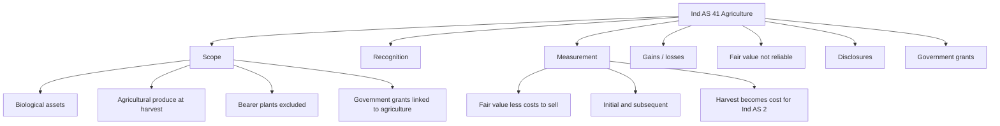
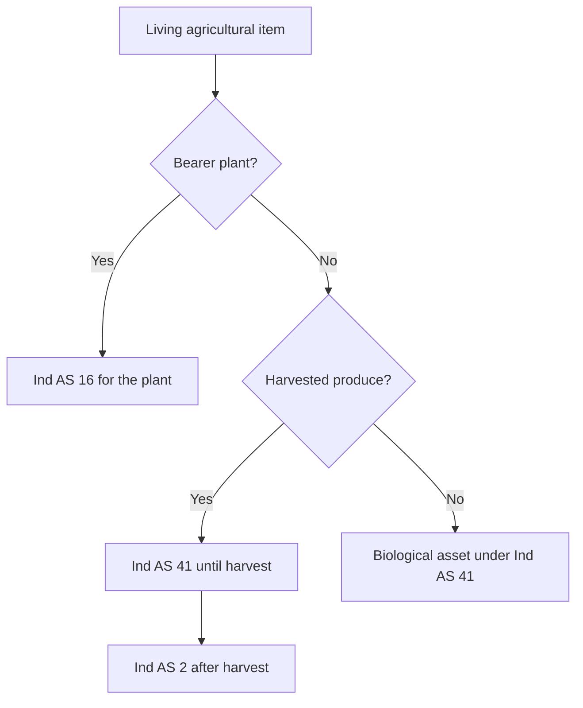
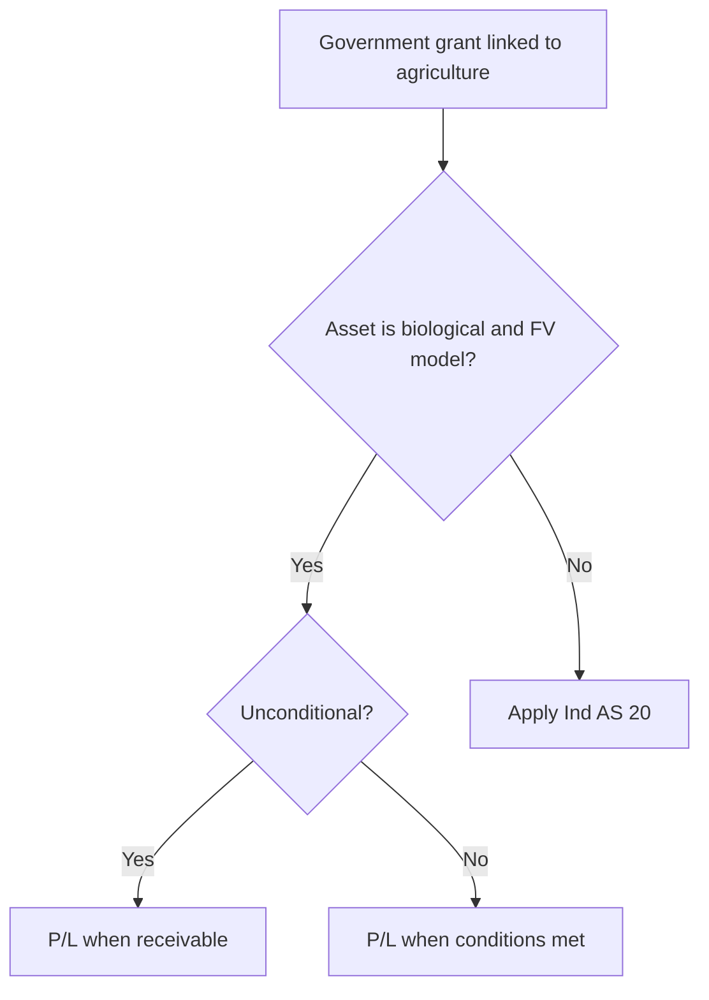

# Chapter 10, Unit 1: Ind AS 41 - Agriculture

## Exam Relevance

- This unit is short, but the examiner likes it because it tests a very specific fair value model.
- The common asks are:
  - what is a biological asset,
  - what is agricultural produce,
  - what is outside Ind AS 41,
  - when fair value less costs to sell applies,
  - when gain or loss goes to profit or loss,
  - what to do when fair value cannot be measured reliably,
  - how government grants are handled.
- Typical traps are:
  - treating bearer plants like biological assets,
  - carrying agricultural produce past harvest at fair value instead of at cost under Ind AS 2,
  - mixing up land, animals, produce, and processing inventory,
  - forgetting that fair value changes are recognized in profit or loss.

## Core Intuition

Ind AS 41 follows the living asset, not the historical cost.
If something is biological and within scope, the exam answer usually starts from fair value less costs to sell.

At harvest, agricultural produce stops being a living asset and becomes inventory cost under Ind AS 2.

## Concept Map

## Key Concepts

### 1. Scope

Ind AS 41 applies to:

- biological assets related to agricultural activity,
- agricultural produce at the point of harvest,
- government grants related to those biological assets when the grant is connected to agricultural activity.

It does not apply to:

- bearer plants, which are covered by Ind AS 16,
- produce growing on bearer plants, which remains within Ind AS 41,
- land used in agriculture,
- post-harvest processing inventory, which moves to Ind AS 2,
- plant and machinery used to support biological assets, which stay under Ind AS 16.

| Item | Standard |
|---|---|
| Tea bushes, grape vines, oil palms, rubber trees | Ind AS 16 if they are bearer plants |
| Grapes harvested from the vine | Ind AS 41 at harvest |
| Wine made after harvesting | Ind AS 2 |
| Cattle, sheep, fish, trees for sale as produce | Ind AS 41 |

### 2. Recognition

Recognize a biological asset or agricultural produce only when all three are met:

1. The entity controls the asset as a result of past events.
2. It is probable that future economic benefits will flow to the entity.
3. Fair value or cost can be measured reliably.

Control can be evidenced by legal ownership, branding, tagging, birth records, or similar control evidence.

### 3. Measurement

The default rule is:

- on initial recognition, measure at fair value less costs to sell,
- at each reporting date, remeasure at fair value less costs to sell.

The source PDF makes one big point very clearly:

- once fair value becomes reliably measurable, continue measuring at fair value less costs to sell until disposal.

Agricultural produce is simpler:

- at harvest, measure at fair value less costs to sell,
- that amount becomes the cost for Ind AS 2 afterwards.

| Stage | Measurement |
|---|---|
| Living biological asset | Fair value less costs to sell |
| Harvested produce | Fair value less costs to sell at harvest |
| After harvest | Ind AS 2 cost basis |

### 4. Gains and losses

Any gain or loss on:

- initial recognition of a biological asset,
- subsequent changes in fair value less costs to sell,
- initial recognition of agricultural produce at harvest,

goes to profit or loss in the period concerned.

That means the standard is volatile by design. If market value rises, the gain hits P/L. If it falls, the loss hits P/L.

#### Mini example

| Particulars | Amount |
|---|---|
| Purchase price of sheep | 5,00,000 |
| Costs to sell | 10,000 |
| Initial carrying amount | 4,90,000 |
| Fair value less costs to sell at year end | 5,88,000 |
| Gain in P/L | 98,000 |

### 5. Fair value when measurement is difficult

Fair value is normally expected to be available.
If it cannot be measured reliably on initial recognition, the source allows cost less accumulated depreciation and impairment, but this is the exception and not the rule.

Once fair value becomes reliably measurable, switch to fair value less costs to sell.

Exam reminder:

- this exception is narrow,
- do not use it casually just because valuation is inconvenient,
- at harvest, agricultural produce is expected to be measurable reliably.

### 6. Government grants

The treatment depends on what the grant is attached to.

#### Biological asset measured at fair value less costs to sell

| Grant type | Recognition |
|---|---|
| Unconditional | In profit or loss when the grant becomes receivable |
| Conditional | In profit or loss when the attached conditions are met |

#### Biological asset measured at cost

If the biological asset is measured at cost less accumulated depreciation and impairment, apply Ind AS 20.

#### Plant and machinery used in agriculture

If the grant relates to plant and machinery supporting agriculture, that item is not itself a biological asset. Ind AS 20 applies.

### 7. Disclosures

The standard wants a lot of explanatory detail.

Required themes include:

- description of each group of biological assets,
- aggregate gain or loss in the period,
- reconciliation of carrying amount,
- restrictions, pledges, commitments, and risk management,
- if fair value is not reliably measurable, explanation and estimate range,
- government grant nature, conditions, and expected reductions.

## Worked Examples

### Example 1: Bearer plant versus produce

Tea bushes are bearer plants.

Result:

- tea bushes themselves are outside Ind AS 41 and go to Ind AS 16,
- tea leaves harvested from them are agricultural produce and fall within Ind AS 41 at harvest,
- processed tea inventory after manufacture goes to Ind AS 2.

### Example 2: Poultry grant

A government grant is received for broiler birds and there are no conditions attached to the release of the grant.

Result:

- the grant is recognized in profit or loss when it becomes receivable,
- if a condition had been attached, recognition would wait until that condition was satisfied.

### Example 3: Harvest boundary

An entity harvests grapes from vines.

Result:

- grapes at harvest are measured at fair value less costs to sell,
- that amount becomes inventory cost afterward,
- wine made later is not biological asset accounting anymore.

## Common Mistakes

- Treating bearer plants as biological assets.
- Forgetting the harvest boundary.
- Measuring harvested produce at cost instead of fair value less costs to sell at harvest.
- Leaving fair value gains in OCI or reserves.
- Using Ind AS 20 rules for a biological asset that is already inside the Ind AS 41 fair value model.

## Summary Tables

| Topic | Fast exam rule |
|---|---|
| Biological asset | Living asset related to agricultural activity |
| Agricultural produce | Harvested product at point of harvest |
| Bearer plant | Usually Ind AS 16, not Ind AS 41 |
| Measurement | Fair value less costs to sell |
| Gain or loss | Profit or loss |
| Post-harvest product | Ind AS 2 |
| Grant on FV biological asset | P/L when receivable or when conditions met |
| Grant on costed biological asset / PPE | Ind AS 20 |

## Last-Day Revision

- Memorize the three recognition tests.
- Fair value less costs to sell is the default.
- Harvest breaks the biology and starts inventory accounting.
- Bearer plants are outside Ind AS 41.
- Gains and losses on biological assets go to P/L.
- Government grants need a fork: Ind AS 41 for FV biological assets, Ind AS 20 for costed assets or PPE.
- Disclosures are descriptive, not just numerical.

## Doubts / Version-Sensitive Items

- The source PDF's examples use agriculture-linked grants and plant-and-machinery support; check the exact fact pattern because the grant standard changes with the asset it supports.
- The distinction between bearer plant and produce is easy to blur in exam wording, so keep the harvest point explicit.
- If a question mixes agriculture with inventory or PPE, write the standard boundary first before you compute anything.
