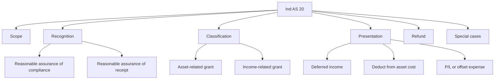
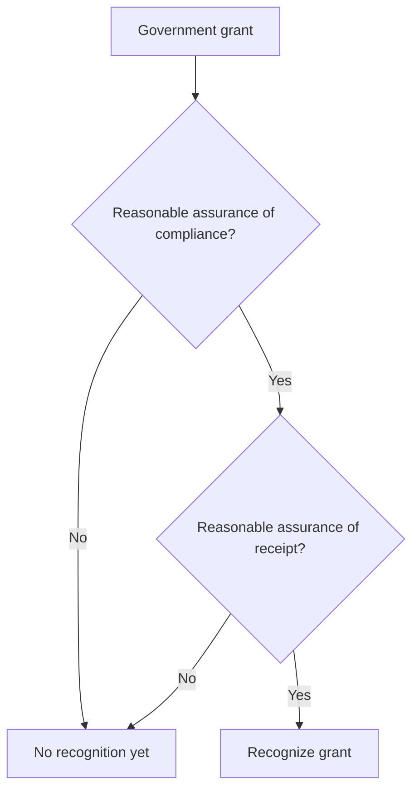

# Chapter 10, Unit 2: Ind AS 20 - Government Grants

## Exam Relevance

- This is a compact but high-yield standard because it tests recognition, presentation, refund, and classification.
- The examiner likes:
  - whether there is reasonable assurance,
  - whether the grant is related to asset or income,
  - whether the grant is presented as deferred income or netted against cost,
  - what happens when the grant is repaid,
  - how forgivable loans and below-market loans are treated.
- Common traps are:
  - recognizing too early,
  - confusing receipt with entitlement,
  - mixing up asset-related and income-related grants,
  - pushing a government contribution straight into equity without checking the fact pattern.

## Core Intuition

Ind AS 20 is not about cash receipt.
It is about entitlement with reasonable assurance, then matching the grant to the expense or asset it is meant to support.

## Concept Map

## Key Concepts

### 1. Scope

Ind AS 20 applies to:

- accounting and disclosure of government grants,
- disclosure of other government assistance.

It does not deal with:

- tax benefits like tax holidays or investment tax credits,
- government participation in ownership,
- grants covered by Ind AS 41.

### 2. Recognition principle

Government grants, including non-monetary grants at fair value, are not recognized until there is reasonable assurance that:

1. the entity will comply with the attached conditions,
2. the grant will be received.

Receipt alone is not enough.

Exam language:

- "reasonable assurance" is closer to a practical certainty threshold than a mere possibility,
- do not book the grant just because the government announced it.

### 3. Form of grant does not change the accounting

The source PDF is explicit that the way the grant is received does not change the accounting:

- cash,
- reduction of a liability,
- non-monetary asset.

The accounting logic still follows the same standard.

### 4. Asset-related versus income-related grants

| Type | Primary condition | Typical exam treatment |
|---|---|---|
| Asset-related grant | Buy, construct, or acquire a long-term asset | Deferred income or deduction from asset cost |
| Income-related grant | Not related to assets | Credit P/L or deduct related expense |

This distinction is factual. The examiner will often hide it inside the wording of the scheme.

### 5. Presentation

#### Grants related to assets

Two accepted methods:

1. Recognize as deferred income and release to P/L systematically over the useful life of the asset.
2. Deduct the grant from the carrying amount of the asset.

| Method | Balance sheet effect | Profit or loss effect |
|---|---|---|
| Deferred income | Liability / deferred income | Recognized over useful life |
| Deduct from asset cost | Lower asset carrying amount | Lower depreciation expense |

#### Grants related to income

These are presented in P/L either:

- separately, or under other income, or
- by deduction from the related expense.

### 6. Matching principle

The grant should be recognized in profit or loss on a systematic basis over the periods in which the related costs are recognized.

That means:

- grant for depreciation-related asset cost is spread over useful life,
- grant for operating costs is matched to those costs,
- grant for a specific period of work is tied to that period.

### 7. Forgivable loans and below-market loans

| Item | Treatment |
|---|---|
| Forgivable loan | Treated as a grant when forgiveness is reasonably assured |
| Loan below market rate | Measure the loan under Ind AS 109; the benefit is a government grant |

The benefit of a below-market loan is the difference between the Ind AS 109 carrying value and the proceeds received.

### 8. Refund of grants

If a grant must be repaid:

- first, treat it against any unamortized deferred credit,
- if the refund exceeds that, recognize the excess immediately in profit or loss.

Refund logic is one of the neat exam favorites because it tests whether the original grant had already flowed through earnings.

### 9. Government-owned entity issue

Where the government is also an owner, do not assume every inflow is a grant.
First ask whether it is:

- a shareholder contribution, or
- a true government grant.

That classification controls whether the amount is recorded in equity or in profit or loss.

## Worked Examples

### Example 1: Asset grant

An entity receives a grant for purchase of a machine used over three years.

Result:

- recognize the grant as deferred income or deduct it from the machine cost,
- release it to profit or loss over the machine's useful life.

### Example 2: Income grant

An entity receives a subsidy linked to wages paid during a year.

Result:

- recognize it in profit or loss over the same wage period,
- either separately under other income or as a reduction of staff cost.

### Example 3: Forgivable loan

A government loan will be forgiven if the entity completes certain conditions and compliance is reasonably assured.

Result:

- treat the benefit as a grant,
- not as a normal liability forever.

## Common Mistakes

- Recognizing on receipt instead of on reasonable assurance.
- Forgetting that non-monetary grants are still covered.
- Mixing up the two presentation methods for asset-related grants.
- Putting an income-related grant directly into reserve or equity.
- Forgetting to separately identify the benefit in a below-market loan.

## Summary Tables

| Question | Answer trigger |
|---|---|
| When recognize? | When reasonable assurance of compliance and receipt exists |
| Asset grant | Deferred income or deduction from asset cost |
| Income grant | P/L or offset related expense |
| Forgivable loan | Grant if forgiveness is reasonably assured |
| Below-market loan | Loan under Ind AS 109, benefit under Ind AS 20 |
| Refund | Reverse against deferred income first, then P/L if needed |

## Last-Day Revision

- The standard is about entitlement, not mere receipt.
- Reasonable assurance has two limbs: conditions and receipt.
- Asset-related grants can be shown either as deferred income or netted from the asset.
- Income-related grants go through P/L, directly or by expense offset.
- Forgivable loans and below-market loans need special handling.
- Form of receipt does not change the accounting method.

## Doubts / Version-Sensitive Items

- The source PDF uses both asset-related and income-related grant examples; in exam answers, name the factual basis of the classification before citing the presentation rule.
- For government-owned entities, the shareholder-contribution question is fact-heavy, so check whether the payment is linked to ownership or to a policy objective.
- If a question mixes Ind AS 20 with Ind AS 41, start by deciding whether the asset is biological under fair value or a costed support asset under Ind AS 16.
