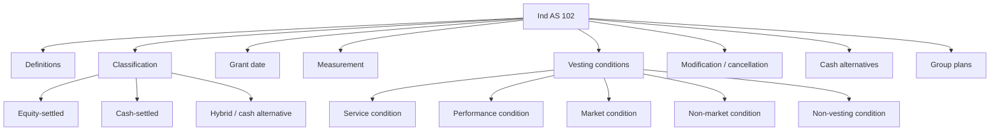
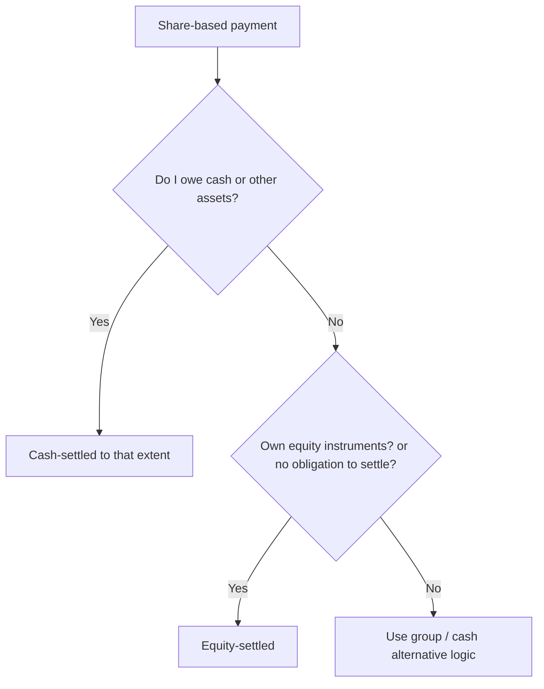
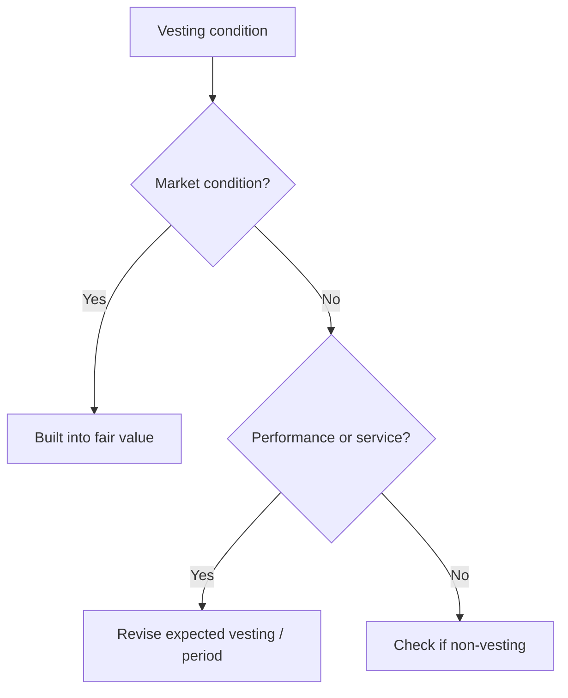

# Chapter 10, Unit 3: Ind AS 102 - Share-Based Payment

## Exam Relevance

- This is a detail-heavy standard and the examiner loves classification logic.
- The core asks are:
  - what is a share-based payment transaction,
  - whether it is equity-settled or cash-settled,
  - how to identify grant date,
  - how to treat service and performance vesting conditions,
  - how to measure over the vesting period,
  - what happens on modification, cancellation, settlement, and cash alternatives.
- Common traps are:
  - using issue date instead of grant date,
  - taking market conditions as a revision trigger,
  - treating non-market performance conditions like market conditions,
  - forgetting the liability remeasurement rule for cash-settled plans,
  - misclassifying group share plans.

## Core Intuition

Ind AS 102 is really two standards in one:

- equity plans are fixed at grant-date fair value and then spread over vesting,
- cash-settled plans are liabilities that are remeasured until settlement.

The whole chapter is a classification problem before it is a measurement problem.

## Concept Map

## Key Concepts

### 1. Scope and basic idea

Ind AS 102 applies when an entity receives goods or services in exchange for:

- its own equity instruments,
- equity instruments of another group entity,
- cash or other assets based on the value of equity instruments.

The standard is used for employees, directors, consultants, and other suppliers when the transaction is share-based.

### 2. Classification

| Type | Core rule |
|---|---|
| Equity-settled | The entity receives goods or services in exchange for its own equity instruments, or has no obligation to settle in cash |
| Cash-settled | The entity incurs a liability to pay cash or other assets based on equity value |
| Cash alternative | Split according to whether the entity has incurred a cash obligation |

### 3. Definitions that matter in exams

| Term | Practical meaning |
|---|---|
| Grant date | Date when both sides agree and have a shared understanding of terms |
| Measurement date | Date fair value is measured; for employees, usually grant date |
| Vesting period | Period during which vesting conditions must be satisfied |
| Service condition | Employee must stay for a specified period |
| Performance condition | Service condition plus specified performance target |
| Market condition | Target linked to market price of equity instruments |
| Non-market condition | Target linked to internal operations or performance |
| Non-vesting condition | Condition that does not affect entitlement to vest |

Important grant-date rule:

- if approval is still pending, grant date is not fixed,
- if employee assent is missing, grant date is not fixed,
- if terms are subjective and not mutually understood, grant date is not fixed.

### 4. Measurement basics

#### Equity-settled

- Measure at grant-date fair value of the equity instruments.
- Recognize the expense over the vesting period.
- Credit equity, usually share-based payment reserve.

#### Cash-settled

- Measure the liability initially and remeasure at fair value at each reporting date.
- Recognize changes in fair value in profit or loss until settlement.

| Plan type | Initial basis | Subsequent basis |
|---|---|---|
| Equity-settled | Grant-date fair value | No remeasurement except for certain vesting-count changes |
| Cash-settled | Fair value of liability | Remeasure every reporting date |

### 5. Vesting conditions

This is the part students usually mix up.

| Condition | How it affects accounting |
|---|---|
| Service condition | Adjust expected vesting number |
| Non-market performance condition | Adjust expected vesting number and vesting period if needed |
| Market condition | Included in grant-date fair value; not used to revise the expected vesting number in the same way |
| Non-vesting condition | Considered in fair value; does not change entitlement logic like a vesting condition |

Exam memory hook:

- service and non-market performance conditions change the number expected to vest,
- market conditions affect fair value at grant date,
- non-vesting conditions are not the same thing as vesting hurdles.

### 6. Subsequent measurement of equity-settled plans

The entity recognizes services over the vesting period based on the best estimate of awards expected to vest.

As information changes:

- revise the estimate of expected vesting number,
- revise the vesting period if a non-market performance condition changes,
- on vesting date, true up to the number that actually vested.

The source PDF's examples show cumulative expense increasing period by period as expectations are updated.

### 7. Cash-settled plans

Cash-settled plans are liabilities.

| Stage | Treatment |
|---|---|
| Initial recognition | Recognize liability and related expense as services are received |
| End of each reporting period | Remeasure liability to fair value |
| Settlement | Reverse liability and pay cash / other asset |

The movement in fair value goes through profit or loss, not equity.

### 8. Cash alternatives

If the arrangement gives a choice of cash or equity:

- recognize as cash-settled if the entity has incurred a cash obligation,
- recognize as equity-settled if no such liability exists.

If the counterparty chooses, the transaction may contain both debt and equity components.

### 9. Modifications, cancellation, early settlement

| Event | Accounting idea |
|---|---|
| Modification increasing fair value | Recognize original award minimum plus incremental fair value |
| Cancellation during vesting | Treat as acceleration of vesting unless it is a forfeiture from unmet vesting conditions |
| Early settlement | Recognize remaining expense immediately to the extent required |

If the entity pays more than the fair value of the equity instruments on cancellation, the excess is generally treated as an expense.

### 10. Group share-based payment plans

This is where many exam answers split into separate and consolidated views.

| Situation | Likely treatment |
|---|---|
| Parent issues own shares to subsidiary employees | Usually equity-settled in the subsidiary's separate accounts |
| Subsidiary settles using parent shares or another group entity's equity | Classification depends on who has the obligation and whose instruments are used |
| Entity has no obligation to settle | Equity-settled |
| Entity must settle in cash or other assets | Cash-settled |

The source PDF emphasizes that the separate financial statements of the receiving entity and the consolidated group may recognize different amounts.

## Worked Examples

### Example 1: Service condition

An entity grants shares to employees if they stay for three years.

Result:

- equity-settled if the settlement is in own shares,
- expense recognized over three years,
- revise expected vesting if employee turnover changes.

### Example 2: Cash appreciation rights

An entity issues SARs that are settled in cash after three years.

Result:

- cash-settled liability,
- remeasure at each reporting date,
- recognize fair value changes in profit or loss.

### Example 3: Market condition

An option vests only if the share price reaches a target.

Result:

- market condition is reflected in grant-date fair value,
- do not revise the fair value just because the share price later moves,
- recognize service as received during vesting.

### Example 4: Grant date

Board approval exists but employee consent is not yet clear.

Result:

- no grant date yet,
- do not lock in fair value too early.

## Common Mistakes

- Using issue date instead of grant date.
- Treating all performance conditions the same.
- Revaluing equity-settled plans every year like liabilities.
- Forgetting that cash-settled plans are remeasured to fair value.
- Missing the effect of cancellation and early settlement.
- Confusing group-settlement mechanics with the separate-account answer.

## Summary Tables

| Topic | Fast exam rule |
|---|---|
| Grant date | Shared understanding plus approval, if any |
| Equity-settled | Grant-date fair value, expense over vesting |
| Cash-settled | Liability, remeasure each reporting date |
| Service condition | Changes expected vesting number |
| Non-market performance condition | Changes expected vesting number / period |
| Market condition | Built into grant-date fair value |
| Non-vesting condition | Consider in fair value, not as vesting hurdle |
| Cancellation | Usually acceleration of vesting |

## Last-Day Revision

- Classify first: equity, cash, or hybrid.
- Grant date is about mutual understanding and approval.
- Equity-settled plans use grant-date fair value.
- Cash-settled plans are remeasured until settlement.
- Market conditions are priced at grant date.
- Non-market vesting conditions drive expected vesting estimates.
- Cancellation and modification can accelerate expense recognition.
- Group plans need separate-account judgment.

## Doubts / Version-Sensitive Items

- The source PDF uses detailed examples for SARs, group plans, and cash alternatives; the final answer should stay close to the fact pattern because the classification can flip on one phrase.
- The exact treatment of market conditions versus non-market conditions is a common exam trap, so write the condition type explicitly before giving the journal logic.
- In group arrangements, confirm whether the receiving entity has an obligation to settle and whose equity instruments are actually delivered.
