# Chapter 11, Unit 1: Financial Instruments - Scope and Definitions

## Exam Relevance

- This unit is the gatekeeper for the whole financial instruments chapter.
- The examiner usually starts by testing whether the item is even within Ind AS 109 / Ind AS 32.
- Common question forms:
  - Is it a financial asset, financial liability, or equity instrument?
  - Is the contract inside or outside the scope of financial instruments?
  - Is a lease, insurance contract, provision, or own-use contract excluded?
  - Does a contract settled in own equity instruments create liability or equity?

## Core Intuition

First decide whether the arrangement is a contract that creates a cash right or cash obligation. If yes, classify it by substance, not by label.

## Concept Map

```mermaid
flowchart TD
    A[Financial instrument] --> B[Financial asset]
    A --> C[Financial liability]
    A --> D[Equity instrument]
    B --> B1[Cash]
    B --> B2[Equity of another entity]
    B --> B3[Right to receive cash or another financial asset]
    B --> B4[Own-equity contract with variable shares / not fixed-for-fixed]
    C --> C1[Contractual obligation to deliver cash or another financial asset]
    C --> C2[Unfavourable exchange terms]
    C --> C3[Own-equity contract with variable shares / not fixed-for-fixed]
    D --> D1[No contractual obligation to deliver cash]
    D --> D2[Fixed-for-fixed settlement in own shares]
    A --> E[Scope exclusions]
    E --> E1[Subsidiaries / associates / JVs]
    E --> E2[Leases]
    E --> E3[Employee benefits]
    E --> E4[Insurance contracts]
    E --> E5[Share-based payment]
    E --> E6[Own-use non-financial items]
```

## Key Concepts

### 1. What is a financial instrument?

A financial instrument is a contract that gives rise to a financial asset of one entity and a financial liability or equity instrument of another entity.

The key word is contract. If the item is only statutory or constructive, it is not a financial instrument.

### 2. Financial asset

A financial asset is:

- cash;
- an equity instrument of another entity;
- a contractual right to receive cash or another financial asset;
- a contractual right to exchange financial assets or liabilities on favourable terms;
- a contract settled in the entity's own equity instruments if it results in variable shares being delivered or if the fixed-for-fixed condition is not met.

Practical meaning:

- trade receivables, loans receivable, deposits receivable, bonds and equity investments are common financial assets.
- prepaid expenses are not financial assets because the benefit is goods or services, not cash.

### 3. Financial liability

A financial liability is any liability with:

- a contractual obligation to deliver cash or another financial asset;
- a contractual obligation to exchange financial instruments on unfavourable terms;
- a contract settled in own equity instruments when the arrangement is not fixed-for-fixed or otherwise fails equity treatment.

Practical meaning:

- trade payables, borrowings, redeemable preference shares with mandatory redemption, and certain derivatives are financial liabilities.

### 4. Equity instrument

An equity instrument is any contract that evidences a residual interest in the assets after deducting liabilities.

The quick check is simple:

- no contractual obligation to pay cash;
- no obligation to deliver another financial asset;
- settlement in own shares only if fixed number of shares for fixed amount is satisfied.

### 5. Substance over legal form

The legal title is not the final answer. The examiner wants the economic reality.

Examples:

- redeemable preference shares with mandatory redemption are liabilities;
- compulsory convertible preference shares into a fixed number of shares are equity if there is no cash obligation and dividends are discretionary;
- a contract requiring a variable number of shares to settle a fixed amount is generally a financial liability.

### 6. Scope exclusions

Ind AS 109 does not cover every contract that looks financial at first glance.

| Exclusion | Exam idea |
|---|---|
| Interests in subsidiaries, associates and joint ventures | Usually dealt with under Ind AS 110 / 27 / 28, except specific cases or derivatives on those interests |
| Leases | Governed by Ind AS 116, though some lease receivables and lease liabilities still interact with Ind AS 109 for derecognition / impairment |
| Employee benefit plans | Covered by Ind AS 19 |
| Insurance contracts | Covered by Ind AS 117, except financial guarantee-type carve-outs and certain separated components |
| Share-based payment transactions | Covered by Ind AS 102 |
| Rights to reimbursement for provisions | Mainly Ind AS 37, with Ind AS 107 disclosure angle |
| Rights and obligations under revenue contracts | Ind AS 115, except what that standard sends back to Ind AS 109 |
| Forward contracts for a business combination | Carved out when they are part of a future acquisition under Ind AS 103 |
| Certain loan commitments | Some are inside Ind AS 109, some are derivatives, some use impairment / derecognition only |

### 7. Own-use exemption

Contracts to buy or sell non-financial items are generally outside financial instruments.

The exemption is lost if the contract can be net settled in cash or another financial instrument, is routinely net settled, is used for short-term trading, or the item is readily convertible to cash.

That is why a pure purchase contract for raw material is usually executory, while a commodity forward with net settlement features can become a derivative.

## Professor's Problem-Solving Framework

1. Ask whether there is a contract.
2. Ask whether the contract creates a right to receive cash / another financial asset, or an obligation to deliver one.
3. Test whether own shares are involved, and if so, check fixed-for-fixed.
4. Check whether the item sits in a scope exclusion.
5. Only then move to classification and measurement.

## Worked Examples

### Example 1

Problem:

A company buys steel on 30 days credit, with interest charged only if payment is delayed.

Working:

The purchase creates a contractual obligation to pay cash. The creditor is a financial liability.

Answer:

The trade payable is a financial liability. If payment is overdue, the interest element is part of that financial liability.

### Example 2

Problem:

A lessee places an interest-free refundable security deposit with the lessor.

Working:

There is a contractual right to receive cash back at the end of the lease term, so the deposit is a financial asset. The fact that it is linked to a lease does not remove the cash right.

Answer:

The deposit is a financial asset, usually measured later using the relevant financial instrument rules unless a separate lease component explains some day-one difference.

### Example 3

Problem:

CCPS convert into one equity share each, and dividends are declared at the issuer's discretion.

Working:

There is no contractual obligation to deliver cash, and conversion is into a fixed number of own shares.

Answer:

The instrument is equity in the issuer's books.

## Common Mistakes

- Treating all redeemable preference shares as equity.
- Assuming any share settlement means equity without checking fixed-for-fixed.
- Missing that taxes and constructive obligations are not financial liabilities.
- Forgetting that leases, insurance, employee benefits, share-based payment and own-use purchase contracts have their own standards.
- Thinking an off-market or delayed payment clause automatically removes financial liability classification.

## Summary Tables

| Item | Why it is or is not financial |
|---|---|
| Cash | Financial asset by definition |
| Trade receivable | Contractual right to receive cash |
| Prepaid expense | Not financial; benefit is goods / services |
| Trade payable | Contractual obligation to pay cash |
| Redeemable preference share | Usually financial liability if redemption is mandatory |
| Fixed-for-fixed convertible instrument | Usually equity |
| Variable share settlement for fixed cash | Usually financial liability |
| Income tax payable | Not financial; statutory obligation |

## Last-Day Revision

- Contract first, label later.
- Financial asset: cash, equity of another entity, or contractual right to receive cash / favourable exchange.
- Financial liability: contractual obligation to deliver cash or another financial asset, or unfavourable exchange.
- Equity instrument: residual interest with no cash-delivery obligation.
- Fixed-for-fixed is the classic own-share equity test.
- Scope exclusions matter before any measurement answer.
- Own-use contracts are outside unless net settlement / trading features pull them in.

## Doubts / Version-Sensitive Items

- Exact treatment of financial guarantee contracts when an insurance accounting election is available should be checked against the source PDF wording.
- The own-use exemption tests on net settlement and readily convertible items are fact-sensitive; use the exact facts in the question.
- If the question mixes leases, insurance or revenue contracts with embedded derivatives, confirm which component is carved out and which remains in Ind AS 109.

