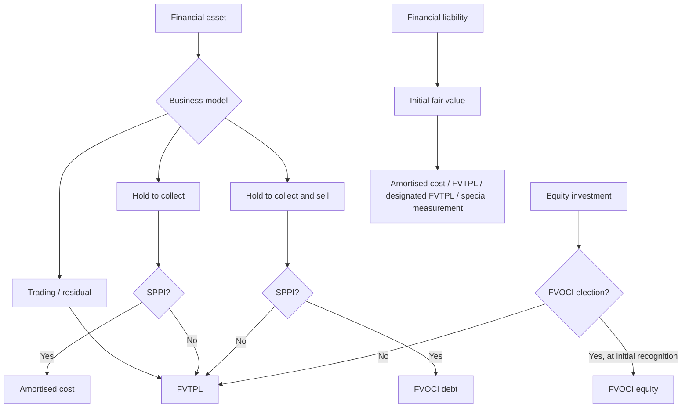

# Chapter 11, Unit 2: Classification and Measurement of Financial Assets and Financial Liabilities

## Exam Relevance

- This is the classification engine of the chapter.
- The examiner usually tests whether you can move from facts to category without confusion.
- Common question forms:
  - Is the asset amortised cost, FVOCI or FVTPL?
  - Is the business model hold-to-collect or hold-to-collect-and-sell?
  - Does the cash flow pass the SPPI test?
  - How do upfront fees and transaction costs affect EIR?
  - Is a liability amortised cost, FVTPL, designated FVTPL, or a special category?

## Core Intuition

For assets, ask two questions in order: what is the business model, and do the cash flows look like basic principal-and-interest cash flows? For liabilities, start from fair value and then follow the category rules.

## Concept Map

## Key Concepts

### 1. The asset classification ladder

Financial assets are classified using a two-step filter:

1. Business model test.
2. SPPI test.

If both are satisfied for hold-to-collect, the asset goes to amortised cost.

If the business model is hold-to-collect-and-sell and SPPI is satisfied, the debt instrument goes to FVOCI.

If neither route fits, or the instrument is held for trading, or the cash flows are not SPPI, the answer is FVTPL.

### 2. Amortised cost

Use amortised cost when:

- the asset is held to collect contractual cash flows; and
- those cash flows are only principal plus interest on the principal outstanding.

Meaning of amortised cost:

- start with initial fair value;
- subtract principal repayments;
- add or subtract cumulative EIR amortisation of premium / discount / fees;
- for financial assets, reduce further for loss allowance.

This is the best answer for plain debt instruments that are meant to behave like lending, not trading.

### 3. Business model intuition

Business model is about how the entity manages the portfolio, not just the one-off intent for one instrument.

Examples:

- hold-to-collect: treasury holds bonds to earn coupons and collect principal at maturity;
- hold-to-collect-and-sell: the entity collects cash flows but also sells assets when liquidity or portfolio strategy requires;
- trading: the portfolio is managed for short-term profit from price movements.

A forced sale because of an unexpected liquidity crisis does not automatically rewrite the original business model.

### 4. SPPI intuition

SPPI means only payments of principal and interest on the principal outstanding.

Interest here is a compensation for:

- time value of money;
- credit risk;
- basic lending risk and costs;
- a normal profit margin.

SPPI fails when returns are linked to equity prices, commodity prices, leverage-like returns, or other non-basic risks.

### 5. FVOCI debt

Use FVOCI for debt instruments when:

- the business model is both to collect and sell; and
- SPPI is satisfied.

Exam rhythm:

- interest revenue in profit or loss;
- fair value movement in OCI;
- on disposal, cumulative OCI is recycled to profit or loss for debt instruments.

### 6. FVOCI equity election

Equity investments are normally measured at FVTPL.

But if the investment is not held for trading, the entity may make an irrevocable election at initial recognition to present fair value changes in OCI.

Exam rhythm:

- dividend income goes to profit or loss;
- fair value changes go to OCI;
- no recycling of cumulative fair value gains or losses to profit or loss on disposal.

### 7. FVTPL

FVTPL is the residual bucket.

It captures:

- held-for-trading assets;
- debt instruments that fail SPPI;
- equity investments without the FVOCI election;
- derivatives not in hedging relationships.

### 8. Initial measurement and transaction costs

Initial measurement is usually fair value.

If part of the consideration relates to something else, isolate the fair value of the financial instrument.

Transaction costs:

- for amortised cost and FVOCI debt, directly attributable transaction costs are part of the initial carrying amount and get unwound through EIR;
- for FVTPL, transaction costs are generally expensed immediately;
- for FVOCI equity, transaction costs are part of initial recognition but do not change the later fair value through OCI pattern.

### 9. Effective interest rate intuition

EIR is the internal rate that spreads the difference between:

- what you pay or receive on day 1; and
- the contract's future cash flows

over the life of the instrument.

Why it matters:

- it turns premium, discount and fees into time-based interest income or expense;
- it makes the amortised cost curve smooth rather than jumpy;
- it is why a loan with upfront processing fees often has an effective yield above the stated coupon.

### 10. Financial liabilities

Upon initial recognition, financial liabilities are measured at fair value.

Subsequent classification is generally:

- amortised cost;
- FVTPL for held-for-trading liabilities and contingent consideration in a business combination;
- designated FVTPL when the designation solves an accounting mismatch or when a managed group is measured on a fair value basis;
- other special measurement bases for certain derecognition-continuing-involvement items, financial guarantees, and below-market loan commitments.

For liabilities at amortised cost, use EIR for interest cost.

For liabilities at FVTPL, fair value changes go to profit or loss, except the own-credit-risk component may go to OCI if that does not create or increase an accounting mismatch.

## Professor's Problem-Solving Framework

1. Identify the instrument: debt, equity, derivative, liability, or hybrid.
2. Check whether the asset is debt or equity.
3. For debt assets, test business model first.
4. Then test SPPI.
5. Classify into amortised cost, FVOCI or FVTPL.
6. For liabilities, identify whether the item is ordinary amortised cost, trading, designated FVTPL, or a special category.
7. Apply the measurement consequences and the EIR / fair value movement rule.

## Worked Examples

### Example 1

Problem:

An entity buys a plain government bond and intends to hold it to collect contractual coupon and principal.

Working:

The business model is hold-to-collect and the cash flows are basic principal and interest.

Answer:

The bond is measured at amortised cost.

### Example 2

Problem:

An entity buys a debt bond mainly to earn coupon income but expects to sell it before maturity if a better investment opportunity appears.

Working:

The business model is hold-to-collect-and-sell. If SPPI is satisfied, the debt instrument is not amortised cost.

Answer:

The bond is measured at FVOCI.

### Example 3

Problem:

The entity buys equity shares for strategic investment and chooses the FVOCI election on day 1.

Working:

Equity investments are not amortised cost. The FVOCI election is only available if the instrument is not held for trading and the election is made at initial recognition.

Answer:

The shares are measured at FVOCI, with dividends in profit or loss and fair value changes in OCI.

### Example 4

Problem:

A bank issues a 5-year loan at a stated 10 percent rate and charges an upfront processing fee.

Working:

The fee reduces the net day-1 carrying amount. EIR will be above 10 percent because the borrower receives less than the contractual amount but repays based on the full contractual schedule.

Answer:

Recognise the loan at fair value / net proceeds and unwind the discount using EIR over the term.

## Common Mistakes

- Treating every debt instrument as amortised cost just because the entity "plans to hold it".
- Forgetting that a sale can still fit hold-to-collect if it is not the business model's objective.
- Mixing up SPPI with a simple fixed-rate test.
- Forgetting that equity FVOCI is an irrevocable day-1 election and has no recycling to profit or loss.
- Posting transaction costs on FVTPL instruments into carrying amount instead of expense.
- Using coupon rate instead of EIR for amortised cost interest.
- Forgetting that liabilities at FVTPL can send own-credit-risk changes to OCI in the right case.

## Summary Tables

| Asset category | Condition | Measurement effect |
|---|---|---|
| Amortised cost | Hold to collect + SPPI | Interest via EIR in P&L; carrying amount amortised over life |
| FVOCI debt | Hold to collect and sell + SPPI | Fair value in OCI; interest in P&L; OCI recycled on disposal |
| FVOCI equity | Day-1 irrevocable election, not held for trading | Fair value changes in OCI; dividends in P&L; no recycling |
| FVTPL | Trading, SPPI fail, residual category, derivatives | Fair value changes in P&L |

| Liability category | Usual rule | Measurement effect |
|---|---|---|
| Amortised cost | Default for ordinary financial liabilities | Interest cost via EIR |
| FVTPL | Held for trading, contingent consideration, designated cases | Fair value changes in P&L, with own-credit-risk OCI treatment where applicable |
| Special basis | Derecognition-continuing involvement, guarantees, below-market commitments | Follow the specific rule set |

## Last-Day Revision

- Asset classification is business model plus SPPI.
- Hold to collect + SPPI = amortised cost.
- Hold to collect and sell + SPPI = FVOCI debt.
- Equity investments are normally FVTPL unless FVOCI is elected on day 1.
- Trading and non-SPPI items go to FVTPL.
- Initial measurement is fair value, with transaction costs capitalised only where the category allows it.
- EIR spreads premium, discount and fees across the instrument life.
- Financial liabilities start at fair value and then follow amortised cost / FVTPL / special rules.

## Doubts / Version-Sensitive Items

- SPPI is a strict contractual cash flow test. If cash flows are linked to equity prices, commodity prices, leverage, inverse floating rates, or other non-basic lending risks, do not assume amortised cost merely because the instrument is called a loan.
- Own-credit-risk OCI for financial liabilities designated at FVTPL is source-sensitive. Check whether recognizing own-credit risk in OCI would create or enlarge an accounting mismatch before final treatment.
- Reclassification is expected only when the business model changes. A mere change in intention for one instrument is not enough.
- SPPI edge cases with modified time value of money, prepayment features, or unusual indexation should be checked against the exact question facts.
- For liabilities designated at FVTPL, verify whether the own-credit-risk OCI exception is relevant in the question wording.
- Reclassification entries can turn on the exact source treatment date, so use the category at the reclassification date rather than the old label.
