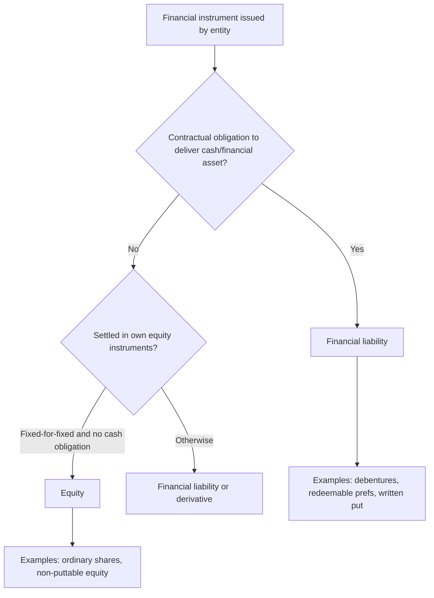

# Chapter 11, Unit 3: Financial Instruments - Equity and Financial Liabilities

## Exam Relevance

- This unit is tested through classification questions: equity or financial liability?
- The examiner likes contract wording that looks like equity but creates a cash obligation in substance.
- Common question forms:
  - Redeemable preference shares
  - Puttable instruments
  - Compound financial instruments
  - Fixed-for-fixed settlement clauses
  - Interest, dividends and transaction costs
- Most marks come from classification first, not from arithmetic.

## Core Intuition

If the issuer may have to deliver cash or another financial asset, the instrument is usually a financial liability; only a residual interest with no contractual cash obligation is equity.

## Concept Map

## Key Concepts

### 1. Substance Over Form

The legal label is never the final answer.

What matters:

- Who bears the obligation?
- Can the issuer avoid paying cash?
- Is the holder’s right a residual interest or a claim?

Exam trap:

- A security may be called "shares" and still be a financial liability if redemption is compulsory or economically unavoidable.

### 2. Financial Liability

A contract is a financial liability when it creates:

- a contractual obligation to deliver cash or another financial asset, or
- an obligation to exchange financial assets/liabilities under potentially adverse conditions, or
- a contract that will or may be settled in own equity instruments but is not equity under the fixed-for-fixed test.

Typical liability indicators:

- Mandatory redemption
- Fixed coupon plus principal repayment
- Holder put right requiring issuer cash settlement
- Variable number of shares for a fixed amount of cash

### 3. Equity Instrument

An equity instrument evidences a residual interest in the assets of the entity after deducting all liabilities.

Typical equity indicators:

- No contractual obligation to deliver cash
- Issuer has discretion over distributions
- Settlement only by issuing a fixed number of own equity instruments for a fixed amount of cash or another financial asset

### 4. Fixed-for-Fixed Test

This is the cleanest exam trigger in share-settlement questions.

| Settlement form | Result | Why |
|---|---|---|
| Fixed number of shares for fixed cash | Equity classification may be possible | No variability in quantity or consideration |
| Variable number of shares for fixed cash | Financial liability or derivative | The issuer has a cash-like obligation in substance |
| Fixed number of shares for variable cash | Usually not equity | Cash amount is not fixed |
| Variable shares for variable cash | Usually liability/derivative | Both sides are variable |

Exam trap:

- Do not confuse "settled in own shares" with "equity". The fixed-for-fixed condition must be satisfied.

### 5. Compound Financial Instruments

A compound instrument has two parts:

- liability component
- equity component

Typical example:

- convertible debenture

Reason:

- the issuer has a contractual obligation to repay principal and interest, which is the liability part
- the conversion right can be an equity component if the conversion settles into a fixed number of shares for a fixed amount

Working idea:

1. Measure the liability component first using market rate for similar non-convertible debt.
2. Residual amount becomes equity component.

Exam trap:

- If the conversion feature fails fixed-for-fixed, the entire conversion element may be a liability/derivative, not equity.

### 6. Puttable Instruments Exception

Some puttable instruments can still be classified as equity if all qualifying conditions are met.

The basic idea:

- the holder has the right to put the instrument back to the issuer for cash
- yet the instrument still represents the most subordinate class of instrument
- and it has features that are consistent with equity participation

Use this as an exception, not the default.

Checklist style:

- Instrument is the most subordinate class
- All holders have identical rights
- No contractual obligation for cash beyond limited redemption mechanics
- Cash flow link is based mainly on residual net assets
- No other contractual feature contradicts equity

Exam trap:

- If any one condition fails, the instrument usually falls back into financial liability.

### 7. Treasury Shares and Distributions

- Buyback or treasury shares reduce equity.
- Dividends on equity are distributions of profit, not interest expense.
- Interest on a financial liability goes through profit or loss.

This distinction often decides the final journal entry and the face of the statement of profit and loss.

## Professor's Problem-Solving Framework

1. Read the contract wording, not the instrument nickname.
2. Ask whether the issuer has a present or unavoidable obligation to pay cash or another financial asset.
3. If settlement is by own shares, apply the fixed-for-fixed test.
4. If the instrument has both debt and equity features, split it only if the rules allow a compound instrument.
5. State the classification, then attach the accounting consequence.

## Worked Examples

### Example 1

Problem:

An entity issues preference shares that must be redeemed after five years at face value with a fixed dividend.

Working:

- There is a contractual obligation to deliver cash on redemption.
- The fixed dividend strengthens the obligation picture.
- The legal form of "preference shares" does not change the substance.

Answer:

Classify as a financial liability.

### Example 2

Problem:

An entity issues convertible debentures, convertible into a fixed number of equity shares at the holder's option.

Working:

- Principal repayment creates a liability component.
- Conversion right may qualify as equity only if fixed-for-fixed is satisfied.
- The instrument is therefore a compound financial instrument.

Answer:

Separate into liability and equity components, subject to the exact conversion terms.

### Example 3

Problem:

A written contract allows settlement in a variable number of own shares equal to a fixed cash value.

Working:

- The issuer does not have a true equity-style fixed-for-fixed settlement.
- The obligation behaves like a cash obligation.

Answer:

Treat as a financial liability or derivative, not equity.

## Common Mistakes

- Treating legal share capital as equity without checking redemption or cash-settlement clauses
- Forgetting that substance over form controls the classification
- Applying fixed-for-fixed loosely instead of literally
- Assuming every convertible instrument is partly equity
- Misclassifying puttable instruments as liabilities without checking the exception
- Charging equity distributions to finance cost

## Summary Tables

| Topic | Meaning | Exam reminder |
|---|---|---|
| Substance over form | Contract economics beats label | Read the obligation first |
| Financial liability | Cash or financial-asset obligation | Redemption and put options matter |
| Equity | Residual interest | No contractual cash obligation |
| Fixed-for-fixed | Fixed shares for fixed amount | Core test for equity settlement |
| Compound instrument | Debt plus equity element | Split only when allowed |
| Puttable exception | Limited equity classification | All conditions must be checked |

| Instrument clue | Likely answer | Trap |
|---|---|---|
| Mandatory redemption | Liability | "Share" label misleads |
| Holder put right | Liability unless exception | Check cash obligation |
| Fixed shares for fixed cash | Equity possible | Must still satisfy all conditions |
| Variable shares for fixed cash | Liability/derivative | Not fixed-for-fixed |
| Convertible debenture | Compound | Split only if conversion is equity-like |

## Last-Day Revision

- A financial liability exists when cash or another financial asset must be delivered.
- Equity is a residual interest, not a promise to pay.
- The instrument name is irrelevant if the substance says otherwise.
- Fixed-for-fixed is the key filter for own-equity settlement.
- Compound instruments need split accounting only when the conversion element is truly equity.
- Puttable instruments are a narrow exception, not the default.
- Dividends on equity are not finance costs.
- Treasury shares reduce equity.

## Doubts / Version-Sensitive Items

- Fixed-for-fixed means a fixed amount of cash or another financial asset for a fixed number of the entity's own equity instruments. If either leg varies, equity classification becomes risky.
- Puttable-instrument exceptions are narrow. Do not treat every redeemable or puttable share as equity; check the specific exception conditions in the source material.
- Compound instruments require split accounting on initial recognition: liability first, residual to equity. Do not remeasure the equity component merely because market rates later change.
- Check the exact ICAI wording for the puttable instruments exception in the source PDF.
- Verify whether the study-note version treats all conversion features under the same fixed-for-fixed wording or separates some edge cases.
- Confirm whether any amendment-linked terminology around own-equity settlement or compound instruments has been updated in the source material.
- If the PDF contains a specific numeric working example for liability/equity split, align the formula wording to that illustration in a later pass.
