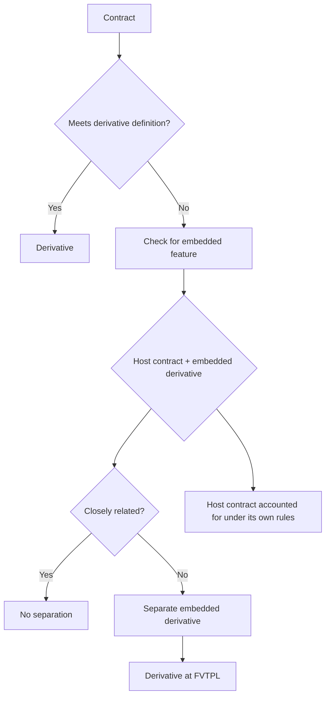

# Chapter 11, Unit 4: Derivatives and Embedded Derivatives

## Exam Relevance

- This unit is tested through definition-based and classification questions.
- The examiner likes hybrid contracts where a derivative is hidden inside a host contract.
- Common question forms:
  - Is the contract a derivative?
  - Does an embedded derivative need separation?
  - What is the host contract?
  - Is the embedded feature closely related?
- Traps often arise when the answer depends on whether the host is a financial asset, financial liability or non-financial contract.

## Core Intuition

A derivative is a small or nil upfront bet on a future underlying, and an embedded derivative is separated only when the host contract and the hidden derivative risk are not closely related.

## Concept Map

## Key Concepts

### 1. Derivative Definition

A derivative typically has three features:

- its value changes in response to an underlying
- it requires little or no initial net investment
- it is settled at a future date

Underlying may be:

- interest rate
- price of commodity
- foreign exchange rate
- index
- credit rating
- other variable

Common examples:

- forward contract
- option
- swap

Exam trap:

- A contract can look complicated, but if it has substantial upfront investment or no underlying-driven variability, it may fail the derivative definition.

### 2. Forward Contract

A forward is an agreement to buy or sell an item at a future date at a fixed price.

Why it matters:

- value changes with market movements
- initial net investment is usually nil or small
- settlement occurs later

Quick example:

- agreeing today to buy shares in six months at today’s fixed price is a classic derivative pattern.

### 3. Option Contract

An option gives one party the right, but not the obligation, to buy or sell an asset.

Exam trap:

- The holder has discretion; the writer has the obligation if the option is exercised.
- The premium paid is usually the initial investment.

### 4. Swap Contract

A swap is an agreement to exchange cash flows.

Common exam area:

- interest rate swap
- currency swap

Logic:

- one side pays fixed, another pays floating
- the contract’s value changes with market variables

### 5. Embedded Derivative

An embedded derivative is a component of a hybrid contract that causes some cash flows to vary in a derivative-like way.

The host contract is the larger contract that is not itself accounted for as a derivative.

Typical structure:

- host contract = debt, lease, purchase contract, or other base agreement
- embedded derivative = hidden variable feature inside the host

Examples:

- commodity-linked interest in a debt instrument
- foreign currency linked payment in a non-financial contract
- equity-linked settlement feature inside a host agreement

### 6. Separation Test

Separate the embedded derivative when:

- the economic characteristics and risks of the embedded derivative are not closely related to those of the host contract
- the hybrid contract is not already measured at fair value through profit or loss in its entirety
- a separate instrument with the same terms would meet the derivative definition

Simple exam logic:

1. Identify the host.
2. Identify the embedded feature.
3. Ask whether the risk is closely related.
4. If not closely related, separate and account for the derivative at fair value through profit or loss.

### 7. Closely Related Test

This is the heart of the trap.

Usually closely related:

- interest rate feature in a debt host
- prepayment option that is reasonably related to the host loan
- foreign currency feature in some contracts where the currency is the functional/operating currency contextually relevant

Usually not closely related:

- equity index-linked return in a debt host
- commodity price-linked payment in a standard loan
- leverage or exotic payoff hidden inside an ordinary host

Exam trap:

- Do not separate merely because a feature looks variable. The real question is whether the variability is closely related to the host.

### 8. Host Contract Focus

The host determines the base accounting treatment.

Host types:

| Host type | Basic treatment | Embedded derivative rule |
|---|---|---|
| Financial liability host | Account under financial liability rules | Separate if not closely related |
| Non-financial host | Account under relevant standard | Separate if criteria met |
| Financial asset host | Apply the financial asset classification rules to the whole contract | Embedded derivatives are generally not separated |

Exam trap:

- Many students try to split every hybrid contract. That is wrong for financial asset hosts.

## Professor's Problem-Solving Framework

1. Decide whether the contract is a derivative on its own.
2. If not, identify whether there is a host contract and an embedded feature.
3. Check whether the host is financial asset, financial liability or non-financial.
4. Apply the "closely related" test.
5. If separation is required, account for the embedded derivative at fair value through profit or loss and the host under its own standard.

## Worked Examples

### Example 1

Problem:

A debt instrument pays interest at a rate linked to a commodity price.

Working:

- The debt is the host contract.
- The commodity linkage is derivative-like.
- Commodity risk is not usually closely related to a plain debt host.

Answer:

Separate the embedded derivative if the other criteria are met.

### Example 2

Problem:

A loan includes a prepayment option that allows the borrower to repay early at an amount close to amortized cost.

Working:

- The option is embedded in the loan host.
- The feature is generally consistent with the host’s lending economics.

Answer:

Usually no separation because the feature is closely related.

### Example 3

Problem:

A contract on its face is a forward agreement with no upfront investment, settled three months later, with value linked to a stock index.

Working:

- Value changes with an underlying.
- Initial investment is minimal or nil.
- Settlement is deferred.

Answer:

Classify as a derivative.

## Common Mistakes

- Calling every variable-payment clause a derivative
- Forgetting the initial net investment condition
- Ignoring the future settlement condition
- Splitting embedded derivatives inside a financial asset host as if separation always applies
- Assuming "host contract" means only a debt host
- Treating close relationship as a vague feeling instead of a real risk comparison

## Summary Tables

| Topic | Meaning | Exam reminder |
|---|---|---|
| Derivative | Value changes with underlying, small initial investment, future settlement | All three features matter |
| Forward | Buy/sell later at fixed terms | Classic derivative |
| Option | Right, not obligation | Writer bears the obligation |
| Swap | Exchange of cash flows | Market-variable exchange |
| Embedded derivative | Derivative-like feature inside a host | Separation depends on close relationship |
| Host contract | Base agreement | Drives the primary accounting |

| Situation | Separate embedded derivative? | Trap |
|---|---|---|
| Host risk and embedded risk closely related | No | Variable does not automatically mean separation |
| Host and embedded risks not closely related | Yes, if other conditions met | Account derivative at FVTPL |
| Financial asset host | Generally no embedded separation | Do not over-split the contract |
| Non-financial or liability host with exotic feature | Possible separation | Check the full test |

## Last-Day Revision

- Derivative = underlying-driven value change + little or no initial net investment + future settlement.
- Forward, option and swap are the cleanest examples.
- Embedded derivative is a hidden derivative-like feature inside a host.
- Separation happens only if the host risk and embedded risk are not closely related.
- Always identify the host contract first.
- Financial asset hosts are the big trap: embedded derivatives are generally not separated.
- If separated, the embedded derivative is measured at fair value through profit or loss.

## Doubts / Version-Sensitive Items

- Verify the exact ICAI wording on when embedded derivatives are not separated in a financial asset host.
- Check whether the source PDF includes a separate carve-out or illustration for own-use or non-financial contracts, and align that wording if needed.
- Confirm the chapter’s exact terminology for "closely related" examples before the final exam pass.
- If the source PDF has a standard illustration on commodity-linked or currency-linked hybrids, mirror its fact pattern in a later refinement.

