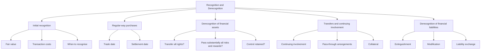
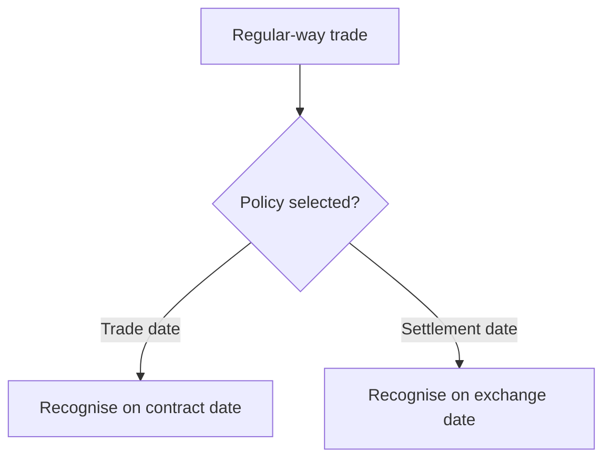
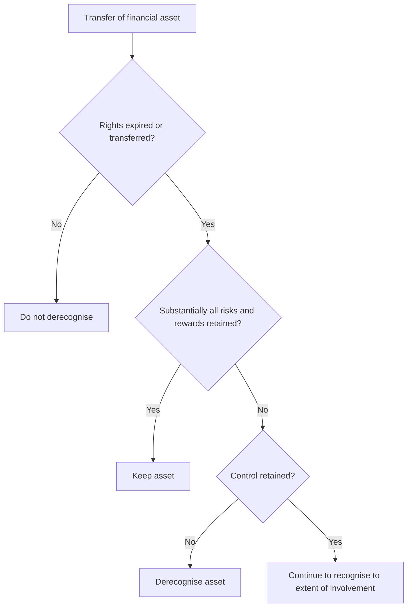

# Chapter 11, Unit 5: Recognition and Derecognition of Financial Instruments

## Exam Relevance

- This unit is the bridge between classification and measurement on one side, and hedge accounting on the other.
- The examiner usually tests:
  - when a financial asset or financial liability is recognised,
  - what "regular-way purchase" means,
  - when a transfer really removes a financial asset from the balance sheet,
  - continuing involvement and pass-through structures,
  - when a liability is extinguished,
  - the difference between derecognition and mere modification.
- Frequent traps:
  - confusing trade date and settlement date,
  - thinking every transfer means derecognition,
  - ignoring continuing involvement,
  - treating a debt modification as extinction without checking the 10 percent test / substantial modification logic,
  - forgetting that a gain or loss on derecognition is usually the balancing figure between carrying amount and consideration received or paid.

## Core Intuition

Recognition asks: **when does the instrument enter the books?**

Derecognition asks: **has the entity really given up the asset or really ended the liability?**

The exam revolves around control, risks and rewards, and continuing exposure.

## Concept Map

## Key Concepts

### 1. Initial recognition

A financial asset or financial liability is recognised when, and only when, the entity becomes a party to the contractual provisions of the instrument.

That is the legal-form trigger the examiner likes.

#### Initial measurement

| Item | Initial measurement | Exam reminder |
|---|---|---|
| Financial asset | Fair value plus or minus transaction costs, depending on category | Transaction costs are not always expensed |
| Financial liability | Fair value minus transaction costs, if not at FVTPL | Liability recognition is not just the cash received |

For instruments measured at fair value through profit or loss, transaction costs are generally expensed as incurred.

#### Practical meaning

- On day 1, do not start with amortised cost, impairment, or hedge logic.
- First ask whether the contract creates a financial asset or liability.
- Then ask what category the instrument belongs to for measurement after recognition.

### 2. Regular-way purchase or sale

A regular-way purchase or sale of a financial asset is one that requires delivery of the asset within the time frame generally established by regulation or convention in the market place.

The standard allows two recognition dates:

| Method | What it means | Exam trap |
|---|---|---|
| Trade date accounting | Recognise on the date the entity commits to buy or sell | Often used when control passes at trade date |
| Settlement date accounting | Recognise on the date cash / asset is exchanged | Do not mix this with trade date gain/loss logic |

The important rule is consistency:

- choose one policy for regular-way purchases and sales of financial assets,
- apply it consistently to a category of assets.

### 3. Derecognition of financial assets

A financial asset is derecognised when the contractual rights to the cash flows from the asset expire, or when the asset is transferred and the transfer qualifies for derecognition.

The transfer analysis is the heart of the question.

#### Step 1: Has there been a transfer?

A transfer happens when the entity either:

- transfers the contractual rights to receive the cash flows, or
- retains the contractual rights but assumes a contractual obligation to pass those cash flows on to one or more recipients under a pass-through arrangement.

#### Step 2: Are substantially all risks and rewards transferred?

If substantially all risks and rewards are transferred, derecognise the asset.

If substantially all risks and rewards are retained, keep the asset on the books.

#### Step 3: If neither is clear, who controls the asset?

If the entity neither transfers nor retains substantially all risks and rewards, then examine control.

- If control is transferred, derecognise.
- If control is retained, continue recognising to the extent of continuing involvement or exposure.

#### Decision tree

### 4. Continuing involvement

Continuing involvement is the part of the asset or cash flow exposure that the transferor still retains after transfer.

Exam language:

- if the transferor retains some exposure, do not jump straight to full derecognition;
- measure the asset / liability arising from the retained involvement where the standard requires it;
- any gain or loss is limited to the rights and obligations transferred.

Typical continuing involvement triggers:

- recourse provisions,
- guarantees,
- call / put options,
- subordinated interests,
- servicing arrangements with exposure to default risk.

### 5. Pass-through arrangements

The transferor may keep the legal right to receive cash flows but still pass them to another party.

To qualify as a transfer, the pass-through obligation must be more than a loose promise.

Watch for:

- no obligation to pay unless equivalent cash flows are collected,
- no right to pledge or sell the asset,
- obligation to remit cash flows without material delay,
- no significant reinvestment of the collected amounts.

### 6. Collateral and derecognition

Pledging collateral does not by itself remove the asset from the balance sheet.

The key question is still whether the contractual rights or control have been transferred.

Exam trap:

- "The asset is pledged" does not automatically mean derecognition.
- "The lender holds security" does not automatically mean recognition of the collateral as its own asset.

### 7. Financial liability derecognition

A financial liability is derecognised when, and only when, the obligation is extinguished.

Extinguishment happens when the obligation is discharged, cancelled, or expires.

#### Common routes

| Event | Result | Exam reminder |
|---|---|---|
| Cash repayment | Liability is removed | Straightforward extinguishment |
| Legal release by creditor | Liability is removed | Check legal evidence |
| Substantial modification / exchange | Old liability may be derecognised and new one recognised | Test the change carefully |

#### Modification versus extinguishment

The exam often asks whether the old liability is gone or merely changed.

Use the standard modification logic:

- if the terms are substantially different, treat it as extinguishment of the old liability and recognition of a new one,
- otherwise, adjust the carrying amount and recognise a modification gain or loss.

### 8. Gain or loss on derecognition

When an asset is derecognised, gain or loss is the difference between:

- the carrying amount, and
- the consideration received plus or minus any new asset or liability recognised.

When a liability is derecognised, gain or loss is the difference between:

- the carrying amount of the liability, and
- the consideration paid, including any non-cash assets transferred.

Do not forget transaction costs or fees if the question gives them.

## Professor's Problem-Solving Framework

1. Identify whether the question is about initial recognition or derecognition.
2. Classify the instrument as asset or liability.
3. For regular-way purchases, decide trade date or settlement date policy.
4. For assets, test transfer, risks and rewards, and control.
5. For liabilities, test extinguishment versus modification.
6. Check whether continuing involvement survives the transfer.
7. Compute the gain or loss only after the classification is settled.

## Worked Examples

### Example 1: Regular-way purchase

**Problem:**
An entity agrees on 1 June to buy shares that will settle on 5 June. The entity uses trade date accounting for regular-way purchases.

**Working:**
- The commitment date is 1 June.
- Recognise the financial asset on trade date.

**Answer:**
Record the investment on 1 June, not 5 June.

### Example 2: Transfer with continuing involvement

**Problem:**
An entity transfers receivables but guarantees part of the credit loss to the transferee.

**Working:**
- There is a transfer of rights.
- The guarantee means continuing involvement remains.
- Derecognition is limited to the portion transferred without continuing exposure.

**Answer:**
Do not assume full derecognition; account for the retained guarantee exposure.

### Example 3: Liability modification

**Problem:**
The lender agrees to revise the coupon and maturity of an existing borrowing without full legal release.

**Working:**
- This is a modification analysis, not automatic extinguishment.
- Compare the revised terms with the original liability.

**Answer:**
Treat as extinguishment only if the modification is substantial; otherwise recognise a modification gain or loss.

## Common Mistakes

- Treating settlement date as the only possible recognition date.
- Forgetting that transfer of legal title alone is not enough.
- Ignoring retained risks through guarantees or recourse.
- Derecognising an asset even though control or exposure remains.
- Calling every debt renegotiation an extinguishment.
- Mixing up fair value treatment at day 1 with measurement after day 1.

## Summary Tables

### Asset derecognition checklist

| Question | Yes | No |
|---|---|---|
| Have the contractual rights expired or been transferred? | Go on to risk / reward test | No derecognition |
| Are substantially all risks and rewards retained? | Keep asset | Go to control test |
| Is control retained? | Continue to recognise to extent required | Derecognise |

### Liability derecognition checklist

| Question | Yes | No |
|---|---|---|
| Has the obligation been discharged, cancelled, or expired? | Derecognise | Continue liability |
| Are the new terms substantially different? | Derecognise old and recognise new | Modify carrying amount |

### Initial recognition quick sheet

| Instrument | Recognition trigger | Initial measurement |
|---|---|---|
| Financial asset | Party to contractual provisions | Fair value plus / minus transaction costs |
| Financial liability | Party to contractual provisions | Fair value minus transaction costs unless FVTPL |

## Last-Day Revision

- Recognition starts when the entity becomes party to the contract.
- Regular-way purchases can use trade date or settlement date, but the policy must be consistent.
- Financial assets are derecognised only when rights expire or a valid transfer occurs.
- Transfer analysis runs in this order: rights, risks and rewards, control, continuing involvement.
- Pledging collateral does not itself cause derecognition.
- Financial liabilities are derecognised only on extinguishment.
- Debt modification is not the same as extinguishment.
- Gains or losses on derecognition are the balancing difference after comparing carrying amount and consideration.
- If the question mentions guarantee, recourse, servicing, or subordination, think continuing involvement.

## Doubts / Version-Sensitive Items

- For regular-way purchases and sales, check whether the question uses trade-date or settlement-date accounting and apply the chosen policy consistently for the same class of financial assets.
- Derecognition of financial assets is a sequence, not a single test: check expiry/transfer of rights, transfer of risks and rewards, and control/continuing involvement.
- For financial liabilities, substantial modification/extinguishment wording is source-sensitive. If the question gives discounted cash flow comparison or revised terms, follow the current ICAI example structure.
- The exact wording for the trade date versus settlement date policy should be checked against the source PDF if the exam asks for ICAI phrasing.
- The precise substantial-modification test and any numeric threshold, if stated in the chapter source, should be verified before final polishing.
- The treatment of fees, costs, and any special liability exchange wording can vary slightly across exam manuals and question banks.
