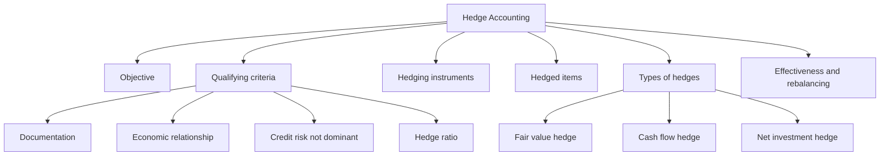
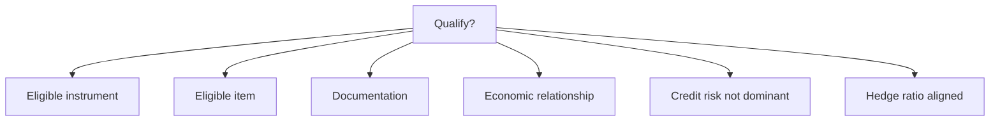
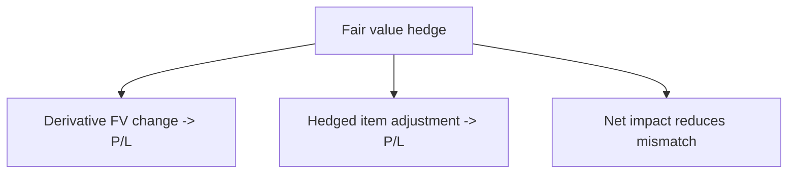
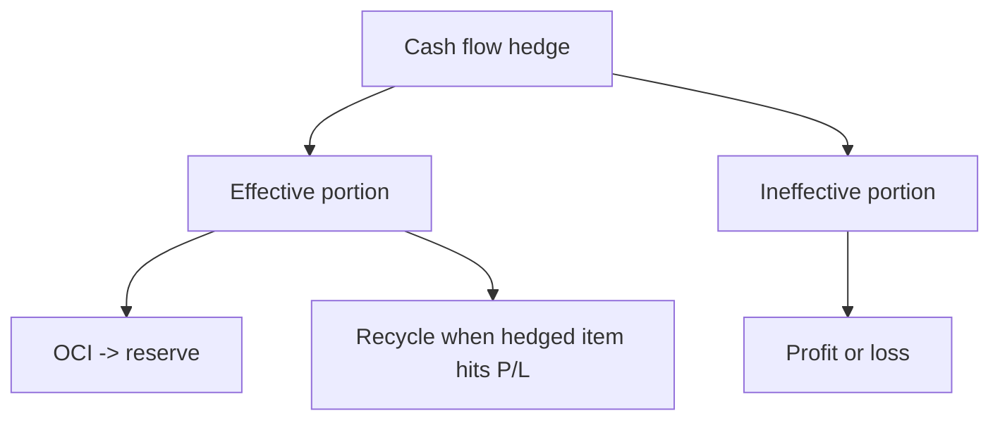

# Chapter 11, Unit 6: Hedge Accounting

## Exam Relevance

- Hedge accounting is one of the most practical and trap-heavy areas in Chapter 11.
- The examiner usually tests:
  - the objective of hedge accounting,
  - whether a hedge relationship qualifies,
  - eligible hedging instruments and hedged items,
  - fair value hedge, cash flow hedge, and net investment hedge,
  - hedge effectiveness and rebalancing,
  - accounting entries in OCI, profit or loss, and the reserve.
- Frequent traps:
  - assuming every derivative can be designated as a hedge,
  - confusing the risk management objective with the accounting entries,
  - forgetting that cash flow hedge gains can sit in OCI first,
  - misclassifying the hedged risk in a fair value hedge,
  - overlooking ineffectiveness and designation documentation,
  - treating a hedge relationship as valid without checking economic relationship and credit risk dominance.

## Core Intuition

Hedge accounting is a matching tool.

It tries to reduce accounting mismatch by linking the derivative result to the hedged item's result in the same period.

The economic hedge may work even when the accounting hedge fails, so the exam keeps the two separate.

## Concept Map

## Key Concepts

### 1. Objective of hedge accounting

The objective is to represent, in the financial statements, the effect of risk management activities using financial instruments to manage exposures arising from particular risks that could affect profit or loss or OCI.

Plain English:

- if the entity hedges a risk economically, the accounting should not create fake volatility;
- the accounting should show the derivative and the hedged item in a way that reflects the risk management strategy.

That is why hedge accounting is elective and tightly controlled.

### 2. The qualifying criteria

A hedge relationship qualifies only if all the following are met:

1. There is an eligible hedging instrument.
2. There is an eligible hedged item.
3. There is formal designation and documentation at inception.
4. There is an economic relationship between hedged item and hedging instrument.
5. Credit risk does not dominate the value changes.
6. The hedge ratio is consistent with actual risk management.

#### Documentation

At inception, the entity must document:

- the risk management objective,
- the hedge relationship,
- the hedged risk,
- the hedging instrument,
- the hedged item,
- how effectiveness will be assessed,
- how hedge ratio was determined.

No documentation at inception means no hedge accounting, even if the hedge works perfectly later.

### 3. Hedging instruments

Most hedge instruments are derivatives, but the standard allows a limited set of non-derivative instruments in certain cases.

| Instrument | Usual status | Exam reminder |
|---|---|---|
| Forward, future, option, swap | Common hedging instruments | Derivative by itself is not enough; designation still needed |
| Non-derivative financial asset or liability | Limited use in foreign currency risk hedges | Do not generalise beyond the standard's permitted cases |

Important trap:

- an item can be a derivative and still not qualify for hedge accounting if it is not designated properly;
- an item can be designated but still fail if the criteria are not met.

### 4. Hedged items

An eligible hedged item can be:

- a recognised asset or liability,
- an unrecognised firm commitment,
- a highly probable forecast transaction,
- a net investment in a foreign operation.

The hedged item can be:

- a single item,
- a group of items,
- a component of an item, if the component is separately identifiable and reliably measurable.

### 5. Fair value hedge

A fair value hedge hedges exposure to changes in fair value of a recognised asset or liability, or an unrecognised firm commitment, or a component of either, attributable to a particular risk.

Typical example:

- fixed-rate debt hedged for interest-rate risk,
- firm commitment to buy an asset hedged for price risk.

#### Accounting logic

- the hedging instrument is remeasured at fair value through profit or loss,
- the hedged item is adjusted for the hedged risk, with the offsetting gain or loss also through profit or loss.

#### Exam cue

Fair value hedge is about protecting the carrying amount from fair value movements.

### 6. Cash flow hedge

A cash flow hedge hedges exposure to variability in cash flows that could affect profit or loss, or a forecast transaction, or the foreign currency risk of a recognised asset or liability, firm commitment, or highly probable forecast transaction.

Typical example:

- floating-rate debt converted to fixed through an interest rate swap,
- forecast purchase in foreign currency.

#### Accounting logic

- the effective portion of the hedge gain or loss goes to OCI and is accumulated in the cash flow hedge reserve,
- the ineffective portion goes to profit or loss,
- amounts in OCI are reclassified when the hedged item affects profit or loss, or adjusted against the related non-financial asset or liability where applicable.

#### Exam cue

Cash flow hedge is about future cash flow volatility, so OCI is the parking place until the forecasted item affects profit or loss.

### 7. Net investment hedge

A net investment hedge hedges the foreign currency exposure of a net investment in a foreign operation.

The accounting follows a pattern similar to cash flow hedge:

- effective portion in OCI,
- reclassified to profit or loss on disposal of the foreign operation.

This is the standard's way of linking translation exposure with hedge accounting.

### 8. Hedge effectiveness

The old bright-line tests are not the exam focus now.

The current model looks for:

- economic relationship,
- effect of credit risk not dominating,
- hedge ratio that reflects actual risk management.

That means the examiner is testing judgement, not rote percentages.

#### Practical check

| Check | What you ask | Trap |
|---|---|---|
| Economic relationship | Do value changes generally move in opposite directions? | Correlation is not just a guess |
| Credit risk | Is credit risk overwhelming the value changes? | Counterparty concerns can break effectiveness |
| Hedge ratio | Is the quantity ratio consistent with risk management? | Over-hedging or under-hedging can need rebalancing |

### 9. Rebalancing and discontinuation

If the hedge ratio no longer reflects the actual risk management objective, the entity may rebalance the hedge relationship.

Rebalancing means:

- adjusting the designated quantities so the relationship continues,
- not redesignating just because the market moved.

Discontinuation occurs when the hedge relationship no longer meets the qualifying criteria, or the risk management objective changes, or the hedging instrument expires / is sold / terminated.

Exam trap:

- discontinuation is not the same as "the derivative was ineffective for one month";
- ineffectiveness and discontinuation are different ideas.

### 10. Cost of hedging and other trap zones

Some components of options, forward points, and currency basis spreads may be treated specially in some hedge designs.

For exam purposes:

- do not assume every fair value change of the derivative goes straight to profit or loss in the same way,
- read the designation closely,
- check whether the item is designated as the intrinsic value only, or with the time value and other components.

This is a high-risk area for wording errors.

## Professor's Problem-Solving Framework

1. Identify the risk management objective and the hedge type.
2. Check whether the hedging instrument and hedged item are eligible.
3. Verify formal designation and documentation.
4. Test economic relationship, credit risk, and hedge ratio.
5. Classify the hedge as fair value, cash flow, or net investment.
6. Post the derivative and hedged item effects to the right place: profit or loss, OCI, or reserve.
7. Recheck ineffectiveness, rebalancing, or discontinuation facts before finalising.

## Worked Examples

### Example 1: Fair value hedge of fixed-rate debt

**Problem:**
An entity hedges the fair value interest-rate exposure of fixed-rate borrowing using an interest rate swap.

**Working:**
- The borrowing is a recognised liability.
- The exposure is to fair value changes from interest-rate risk.
- The swap is designated as the hedging instrument.

**Answer:**
This is a fair value hedge. Both the swap and the hedged fair value movement go through profit or loss.

### Example 2: Forecast foreign purchase

**Problem:**
An entity hedges the USD cost of a highly probable forecast purchase using a forward contract.

**Working:**
- The risk is future cash flow variability.
- The hedge instrument is a derivative.
- Effective gains or losses are parked in OCI.

**Answer:**
This is a cash flow hedge. Reclassify from OCI when the purchase affects profit or loss, or include in the asset cost if the standard requires basis adjustment.

### Example 3: Net investment hedge

**Problem:**
A parent hedges its foreign subsidiary investment using foreign currency borrowing.

**Working:**
- The exposure is translation risk on a net investment.
- The qualifying hedge relationship can be designated as a net investment hedge.

**Answer:**
Account for it as a net investment hedge, with the effective portion in OCI until disposal.

## Common Mistakes

- Assuming hedge accounting is automatic once a derivative exists.
- Forgetting inception documentation.
- Mixing up fair value hedge and cash flow hedge.
- Sending all derivative gains to OCI.
- Ignoring ineffective portions.
- Using a hedge ratio that does not reflect real risk management.
- Treating a forecast transaction as if it were already a recognised item.
- Missing the difference between rebalancing and discontinuation.

## Summary Tables

### Hedge type comparison

| Hedge type | What it protects | Where hedge instrument goes | Where hedged item effect goes | Main exam cue |
|---|---|---|---|---|
| Fair value hedge | Fair value changes of recognised item / firm commitment | Profit or loss | Profit or loss for hedged risk movement | Reduces carrying amount volatility |
| Cash flow hedge | Cash flow variability | Effective portion in OCI, ineffective in P/L | OCI first, then recycle or basis adjust | Protects future cash flows |
| Net investment hedge | Foreign currency exposure in foreign operation | Similar to cash flow hedge | OCI until disposal | Translation exposure |

### Qualifying criteria checklist

| Condition | Must have? | Trap |
|---|---|---|
| Eligible hedging instrument | Yes | Not every derivative works automatically |
| Eligible hedged item | Yes | Must be identifiable and measurable |
| Formal documentation | Yes, at inception | Missing documentation kills hedge accounting |
| Economic relationship | Yes | Random offset is not enough |
| Credit risk not dominant | Yes | Counterparty risk can break the hedge |
| Hedge ratio aligned with risk management | Yes | Not a purely accounting ratio |

### Profit or loss / OCI map

| Item | Usual accounting location |
|---|---|
| Fair value changes in fair value hedge derivative | Profit or loss |
| Hedged item fair value movement for hedged risk | Profit or loss |
| Effective portion of cash flow hedge | OCI |
| Ineffective portion of cash flow hedge | Profit or loss |
| Effective portion of net investment hedge | OCI |

## Last-Day Revision

- Hedge accounting is a matching tool, not a valuation shortcut.
- Qualifying criteria matter before the hedge starts.
- Documentation at inception is mandatory.
- Fair value hedge = fair value risk, profit or loss on both sides.
- Cash flow hedge = future cash flow variability, OCI first.
- Net investment hedge = foreign operation exposure, OCI first.
- Ineffectiveness always matters.
- Rebalancing is not discontinuation.
- Economic relationship, credit risk, and hedge ratio are the modern effectiveness test.
- If the question uses "highly probable", "firm commitment", or "net investment", check the hedge type carefully.

## Doubts / Version-Sensitive Items

- Hedge accounting is optional but rule-bound. Do not apply it unless formal designation, risk management objective, eligible hedging instrument/item, and effectiveness requirements are satisfied.
- Hedge effectiveness under Ind AS 109 is not the old mechanical 80-125 percent shortcut. Focus on economic relationship, credit risk dominance, and hedge ratio consistency.
- Cost-of-hedging components such as forward points, currency basis spread, and time value of options are source-sensitive; check whether the question asks for designation of the full derivative or only selected components.
- The exact source wording for effectiveness assessment and any sub-components of the hedge instrument should be cross-checked against the PDF before final polishing.
- Any detailed treatment of forward points, time value, or currency basis spread should be confirmed against the chapter source and the current ICAI framing.
- Where the question mixes hedge accounting with recognition or derecognition of the underlying instrument, the order of analysis may need to follow the exact facts in the PDF.
