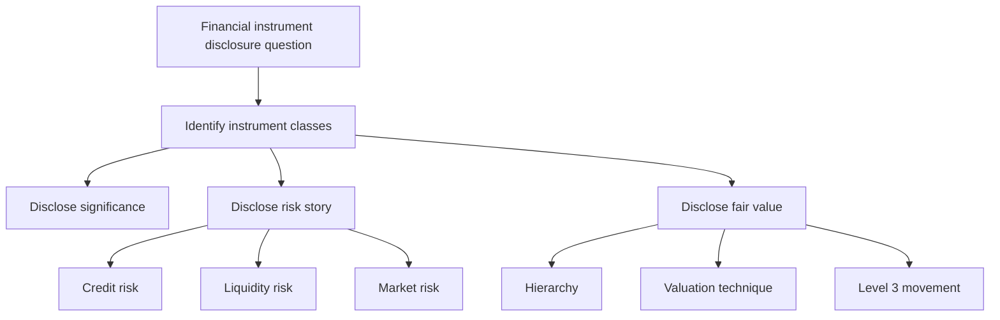
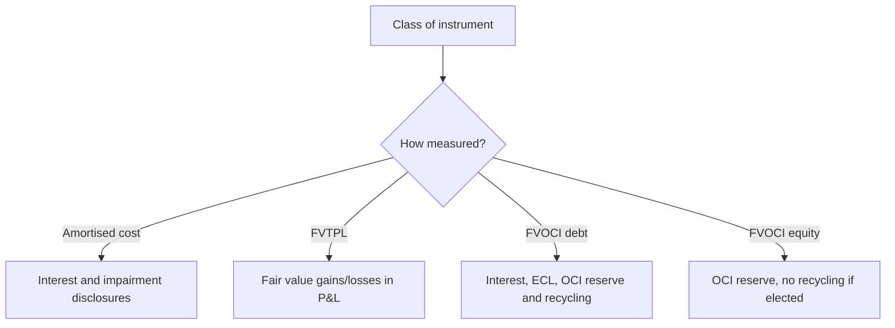
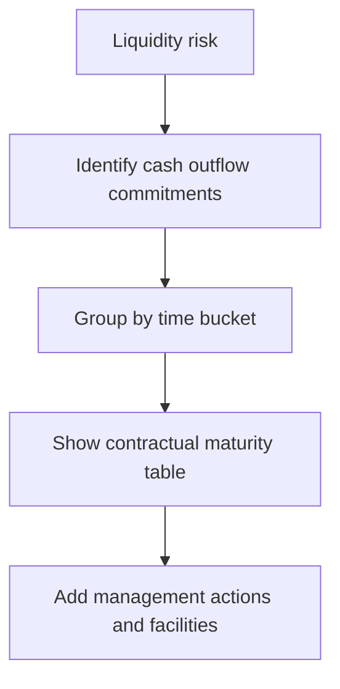

# Chapter 11 - Unit 7: Financial Instruments Disclosures

## Exam Relevance

- This unit is usually tested as a note-disclosure chapter, not a pure computation chapter.
- The examiner likes questions on significance, class-wise presentation, credit risk, liquidity risk, market risk and fair value hierarchy.
- A common twist is to mix Ind AS 107 disclosures with Ind AS 109 classification and then ask for the correct note format.
- Good answers show the disclosure logic first, then the tables, then the short conclusion.

## Core Intuition

Financial instrument disclosures are meant to tell the user two things: what the instruments mean to the entity, and what risks they carry.

## Concept Map

## Key Concepts

### 1. What the disclosure note is trying to show

The note is not only a list of balances. It explains:

- what financial instruments exist,
- how significant they are to the statement of financial position and performance,
- what risks they create, and
- how fair value was determined.

Think of it as a bridge between the accounting classification and the user's risk assessment.

### 2. Significance disclosures

The significance part usually asks for carrying amounts, categories and income/expense related to financial assets and liabilities.

Typical disclosure buckets:

| Bucket | What the examiner expects |
|---|---|
| Financial assets at amortised cost | Carrying amount, interest income, impairment impact |
| Financial assets at FVTPL | Fair value, gains/losses in profit or loss |
| Financial assets at FVOCI | Carrying amount, fair value reserve movement, recycling rules where applicable |
| Financial liabilities at amortised cost | Carrying amount, finance cost / interest expense |
| Financial liabilities at FVTPL | Fair value changes, own credit effects where relevant |

The exact line items depend on the source PDF and the entity facts, but the idea is always the same: show the class, the measurement basis and the effect on profit or loss / OCI.

### 3. Credit risk disclosures

Credit risk answers usually revolve around the chance that the counterparty will fail to pay.

What to disclose:

- exposure to credit risk,
- how the entity manages it,
- credit quality of financial assets,
- ageing of overdue amounts,
- collateral or other credit enhancements where relevant,
- loss allowance movement for expected credit losses.

For a practical answer, the examiner usually wants the narrative plus a compact table.

| Credit risk item | What to mention |
|---|---|
| Exposure | Gross carrying amount or maximum exposure to loss |
| Management | Limits, collateral, monitoring, diversification |
| Ageing | Not past due, 1-30 days, 31-90 days, more than 90 days, or a similar source-based bucket |
| Loss allowance | Opening balance, charge, write-offs, reversals, closing balance |

### 4. Liquidity risk disclosures

Liquidity risk asks whether the entity can meet its payment obligations when they fall due.

Expected disclosure content:

- maturity analysis for financial liabilities,
- contractual undiscounted cash outflows,
- management of funding pressure,
- unused borrowing facilities, if relevant,
- concentration of repayment dates.

### 5. Market risk disclosures

Market risk covers sensitivity to changes in market variables.

The three usual drivers are:

- interest rate risk,
- currency risk,
- other price risk.

The note often asks for sensitivity analysis showing the effect of a reasonably possible change in the risk variable.

| Market risk type | Typical disclosure focus |
|---|---|
| Interest rate risk | Effect of rate change on profit or loss / OCI |
| Currency risk | Effect of exchange rate change on monetary items and derivatives |
| Other price risk | Effect of equity price or commodity price changes |

The key exam point is to keep the sensitivity analysis connected to the actual exposures the entity holds.

### 6. Fair value disclosures

Fair value disclosures are a separate note story: what fair value is, how it was measured, and how reliable the inputs are.

The usual hierarchy is:

| Level | Meaning |
|---|---|
| Level 1 | Quoted prices in active markets for identical items |
| Level 2 | Observable inputs other than Level 1 prices |
| Level 3 | Significant unobservable inputs |

For Level 3 measurements, the note often needs:

- opening and closing balances,
- total gains or losses recognised,
- purchases, issues, settlements and transfers,
- a description of valuation technique and key inputs,
- sensitivity or effect of changes in unobservable inputs, if required by the source wording.

### 7. Other recurring disclosure items

Do not forget these if the fact pattern mentions them:

- offsetting arrangements,
- derecognition of transferred assets,
- defaults and breaches,
- hedge accounting disclosures,
- collateral held or pledged,
- fair value of financial instruments not measured at fair value but for which fair value is disclosed.

## Professor's Problem-Solving Framework

1. Identify the class of instrument and whether the note is significance, risk or fair value.
2. Split the answer by financial asset, financial liability, derivative and equity instrument where needed.
3. For risk notes, write credit risk first, then liquidity risk, then market risk.
4. For fair value notes, start with hierarchy and then move to technique and movement.
5. Finish with the short exam conclusion and avoid over-explaining the mechanics.

## Worked Examples

### Example 1

Problem:

An entity holds trade receivables, bank deposits and an FVTPL investment portfolio.

Working:

The note should not lump them together. Trade receivables and bank deposits are usually shown under amortised cost-related disclosures, while the investment portfolio needs fair value and profit or loss movement disclosure.

Answer:

Disclose carrying amounts by class, ECL for receivables, and fair value gains or losses for the FVTPL portfolio.

### Example 2

Problem:

A company has large short-term borrowings and a long-term debenture maturing in three years.

Working:

The liquidity note needs a maturity analysis showing the contractual cash outflows. The debenture and borrowings should appear in separate time buckets if their due dates differ.

Answer:

Prepare a contractual maturity table and add a short note on how management manages refinancing risk.

### Example 3

Problem:

An entity values an unquoted equity investment using a discounted cash flow model.

Working:

This is likely a Level 3 fair value item because significant unobservable inputs are used. The disclosure should explain the technique and the key assumptions.

Answer:

Show the Level 3 hierarchy disclosure, valuation method and movement in the period.

### Example 4

Problem:

A foreign currency loan and an interest rate swap are outstanding at year-end.

Working:

The loan creates currency risk and liquidity risk. The swap may create or reduce market risk depending on the hedge relationship.

Answer:

Disclose the relevant risk exposures separately and state the fair value basis for the derivative if required.

## Common Mistakes

- Mixing measurement disclosures with risk disclosures.
- Forgetting that risk notes are about exposure management, not just balance sheet figures.
- Writing a maturity table without contractual cash flows.
- Treating every fair value item as Level 1 if the market is not active.
- Skipping the movement table for Level 3 instruments.

## Summary Tables

| Topic | What to remember | Exam trap |
|---|---|---|
| Significance | Show class, carrying amount and income effect | Lumping everything into one number |
| Credit risk | Exposure, ageing, loss allowance, collateral | Ignoring write-offs and reversals |
| Liquidity risk | Contractual maturity analysis | Using expected settlement instead of contractual cash outflows |
| Market risk | Interest, currency, other price sensitivity | Forgetting the actual risk driver |
| Fair value | Hierarchy, valuation technique, Level 3 movement | Saying "fair value" without explaining how it was obtained |

## Last-Day Revision

- Disclosures tell the risk story, not just the accounting classification.
- Credit risk is about default exposure and loss allowance.
- Liquidity risk is about when cash outflows fall due.
- Market risk is about sensitivity to market variables.
- Fair value notes need hierarchy, method and movement.
- Level 3 disclosures deserve special attention because the inputs are unobservable.

## Doubts / Version-Sensitive Items

- Separate "significance of financial instruments" disclosures from "nature and extent of risks" disclosures. The first explains balance sheet/performance impact; the second explains credit, liquidity, and market risk exposure.
- Liquidity risk maturity analysis should preserve contractual maturity logic. Do not replace it with expected cash flow timing unless the source question explicitly asks for management's expected timing.
- Level 3 fair value disclosures are sensitive because they may require valuation technique, inputs, reconciliations, and sensitivity information. Match the source structure when drafting an exam answer.
- Verify the exact source-PDF wording for maturity bucket presentation, because some ICAI materials use simplified buckets.
- Check whether the chapter separates Ind AS 107 disclosure headings from Ind AS 109 measurement notes or blends them in one illustration.
- Confirm the wording used for fair value sensitivity of Level 3 items, because the source may prefer a shorter revision-friendly phrase.
- If the PDF uses an older or simplified structure for hedge disclosures, mirror that structure in the final exam answer.
