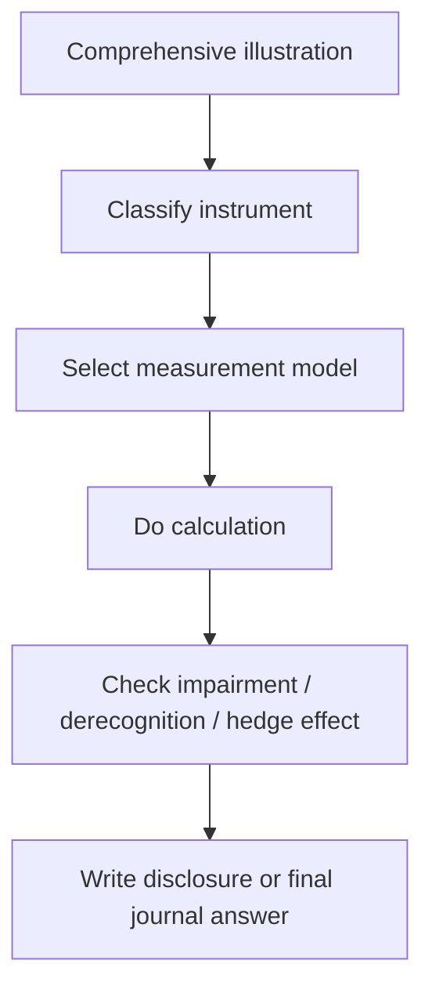
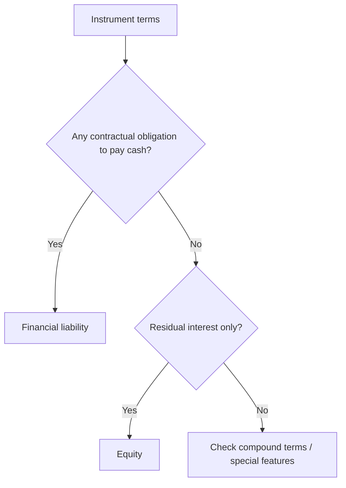
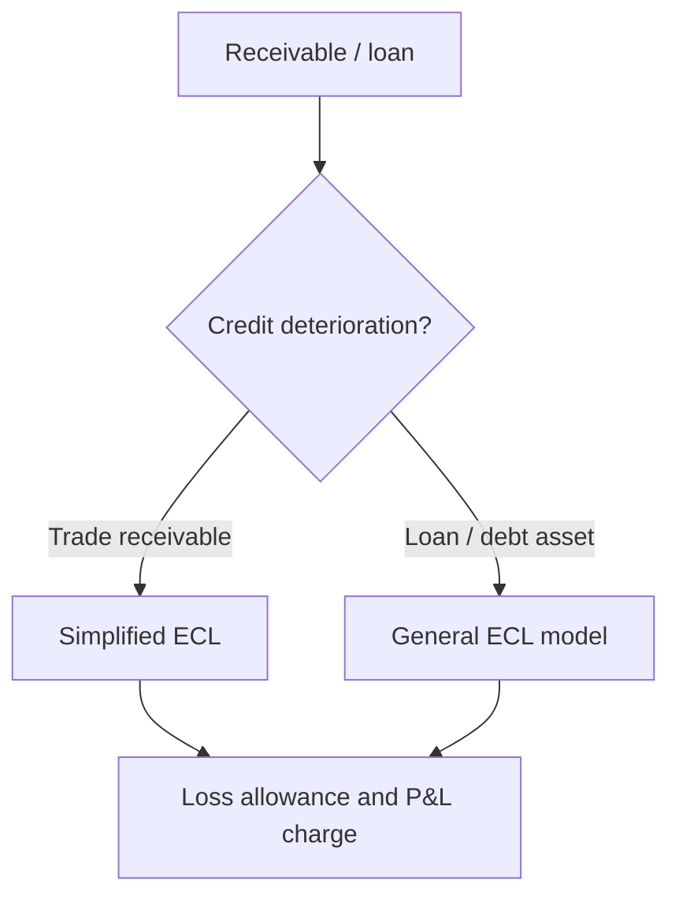

# Chapter 11 - Comprehensive Illustrations Pattern Guide

## Exam Relevance

- This file trains the long-form illustration style used in financial instrument questions.
- The examiner can mix classification, measurement, EIR, impairment, hedge accounting and disclosure in one case study.
- Chapter 11 illustrations often begin with a story problem and end with a note disclosure or journal-style answer.
- The safest method is to classify first, then compute, then disclose.

## Core Intuition

Financial instrument illustrations are usually a sequence problem: identify the instrument, choose the measurement basis, run the accounting mechanics, then finish with the note.

## Concept Map

## Question Pattern Map

| Pattern | How to Recognize It | Core Solving Move |
|---|---|---|
| Equity or liability classification | Redeemable shares, fixed return, conversion, residual interest words appear. | Decide whether there is a contractual obligation to deliver cash or another financial asset. |
| Compound instrument | Debenture with conversion feature, convertible preference share, detachable equity component. | Split liability and equity using present value logic. |
| Amortised cost / EIR | Coupon bonds, issue discount, redemption premium, transaction costs. | Compute initial recognition and amortise using effective interest rate. |
| FVOCI debt | Debt investment held for collection and sale. | Track fair value changes in OCI and interest / ECL in P&L. |
| FVOCI equity | Strategic equity investment with irrevocable election. | Route fair value changes to OCI without recycling, if the election applies. |
| Impairment / ECL | Trade receivable, loan, financial asset with credit deterioration. | Apply simplified or general expected credit loss approach as facts require. |
| Derivatives | Forward, option, swap, embedded conversion or commodity price exposure. | Measure at fair value through profit or loss unless hedge accounting changes presentation. |
| Hedge accounting | Risk management, designation, hedge relationship, effectiveness words. | Test the relationship and match the accounting treatment to the hedge type. |
| Derecognition | Sale, transfer, assignment, modification, extinguishment. | Decide whether risks and rewards or control have passed. |
| Disclosure-heavy illustration | Fair value, credit risk, liquidity risk, sensitivity tables. | Build the note in the order the standard expects. |

## Illustration Patterns

### 1. Classification first, valuation later

The question often hides the accounting category inside the story.

Typical clues:

- "held to collect interest and principal"
- "held for trading"
- "can be converted into shares"
- "redeemable at par plus premium"
- "board intends to sell later"

If the classification is wrong, the rest of the answer collapses.

### 2. Liability versus equity

This is one of the most common illustration traps.

| Fact | Typical implication |
|---|---|
| Mandatory redemption in cash | Financial liability |
| Fixed coupon plus compulsory repayment | Financial liability |
| Residual claim with no contractual cash obligation | Equity |
| Holder's option to convert into fixed number of shares | Often a compound instrument |
| Issuer's discretionary dividend | Usually points toward equity, subject to exact terms |

### 3. Effective interest rate illustrations

These questions usually want you to:

1. determine initial carrying amount,
2. calculate the EIR,
3. build the amortisation schedule,
4. record finance cost, and
5. update carrying amount each period.

Common outputs:

| Item | What to show |
|---|---|
| Initial recognition | Fair value plus or minus directly attributable transaction costs, depending on classification |
| Period finance cost | Opening carrying amount multiplied by EIR |
| Cash coupon | Actual interest paid or received |
| Difference | Amortisation of discount or premium |

### 4. Impairment illustrations

Trade receivables and loans often come with loss allowance data.

Pattern:

1. Identify whether the simplified approach applies.
2. Classify the portfolio or individual asset.
3. Estimate ECL using ageing, probability and loss given default.
4. Post the loss allowance movement.

### 5. Derecognition and modification illustrations

The source may ask whether a transfer of receivables or a debt modification gives rise to:

- full derecognition,
- partial derecognition,
- modification gain or loss,
- continuation of recognition with revised cash flows.

The pattern is always:

1. check transfer of contractual rights,
2. check retention of risks and rewards,
3. check whether control is retained,
4. decide whether a modification is substantial.

### 6. Hedge-accounting illustrations

Hedge cases usually test matching.

| Hedge type | Usual accounting feel |
|---|---|
| Fair value hedge | Changes in hedged item and derivative go to P&L, with basis adjustment logic |
| Cash flow hedge | Effective portion goes to OCI and later reclassifies where applicable |
| Net investment hedge | Foreign exchange translation story, often within OCI |

The examiner generally rewards a clean explanation of the hedge relationship before the journal entries.

### 7. Disclosure illustrations

Some illustrations are really disclosure questions in disguise.

Clues:

- "state the risk note"
- "prepare note disclosures"
- "disclose fair value hierarchy"
- "show credit risk and liquidity risk"

In that case, do not waste time on detailed valuation unless it is specifically required.

## Professor's Problem-Solving Framework

1. Read the entire story and mark the instrument type.
2. Decide whether the question is asking for classification, measurement, impairment, hedge or disclosure.
3. Build the answer in the same order as the transaction flow.
4. Use a table or schedule for the numerical portion.
5. End with a short exam-style conclusion, not an essay.

## Worked Examples

### Example 1

Problem:

An entity issues a 5-year debenture at a discount with annual coupon payments.

Working:

This is a liability measured using amortised cost. The discount is amortised through the effective interest method.

Answer:

Show the initial recognition, the EIR schedule and the closing carrying amount.

### Example 2

Problem:

A company grants employees a right to convert a redeemable instrument into a fixed number of shares.

Working:

The redemption obligation points to a liability component, while the conversion feature may create an equity component if the contract terms support it.

Answer:

Treat it as a compound instrument and split the proceeds accordingly.

### Example 3

Problem:

Trade receivables are grouped by ageing and some balances are past due by 120 days.

Working:

The simplified ECL approach is likely relevant. The illustration should show gross carrying amount, expected loss percentages and the closing loss allowance.

Answer:

Recognize the loss allowance and disclose the credit risk profile.

### Example 4

Problem:

An entity designates an interest rate swap as a cash flow hedge of a floating-rate loan.

Working:

The derivative is measured at fair value. The effective portion of the hedge is routed through OCI under cash flow hedge logic.

Answer:

Apply hedge accounting if the hedge relationship and documentation are in place; otherwise the derivative stays in FVTPL.

### Example 5

Problem:

An unquoted investment is valued using a discounted cash flow model with management assumptions.

Working:

This is a Level 3 fair value illustration. The note should explain the technique, assumptions and movement.

Answer:

Disclose the hierarchy, technique and key unobservable inputs.

## Common Mistakes

- Trying to do the schedule before deciding the classification.
- Confusing liability/equity analysis with mere legal form.
- Forgetting that transaction costs behave differently across categories.
- Treating every receivable as if the same ECL percentage applies.
- Writing hedge accounting without identifying the hedge item and hedge instrument.
- Using a disclosure answer where a computation was asked, or vice versa.

## Summary Tables

| Illustration family | Best approach | Trap |
|---|---|---|
| Debenture at discount | EIR schedule | Using coupon rate as effective rate |
| Convertible instrument | Split components | Treating entire instrument as liability or equity without analysis |
| Receivable impairment | Ageing and ECL table | Ignoring loss allowance movement |
| Derivative hedge | Check designation and effectiveness | Assuming all swaps qualify automatically |
| Fair value note | Hierarchy and inputs | Calling a Level 3 model Level 1 |

## Last-Day Revision

- Start with classification, not the arithmetic.
- Liability versus equity is driven by contractual obligation.
- Amortised cost questions usually want an EIR schedule.
- ECL questions usually want ageing, assumptions and a closing allowance.
- Hedge questions need documentation, designation and matching treatment.
- Disclosure questions need fair value hierarchy, risk and movement tables.

## Concrete Worked Pattern

### Debt instrument classification and EIR flow

Problem cue: a debt investment is held to collect contractual cash flows, pays fixed interest, and is acquired at a transaction price different from face value.

Solving move:

1. Apply the business model test: held to collect points toward amortised cost.
2. Apply SPPI: fixed principal and interest generally pass unless terms add non-basic lending exposure.
3. Initially measure at fair value plus transaction costs if not FVTPL.
4. Use effective interest method for subsequent measurement.

Exam trap: contractual interest received is not automatically the finance income if the instrument is measured at amortised cost; EIR drives the income.

## Doubts / Version-Sensitive Items

- Confirm whether the source PDF uses the full Ind AS 109 terminology or a shortened revision style for amortised cost and fair value categories.
- Check if the illustration set includes specific formula shortcuts for EIR, because the source may prefer a table-based method.
- Verify the hedge accounting examples in the PDF, since the exact designation wording can vary across ICAI revisions.
- If the PDF uses a particular bucket structure for credit risk ageing or liquidity maturity, mirror that exact bucket structure in the final clean version.
