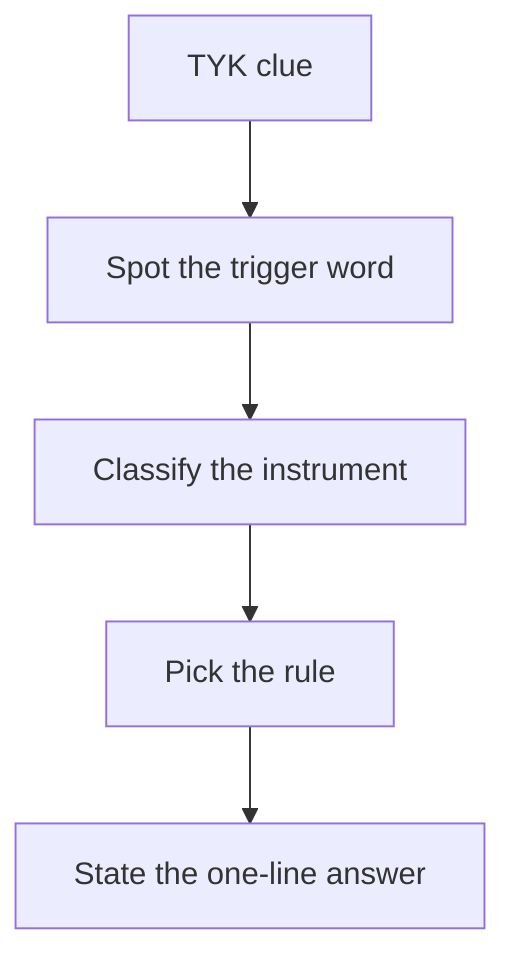
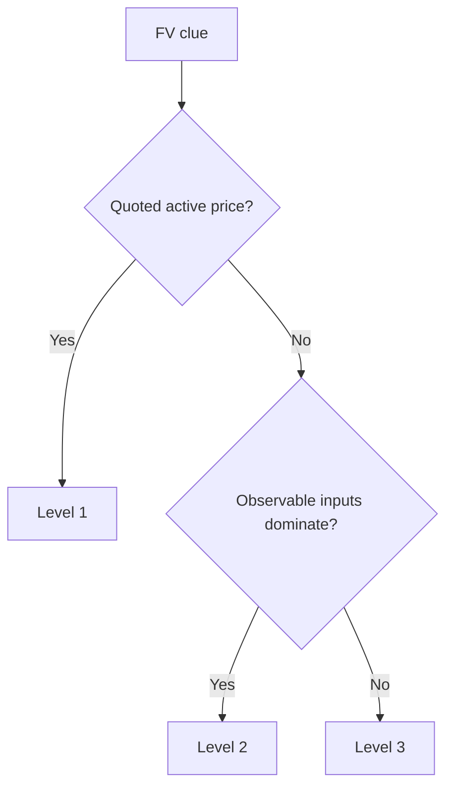

# Chapter 11 - Test Your Knowledge Guide

## Exam Relevance

- TYK questions are usually short, direct and designed to test whether you can spot the right accounting rule quickly.
- They often focus on definitions, classification triggers, disclosure headings and one-step conclusions.
- In Chapter 11, the common TYK traps are financial liability versus equity, fair value level selection, expected credit loss and risk disclosures.
- These questions reward speed, but only after you have named the correct standard and issue.

## Core Intuition

TYK items are not asking for long working notes; they are asking whether you can identify the accounting consequence from a small fact pattern.

## Concept Map

## Key Concepts

### 1. Common TYK trigger words

| Trigger word / phrase | Likely issue |
|---|---|
| redeemable, compulsory buy-back, fixed repayment | Financial liability |
| residual interest, ordinary shares, no contractual cash obligation | Equity instrument |
| conversion into fixed number of shares | Compound instrument / equity feature |
| held to collect and sell | FVOCI debt |
| held for trading | FVTPL |
| overdue, ageing, default, collateral | Credit risk / ECL |
| payment due in bands | Liquidity risk |
| foreign currency, swap, option, forward | Market risk or derivative |
| discount rate, present value, coupon | Amortised cost / EIR |

### 2. Quick classification reminders

| Question type | Fast answer habit |
|---|---|
| Instrument classification | Ask whether there is a contractual obligation to pay cash or another financial asset. |
| Measurement category | Ask what the business model and cash flow characteristics suggest. |
| Derivative existence | Ask whether value changes with an underlying, little initial investment and future settlement. |
| Impairment question | Ask whether expected credit loss or a simpler receivable rule is intended. |
| Disclosure question | Ask whether the note wants significance, risk or fair value hierarchy. |

### 3. Fair value hierarchy TYK patterns

| Clue | Likely level |
|---|---|
| Quoted price for identical security on active exchange | Level 1 |
| Observable yield curve, dealer quote, market corroborated input | Level 2 |
| DCF using management assumptions or unobservable discount rate | Level 3 |

### 4. Risk disclosure TYK patterns

| Risk type | What to say in one line |
|---|---|
| Credit risk | Risk of counterparty default; disclose exposure, ageing and loss allowance. |
| Liquidity risk | Risk of not meeting obligations when due; disclose maturity analysis and funding arrangements. |
| Market risk | Risk from interest rates, foreign exchange or other prices; disclose sensitivity analysis. |

### 5. Short-answer structure

TYK answers should usually follow this rhythm:

1. identify the standard,
2. state the trigger,
3. give the treatment,
4. close with the conclusion.

Keep it compact. The examiner is usually testing recognition, not essay length.

## Professor's Problem-Solving Framework

1. Circle the one fact that changes the accounting outcome.
2. Decide whether the issue is classification, measurement or disclosure.
3. Match the issue to the right standard wording.
4. Write a single precise conclusion.
5. Do not add extra theory unless the question asks for it.

## Worked Examples

### Example 1

Question:

A bond is mandatorily redeemable at par after three years.

Working:

Mandatory redemption means the issuer has a contractual obligation.

Answer:

Treat the bond as a financial liability.

### Example 2

Question:

An investment is valued using quoted prices on an active stock exchange.

Working:

Quoted active market prices are Level 1 inputs.

Answer:

Classify the fair value measurement as Level 1.

### Example 3

Question:

Receivables are 100 days overdue and the entity applies the expected credit loss model.

Working:

Past-due balances point to credit risk and ECL assessment.

Answer:

Recognize a loss allowance and disclose the ageing analysis.

### Example 4

Question:

A company has floating-rate borrowings and an interest rate swap.

Working:

The swap is a derivative that can be used to manage market risk if designated correctly.

Answer:

Discuss derivative accounting and hedge designation before deciding P&L or OCI treatment.

## Common Mistakes

- Answering with the name of the standard but not the treatment.
- Missing the obligation test in liability/equity questions.
- Treating a model-based fair value as Level 1.
- Mixing credit risk and liquidity risk.
- Writing a long explanation where the TYK expects one sentence.

## Summary Tables

| TYK area | Recall point | Common slip |
|---|---|---|
| Liability vs equity | Contractual obligation drives liability | Relying on legal form alone |
| FV hierarchy | Input observability drives the level | Calling every quote Level 1 |
| ECL | Expected losses on financial assets | Waiting for actual default |
| Liquidity risk | Maturity buckets and funding | Using settlement guesswork |
| Market risk | Sensitivity to rates / FX / prices | Forgetting the actual exposure |

## Last-Day Revision

- TYK questions are trigger-word questions.
- The first task is to identify the accounting issue.
- Fair value level depends on observability of inputs.
- Credit risk is exposure plus loss allowance.
- Liquidity risk is maturity-based.
- Market risk is sensitivity-based.
- Keep the conclusion short and exact.

## Concrete Trigger Examples

| Trigger in question | Likely answer path |
|---|---|
| "Held for trading" | Usually FVTPL; do not force amortised cost even if cash flows are fixed. |
| "Convertible debenture issued" | Split liability and equity components if it is a compound instrument. |
| "Receivables sold with recourse" | Test derecognition by risks/rewards and continuing involvement. |
| "Forecast purchase hedged by forward contract" | Consider cash flow hedge if designation and hedge criteria are met. |

## Doubts / Version-Sensitive Items

- Check the source PDF for the exact phrasing of the expected credit loss trigger, because some TYK sets use simpler wording than the standard itself.
- Verify whether the fair value question expects the standard name, the hierarchy level, or both.
- If the PDF uses a condensed treatment for compound instruments or derivatives, keep the answer aligned with that simplification.
- Confirm whether any TYK items in the source are actually disclosure questions disguised as theory questions.
