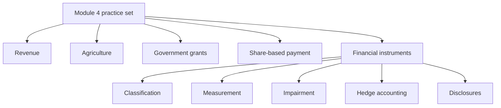
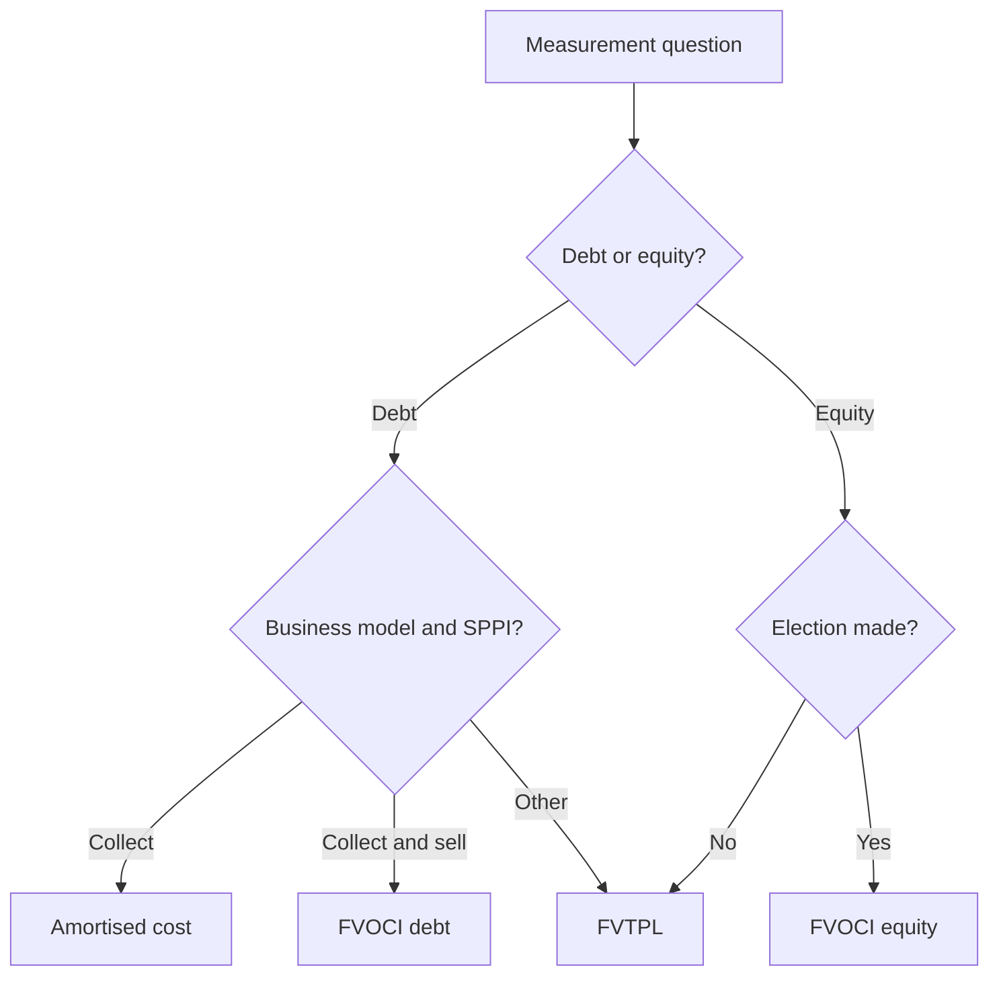

# Module 4 Practice Questions Pattern Guide

## Exam Relevance

- This practice set mixes Chapter 9, Chapter 10 and Chapter 11 style questions.
- The financial instruments portion usually carries the most technical traps because it mixes classification, measurement, hedge accounting and disclosures.
- The examiner may ask a single case that begins as a recognition question and ends as a disclosure question.
- The right approach is to identify the topic family first, then apply the specific standard.

## Core Intuition

Module 4 practice questions reward fast classification and clean sequencing more than raw memory.

## Concept Map

## Question Pattern Map

| Pattern | How to Recognize It | Core Solving Move |
|---|---|---|
| Revenue timing | Performance obligation, transfer of control, variable consideration words appear. | Map the contract, obligations and timing of revenue. |
| Biological asset / agriculture | Living plant or animal, harvest date, fair value less costs to sell. | Separate biological asset before harvest from agricultural produce at harvest. |
| Government grant | Assistance, subsidy, compliance conditions, asset or income linked. | Decide recognition basis and whether it relates to an asset or income. |
| Share-based payment | ESOP, vesting, market condition, non-market condition, cancellation. | Classify equity-settled or cash-settled and measure accordingly. |
| Financial liability vs equity | Redeemable, mandatory coupon, conversion, residual claim. | Test the contractual obligation first. |
| Amortised cost / EIR | Coupon, issue discount, redemption premium, transaction costs. | Build an amortisation schedule. |
| ECL and impairment | Overdue receivables, probability of default, ageing, collateral. | Apply the expected loss model and disclose the allowance movement. |
| Derivative / hedge | Swap, forward, option, foreign currency or rate exposure. | Decide whether it is freestanding FVTPL or hedge-accounted. |
| Risk disclosures | Credit, liquidity, market risk words in the prompt. | Write the note in the risk-order the standard expects. |

## Financial Instruments Pattern Guide

### 1. Classification and category questions

These are the first questions to solve because they drive everything else.

Useful test:

1. Is there a contractual obligation?
2. What is the business model for the asset?
3. What are the cash flow characteristics?
4. Is there a derivative or embedded feature?

| Fact pattern | Likely question type |
|---|---|
| Fixed redemption plus fixed coupon | Liability classification |
| Ordinary shares with discretionary dividends | Equity classification |
| Bond bought to collect and sometimes sell | FVOCI debt question |
| Equity held for strategic investment | FVOCI equity election question |

### 2. Measurement pattern questions

The common measures are amortised cost, FVTPL and FVOCI.

Common traps:

- Using business intent instead of the business model test.
- Ignoring the SPPI clue in debt questions.
- Forgetting that equity FVOCI election is different from debt FVOCI treatment.

### 3. Compound instrument and equity component questions

These questions often hide inside a long paragraph about a convertible debenture or preference share.

Pattern:

- identify the liability component by discounting the contractual cash flows,
- assign the residual to equity if the feature qualifies,
- thereafter account for interest using the liability's effective rate.

### 4. Impairment and ECL questions

These questions may be numerical or narrative.

Typical steps:

1. decide whether the simplified or general model applies,
2. estimate expected losses,
3. recognize the loss allowance,
4. disclose changes in credit risk and loss allowance.

| Clue | Likely response |
|---|---|
| Trade receivable | Simplified ECL |
| Loan with stage migration facts | General ECL logic |
| Collateral and ageing | Credit risk disclosure plus impairment |

### 5. Derivative and hedge questions

The market-risk chapter questions usually ask one of three things:

| Pattern | What to decide |
|---|---|
| Standalone derivative | FVTPL measurement |
| Fair value hedge | P&L symmetry with basis adjustment |
| Cash flow hedge | OCI routing for effective portion |

The answer should always mention the hedge relationship, the designation and the accounting outcome.

### 6. Disclosure and fair value questions

These questions are often the easiest to miss because they look descriptive.

Ask:

- Is the question about significance?
- Is it asking for credit, liquidity or market risk?
- Is it asking for fair value hierarchy and valuation method?

If yes, answer with a structured note, not a computation schedule.

## Professor's Problem-Solving Framework

1. Mark the chapter family at the top of the page.
2. Decide whether the issue is revenue, agriculture, grants, share-based payment or financial instruments.
3. For financial instruments, classify first and measure second.
4. Check whether the question is asking for a note, a schedule or a final conclusion.
5. End with the one-line result in exam language.

## Worked Examples

### Example 1

Given:

A company issues a debenture with compulsory redemption and a fixed coupon.

Working:

The instrument creates a contractual obligation to pay cash.

Final answer:

Treat it as a financial liability and measure it under the relevant debt classification.

### Example 2

Given:

An entity has trade receivables that are overdue and provides ageing information.

Working:

This is an ECL question, and the note should include the loss allowance movement.

Final answer:

Recognize expected credit losses and disclose the credit risk profile.

### Example 3

Given:

A company holds shares in another entity for strategic reasons and elects FVOCI.

Working:

This is an equity FVOCI election question.

Final answer:

Recognize fair value changes in OCI without recycling, subject to the standard's election rules.

### Example 4

Given:

An interest rate swap is used to manage floating-rate borrowing exposure.

Working:

The question is likely testing derivative measurement and cash flow hedge logic.

Final answer:

Account for the swap at fair value and apply hedge accounting only if the designation and effectiveness conditions are satisfied.

### Example 5

Given:

The question asks for credit risk, liquidity risk and market risk disclosures in one note.

Working:

This is a presentation question, not a valuation question.

Final answer:

Prepare a structured disclosure note with exposure, maturity and sensitivity tables.

## Common Mistakes

- Mixing up Chapter 11 disclosure questions with Chapter 9 revenue questions.
- Starting with journal entries before classification.
- Treating every debt instrument as amortised cost.
- Assuming every derivative qualifies for hedge accounting.
- Forgetting that disclosure answers still need the right hierarchy and risk order.
- Using a narrative answer where a table is the clearer exam move.

## Summary Tables

| Module 4 area | Best approach | Trap |
|---|---|---|
| Revenue | Identify performance obligations and control transfer | Confusing invoicing with revenue timing |
| Agriculture | Split biological asset and harvested produce | Mixing pre-harvest and post-harvest accounting |
| Government grants | Link grant to condition and related item | Recognizing before compliance is met |
| Share-based payment | Decide settlement basis and vesting treatment | Ignoring market vs non-market conditions |
| Financial instruments | Classify, measure, impair, disclose | Treating all issues as one standard |

## Last-Day Revision

- Module 4 practice sets are mixed, but financial instruments usually carry the sharpest classification traps.
- For instruments, ask obligation first and business model second.
- For impairment, ask whether ECL logic applies and whether disclosure movement is needed.
- For derivatives, decide whether it is just FVTPL or hedge-accounted.
- For disclosures, write risk and fair value notes in a table-friendly format.

## Full Mixed Chapter 11 Example

Problem cue: an entity buys a debt instrument, later designates an interest-rate swap as a hedge, and then sells the instrument before maturity.

Solving move:

1. Unit 2: classify the debt instrument using business model and SPPI.
2. Unit 5: recognize initially and measure subsequently using the relevant category.
3. Unit 6: apply hedge accounting only if documentation and qualifying criteria are met.
4. Unit 5 again: on sale, apply derecognition and recycle/recognize gains according to the category.
5. Unit 7: disclose risk exposure, hedge effects, and fair value information where required.

Exam trap: the classification answer, hedge answer, derecognition answer, and disclosure answer are separate layers of the same fact pattern.

## Doubts / Version-Sensitive Items

- Confirm whether the source practice set uses the same chapter order as the study notes or groups the standards differently.
- Check the exact wording used for SPPI, business model and hedge documentation in the PDF, because practice questions often simplify those terms.
- Verify whether the module practice set includes any revenue or share-based payment twists that should be mirrored in a final answer key style.
- If the PDF uses a specific note format for risk disclosures, mirror that instead of a generic exam template.
