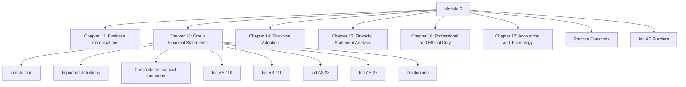

# Module 5: Initial Pages Overview

## Exam Relevance

This front matter opens the consolidation and broader reporting module. It covers business combinations, group accounting, first-time adoption, financial statement analysis, professional ethics and accounting technology.

This is a mixed module: some parts are highly technical, while others are theory- and discussion-heavy.

## Module Map

## How To Use This Module

- Study business combinations before the consolidation chain, because control and purchase accounting shape the rest of the module.
- Keep the consolidation standards in one mental sequence: identification, procedure, treatment and disclosure.
- Use first-time adoption as a standalone transition standard, not as a continuation of the consolidation chapter.
- Treat analysis, ethics and technology as shorter conceptual chapters that reward clean revision notes.
- Finish with practice questions and puzzlers to test mixed-recognition and group-accounting facts.

## Exam Strategy

1. Identify whether the question is about acquisition, control, consolidation or separate financial statements.
2. For consolidation problems, map the group structure before doing any adjustments.
3. For first-time adoption, separate transition exceptions from full retrospective logic.
4. For analysis, state the ratio or tool, then interpret it in reporting terms.
5. For ethics and technology, keep the answer direct and principle-based.

## Front-Matter Watchlist

- Chapter 13 is a compound chapter, so the exact unit boundaries matter for study planning.
- Consolidation and associate/joint arrangement answers are sensitive to control and rights facts.
- First-time adoption wording is date-sensitive and should be checked against the source PDF if the question fixes an opening Ind AS date.
- The analysis and technology chapters may include terminology that should be matched carefully to the edition used in this study set.

